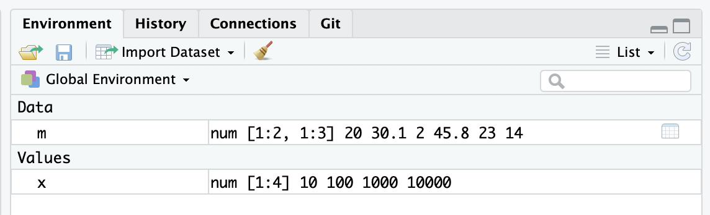

# Data Types

## Basic Data Types

Every data structure in R is built from a few **atomic types**:

| Type | Example | Description |
|------|---------|-------------|
| `numeric` | `3.14`, `1e-3` | Real numbers (double precision) |
| `integer` | `287`, `2L` | Whole numbers (suffix `L`) |
| `character` | `"hello"`, `'R'` | Text strings |
| `logical` | `TRUE`, `FALSE` | Boolean values |
| `complex` | `1+2i` | Complex numbers (rarely used in bioinfo) |

\footnotesize

```{r}
# integer
287
# decimal (double)
99.99
# scientific notation
1e-3
1e2
```

## Logical Values

Logical values are **`TRUE`** and **`FALSE`** (abbreviated `T` and `F`):

\footnotesize

```{r eval=FALSE}
TRUE
T
FALSE
F
```

They are **stored as numbers** internally:

```{r}
1 + TRUE      # TRUE == 1
2 * FALSE     # FALSE == 0
```

## Character Strings

Any text enclosed in single or double quotes:

\footnotesize

```{r eval=FALSE}
'a sentence'               # single quotes
"a string in Chinese"      # double quotes
'1.123'                    # looks like a number, but is a string
'*%%*()!@##&@(9'          # gibberish is OK too
```

# Vectors

## Creating Vectors

A **vector** is a one-dimensional sequence of values of the **same type**.

\footnotesize

```{r}
c(100, 20, 30)                         # numeric vector
c("string", "array", "a vector")       # character vector
c(TRUE, FALSE, TRUE, T, F)             # logical vector
```

\vspace{0.3cm}

The `:` operator creates integer sequences:

```{r}
2:8
```

## Type Coercion Rules

A vector can only hold **one type**. When types are mixed, R coerces them:

**Coercion order:** logical → numeric → character

\footnotesize

```{r}
# logical + numeric → all numeric
class( c(45, TRUE, 20, FALSE, -100) )

# logical + character → all character
str( c("string a", FALSE, "string b", TRUE) )

# numeric + character → all character
str( c("a string", 1.2, "another string", 1e-3) )
```

## Vector Properties

\footnotesize

```{r}
x <- c(10, 100, 1000, 10000)

# Length of a vector
length(x)

# Sum and mean
sum(x)
mean(x)
```

\vspace{0.3cm}

Use `class()`, `str()`, and `typeof()` to inspect vectors — we'll compare them later.

# Matrices

## Creating Matrices

A **matrix** is a 2-dimensional vector. Like vectors, all elements must be the **same type**.

\footnotesize

```{r}
matrix( c(20, 30.1, 2, 45.8, 23, 14), nrow = 2, byrow = T )
```

Key `matrix()` parameters:

| Parameter | Meaning |
|-----------|---------|
| `data` | Values to fill the matrix |
| `nrow` | Number of rows |
| `ncol` | Number of columns |
| `byrow` | Fill by row (`TRUE`) or by column (`FALSE`) |
| `dimnames` | Row and column names |

## `matrix()` byrow = TRUE vs FALSE

\footnotesize

```{r}
matrix( c(20, 30.1, 2, 45.8, 23, 14), nrow = 2, byrow = T )
```

```{r}
matrix( c(20, 30.1, 2, 45.8, 23, 14), nrow = 2, byrow = F )
```

## Named Rows & Columns

\footnotesize

```{r}
matrix( c(20, 30.1, 2, 45.8, 23, 14), nrow = 2, 
       dimnames = list( c("row_A", "row_B"), c("A", "B", "C") ) )
```

## Recycling & Truncation

When `nrow × ncol` ≠ `length(data)`, R recycles or truncates **silently**:

\footnotesize

```{r}
# data length 20, matrix size 10 → data is truncated
matrix( 1:20, nrow = 2, ncol = 5, byrow = T)
```

```{r}
# data length 3, matrix size 6 → data is recycled
matrix( 1:3, nrow = 2, ncol = 3, byrow = T )
```

## Recycling Warnings

**Warning 1:** matrix larger than data, but not an integer multiple:

\footnotesize

```{r}
matrix( 1:3, nrow = 2, ncol = 4, byrow = T )
```

**Warning 2:** matrix smaller than data, but not an integer multiple:

\footnotesize

```{r}
matrix( letters[1:20], nrow = 3, ncol = 5, byrow = T )
```

## Matrix Properties

\footnotesize

```{r}
m <- matrix( c(20, 30.1, 2, 45.8, 23, 14), nrow = 2, byrow = T )

dim(m)       # dimensions
nrow(m)      # number of rows
ncol(m)      # number of columns
range(m)     # min and max
summary(m)   # 5-number summary
```

## `class()` vs `str()`

\footnotesize

```{r}
class( matrix( c(20, 30.1, 2, 45.8, 23, 14), 
               nrow = 2, byrow = T ) )

str( matrix( c(20, 30.1, 2, 45.8, 23, 14), 
              nrow = 2, byrow = T ) )
```

\normalsize

- `class()` — returns the class name (e.g., `"matrix"`, `"array"`)
- `str()` — shows the **str**ucture: type, dimensions, first few values

# Arrays

## Multi-dimensional Arrays

Vectors are 1D, matrices are 2D. **Arrays** generalize to any number of dimensions:

\footnotesize

```{r}
array( data = LETTERS[1:16], 
      dim  = c(2, 4, 2), 
      dimnames = list( c("A","B"), 
                      c("one","two","three","four"), 
                      c("first", "second") ) )
```

- All elements must be the **same type**
- `dim` specifies the shape (rows, columns, layers, ...)
- `dimnames` names each dimension

# Basic Operators

## Arithmetic Operators

\footnotesize

```{r eval=FALSE}
1 + 2 - 3 * 4 / 5        # +, -, *, /
1 + (2 - 3) * 4 / 5      # parentheses change precedence
```
```{r eval=FALSE}
2 ^ 6                     # exponentiation (power)
5 %% 2                    # modulo (remainder)
```

## Logical Operators

\footnotesize

```{r eval=FALSE}
T | F                     # OR  — TRUE if either is TRUE
T & F                     # AND — TRUE only if both are TRUE
5 | 0                     # non-zero = TRUE, zero = FALSE
```

\footnotesize

```{r}
5 & -1                    # what do you think this returns?
```

## Math Functions

Commonly used math functions:

\footnotesize

| Function | Description |
|----------|-------------|
| `log(x)` | Natural logarithm |
| `log2(x)`, `log10(x)` | Base-2, base-10 log |
| `exp(x)` | Exponential (\(e^x\)) |
| `sqrt(x)` | Square root |
| `sin(x)`, `cos(x)` | Trigonometry |
| `abs(x)` | Absolute value |
| `round(x, digits=n)` | Round to n decimal places |

# Variables & Assignment

## Assignment Operators

R uses `<-` for assignment (the recommended style):

\footnotesize

```{r eval=FALSE}
x <- c(10, 100, 1000, 10000)   # recommended
x = c(10, 100, 1000, 10000)    # also works
c(10, 100, 1000, 10000) -> x   # rarely used (rightward)
assign("x", c(10, 100, 1000, 10000))  # functional form
```

\normalsize

::: {.callout-tip}
**After assignment**, the value is stored silently (not printed). Enclose in `()` to print: `(x <- 1:5)`.
:::

## Managing Variables

\footnotesize

```{r}
x <- c(10, 100, 1000, 10000)
m <- matrix( c(20, 30.1, 2, 45.8, 23, 14), nrow = 2, 
       dimnames = list( c("row_A", "row_B"), c("A", "B", "C") ) )
```

```{r}
ls()                    # list all variables in current environment
rm(x)                   # remove one variable
ls()
# rm(list = ls())       # remove ALL variables — use with caution!
```

## Viewing Variables in RStudio

RStudio's **Environment pane** (top-right) shows all current variables:

{height=55%}

# Vectorized Operations

## Vectorization — The Key R Paradigm

Operations are automatically applied **element-by-element** — no loops needed:

\footnotesize

```{r}
x <- c(10, 100, 1000, 10000)
( y <- sqrt(x) * 4 + 10 )
```

Every operation above (`sqrt`, `*`, `+`) is applied to **each element** of `x` simultaneously.

## Recycling Rules

When two vectors have **different lengths**, the shorter one is **recycled**:

\footnotesize

```{r}
# Shorter vector recycled to match longer one
x / c(10, 100)      # c(10,100) → c(10,100,10,100)
```

```{r}
# Incomplete recycling produces a warning but still runs
x / c(10, 100, 1000)    # longer vector length 3, shorter recycled
```

## Matrix Operations

Matrix arithmetic also follows vectorization:

\footnotesize

```{r}
m
```
```{r}
m / 10                    # divide every element by 10
```
```{r}
m / c(1, 10, 100)         # recycle across columns (column-major)
```
```{r}
m / c(1, 10)              # recycle across columns
```

# Subsetting

## Vector Subsetting with `[ ]`

Extract elements by **position**, **name**, or **logical condition**:

\footnotesize

```{r}
ab <- c("a", "b", "c", "d", "e", "f")

ab[1]                     # single element
ab[ c(1, 4, 5) ]          # multiple by position
ab[ 2:5 ]                 # range
ab[ length(ab) ]          # last element
```

## Vector — Replace Values

\footnotesize

```{r}
ab[1] <- "A"              # replace single element
ab
```

```{r}
ab[c(2, 3)] <- c("B", "C")  # replace multiple
ab
```

## Vector — Named Elements

\footnotesize

```{r}
names(ab) <- ab           # name elements after themselves
ab

ab[ c("A", "B") ] <- c("alpha", "beta")   # replace by name
ab
```

## Matrix Subsetting — Rows

Matrix subsetting uses `[row, column]`:

\footnotesize

```{r}
m
```
```{r}
m[1, ]                    # first row
m[1:2, ]                  # first two rows
```
```{r}
m["row_A", ]              # by row name
m[ c("row_B", "row_A"), ] # by name, custom order
```

## Matrix Subsetting — Columns

\footnotesize

```{r}
m[, 1]                    # first column
m[, c(1, 2)]              # first two columns
m[, c("B", "A")]          # by column name, custom order
```

## Matrix Subsetting — Sub-blocks

\footnotesize

```{r}
m[1:2, 2:3]               # rows 1-2, columns 2-3
```

## Matrix — Replace Values

\footnotesize

```{r}
# Replace an entire row
m[1, ] <- c(10)
m
```
```{r}
# Replace an entire column
m[, "C"] <- c(230, 140)
m
```

## Matrix Transpose

\footnotesize

```{r}
t(m)                      # swap rows and columns
```

## Other Useful Vector Functions

\footnotesize

```{r}
rev(1:10)                 # reverse order
```

```{r}
lts <- sample( LETTERS[1:20] )
sort(lts)                 # sort values
order(lts)                # indices of sorted positions
```

# Missing & Special Values

## R Data Structures Overview

{height=55%}

*Image from: https://r4ds.had.co.nz/vectors.html*

## `typeof()` — The Fundamental Type

\footnotesize

```{r}
typeof(letters)            # character
typeof(1:10)               # integer
typeof( list("a", "b", 1:10) )  # list
typeof( 1:10 %% 3 == 0 )   # logical
typeof(1)                  # double
typeof(1L)                 # integer (note the L suffix)
```

## Special Values

R has several special values for edge cases:

| Value | Meaning | Example |
|-------|---------|---------|
| `NA` | Not Available (missing) | `c(1, NA, 3)` |
| `NaN` | Not a Number | `0 / 0` |
| `Inf` / `-Inf` | Infinity | `1 / 0` |
| `NULL` | Undefined / empty | Returned by some functions |

\footnotesize

```{r}
c(-1, 0, 1) / 0           # produces -Inf, NaN, Inf
```

## `is.*()` Test Functions

Instead of comparing with `== NA`, use `is.*()` functions:

\footnotesize

```{r warning=FALSE, message=FALSE}
# Read a small CSV with missing values
nul <- readr::read_csv(file = "data/talk02/null.csv")
library(kableExtra)
kbl(nul, booktabs = T)
```

## More `is.*()` Functions

\footnotesize

```{r eval=FALSE}
is.null(NULL)              # TRUE
is.numeric(NA)             # TRUE (NA inherits numeric type!)
is.numeric(Inf)            # TRUE

# Type-checking functions
is.list(x)
is.logical(x)
is.character(x)
is.vector(x)
is.matrix(m)
is.array(x)

# Many more...
```

# Summary & Homework

## Today's Summary — Data Types

\footnotesize

| Category | What we covered |
|----------|----------------|
| **Atomic types** | numeric, integer, character, logical, complex |
| **Coercion** | logical → numeric → character |
| **Vectors** | `c()`, `:`, single-type constraint |
| **Matrices** | `matrix()`, `nrow`/`ncol`, `byrow`, `dimnames` |
| **Arrays** | `array()`, `dim`, multi-dimensional |

## Today's Summary — Operations

\footnotesize

| Category | What we covered |
|----------|----------------|
| **Operators** | `+`, `-`, `*`, `/`, `^`, `%%`, `|`, `&` |
| **Variable mgmt** | `<-`, `=`, `ls()`, `rm()` |
| **Vectorization** | element-wise operations, recycling rules |
| **Subsetting** | `[ ]` by position/name/condition |
| **Special values** | `NA`, `NaN`, `Inf`, `NULL`, `is.*()` |

## Today's Summary — Key Functions

\footnotesize

| Function | Purpose |
|----------|---------|
| `class()`, `str()`, `typeof()` | Inspect object type/structure |
| `length()`, `dim()`, `nrow()`, `ncol()` | Dimensions |
| `sum()`, `mean()`, `range()`, `summary()` | Summary statistics |
| `sort()`, `order()`, `rev()` | Ordering |
| `names()`, `dimnames()` | Naming |
| `t()` | Matrix transpose |
| `is.null()`, `is.na()`, `is.numeric()`, ... | Type tests |

## Homework

\footnotesize

1. Open `Exercises and homework/talk02-homework.Rmd` in your course repository
2. Complete all exercises — use CodeBuddy AI for help!
3. Render the `.Rmd` to PDF
4. Submit as instructed on the course platform

::: {.callout-tip}
**Pro tip**: When stuck, ask CodeBuddy: "Explain this R error to me: [paste error]" or "Help me understand how vector recycling works in R."
:::

## Next Talk

**Talk 03 — R Language Basics II**

- Factors: creation, levels, ordering (`forcats`)
- Lists: creation, naming, subsetting
- Data frames vs tibbles
- Data import/export with `readr`
- Introduction to tidy data
