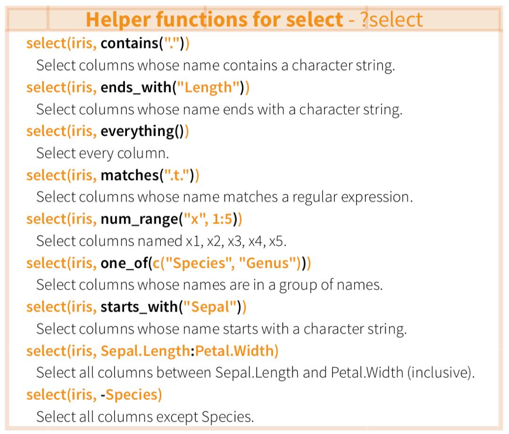
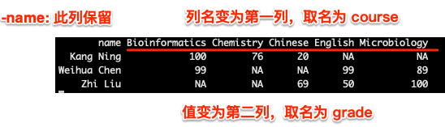
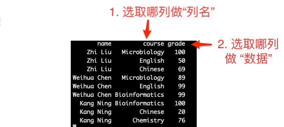

# The Pipe Operator

## What is the Pipe?

The pipe `%>%` comes from the **magrittr** package by Stefan Milton Bache. It passes the result of the left-hand side as the **first argument** to the right-hand side function.

**Traditional code** (nested, hard to read):

\footnotesize

```{r warning=FALSE, message=FALSE}
# Step-by-step, storing intermediate results
a <- subset(swiss, Fertility > 20)
cor.test(a$Fertility, a$Education)
```

## What is the Pipe?, cont.

**Pipe version** (left-to-right, easy to read):

\footnotesize

```{r message=FALSE, warning=FALSE}
library(tidyverse)
library(magrittr)

swiss %>%
  subset(., Fertility > 20) %$%
  cor.test(Education, Fertility)
```

## What is the Pipe?, cont.

\footnotesize

::::: {.callout-tip}
The pipe makes your code read like a **recipe**: take this data → then filter → then group → then summarize. It eliminates deep nesting and temporary variables.
:::::

## The `.` Placeholder

When the piped data is **not** the first argument, use `.` as a placeholder:

\footnotesize

```{r}
swiss %>% head(., n = 4)
```

```{r}
swiss %>% do(head(., n = 4))
```

## The Tee Pipe `%T>%`

`%T>%` returns the **left-hand side** (upstream value), not the right-hand side result:

\footnotesize

```{r fig.height=3, fig.width=6}
# res1 will be NULL — because plot() returns NULL
res1 <- rnorm(100) %>% matrix(ncol = 2) %>% plot()
```

## The Tee Pipe `%T>%`, cont.

\footnotesize

```{r fig.height=3, fig.width=4}
# res2 keeps the matrix — %T>% returns the left side
res2 <- rnorm(100) %>% matrix(ncol = 2) %T>% plot()
head(res2)
```

## The Exposition Pipe `%$%`

`%$%` exposes column names — like `attach()` but safer:

\footnotesize

```{r}
# Instead of:
with(mtcars, cor.test(cyl, mpg))
```

## The Exposition Pipe `%$%`, cont.

\footnotesize

```{r}
# Use exposition pipe:
mtcars %$% cor.test(cyl, mpg)
```

## The Assignment Pipe `%<>%`

`%<>%` pipes and assigns back to the original variable:

\footnotesize

```{r}
mtcars_small <- mtcars %>% select(mpg, cyl, disp) %>% head(3)
mtcars_small
```

```{r}
# %<>% modifies in place
mtcars_small %<>% transform(cyl = cyl * 2)
mtcars_small
```

## Base R Pipe `|>`

Since **R 4.1.0**, base R includes its own pipe `|>`. It works similarly but has some differences (e.g., no `.` placeholder for non-first-argument). This course uses `%>%` from magrittr.

\footnotesize
See: <https://www.tidyverse.org/blog/2023/04/base-vs-magrittr-pipe/>

# dplyr Core Verbs

## What is dplyr?

**dplyr** is the data manipulation grammar of the tidyverse:

- Works on data frames and tibbles
- **Row-based** operations (fast, consistent API)
- Five core verbs: `select()`, `filter()`, `mutate()`, `summarise()`, `arrange()`
- Designed to work seamlessly with `%>%`

- [dplyr official page](https://dplyr.tidyverse.org)
- [R for Data Science](https://r4ds.had.co.nz)

{height="20%"}


## dplyr Core Verbs Overview

\footnotesize

| Verb | What it does | Row change? |
|------|-------------|:-----------:|
| `select()` | Choose columns by name | No |
| `filter()` | Subset rows by condition | Fewer |
| `mutate()` | Create/modify columns | No |
| `summarise()` | Aggregate to single values | Fewer |
| `arrange()` | Sort rows | No |

All verbs work naturally with `group_by()` for grouped operations.

## `select()` — Choose Columns

Select columns by name, position, or helper functions:

\footnotesize

```{r}
# Get ready
library(tidyverse)

# Basic selection
starwars %>% select(name, height, mass) %>% head(3)
```


## `select()` — Choose Columns, cont.

\footnotesize

```{r}
# Range of columns (name through mass)
starwars %>% select(name:mass) %>% head(3)
```

```{r}
# Helper functions
starwars %>% select(name, ends_with("color")) %>% head(3)
```

## `select()` Helpers

{height="70%"}


## `select()` Helpers, cont.

Common helpers:

- `starts_with("prefix")`
- `ends_with("suffix")`  
- `contains("substring")`
- `matches("regex")`
- `everything()` — all remaining columns
- `last_col()` — the last column
- Remove columns with `-`: `select(-hair_color, -eye_color)`

## `filter()` — Subset Rows

Keep rows that satisfy logical conditions:

\footnotesize

```{r}
# Get mouse gene data
mouse.tibble <- read_delim(
  file = "data/talk04/mouse_genes_biomart_sep2018.txt",
  delim = "\t", quote = ""
)

```

## `filter()` — Subset Rows, cont.

\footnotesize

```{r}
# Filter for specific chromosomes
mouse.tibble %>%
  filter(`Chromosome/scaffold name` %in% c(1:19, "X", "Y")) %>%
  count(`Chromosome/scaffold name`) %>%
  arrange(desc(n))

```

## `filter()` — Multiple Conditions

Combine conditions with `&` (AND), `|` (OR), `,` (AND):

\footnotesize


```{r}
# Blond AND blue-eyed characters
starwars %>%
  select(name, ends_with("color"), gender, species) %>%
  filter(hair_color == "blond", eye_color == "blue")
```

## `filter()` — Multiple Conditions, cont.

\footnotesize

```{r}
# Filter for specific gene types
mouse.tibble %>%
  filter(`Transcript type` == "protein_coding" | 
   `Transcript type` == "miRNA" | `Transcript type` == "lincRNA") %>%
  count(`Transcript type`) %>%
  arrange(desc(n))
```

## `filter()` — Multiple Conditions, cont.

\footnotesize

the above `|` operations can be easily replaced with **`%in%`**:

```{r}
mouse.tibble %>%
  filter(`Transcript type` %in% c("protein_coding", "miRNA", "lincRNA")) %>%
  count(`Transcript type`) %>%
  arrange(desc(n))
```


## `mutate()` — Create/Modify Columns

Add new columns computed from existing ones (does **not** change row count):

\footnotesize

```{r}
# Calculate BMI for starwars characters
starwars %>%
  select(name, height, mass) %>%
  mutate(bmi = mass / ((height / 100)^2)) %>%
  head(6)
```

## `mutate()` — Create/Modify Columns, cont. 

\footnotesize

```{r}
# Create a categorized column
starwars %>%
  select(name, species, height) %>%
  mutate(
    height_cat = case_when(
      height < 100 ~ "Short",
      height < 180 ~ "Medium",
      height >= 180 ~ "Tall"
    )
  ) %>%
  head(6)
```

## `arrange()` — Sort Rows

Sort by one or more columns; use `desc()` for descending:

\footnotesize

```{r}
# Sort starwars by height (tallest first)
starwars %>%
  select(name, height, mass) %>%
  arrange(desc(height)) %>%
  head(6)
```


## `arrange()` — Sort Rows, cont.
\footnotesize


```{r}
# Sort by species then by height
starwars %>%
  select(name, species, height) %>%
  arrange(species, desc(height)) %>%
  head(10)
```

## `group_by()` + `summarise()` — Grouped Aggregation

The most powerful combination in dplyr:

\footnotesize

```{r}
# Average height and mass by species
starwars %>%
  group_by(species) %>%
  summarise(
    n = n(),
    avg_height = mean(height, na.rm = TRUE),
    avg_mass = mean(mass, na.rm = TRUE)
  ) %>%
  arrange(desc(n))
```

## Full Analysis Example — Mouse Genes

\footnotesize

```{r}
dat <- mouse.tibble %>%
  # 1. Keep only main chromosomes
  filter(`Chromosome/scaffold name` %in% c(1:19, "X", "Y")) %>%
  # 2. Keep only three gene types
  filter(`Transcript type` %in% c("protein_coding", "miRNA", "lincRNA")) %>%
  # 3. Rename columns for readability
  select(
    CHR = `Chromosome/scaffold name`,
    TYPE = `Transcript type`,
    GENE_ID = `Gene stable ID`,
    GENE_LEN = `Transcript length (including UTRs and CDS)`
  ) %>%
  # 4. Group and summarize
  group_by(CHR, TYPE) %>%
  summarise(
    count = n_distinct(GENE_ID),
    mean_len = mean(GENE_LEN)
  ) %>%
  # 5. Sort
  arrange(CHR, desc(count))
```

## Full Analysis — Result

\footnotesize

```{r echo=FALSE, message=FALSE}
library(kableExtra)
kbl(head(dat, n = 15), booktabs = TRUE)
```

## Grades Analysis Example

A complete analysis with pivot_longer + dplyr:

\footnotesize

```{r}
# Create grades tibble
set.seed(42)
grades <- tibble(
  "Name" = c("Weihua Chen", "Mm Hu", "John Doe", "Jane Doe",
             "Warren Buffet", "Elon Musk", "Jack Ma"),
  "Occupation" = c("Teacher", "Student", "Teacher", "Student",
                   rep("Entrepreneur", 3)),
  "English" = sample(60:100, 7),
  "ComputerScience" = sample(80:90, 7),
  "Biology" = sample(50:100, 7),
  "Bioinformatics" = sample(40:90, 7)
)
```

## Grades Analysis Example, cont.

\footnotesize

```{r}
kbl(grades, booktabs = TRUE)
```

## Grades — Average per Student

\footnotesize

```{r}
grades %>%
  pivot_longer(cols = c(English, ComputerScience, Biology, Bioinformatics),
               names_to = "course", values_to = "grade") %>%
  group_by(Name, Occupation) %>%
  summarise(
    avg_grade = mean(grade),
    courses_count = n()
  ) %>%
  arrange(desc(avg_grade)) %>%
  kbl(booktabs = TRUE)
```

## Grades — Best Subject per Student

\footnotesize

```{r}
# Find each student's best subject
grades %>%
  pivot_longer(cols = c(English, ComputerScience, Biology, Bioinformatics),
               names_to = "course", values_to = "grade") %>%
  group_by(Name) %>%
  summarise(
    best_course = first(course, order_by = desc(grade)),
    best_grade = first(grade, order_by = desc(grade)),
    avg_grade = mean(grade)
  ) %>%
  arrange(desc(avg_grade)) %>%
  kbl(booktabs = TRUE)
```

# tidyr — Reshaping Data

## Why Reshape Data?

Data comes in two forms:

| Format | Description | Example |
|--------|-------------|---------|
| **Wide** | Each variable has its own column; good for humans | One column per gene |
| **Long** | Each row is one observation; good for computers | One row per gene-sample pair |

**tidyr** provides tools to switch between these formats.

## `pivot_longer()` — Wide → Long

Convert columns into rows:

\footnotesize

```{r}
# Wide gene expression data
wide_expr <- tibble(
  patient = c("P1", "P2", "P3"),
  BRCA1 = c(2.3, 1.8, 3.1),
  TP53  = c(-1.2, -0.8, 0.5),
  EGFR  = c(0.5, 1.1, -0.3)
)
kbl(wide_expr, booktabs = TRUE)
```

## `pivot_longer()` — Wide → Long, cont.
\footnotesize

```{r}
# Convert to long format
wide_expr %>%
  pivot_longer(
    cols = c(BRCA1, TP53, EGFR),
    names_to = "gene",
    values_to = "expression"
  ) %>%
  kbl(booktabs = TRUE)
```

## `pivot_longer()` Explained

\footnotesize

```{r eval=FALSE}
# Anatomy of pivot_longer()
wide_expr %>%
  pivot_longer(
    cols      = c(BRCA1, TP53, EGFR),  # which columns to pivot
    names_to  = "gene",                 # new column for old column names
    values_to = "expression"            # new column for values
  )
```

## `pivot_longer()` Explained, cont.

Take the `grades2` data as an example:

\footnotesize

```{r}
# Load grades2 data
grades2 <- read_tsv(file = "data/talk06/grades2.txt")
grades2
```

- **`cols`** = `-name` — pivot all columns except `name` (the ID column)
- **`names_to`** = `"course"` — new column for old column names (Microbiology, English, Chinese, etc.)
- **`values_to`** = `"grade"` — new column for the scores
- `values_drop_na = TRUE` removes rows with missing grades

## `pivot_longer()` — Visual Guide

{height="60%"}

This figure illustrates the wide-to-long transformation: column names become values in a "key" column, and cell values go into a "value" column.

## `pivot_wider()` — Long → Wide

Reverse the operation — convert rows back to columns:

\footnotesize

```{r}
long_data <- wide_expr %>%
  pivot_longer(cols = c(BRCA1, TP53, EGFR),
               names_to = "gene", values_to = "expression")

# Convert back to wide
long_data %>%
  pivot_wider(
    names_from = gene,
    values_from = expression
  ) %>%
  kbl(booktabs = TRUE)
```

## `pivot_wider()` Explained

Using the `grades2` data (from the previous `pivot_longer` result):

\footnotesize

```{r}
# Long format: each row is one student × one course
grades2_long <- grades2 %>%
  pivot_longer(-name, names_to = "course", values_to = "grade",
               values_drop_na = TRUE)
grades2_long
```

## `pivot_wider()` — Visual Guide

{height="40%"}

- **`names_from`** = `course` — which column provides the **new column names** (Microbiology, English, Chinese, etc.)
- **`values_from`** = `grade` — which column provides the **values** to fill into the new columns
- The result reconstructs the original wide table with one row per student


## `separate()` — Split One Column into Many

Split a column based on a separator:

\footnotesize

```{r}
# Data with combined column
drug_data <- tibble(
  treatment = c("DrugA_10mg", "DrugA_20mg", "DrugB_10mg", "DrugB_20mg"),
  response = c(0.8, 0.6, 0.3, 0.1)
)
kbl(drug_data, booktabs = TRUE)
```

## `separate()` — Split One Column into Many, cont. 

\footnotesize

```{r}
drug_data %>%
  separate(treatment, into = c("drug", "dose"), sep = "_") %>%
  kbl(booktabs = TRUE)
```

## `unite()` — Combine Columns into One

The reverse of `separate()`:

\footnotesize

```{r}
drug_data %>%
  separate(treatment, into = c("drug", "dose"), sep = "_") %>%
  unite(col = "treatment_label", drug, dose, sep = " - ") %>%
  kbl(booktabs = TRUE)
```

# Joining Tables

## Why Join Tables?

Real-world data is rarely in a single table. Common scenarios:

- **Clinical data**: patient info + lab results + treatment records
- **Genomics**: gene expression + gene annotation + pathway data
- **Microbiome**: OTU table + taxonomy + sample metadata

**dplyr** provides a family of join functions that work like SQL joins.

## Join Types Overview

| Join | Keeps rows from | Description |
|------|:---:|-------------|
| `left_join(x, y)` | All x | Match y to x; `NA` where no match |
| `right_join(x, y)` | All y | Match x to y; `NA` where no match |
| `inner_join(x, y)` | Both | Only rows with matches in both |
| `full_join(x, y)` | All | All rows from both; `NA` where no match |
| `semi_join(x, y)` | x | Keep x rows that have a match in y |
| `anti_join(x, y)` | x | Keep x rows that have **no** match in y |

## Join Example

\footnotesize

```{r}
# Patient metadata
patients <- tibble(
  id = c("P01", "P02", "P03", "P04"),
  age = c(45, 62, 38, 55),
  sex = c("F", "M", "F", "M")
)

# Lab results
lab_results <- tibble(
  id = c("P01", "P02", "P03", "P05"),
  glucose = c(98, 142, 105, 130),
  cholesterol = c(180, 220, 195, 210)
)

```

## Join Example, Inner Join 

\footnotesize

```{r}
# Inner join — only patients with lab results
patients %>% inner_join(lab_results, by = "id") %>%
  kbl(booktabs = TRUE)
```

## Left Join

\footnotesize

```{r}
# Left join — all patients, NA if no lab result
patients %>% left_join(lab_results, by = "id") %>%
  kbl(booktabs = TRUE)
```


## Full Join

\footnotesize

```{r}
# Full join — all rows from both tables
patients %>% full_join(lab_results, by = "id") %>%
  kbl(booktabs = TRUE)
```

## Semi Join

\footnotesize

```{r}
# Semi join — only patients with lab results
patients %>% semi_join(lab_results, by = "id") %>%
  kbl(booktabs = TRUE)
```

**Note**: `semi_join()` keeps only the rows in x that have a match in y, but doesn't bring over any information from y. This is different from `inner_join()` which brings over all columns from y.

## Anti Join — Find Missing Matches

Useful for quality control — find which rows have **no** match:

\footnotesize

```{r}
# Which patients have NO lab results?
patients %>% anti_join(lab_results, by = "id") %>%
  kbl(booktabs = TRUE)
```

\footnotesize

```{r}
# Which lab results have NO matching patient?
lab_results %>% anti_join(patients, by = "id") %>%
  kbl(booktabs = TRUE)
```

# Advanced dplyr

## `across()` — Column-wise Operations

Apply a function to multiple columns:

\footnotesize

```{r}
# Summarize all numeric columns
starwars %>%
  summarise(
    across(where(is.numeric), ~ mean(.x, na.rm = TRUE))
  ) %>%
  kbl(booktabs = TRUE)
```

## `across()` — Column-wise Operations, cont.

\footnotesize

```{r}
# Mutate multiple columns
starwars %>%
  select(name, height, mass) %>%
  mutate(
    across(c(height, mass), ~ .x / 100)
  ) %>%
  head(4) %>%
  kbl(booktabs = TRUE)
```

## `rowwise()` — Row-wise Operations

By default, dplyr operations are column-wise. `rowwise()` makes them row-wise:

\footnotesize

```{r}
# Row-wise mean of gene expression
gene_expr <- tibble(
  gene = c("BRCA1", "TP53", "EGFR"),
  sample1 = c(2.3, 1.8, 0.5),
  sample2 = c(2.1, 1.5, 0.8),
  sample3 = c(2.5, 2.0, 0.3)
)

gene_expr %>%
  rowwise() %>%
  mutate(mean_expr = mean(c_across(starts_with("sample")))) %>%
  kbl(booktabs = TRUE)
```

## `slice_*()` — Row Selection by Position

Select rows by position within groups:

\footnotesize

```{r}
# Top 3 tallest characters per species (species with ≥3 members)
starwars %>%
  filter(!is.na(height)) %>%
  group_by(species) %>%
  filter(n() >= 3) %>%
  slice_max(order_by = height, n = 3) %>%
  select(name, species, height) %>%
  head(9) %>%
  kbl(booktabs = TRUE)
```

## `count()` — Quick Frequency Table

A convenient shortcut for `group_by() + summarise(n = n())`:

\footnotesize

```{r}
# Count by species, sorted by frequency
starwars %>%
  count(species, sort = TRUE) %>%
  head(8) %>%
  kbl(booktabs = TRUE)
```


## `count()` — Quick Frequency Table, cont.

\footnotesize

```{r}
# Count with weight (e.g., total mass per species)
starwars %>%
  count(species, wt = mass, sort = TRUE) %>%
  head(5) %>%
  kbl(booktabs = TRUE)
```

# Summary & Exercises

## What We Covered Today

::::: {.columns}
::: {.column width="50%"}
**The Pipe `%>%`**

- Basic usage, `.` placeholder

- `%T>%`, `%$%`, `%<>%`

- Base R pipe `|>`

**dplyr Core Verbs**

- `select()` — choose columns

- `filter()` — subset rows

- `mutate()` — create/modify columns

- `summarise()` + `group_by()`

- `arrange()` — sort rows
:::

::: {.column width="50%"}
**tidyr Reshaping**

- `pivot_longer()` — wide → long

- `pivot_wider()` — long → wide

- `separate()` / `unite()`

**Joining Tables**

- `left_join`, `inner_join`, `full_join`

- `semi_join`, `anti_join`

**Advanced**

- `across()` — column-wise ops

- `rowwise()` — row-wise ops

- `slice_*()`, `count()`

:::
:::::

## Next Time

- **Talk 05**: Data Visualization with **ggplot2** — grammar of graphics, scatter plots, bar charts, boxplots, facets, themes

## Exercises

- `Homework_AI_powered_R` directory → `talk04-homework.qmd`
- Covers: pipe, dplyr verbs, tidyr reshaping, joins
- Due: check DingTalk group for deadline

*All code available at: <https://github.com/evolgeniusteam/R-for-bioinformatics>*
