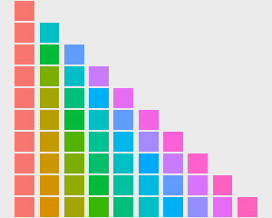

# R Base Graphics

## Why Visualization Matters in Bioinformatics

- **Explore data**: detect patterns, outliers, clusters
- **Communicate results**: publication-quality figures
- **Validate analyses**: PCA plots, volcano plots, heatmaps

## R Base Plot: Scatter Plot

Let's first see the data: 

\footnotesize
```{r}
head(swiss)
```
\normalsize

## Scatter Plot with plot()

\footnotesize

Make a scatter plot of `Fertility` vs. `Education`, note the use of `with()`:

```{r fig.height=3.5, fig.width=10}
with(swiss, plot(Education, Fertility))
```

## plot() Parameters

\footnotesize
```{r fig.height=3.5, fig.width=10}
#| label: edu-vs-fertility
with(swiss, plot(Education, Fertility, 
  type = "p", main = "Swiss data 1888", 
  sub = "Socioeconomic indicators & Fertility", 
  xlab = "Education", ylab = "Fertility", col = "darkblue", 
  xlim = range(Education), ylim = range(Fertility), 
  pch = 20, frame.plot = FALSE))
```

## plot() Parameter Summary

- **type**: `"p"` points, `"l"` lines, `"o"` overplotted, `"b"` both, `"c"`, `"s"`, `"S"`, `"h"`
- **main**, **sub**, **xlab**, **ylab**: labels
- **col**: color
- **xlim**, **ylim**: axis limits
- **pch**: point character (0–25, 32–127)
- **log**: `"x"`, `"y"`, `"xy"` for log-scale axes

## plot Types

\footnotesize
```{r fig.height=4, fig.width=10}
par(mfrow = c(2, 4))
opts <- c("p", "l", "o", "b", "c", "s", "S", "h")
for (o in opts) {
  plot(1:5, type = o, main = paste("type =", o))
}
```
\normalsize

## pch: Point Characters

\footnotesize

**Note**: pch 21–25 have both `colour` (stroke) and `fill`.

```{r fig.height=3, fig.width=10, warning=FALSE, message=FALSE}
library(tidyverse)
ggplot(data.frame(p = c(0:25, 32:127))) +
  scale_y_continuous(name = "") + scale_x_continuous(name = "") +
  scale_shape_identity() +
  geom_point(aes(x = p %% 16, y = p %/% 16, shape = p), size = 5, fill = "red") +
  geom_text(aes(x = p %% 16, y = p %/% 16 + 0.4, label = p), size = 3)
```

## High-level vs. Low-level Plots

- **High-level**: creates a new plot (plot, hist, boxplot, ...)
- **Low-level**: adds to existing plot (points, lines, abline, legend, ...)

\footnotesize
```{r fig.height=4, fig.width=10}
plot(1:10, col = "red")         # high-level
points(sample(1:10, 10), col = "darkgreen", pch = 20)  # low-level
```
\normalsize

## Graphics Parameters: par()

\footnotesize
```{r}
par(c("mar", "bg"))  # show specific parameters
```
\normalsize

**Always backup before changing par()**:

```{r eval=FALSE}
oldpar <- par()
# ... make changes ...
par(oldpar)  # restore
```

## Multi-panel Layout with par()

\footnotesize
```{r fig.height=3.5, fig.width=10}
par(mfrow = c(2, 3))   # 2 rows, 3 cols, fill by row
for (i in 1:6)
  plot(sample(1:10, 10), main = i)
```

`mfcol = c(2,3)` fills by column instead.

## Graphics Devices

The **graphics device** is the output destination:

- **Screen**: `X11()` (Linux), `windows()` (Windows), `quartz()` (macOS)
- **File**: `pdf()`, `png()`, `jpeg()`

\footnotesize
```{r eval=FALSE}
pdf(file = "myplot.pdf", height = 5, width = 5)
plot(1:10)
dev.off()  # MUST close the device!
```
\normalsize

**Always use PDF for bioinformatics figures** — it's a vector format (infinite zoom, editable in Illustrator).

# Introduction to ggplot2

## Grammar of Graphics Philosophy

ggplot2 is based on **The Grammar of Graphics** (Leland Wilkinson):

- **Data** — the dataset
- **Aesthetics (aes)** — mapping variables to visual properties
- **Geometries (geom)** — visual marks (points, lines, bars, ...)
- **Scales** — control how data values map to visual values
- **Facets** — small multiples
- **Themes** — non-data ink

## A Simple ggplot2 Example

\footnotesize
```{r}
library(tidyverse)

year1 <- c(7, 12, 28, 3, 41)
year2 <- c(14, 7, 6, 19, 3)

df <- rbind(
  tibble(month = 1:length(year1), value = year1, cat = "Year1"),
  tibble(month = 1:length(year2), value = year2, cat = "Year2"))

plot1 <- ggplot(df, aes(x = month, y = value, colour = cat)) +
  geom_line() + geom_point() +
  xlab("Month") + ylab("Rain fall") +
  labs(colour = "Year")
```
\normalsize

## The Plot

\footnotesize
```{r fig.width=10, fig.height=4}
plot1
```
\normalsize

## ggplot2 Anatomy Explained

- **`aes()`** (aesthetics): maps data to visual properties — x, y, colour, fill, shape, size, group
- **Layers** (`geom_xxx`): each plot can have multiple layers; layers can inherit or override aes and data
- **Other controls**: scales, facets, themes, labels

## Layers Can Use Their Own Data

\footnotesize
```{r fig.height=3, fig.width=10}
plot1 +
  geom_point(data = data.frame(x2 = 1:5, y2 = sample(30:100, 5)),
             aes(x = x2, y = y2),
             colour = c("darkgreen", "red", "blue", "gold", "purple"),
             shape = 15, size = 4)
```


## Layers Can Use Their Own Data, cont. 

**Key points**:

1. Axes auto-adjust to data
2. Plots can be stored in variables and incrementally built
3. Layer-specific data needs `data =` argument

## ggplot2: Pros & Cons

**Pros**:

- Powerful, professional
- Complex yet beautiful
- Canvas auto-adjusts — you focus on the data story

**Cons**:

- Steep learning curve
- Many parameters to remember

## The Four Core Components of ggplot2

1. **Layers** — `geom_xxx`
2. **Scales** — `scale_xxx_yyy`
3. **Coordinate systems** — `coord_xxx`
4. **Facets** — `facet_xxx`

# 1. Layers (geoms)

## Common Geoms

| geom | Use case |
|------|----------|
| `geom_point()` | Scatter plots |
| `geom_line()` | Line charts |
| `geom_smooth()` | Trend lines |
| `geom_bar()` / `geom_col()` | Bar charts |
| `geom_boxplot()` | Box plots |
| `geom_violin()` | Violin plots |
| `geom_histogram()` | Histograms |
| `geom_density()` | Density plots |
| `geom_path()` | Paths |

## Scatter Plot with ggplot2

\footnotesize
```{r fig.height=4, fig.width=10}
ggplot(mtcars, aes(x = wt, y = mpg, colour = factor(cyl), shape = factor(cyl))) +
  geom_point() +
  xlab("Weight (1000 lbs)") + ylab("Miles/(US) gallon") +
  labs(colour = "Cylinders", shape = "Cylinders")
```
\normalsize

## Box Plot

\footnotesize
```{r fig.height=4, fig.width=10}
ggplot(ToothGrowth, aes(x = factor(dose), y = len, fill = supp)) +
  geom_boxplot() + scale_fill_brewer(palette = "Paired") +
  labs(fill = "Supplement", x = "Dose (mg)")
```

## Multiple Geoms in One Plot

\footnotesize
```{r fig.height=4, fig.width=10}
ggplot(mtcars, aes(x = wt, y = mpg, colour = factor(cyl), shape = factor(cyl))) +
  geom_point() + ## layer 1
  geom_smooth(method = "lm", se = FALSE) + ## layer 2; both layers use the same data
  xlab("Weight (1000 lbs)") + ylab("Miles/(US) gallon") +
  labs(colour = "Cylinders", shape = "Cylinders")
```
\normalsize

# 2. Scales

## Scale Rule

`Scale` is a function that maps data values to visual values.

`scale_<aesthetic>_<method>`, e.g. `scale_color_manual()`

Four aesthetic types:

- `scale_color_...` — outline/stroke color
- `scale_fill_...` — fill color
- `scale_shape_...` — point shape
- `scale_size_...` — point/text size

## colour vs. fill

- **`colour`**: outline (stroke) of a geom
- **`fill`**: interior of a geom

Point shapes **21–25** have **both** colour and fill.

\footnotesize
```{r fig.height=3.5, fig.width=10}
mpg %>% ggplot(aes(displ, hwy)) +
  geom_point(aes(colour = cyl, fill = class), shape = 21, size = 3, stroke = 2)
```
\normalsize

## How the Fill Color is Determined?

* **`fill = class` ** means the fill color is determined by the `class` variable.
* **`class` contains categorical values** and has **7 levels**, so the fill color is determined by the default discrete color palette.

Here is how the `discrete color palette` looks like:

{height="45%"}


## Discrete Color Palettes: scale_colour_brewer()

\footnotesize
```{r fig.height=3, fig.width=8}
ggplot(iris, aes(x = Sepal.Length, y = Sepal.Width, color = Species)) +
  geom_point(size = 2) +
  scale_color_brewer(palette = "Set1")
```
\normalsize

## Discrete Color Palettes: scale_colour_brewer(), cont. 

\footnotesize

Three palette types:

- **Sequential**: Blues, Greens, Reds, ...
- **Qualitative**: Set1, Set2, Set3, Dark2, Paired, ...
- **Diverging**: RdBu, RdYlGn, Spectral, ...

## Manual Colors: scale_colour_manual()

\footnotesize
```{r fig.height=4, fig.width=10}
mtcars %>% ggplot(aes(disp, mpg)) +
  geom_point(aes(color = factor(cyl))) +
  scale_color_manual(breaks = c("4", "6", "8"),
                     values = c("red", "green", "blue"))
```
\normalsize

## Gradient Colors for Continuous Variables

\footnotesize
```{r fig.height=4, fig.width=10}
mpg %>% ggplot(aes(displ, hwy)) +
  geom_point(aes(color = displ)) +
  scale_color_gradient(low = "black", high = "yellow")
```
\normalsize

## Two-Color Gradient: scale_colour_gradient2()

\footnotesize
```{r fig.height=3.8, fig.width=10}
mpg %>% ggplot(aes(displ, hwy)) +
  geom_point(aes(color = displ)) +
  scale_colour_gradient2(low = "black", mid = "red", high = "yellow", midpoint = 4.5)
```
\normalsize

## N-Color Gradient: scale_colour_gradientn()

\footnotesize
```{r fig.height=4, fig.width=10}
mpg %>% ggplot(aes(displ, hwy)) +
  geom_point(aes(color = displ)) +
  scale_colour_gradientn(colors = c("black", "red", "yellow", "blue", "pink"))
```
\normalsize

## Publication-Ready Palettes: ggsci

\footnotesize
```{r warning=FALSE, message=FALSE}
library(ggsci)
library(gridExtra)

data("diamonds")
p1 <- ggplot(subset(diamonds, carat >= 2.2),
             aes(x = table, y = price, colour = cut)) +
  geom_point(alpha = 0.7) +
  geom_smooth(method = "loess", alpha = 0.05, size = 1, span = 1) +
  theme_bw() + labs(tag = "A")

p2 <- ggplot(subset(diamonds, carat > 2.2 & depth > 55 & depth < 70),
             aes(x = depth, fill = cut)) +
  geom_histogram(colour = "black", binwidth = 1, position = "dodge") +
  theme_bw() + labs(tag = "B")
```
\normalsize

## ggsci — Nature Publishing Group Style

\footnotesize
```{r fig.width=10, fig.height=4}
p1_npg <- p1 + scale_color_npg()
p2_npg <- p2 + scale_fill_npg()
grid.arrange(p1_npg, p2_npg, ncol = 2)
```
\normalsize

## Size and Shape Scales

\footnotesize
```{r fig.height=4, fig.width=10}
mpg %>% ggplot(aes(displ, hwy)) +
  geom_point(aes(size = cyl, colour = class, shape = class))
```
\normalsize

## aes() Inside vs. Outside

**Inside `aes()`**: maps to **data column** — varies by data values

**Outside `aes()`**: uses **fixed value** — constant for all points

```{r eval=FALSE}
# Inside — varies by data
geom_point(aes(size = cyl, colour = class))

# Outside — fixed value
geom_point(size = 2, colour = "green", shape = 21)
```

# 3. Coordinate Systems

## Linear Coordinate Systems

\footnotesize
```{r fig.height=3, fig.width=10, warning=FALSE}
p1 <- ggplot(mpg, aes(displ, hwy)) + geom_point() + geom_smooth()

p1 + coord_cartesian(xlim = c(4, 6))   # zoom in
```

`Cartesian` coordinate system is the default in R.

## coord_flip()

\footnotesize
```{r fig.height=4, fig.width=10, warning=FALSE}
# Flip x and y axes
ggplot(mpg, aes(displ, cty)) + geom_point() + geom_smooth() + coord_flip()
```
\normalsize

## coord_fixed()

`coord_fixed(ratio = 1)` — unit on x equals unit on y (e.g. for maps).

\footnotesize
```{r fig.height=3, fig.width=10, warning=FALSE}
ggplot(mpg, aes(cty, displ)) + geom_point() + geom_smooth() + coord_fixed()
```
\normalsize

## coord_trans() — Nonlinear Transformations

\footnotesize
```{r fig.height=3, fig.width=10}
rect <- data.frame(x = 50, y = 50)
line <- data.frame(x = c(1, 200), y = c(100, 1))
base <- ggplot(mapping = aes(x, y)) +
  geom_tile(data = rect, aes(width = 50, height = 50)) +
  geom_line(data = line)

base + coord_trans(y = "log10")
```
\normalsize

## coord_polar() — Pie Charts

\footnotesize
```{r fig.height=2.6, fig.width=10}
base2 <- ggplot(mtcars, aes(factor(1), fill = factor(cyl))) +
  geom_bar(width = 1) + theme(legend.position = "none") +
  scale_x_discrete(NULL, expand = c(0, 0)) +
  scale_y_continuous(NULL, expand = c(0, 0))

base2 + coord_polar(theta = "y")  # bar → pie
```
\normalsize

## coord_map() — World Maps

\footnotesize
```{r fig.height=3, fig.width=10, message=FALSE, warning=FALSE}
library(mapproj)
world <- map_data("world")
worldmap <- ggplot(world, aes(long, lat, group = group)) +
  geom_path() +
  scale_y_continuous(NULL, breaks = (-2:3) * 30, labels = NULL) +
  scale_x_continuous(NULL, breaks = (-4:4) * 45, labels = NULL)

worldmap + coord_map("ortho")  # orthographic projection
```
\normalsize

# 4. Facets

## facet_grid()

\footnotesize
```{r fig.height=3, fig.width=10}
ggplot(mtcars, aes(x = wt, y = mpg)) +
  geom_point() +
  facet_grid(. ~ cyl, scales = "free")
```
\normalsize

`facet_grid(rows ~ cols)` — `.` means no faceting on that dimension.

## facet_grid() by Row

\footnotesize
```{r fig.height=3, fig.width=4}
ggplot(mtcars, aes(x = wt, y = mpg)) +
  geom_point() +
  facet_grid(cyl ~ .)
```
\normalsize

## facet_wrap()

\footnotesize
```{r fig.height=4, fig.width=10}
ggplot(mtcars, aes(x = wt, y = mpg)) + geom_point() + geom_smooth(method = "lm") +
  facet_wrap(. ~ cyl, ncol = 2, dir = "v")
```

Key parameters: `nrow`, `ncol`, `scales`, `dir`

## Key parameters - scales

Here is an example that each facet has its own scale:

\footnotesize
```{r fig.height=3.5, fig.width=10}
ggplot(mtcars, aes(x = wt, y = mpg)) + geom_point() + geom_smooth(method = "lm") +
  facet_wrap(. ~ cyl, scales = "free")
```
\normalsize

# Summary

## What We Covered

| Component | Key Functions |
|-----------|---------------|
| **Base R Graphics** | `plot()`, `par()`, `pdf()`, `dev.off()` |
| **ggplot2 Basics** | `ggplot()`, `aes()`, geom layers |
| **Geoms** | `geom_point`, `geom_line`, `geom_bar`, `geom_boxplot`, `geom_histogram`, `geom_density`, `geom_smooth` |
| **Scales** | `scale_color_brewer`, `scale_color_manual`, `scale_color_gradient*`, `ggsci` |
| **Coordinates** | `coord_cartesian`, `coord_flip`, `coord_fixed`, `coord_trans`, `coord_polar`, `coord_map` |
| **Facets** | `facet_grid`, `facet_wrap` |

## Key Takeaway

ggplot2 = **grammar of graphics** — build plots layer by layer, with consistent logic.

## Next Talk

**Talk 06**: Data Visualization II — Advanced ggplot2, Themes & Saving Plots

## Homework

Complete `Homework_AI_powered_R/talk05-homework.qmd`
