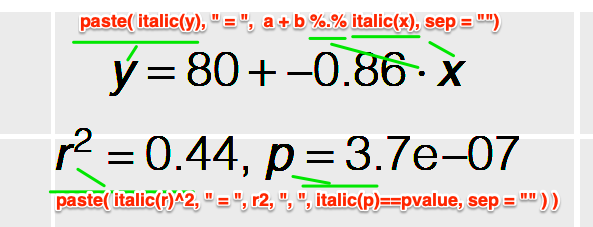

# Multi-panel Plots

## Multiple Panels with cowplot

\footnotesize

first prepare four plots:

```{r message=FALSE}
library(tidyverse)
library(cowplot)

#1. points
plot.hwy <- ggplot(mpg, aes(x = cty, y = hwy, colour = factor(cyl))) + geom_point(size = 2.5)

#2. bar
plot.dose <- ggplot(diamonds, aes(clarity, fill = cut)) + geom_bar() +
  theme(axis.text.x = element_text(angle = 70, vjust = 0.5))

#3. scatterplot + smooth
plot.iris <- ggplot(iris, aes(Sepal.Length, Sepal.Width)) +
  geom_point() + facet_grid(. ~ Species) + stat_smooth(method = "lm") +
  background_grid(major = 'y', minor = "none") + panel_border()

#4. scatterplot + smooth
plot.swiss <- swiss %>% ggplot(aes(Education, Agriculture)) + geom_point() + geom_smooth()
```
\normalsize

## plot_grid(): combine 4 plots, 2 rows, 2 columns

\footnotesize
```{r fig.height=4, fig.width=10, message=FALSE}
cowplot::plot_grid(plot.hwy, plot.dose, plot.iris, plot.swiss,
                   labels = c("A", "B", "C", "D"), ncol = 2, nrow = 2)
```
\normalsize

## Free Layout with ggdraw() + draw_plot()

\footnotesize
```{r fig.height=4, fig.width=10}
ggdraw() + ## note the coordinates start from 0,0 at the left bottom corner!
  draw_plot(plot.iris, x = 0, y = 0.5, width = 1, height = 0.5) +
  draw_plot(plot.hwy, 0, 0, 0.5, 0.5) +
  draw_plot(plot.dose, 0.5, 0, 0.5, 0.5) +
  draw_plot_label(c("A", "B", "C"), c(0, 0, 0.5), c(1, 0.5, 0.5), size = 15)
```
\normalsize

## gridExtra::grid.arrange() - another way to combine plots

\footnotesize

again prepare four plots:

```{r message=FALSE}
library(gridExtra)
df2 <- ToothGrowth; df2$dose <- as.factor(df2$dose)
#1. boxplot
bp <- ggplot(df2, aes(x = dose, y = len, color = dose)) +
  geom_boxplot() + theme(legend.position = "none") + labs(tag = "A")
#2. dotplot
dp <- ggplot(df2, aes(x = dose, y = len, fill = dose)) +
  geom_dotplot(binaxis = 'y', stackdir = 'center') +
  stat_summary(fun.data = mean_sdl, mult = 1, geom = "pointrange", color = "red") +
  theme(legend.position = "none") + labs(tag = "B")
#3. violin
vp <- ggplot(df2, aes(x = factor(dose), y = len)) +
  geom_violin() + geom_boxplot(width = 0.1) + labs(tag = "C")
#4. jitter
sc <- ggplot(df2, aes(x = dose, y = len, color = dose, shape = dose)) +
  geom_jitter(position = position_jitter(0.2)) +
  theme(legend.position = "none") + theme_gray() + labs(tag = "D")
```
\normalsize

## grid.arrange() - combine 4 plots, 2 rows, 2 columns, cont.

\footnotesize
```{r fig.height=6, fig.width=10, message=FALSE}
grid.arrange(bp, dp, vp, sc, ncol = 2, nrow = 2)
```
\normalsize

## Complex Layout with layout_matrix

\footnotesize
```{r fig.height=4, fig.width=8, message=FALSE}
grid.arrange(bp, dp, vp, sc, ncol = 2,
             layout_matrix = cbind(c(1, 1, 1), c(2, 3, 4)))
```
\normalsize

## layout_matrix explained!

\footnotesize

let us take a look at the layout matrix:

```{r fig.height=6, fig.width=10, message=FALSE}
cbind(c(1, 1, 1), c(2, 3, 4))
```

\normalsize

Meaning of the layout matrix:

- 1st column: panel A takes the whole column
- 2nd column: the rest three panels take this column vertically.


# Equations in Plots

## Scenario 1: Without Variable Substitution - expression() 

\footnotesize
```{r fig.width=10, fig.height=4}
eq <- expression(paste(frac(1, sigma * sqrt(2 * pi)), " ",
                       plain(e)^{frac(-(x - mu)^2, 2 * sigma^2)}))

ggplot(data.frame(x = 1:10, y = 1:10), aes(x, y)) +
  geom_point(size = 0) +
  geom_text(data = NULL, x = 5, y = 5, size = 12,
            label = as.character(eq), parse = TRUE) ## note parse = TRUE tells ggplot to parse the expression
```
\normalsize

## Greek Letters

\footnotesize
```{r message=FALSE, error=FALSE, fig.height=3.5, fig.width=10}
greeks <- c("Alpha", "Beta", "Gamma", "Delta", "Epsilon", "Zeta",
            "Eta", "Theta", "Iota", "Kappa", "Lambda", "Mu",
            "Nu", "Xi", "Omicron", "Pi", "Rho", "Sigma",
            "Tau", "Upsilon", "Phi", "Chi", "Psi", "Omega")
dat <- data.frame(x = rep(1:6, 4), y = rep(4:1, each = 6), greek = greeks)
## note the difference between parse = TRUE and parse = FALSE (default)
ggplot(dat, aes(x = x, y = y)) + geom_point(size = 0) +
  geom_text(aes(x, y + 0.1, label = tolower(greek)), size = 10, parse = TRUE) +
  geom_text(aes(x, y - 0.1, label = tolower(greek)), size = 5, parse = FALSE)
```

## Scenario 2: With Variable Substitution - bquote() / substitute()

\footnotesize
```{r fig.width=10, fig.height=4}
x <- 1.24; y <- 0.6
ex <- bquote(.(parse(text = paste("observed (", "italic(R)^2 == ",
                                  x, "^bold(", x, "), n == ", y, ")",
                                  sep = "  "))))
ggplot(data.frame(x = 1:10, y = 1:10), aes(x, y)) + geom_point(size = 0) +
  geom_text(data = NULL, x = 5, y = 5, size = 8,
            label = as.character(ex), parse = TRUE) ## always use parse = TRUE
```
\normalsize

## Full Example: Regression Equation on Plot

\footnotesize
```{r fig.width=10, fig.height=5, warning=FALSE, message=FALSE}
m <- lm(Fertility ~ Education, swiss)
c <- cor.test(swiss$Fertility, swiss$Education)

eq <- substitute(
  atop(paste(italic(y), " = ", a + b %.% italic(x), sep = ""),
       paste(italic(r)^2, " = ", r2, ", ", italic(p) == pvalue, sep = "")),
  list(a = as.vector(format(coef(m)[1], digits = 2)),
       b = as.vector(format(coef(m)[2], digits = 2)),
       r2 = as.vector(format(summary(m)$r.squared, digits = 2)),
       pvalue = as.vector(format(c$p.value, digits = 2))))

eq <- as.character(as.expression(eq))

## save plot for latter use
plot <- ggplot(swiss, aes(x = Education, y = Fertility)) +
  geom_point(shape = 20) + geom_smooth(se = TRUE) +
  geom_text(data = NULL,
            aes(x = 30, y = 80, label = eq, hjust = 0, vjust = 1),
            size = 4, parse = TRUE, inherit.aes = FALSE)
```

## Full Example: Regression Equation on Plot - cont.

\footnotesize

```{r fig.width=10, fig.height=5, warning=FALSE, message=FALSE}
plot
```


## Full Example: Regression Equation on Plot - Visual Guide

\footnotesize

* `paste()`: concatenate strings
* `italic()`: italic font
* `bold()`: bold font
* `atop()`: align text vertically
* `substitute()`: substitute variables

{height="30%"}

# Themes & Legends

## Built-in Themes

\footnotesize
```{r fig.height=3.5, fig.width=10}
ggplot(ToothGrowth, aes(x = factor(dose), y = len, fill = supp)) +
  geom_boxplot() + scale_fill_brewer(palette = "Paired") + theme_classic()
```

## Built-in Themes, cont.

* `theme_gray` (default), 
* `theme_bw`, 
* `theme_linedraw`, 
* `theme_light`, 
* `theme_dark`, 
* `theme_minimal`, 
* `theme_void`

## Customizing with theme() - legend position

\footnotesize
```{r fig.height=4, fig.width=10}
ggplot(ToothGrowth, aes(x = factor(dose), y = len, fill = supp)) +
  geom_boxplot() + scale_fill_brewer(palette = "Paired") +
  labs(fill = "Supplement", x = "Dose (mg)") +
  theme(legend.position = "top")
```
\normalsize

## labs() Function 

`labs()` can be used to customize labels (axis, legend, title, subtitle, caption, tag)

\footnotesize

Note: the corresponding relationships between `labs()` and `aes()`:

```{r eval=FALSE}
labs(
  x = "<x label>", y = "<y label>",
  colour = "<legend title>",  # matches aes(colour = ...)
  fill = "<legend title>",    # matches aes(fill = ...)
  shape = "<legend title>",   # matches aes(shape = ...)
  title = "...", subtitle = "...", caption = "...", tag = "..."
)
```
\normalsize

## labs() Example

\footnotesize
```{r fig.height=4, fig.width=10}
grid.arrange(
  sc + labs(tag = "A"),
  sc + labs(colour = "Dose (mg)", tag = "B"),
  sc + labs(shape = "Dose (mg)", tag = "C"),
  
  ## note the merge of `colour` and `shape`
  sc + labs(colour = "Dose (mg)", shape = "Dose (mg)", tag = "D"), 
  ncol = 4, nrow = 1)
```
\normalsize

# Saving Plots

## ggsave()

\footnotesize
```{r eval=FALSE}
# Save last displayed plot
ggsave("myplot.pdf", width = 8, height = 6)

# Save a specific plot object
ggsave("myplot.png", plot = p1, width = 8, height = 6, dpi = 300)
```
\normalsize

Key parameters:

- **filename**: extension determines format (`.pdf`, `.png`, `.jpg`, `.svg`, ...)
- **width, height**: in inches
- **dpi**: resolution for raster formats

## Interactive Plots: plotly::ggplotly()

\footnotesize
```{r eval=FALSE}
library(plotly)
p <- ggplot(mpg, aes(displ, hwy, colour = class)) + geom_point()
ggplotly(p)  # interactive version
```
\normalsize

# Summary

## What We Covered : Advanced Plotting

| Topic | Key Functions |
|-------|---------------|
| **Multi-panel Layouts** | `cowplot::plot_grid`, `ggdraw`, `draw_plot`, `gridExtra::grid.arrange` |
| **Equations in Plots** | `expression()`, `bquote()`, `substitute()`, `atop()` |
| **Themes** | `theme_*()`, `theme()` customization |
| **Labels & Legends** | `labs()`, legend position, merge legends |
| **Saving Plots** | `ggsave()`, `plotly::ggplotly()` |

## Key Takeaway

Beyond basic plots: 

- combine multiple panels, 
- add statistical annotations, 
- customize appearance, and 
- export publication-quality figures.

## Next Talk

**Talk 07**: Data Visualization III — Bioinformatics Plots with Real Data

## Homework

Complete `Homework_AI_powered_R/talk06-homework.qmd`
