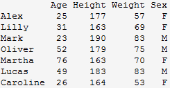
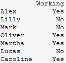

## 练习和作业说明

将相关代码填写入以 \`\`\`{r} \`\`\` 标志的代码框中，运行并看到正确的结果；

完成后，用工具栏里的"Knit"按键生成PDF文档；

**将生成的PDF**改为：**`姓名-学号-talk03作业.pdf`**，并提交到老师指定的平台/钉群。

## talk03 内容回顾

-   二维表：`data.frame`, `tibble`

    -   声明

    -   操作

        -   增减行、列

        -   合并

    -   常用相关函数

        -   `nrow`, `ncol`, `dim` , `str` , `head`, `tail`

    -   `data.frame`和 `tibble` 的不同

    -   高级技巧：

        -   `with`, `within`

-   IO

    -   系统自带函数

    -   `readr` 带的函数

    -   不同格式的读取

    -   从网络、压缩文件读取

## 练习与作业：用户验证

请运行以下命令，验证你的用户名。

**如你当前用户名不能体现你的真实姓名，请改为拼音后再运行本作业！**

```{r}
Sys.info()[["user"]]
Sys.getenv("HOME")
```


## 练习与作业1，`data.frame`

注：以下内容来自 <https://www.r-exercises.com/>。

-   **生成下面的 `data.frame` 的前三列，之后再增加 `Sex` 这列**

{width="80%"}

```{r}
## 先生成前三列；

## 再插入第四列

## 显示最终结果

```

------------------------------------------------------------------------

-   **生成以下`data.frame`，确保`Working`这列的类型是 `character`，而不是 `factor`**

{width="80%"}

```{r}
## 生成 data.frame

## 显示结果

## 显示 Working 列的性质

```

------------------------------------------------------------------------

-   **检查系统自带变量 `state.center` 的内容，将其转化为 `data.frame`**

```{r}
## 代码写这里，并运行；
```

------------------------------------------------------------------------

-   **生成一个 50行 \* 5列 的`matrix`，将其行名改为：row_i 格式，其中 i 为当前的行号，比如 row_1, row_2 等**

```{r}
## 代码写这里，并运行；

```

------------------------------------------------------------------------

-   **使用系统自带变量`VADeaths`，做如下练习：**

-   检查`VADeaths`的类型，如果不是 `data.frame`，则转换之；

-   添加新的一列，取名 `Total`，其值为每行的总合

-   调整列的顺序，将 `Total` 变为第一列。

```{r}
## 代码写这里，并运行；

```

------------------------------------------------------------------------

-   **用系统自带的`swiss`数据做练习：**

-   取子集，选取第1, 2, 3, 10, 11, 12 and 13行，第`Examination`, `Education` 和 `Infant.Mortality`列；

-   将`Sarine`行 `Infant.Mortality` 列的值改为NA；

-   增加一列，命名为 `Mean`，其值为当前行的平均值；

```{r}
## 代码写这里，并运行；

```

------------------------------------------------------------------------

-   **将下面三个变量合并生成一个`data.frame`**

`Id <- LETTERS`

`x <- seq(1,43,along.with=Id)`

`y <- seq(-20,0,along.with=Id)`

```{r}
## 代码写这里，并运行；

```

**问：** `seq`函数中的`along.with` 参数的意义是什么？请举例说明。

答：

```{r}
## 代码写这里，并运行；

```

------------------------------------------------------------------------

-   **提供代码，合并以下两个 `data.frame`**

<!-- -->

    > df1 的内容 
    Id Age
    1 14
    2 12
    3 15
    4 10 

    >df2 的内容
    Id Sex Code
    1 F a
    2 M b
    3 M c
    4 F d

合并之后的结果：

    > M 
    Id Age Sex Code
    1 14 F a
    2 12 M b
    3 15 M c
    4 10 F d

```{r}
## 代码写这里，并运行；

```

------------------------------------------------------------------------

-   **从上面的`data.frame`中删除`code`列**

```{r}
## 代码写这里，并运行；

```

------------------------------------------------------------------------

-   **练习，回答代码中的问题**

<!-- -->

    ## 1. 生成一个10 行2 列的data.frame
    df3 <- data.frame( data = 1:10, group = c("A","B") );
    ## 2. 增加一列，其长度是1，可以吗？
    cbind(df3, newcol = 1);
    ## 3. 增加一列，其长度是10，可以吗？
    cbind(df3, newcol = 1:10);
    ## 4. 增加一列，其长度是2，可以吗？
    cbind(df3, newcol = 1:2);
    ## 5. 增加一列，其长度是3，可以吗？
    cbind(df3, newcol = 1:3);

答：

## 练习与作业2，`tibble`

-   **运行以下代码，生成一个新的`tibble`：**

```{r}
## 如果系统中没有 lubridate 包，则安装：
if (!require("lubridate")){ 
  chooseCRANmirror();
  install.packages("lubridate");
} 
library(lubridate);

if (!require("tibble")){ 
  chooseCRANmirror();
  install.packages("tibble");
}
library(tibble);

tibble(
  a = lubridate::now() + runif(1e3) * 86400,
  b = lubridate::today() + runif(1e3) * 30,
  c = 1:1e3,
  d = runif(1e3),
  e = sample(letters, 1e3, replace = TRUE)
)
```

从中可以看出，`tibble`支持一些细分数据类型，包括：

-   `<dttm>`
-   `<date>`

等；

------------------------------------------------------------------------

-   **生成一个如下的`tibble`，完成以下任务：**

<!-- -->

    df <- tibble(
      x = runif(5),
      y = rnorm(5)
    )

任务：

-   取一列，比如`x`这一列，得到一个 `tibble`；
-   取一列，比如`y`这一列，得到一个 `vector`；

```{r}
## 代码写这里，并运行；

```

------------------------------------------------------------------------

-   **用 `tibble` 函数创建一个新的空表，并逐行增加一些随机的数据，共增加三行：**

```{r}
## 代码写这里，并运行；
## 新tibble, with defined columns ... 创建表头
tb <- tibble( name = character(), age = integer(), salary = double() );

##增加三行随机数据；


```

------------------------------------------------------------------------

-   \*\* 请解释为什么下面第一行代码能够运行成功，但第二个不行？ \*\*

这个可以：

`data.frame(a = 1:6, b = LETTERS[1:2]);`

但下面这个不行：

`tibble(a = 1:6, b = LETTERS[1:2]);`

问：为什么？tibble 循环的规则是什么？

答：

------------------------------------------------------------------------

-   **`attach`和`detach`：**

问：这个两个函数的用途是什么？请用 `iris` 这个系统自带变量举例说明。

答：

------------------------------------------------------------------------

-   **使用内置变量`airquality`：**

-   检查它是否是 `tibble`；

-   如果不是，转化为 `tibble`；

```{r}
## 代码写这里，并运行；

```

------------------------------------------------------------------------

-   **问：`tibble::enframe`函数的用途是什么？请举例说明：**

答：

------------------------------------------------------------------------

-   **简述`tibble`相比`data.frame`的优势？并用实例展示**

答：

```{r}
## 代码写这里，并运行；

```

## 练习与作业3：IO

-   **提供代码，正确读取以下文件：**

注：数据在当前目录下的 `data/` 子目录里

-   Table0.txt
-   Table1.txt
-   Table2.txt
-   Table3.txt
-   Table4.txt
-   Table5.txt
-   Table6.txt
-   states1.csv
-   states2.csv

注2：每个文件读取需要提供两种方法，一种是利用系统自带函数，另一种是`readr`包的函数；

注3：请注意观察每列的数据特点，并将之读取为合理的数据类型；比如 体重 `1,77` 可理解为 `1.77` 米，并将之读取为 `col_double()` 类型；

```{r}
## 用系统自带函数，并显示读取的内容；

## 用readr 包的函数读取，并显示读取的内容；

```
