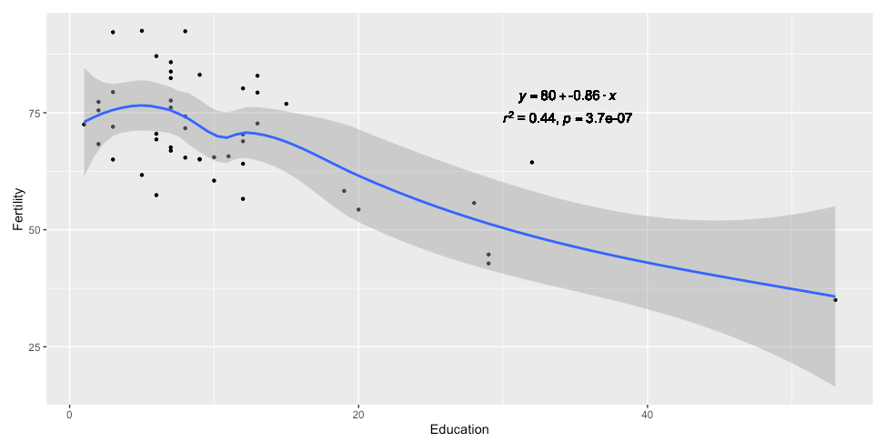

## 练习和作业说明

将相关代码填写入以 \`\`\`{r} \`\`\` 标志的代码框中，运行并看到正确的结果；

完成后，用工具栏里的"Knit"按键生成PDF文档；

**将PDF文档**改为：`姓名-学号-talk10作业.pdf`，并提交到老师指定的平台/钉群。

## Talk10 内容回顾

-   data summarisation functions (vector data)

    -   median, mean, sd, quantile, summary

-   图形化的 data summarisation (two-D data/ tibble/ table)

    -   dot plot
    -   smooth
    -   linear regression
    -   correlation & variance explained
    -   groupping & bar/ box/ plots

-   statistics

    -   parametric tests

        -   t-test
        -   one way ANNOVA
        -   two way ANNOVA
        -   linear regression
        -   model / prediction / coefficients

    -   non-parametric comparison

## 练习与作业：用户验证

请运行以下命令，验证你的用户名。

**如你当前用户名不能体现你的真实姓名，请改为拼音后再运行本作业！**

```{r}
Sys.info()[["user"]]
Sys.getenv("HOME")
```

## 练习与作业1：数据查看

------------------------------------------------------------------------

-   **正态分布**

1.  随机生成一个数字（`numberic`）组成的`vector`，长度为10万，其值符合正态分布；

2.  用 `ggplot2` 的 `density plot` 画出其分布情况；

3.  检查 `mean` +- 1 \* `sd`，`mean` +- 2 \* `sd`和`mean` +- 3 \* `sd` 范围内的取值占总值数量的百分比。

```{r}
## 代码写这里，并运行；
plot(1:10)
```

------------------------------------------------------------------------

-   **用函数生成符合以下分布的数值，并做图：**

另外，在英文名后给出对应的中文名：

    -   Uniform Distribution

    -   Normal Distribution

    -   Binomial Distribution

    -   Poisson Distribution

    -   Exponential Distribution

    -   Gamma Distribution

```{r}
## 代码写这里，并运行；

```

------------------------------------------------------------------------

-   **分组的问题**

    -   什么是`equal-sized bin`和`equal-distance bin`？以`mtcars`为例，将`wt`列按两种方法分组，并显示结果。

```{r}
## 代码写这里，并运行；

```

------------------------------------------------------------------------

-   **`boxplot`中`outlier`值的鉴定**

    -   以 `swiss$Infant.Mortality` 为例，找到它的 `outlier` 并打印出来；

```{r}
## 代码写这里，并运行；

```

------------------------------------------------------------------------

-   **以男女生步数数据为例，进行以下计算：**

首先用以下代码装入`Data`:

```{r}
source("../data/talk10/input_data1.R"); ## 装入 Data data.frame ... 
head(Data);
```

    -    分别用`t.test`和`wilcox.test`比较男女生步数是否有显著差异；打印出`p.value`

```{r}
## 代码写这里，并运行；

```

    -    两种检测方法的`p.value`哪个更显著？为什么？

答：

------------------------------------------------------------------------

-   **以下是学生参加辅导班前后的成绩情况，请计算同学们的成绩是否有普遍提高？**

注：先用以下代码装入数据：

```{r}
source("../data/talk10/input_data2.R");
head(scores);
```

注：计算时请使用 `paired = T` 参数；

```{r}
## 代码写这里，并运行；

```

## 练习与作业2：作图

------------------------------------------------------------------------

-   **利用talk10中的`data.fig3a`作图**

    -   首先用以下命令装入数据：

```{r}
library(tidyverse);
data.fig3a <- read_csv( file = "../data/talk10/nc2015_data_for_fig3a.csv" );
```

    -   利用两列数据：`tai` `zAA1.at` 做`talk10`中的`boxplot`（详见：`fig3a`的制作）；

    -   用`ggsignif`为相邻的两组做统计分析（如用 `wilcox.test` 函数），并画出`p.value`；

```{r}
## 代码写这里，并运行；

```

**问：** 这组数据可以用`t.test`吗？为什么？

答：

```{r}
## 代码写这里，并运行；

```

------------------------------------------------------------------------

-   **用系统自带变量`mtcars`做图**

    -   用散点图表示 `wt`（x-轴）与 `mpg`（y-轴） 的关系

    -   添加线性回归直线图层

    -   计算`wt`）与 `mpg`的相关性，并将结果以公式添加到图上。其最终效果如下图所示（注：相关代码可在`talk09`中找到）：



```{r}
## 代码写这里，并运行；

```

## 练习与作业3：线性模型与预测

------------------------------------------------------------------------

-   **使用以下代码产生数据进行分析**

```{r}
wts2 <- bind_rows( 
   tibble( class = 1, age = sample( 13:15, 20, replace = T ), wt = sample( seq(50, 60, by = 0.1), 20 ) ),
   tibble( class = 2, age = sample( 14:16, 20, replace = T ), wt = sample( seq(55, 65, by = 0.1), 20 ) ),
   tibble( class = 3, age = sample( 15:17, 20, replace = T ), wt = sample( seq(60, 70, by = 0.1), 20 ) )
);

ggplot(wts2, aes( factor( age ), wt ) ) + geom_boxplot() + coord_flip();
```

    -   用线性回归检查`age`, `class` 与 `wt` 的关系，构建线性回归模型；

    -   以`age`, `class`为输入，用得到的模型预测`wt`；

    -   计算预测的`wt`和实际`wt`的相关性；

    -   用线性公式显示如何用`age`, `class`计算`wt`的值。

```{r}
## 代码写这里，并运行；

```
