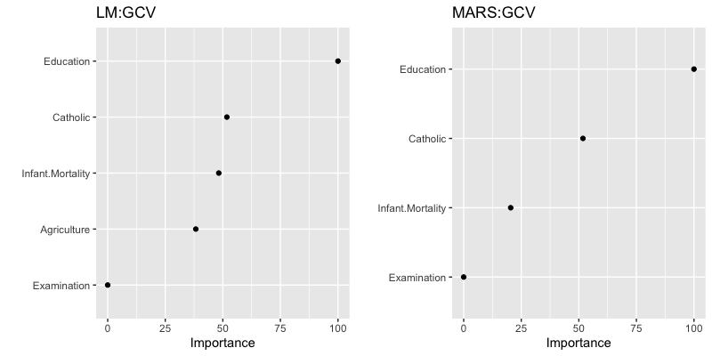

## 练习和作业说明

将相关代码填写入以 \`\`\`{r} \`\`\` 标志的代码框中，运行并看到正确的结果；

完成后，用工具栏里的"Knit"按键生成PDF文档；

**将PDF文档**改为：**`姓名-学号-talk11作业.pdf`**，并提交到老师指定的平台/钉群。

## talk11 内容回顾

待写 .. 

## 练习与作业：用户验证

请运行以下命令，验证你的用户名。

**如你当前用户名不能体现你的真实姓名，请改为拼音后再运行本作业！**

```{r}
Sys.info()[["user"]]
Sys.getenv("HOME")
```


## 练习与作业1：linear regression

------------------------------------------------------------------------

### **一元回归分析**

用 `readr` 包的函数将 `Excercises and homework/data/talk11/` 目录下的 `income.data_.zip` 文件装入到 `income.dat` 变量中，进行以下分析：

1.  用线性回归分析 `income` 与 `happiness` 的关系；
2.  用点线图画出`income` 与 `happiness` 的关系，将推导出来的公式写在图上；
3.  用得到的线性模型，以`income`为输入，预测`happiness`的值；
4.  用点线图画出预测值与真实`happiness`的关系，并在图上写出 R2 值。

```{r}
## 代码写这里，并运行；

```

------------------------------------------------------------------------

### **多元回归分析**

用 `readr` 包的函数将 `Excercises and homework/data/talk11/` 目录下的 `heart.data_.zip` 文件装入到 `heart.dat` 变量中，进行以下分析：

1.  用线性回归分析 `heart.disease` 与 `biking` 和 `smoking` 的关系；
2.  写出三者间关系的线性公式；
3.  解释`biking` 和 `smoking`的影响（方向和程度）；
4.  `biking` 和 `smoking`能解释多少`heart.disease`的variance？这个值从哪里获得？
5.  用 `relaimpo`包的函数计算`biking` 和 `smoking`对`heart.disease`的重要性。哪个更重要？
6.  用得到的线性模型预测`heart.disease`，用点线图画出预测值与真实值的关系，并在图上写出 R2 值。
7.  在建模时考虑 `biking` 和 `smoking`的互作关系，会提高模型的 R2 值吗？如果是，意味着什么？如果不是，又意味着什么？

```{r}
## 代码写这里，并运行；

```

------------------------------------------------------------------------

### **`glm` 相关问题**

用 `glm` 建模时使用`family=binomial`；在预测时， `type=`参数可取值 `link`（默认）和 `response`。请问，两者的区别是什么？请**写代码**举例说明。

```{r}
## 代码写这里，并运行；

```

## 练习与作业2：non-linear regression

------------------------------------------------------------------------

### **分析 `swiss` ，用其它列的数据预测`Fertility`**

1.  使用`earth`包建模，并做 10 times 10-fold cross validation;
2.  使用`lm`方法建模，同样做 10 times 10-fold cross validation;
3.  用 `RMSE` 和 `R2` 两个指标比较两种方法，挑选出较好一个；
4.  用 `vip` 包的函数查看两种方法中 feature 的重要性，并画图（如下图所示）：



```{r}
## 代码写这里，并运行；

```