```{r include=FALSE}
color_block = function(color) {
  function(x, options) sprintf('\\color{%s}\\begin{verbatim}%s\\end{verbatim}',
                               color, x)
}

## 将错误信息用红色字体显示
knitr::knit_hooks$set(error = color_block('red'))
```

## Table of Contents

-   什么是PCA

-   PCA, PCoA 和 NMDS

-   组学数据举例

# Section 1: PCA

## 什么是PCA？

Principle component analysis (PCA) 是一种降维分析方法，主要用于简化、揭示**样本之间的关系**（距离），并显示**变量之间的关系及对样本分组的贡献度**。

PCA通常用所谓的biplot（双标图）来表示；Biplot is a generalization of the simple two-variable [scatterplot](https://en.wikipedia.org/wiki/Scatter_plot "Scatter plot"); biplot allows information on both [**samples**](https://en.wikipedia.org/wiki/Sampling_(statistics) "Sampling (statistics)") and **variables of a [data matrix](https://en.wikipedia.org/wiki/Data_matrix_(statistics) "Data matrix (statistics)")** to be displayed graphically.

这里用`mtcars`给出一个例子；先看一下数据： \FontSmall

```{r message=FALSE, warning=FALSE, echo=FALSE}
## -- 显示原始数据 --
knitr::kable(head(mtcars));
```

## A PCA plot

```{r echo=FALSE, fig.width=10, fig.height=5, warning=FALSE, message=FALSE}

## echo=FALSE 时，不显示代码；

require(ggbiplot);
mtcars.pca <- prcomp(mtcars, scale = T);
mtcars.country <- c(rep("Japan", 3), rep("US",4), rep("Europe", 7),rep("US",3), "Europe", rep("Japan", 3), rep("US",4), rep("Europe", 3), "US", rep("Europe", 3))

ggbiplot(mtcars.pca, ellipse=TRUE, obs.scale = 1, var.scale = 1, labels=rownames(mtcars), groups=mtcars.country) +
  ggtitle("PCA of mtcars dataset")+
  scale_colour_manual(name="Origin", values= c("forest green", "red3", "dark blue"))+
  theme_minimal();
```

## 降维

`mtcars`共有11维数据：

\FontSmall

```{r message=FALSE, warning=FALSE, echo=FALSE}
## -- 显示原始数据 --
knitr::kable(head(mtcars, n = 3));
```

\FontNormal

但通常情况下，人只能处理2\~3维的数据。因此，理想情况是将**任何多维数据**转化为**2\~3维**，以供人眼识别。

但操作中这很难实现。解决方法如下：

1.  创造新的、数量与**变量数**一样的**维度**（components）；
2.  使第一维尽可能多的捕捉整体数据的**变化（variation），实现最大可分性**；并使第二 ... N 维依次捕捉独立于之前维度的独立变化；或者说，按维度的重要性（对样本variation的解释度）进行排序，最重要的排第一，依次排列；
3.  所有维度对样本解释度的总和为100%；
4.  可以用最重要的2\~3个维度做图，虽然这样会损失部分信息；损失程度与前几维的重要性有关。

## 如何实现最大可分性？

假设我们有一个二维数据，可以用x1和x2表示：

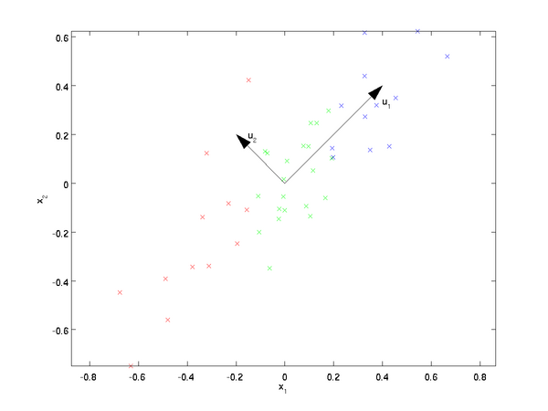{width="45%"}

从直观上也可以看出，我们可以产生两个新的维度，以更好的表示当前数据；而且， `u1`比 `u2` 好，因此前者可以作为第一维。这就是我们所说的**最大可分性。**

## 最大可分性

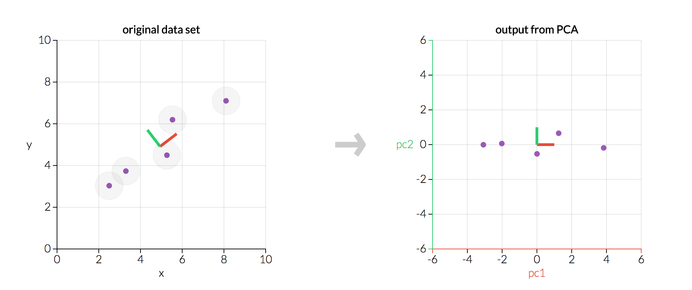{width="339"}

## 降维

两个维度的重要性可以用数据点与维度的距离判定：

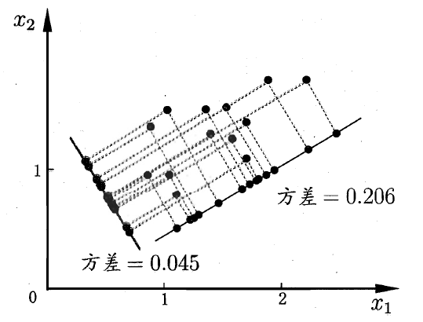{width="50%"}

注：插图来自[知乎](https://zhuanlan.zhihu.com/p/32412043).

## 多维数据的降维？

一般来说，欲获得原始数据新的表示空间，最简单的是对原始数据进行线性变换（基变换）：

$Y = PX$

其中 $Y$ 是样本在新空间的表达， $P$ 是基向量， $X$ 是原始样本。我们可知选择不同的基可以对一组数据给出不同的表示，同时当基的数量少于原始样本本身的维数则可达到降维的效果，矩阵表示如下：

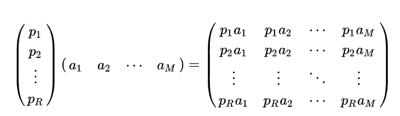{width="68%"}

注：详情见[知乎](https://zhuanlan.zhihu.com/p/32412043)页面.

## PCA算法的优缺点

### 优点：

-   仅仅需要以方差衡量信息量，不受数据集以外的因素影响。　

-   各主成分之间正交，可消除原始数据成分间的相互影响的因素。

-   计算方法简单，主要运算是特征值分解，易于实现。

### 缺点：

-   主成分各个特征维度的含义具有一定的模糊性，不如原始样本特征的解释性强。

-   方差小的非主成分也可能含有对样本差异的重要信息，因降维丢弃可能对后续数据处理有影响。

## PCA计算方法与结果解读

\FontSmall

```{r message=FALSE, warning=FALSE, echo=FALSE}
## -- 显示原始数据 --
knitr::kable(head(mtcars, n = 3));
```

```{r}
mtcars.pca <- prcomp(mtcars, scale = T);
names(mtcars.pca);
summary(mtcars.pca);
```

## Variance explained by components

```{r message=FALSE, warning=FALSE, echo=FALSE, fig.width=10, fig.height=5}
# bar plot
plot(mtcars.pca)
```

## Plot both `variance` and `cumulative variance`

\FontSmall

```{r message=FALSE, warning=FALSE}
## -- let's first get all data ready --
impor <- summary( mtcars.pca )$importance[2:3,]; ## get importance
impor2 <- data.frame( impor, type = rownames(impor) );

## -- transform
require(tidyverse);
dat <- impor2 %>% gather( comp, impo, -type );
dat$comp <- factor(dat$comp, levels = colnames(impor));
plot3 <- 
  ggplot( dat, aes( comp, impo, group = type, color = type ) ) +
  geom_line() +
  geom_point();
```

## Plot both `variance` and `cumulative variance`, cont.

\FontSmall

```{r warning=FALSE, echo=FALSE, fig.width=10, fig.height=5}
plot3
```

## Plot the first two components

\FontSmall

```{r warning=FALSE, message=FALSE}
require(ggbiplot);
plot1 <- 
  ggbiplot(mtcars.pca, obs.scale = 1, var.scale = 1) + theme_minimal();
```

## Plot the first two components, cont.

\FontSmall

```{r fig.height=3, fig.width=10}
plot1;
```

## 双标图中各个线段、点所代表的意义

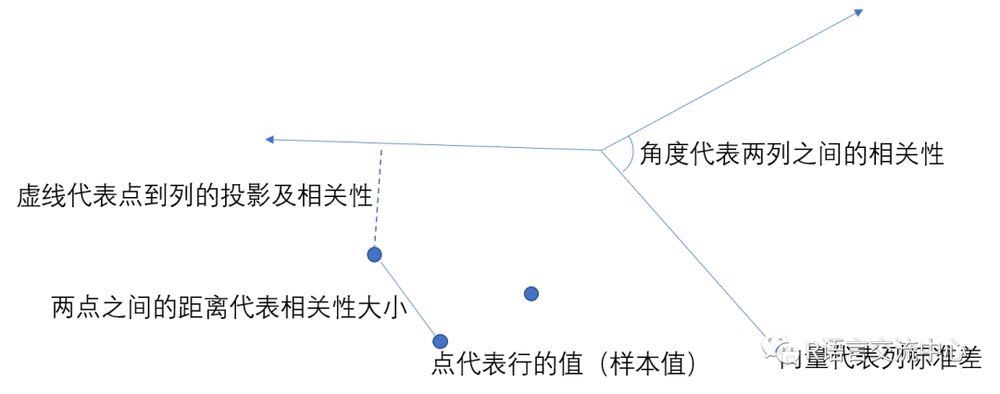{width="444"}

注：图片来自[腾讯云](https://cloud.tencent.com/developer/article/1556141).

## XY数据从何而来？

\FontSmall

```{r}
knitr::kable(mtcars.pca$x[1:10, 1:4])
```

## Components and their contributing variables

\FontSmall

```{r message=FALSE, warning=FALSE, echo=FALSE}
knitr::kable(mtcars.pca$rotation[, 1:5])
```

## PCA常用分析1：组间差别

\FontSmall

```{r warning=FALSE, message=FALSE}
mtcars.country <- c(rep("Japan", 3), rep("US",4), rep("Europe", 7),rep("US",3),
                    "Europe", rep("Japan", 3), rep("US",4), rep("Europe", 3), 
                    "US", rep("Europe", 3))

## 只做图不显示；
plot2 <- 
  ggbiplot(mtcars.pca, ellipse=TRUE, obs.scale = 1, var.scale = 1, labels=rownames(mtcars), 
         groups=mtcars.country) +
  scale_colour_manual(name="Origin", 
                      values= c("forest green", "red3", "dark blue"))+
  theme_minimal();
```

## PCR常用分析1：组间差别, cont.

\FontSmall

```{r fig.width=10, fig.height=5}
plot2
```

## PCA biplot其它画法

详情见[sthda.com](http://www.sthda.com/english/articles/31-principal-component-methods-in-r-practical-guide/112-pca-principal-component-analysis-essentials/).

\FontSmall

```{r fig.width=10, fig.height=4, warning=FALSE, message=FALSE}
require(factoextra);
fviz_pca_biplot(mtcars.pca, fill.ind = mtcars.country, palette = "jco", 
                addEllipses = TRUE, label = "var", col.var = "black", 
                repel = TRUE, legend.title = "Country") 
```

## PCA 常见分析2：利用PCA Scores进行聚类分析

\FontSmall

```{r fig.width=10, fig.height=4}
knitr::kable( head( round(mtcars.pca$x, digits = 2), n = 3 ) );
carsHC <- hclust(dist(mtcars.pca$x), method = "ward.D2")
```

## Cluster Dendrogram

\FontSmall

```{r}
plot(carsHC);
```

## Cut the Dendrogram

\FontSmall

```{r fig.width=10, fig.height=5}
carsClusters <- cutree(carsHC, k = 3);
plot(carsHC);
rect.hclust(carsHC, k=3, border="red");
```

## **First 2 PCs with Cluster Membership**

\FontSmall

```{r}
ggbiplot( mtcars.pca, obs.scale = 1, var.scale = 1, groups = factor(carsClusters),
          ellipse = T)
```

## Plot the Cluster Membership using native `ggplot2`

\FontSmall

```{r}
library(ggplot2)
library(ggrepel)
carsDf <- data.frame( mtcars.pca$x, cluster = factor(carsClusters) );
plot4 <- 
  ggplot(carsDf,aes(x=PC1, y=PC2)) +
    geom_text_repel(aes(label = rownames(carsDf))) +
    theme_classic() +
    geom_hline(yintercept = 0, color = "gray70") +
    geom_vline(xintercept = 0, color = "gray70") +
    geom_point(aes(color = cluster), alpha = 0.55, size = 3) +
    xlab("PC1") +
    ylab("PC2") + 
    xlim(-5, 6) + 
    ggtitle("PCA plot of Cars");
```

## Plot

\FontSmall

```{r fig.width=10, fig.height=5, warning=FALSE, message=FALSE}
plot4;
```

## PCA 进阶分析：添加组间统计分析

\FontSmall

```{r message=FALSE, warning=FALSE}
library(cowplot);
library("ggExtra");
library(ggpubr);
carsDF2 <- data.frame( mtcars.pca$x, groups = factor(mtcars.country) );

sp <- ggscatter(carsDF2, x = "PC1", y = "PC2",
                color = "groups", palette = "jco",
                ellipse = TRUE, mean.point = TRUE, star.plot = TRUE, 
                alpha = 0.6, ggtheme = theme_bw());
# Marginal boxplot of x (top panel) and y (right panel)
xplot <- ggboxplot(carsDF2, x = "groups", y = "PC1", 
                   color = "groups", fill = "groups", palette = "jco",
                   alpha = 0.5, ggtheme = theme_bw())+rotate();
yplot <- ggboxplot(carsDF2, x = "groups", y = "PC2",
                   color = "groups", fill = "groups", palette = "jco",
                   alpha = 0.5, ggtheme = theme_bw())
# Cleaning the plots
sp <- sp + rremove("legend");
yplot <- yplot + clean_theme() + rremove("legend")
xplot <- xplot + clean_theme() + rremove("legend")
```

## Plot

\FontSmall

```{r fig.height=4.5, fig.width=10}
plot_grid(xplot, NULL, sp, yplot, ncol = 2, align = "hv", 
          rel_widths = c(2, 1), rel_heights = c(1, 2))
```

# Section 2: PCoA

## PCA的局限

PCA分析存在着自身的局限性，PCA分析需基于线性模型（linear model）开展，所谓线性模型就是假设物种丰度伴随着环境变量的变化做出线性变化的响应，这种模型使用范围较为有限。

而在实际环境中，**微生物丰度**通常呈现**单峰模型**（unimodal model），该模型假设在一定范围内微生物丰度随环境因素上升而增加，但到达临界值后，若环境因子指标继续增加，微生物丰度则出现下降。如下图所示。

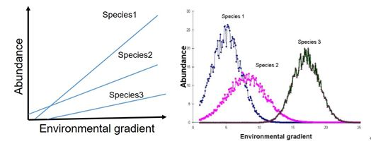{width="58%"}

## **主坐标分析 \| principal co-ordinates analysis，PCoA**

PCoA 分析同样采用降维的思想对样本关系进行低维平面的投影。

不同的是，PCA分析是对样本中物种丰度数据的直接投影，而PCoA则是将样本数据经过不同距离算法获得样本距离矩阵的投影，在图形中样本点的距离等于距离矩阵中的差异数据距离。

因此，**PCA是一种同时反映样本与物种信息的分析，而PCoA图形则仅对样本距离矩阵进行降维。**

PCoA常用于微生物β多样性分析中，β多样性的衡量指标是样本相似距离值，相似距离值的算法有很多种，常见的距离类型有：**Jaccard**、**Bray-Curtis**、**Unifrac**等。

## PCoA的输入是样本间的距离值

假设有两个样本：

{width="81%"}

## 随着样本量增加，维度也增加

三个样本：

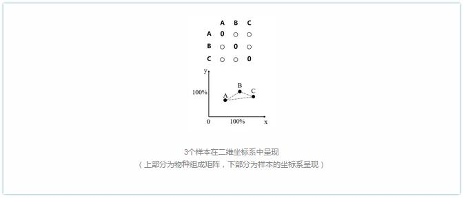{width="80%"}

## N个样本，N-1维度

N个样本：

{width="79%"}

[以上图来源于genewiz.com](https://www.genewiz.com.cn/Public/Resources/zxzx/0008/).

## PCoA的降维处理

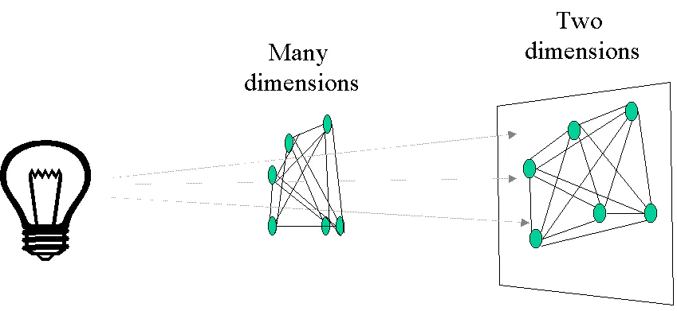{width="78%"}

因此，和PCA一样，PCoA也有**主成分**，也有信息损失。

## PCoA 分析举例

先看一下数据；来源于结直肠癌的宏基因组样本。

\FontSmall

```{r message=FALSE, warning=FALSE}
load("../data/PCA/spe_list_puzi.Rdata"); ## 得到 spe.list 和 crc.meta 
names(spe.list);
knitr::kable( spe.list$all.spe.data[1:3, 1:2] );
knitr::kable( head(crc.meta, n = 3) );
```

## 数据预处理

得到项目`PRJEB7774`的**菌群丰度**和**meta data**。

\FontSmall

```{r}
## get meta-data for the target project 
library(tidyverse);
meta.data <- crc.meta;
meta.data$Group2 <- if_else( meta.data$Group == "CTR", 0, 1 );
meta.data <- meta.data %>% filter( Project == "PRJEB7774" );

## -- get species abundance data 
feat.spec.raw <- spe.list$all.spe.data;
feat.spec <- feat.spec.raw[rownames(meta.data), 1:( ncol(feat.spec.raw )-2 )]; ## remove Group & HDC columns 

## check if data are valid --
nrow(feat.spec);
table(meta.data$Group);
```

## 计算样本间距离

样本间距离由 `vegan` 包的 `vegdist` 函数完成；此函数支持多种方法计算距离，请使用 `?vegdist` 查看。

\FontSmall

```{r message=FALSE, warning=FALSE}
require(vegan);
dist <- vegdist( feat.spec, method = "bray" );
```

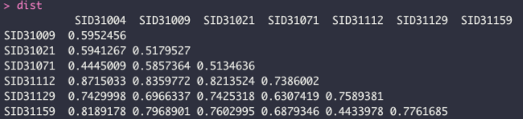{width="82%"}

## 计算PCoA

\FontSmall

```{r message=FALSE, warning=FALSE}
require(ape);
PCOA <- pcoa(dist);
rel.eig <- PCOA$values$Relative_eig[1:10];
val <- data.frame( PCOA$vectors[, 1:2], group = factor(meta.data$Group) );

plot_pcoa <- 
  ggscatter(val,color = "group", x = "Axis.1", y = "Axis.2", 
            ellipse = TRUE, mean.point = TRUE, star.plot = TRUE, 
            alpha = 0.6, ggtheme = theme_bw()) + 
    xlab( paste0( "Axis.1 (", round( rel.eig[1] * 100, digits = 2), "%)") ) +
    ylab( paste0( "Axis.2 (", round( rel.eig[2] * 100, digits = 2), "%)") );
```

## PCoA plot

\FontSmall

```{r fig.width=10, fig.height=5}
plot_pcoa;
```

## Are two groups significantly different

\FontSmall

```{r}
adonis( dist ~ group, data = val);
```

\FontNormal

`adonis`函数可用于分析两组或多组间的差异。更多细节见：<https://www.rpubs.com/roalle/mres_2019>

# Section 3: NMDS

## **非度量多维标度分析法 \| Non-metric multidimensional scaling，NMDS**

NMDS分析与PCoA分析的相同点在于两者都使用样本相似性距离矩阵进行降维排序分析，从而在二维平面上对样本关系做出判断。

不同于PCoA分析，NMDS弱化了对实际距离数值的依赖，更加强调数值间的排名（秩次），例如三个样本的两两相似性距离，（1,2,3）和（10,20,30）在NMDS分析上的排序一致，所呈现的效果相同。

详情见[知乎页面：**常见分析方法 \| PCA、PCoA和NMDS有什么区别？**](https://zhuanlan.zhihu.com/p/180284720)

## **NMDS图形**

\FontSmall

1.  常见分析点：微生物群落研究的β分析。

2.  输入的数据：样本相似性距离表格。

3.  图形类型：散点图。

4.  图形解读：图形中的点代表样本，不同颜色/形状代表样本所属的分组信息。同组样本点距离远近说明了样本的重复性强弱，不同组样本的远近则反应了组间样本距离在秩次（数据排名）上的差异。样本相似性距离计算方式对结果有影响，选择输入不同相似性距离值的矩阵，得到的结果存在着不同程度差异。

5.  横纵坐标轴含义：NMDS是距离值的秩次（数据排名）信息的评估，图形上样本信息仅反映样本间数据秩次信息的远近，而不反映真实的数值差异，横纵坐标轴并无权重意义，横轴不一定比纵轴更加重要。NMDS整体降维效果由Stress值进行判断。

6.  stress值含义：NMDS图形通常会给出该模型的stress值，用于判断该图形是否能准确反映数据排序的真实分布，stress值越接近0则降维效果越好，一般要求该值\<0.1。

# Section 4: 常见生物分析任务

## Enterotype analysis

什么是**肠型**？In April 2011, the [**MetaHIT consortium**](http://www.metahit.eu/) published the discovery of enterotypes in the human gut microbiome ([**Arumugam, Raes *et al.* 2011**](http://www.nature.com/doifinder/10.1038/nature09944)).

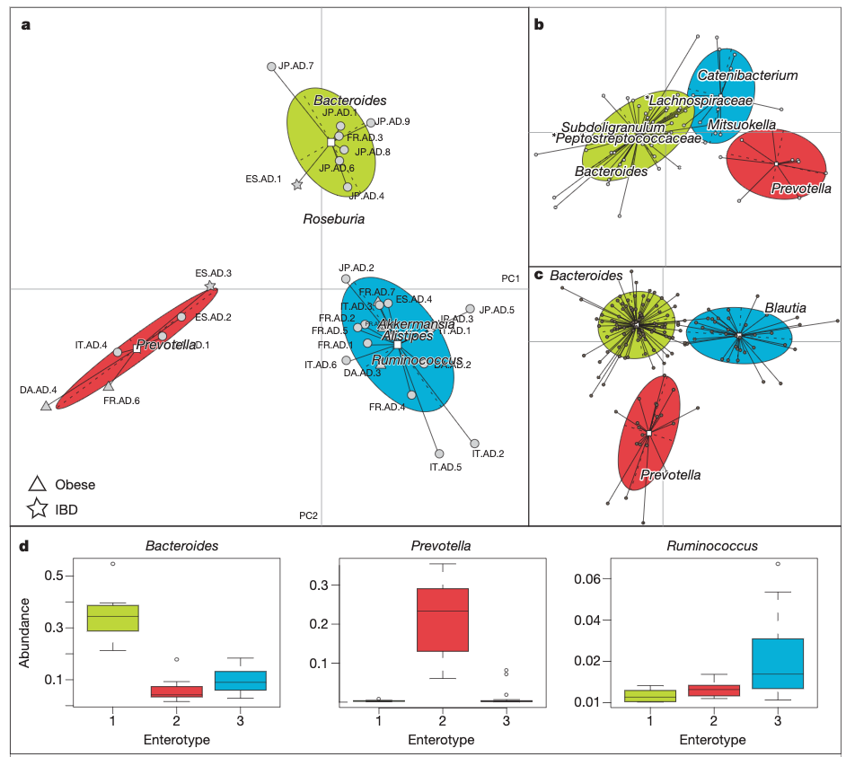{width="57%"}

## One of the top papers from Peer Bork's group

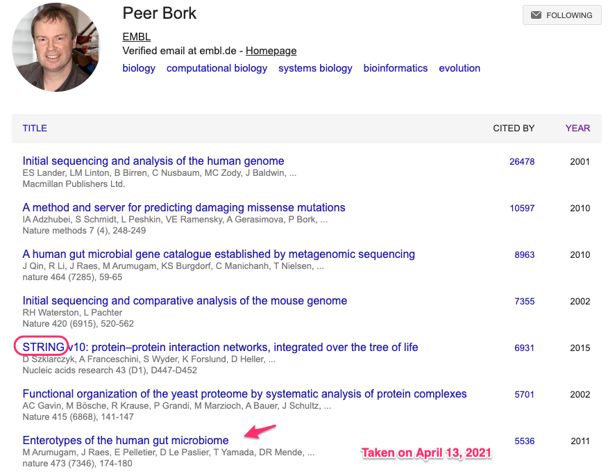{width="84%"}

## 肠型分析所需数据

下载地址和tutorial：<https://enterotype.embl.de/enterotypes.html>

\FontSmall

```{r}
data <- read.table("../data/PCA/MetaHIT_SangerSamples.genus.txt", 
                header=T, row.names=1, dec=".", sep="\t");
data <- data[-1,];
dim(data);
knitr::kable( data[1:3, 1:5] ); ## genus level data 
```

## Clustering

\FontSmall

```{r}
source("../rscripts/dist.JSD.R"); ## load function dist.JSD() ... 
data.dist <- dist.JSD(data);
```

\FontNormal

We used the Partitioning around medoids (PAM) clustering algorithm to cluster the abundance profiles. PAM derives from the basic k-means algorithm, but has the advantage that it supports any arbitrary distance measure and is more robust than k-means. It is a supervised procedure, where the predetermined number of clusters is given as input to the procedure, which then partitions the data into exactly that many clusters.

## PAM

\FontSmall

```{r message=FALSE, warning=FALSE}
pam.clustering <- function(x,k) { # x is a distance matrix and k the number of clusters
                         require(cluster)
                         cluster = as.vector(pam(as.dist(x), k, diss=TRUE)$clustering)
                         return(cluster)
}

data.cluster <- pam.clustering(data.dist, k=3);
head(data.cluster); ## 显示每个样本的分组情况；
length(data.cluster); ## 共有33个样本
```

## Decide the optimal number of clusters ...

\FontSmall

```{r message=FALSE, warning=FALSE}
  require(clusterSim)
  nclusters=NULL

	for (k in 1:20) { 
		if (k==1) {
			nclusters[k]=NA 
		} else {
			data.cluster_temp=pam.clustering(data.dist, k)
			nclusters[k]=index.G1(t(data),data.cluster_temp,  d = data.dist,
			centrotypes = "medoids")
		}
	}
```

## Plot the results

\FontSmall

```{r fig.width=10, fig.height=4}
plot(nclusters, type="h", xlab="k clusters", ylab="CH index");
```

## Noise removal

\FontSmall

```{r}
noise.removal <- function(dataframe, percent=0.01, top=NULL){
	dataframe->Matrix
	bigones <- rowSums(Matrix)*100/(sum(rowSums(Matrix))) > percent 
	Matrix_1 <- Matrix[bigones,]
	print(percent)
	return(Matrix_1)
}

data.denoized <- noise.removal(data, percent=0.01);
```

## Plot enterotype

\FontSmall

```{r fig.width=10, fig.height=4}
require(ade4);
obs.pca <- dudi.pca(data.frame(t(data)), scannf=F, nf=10)
obs.bet <- bca(obs.pca, fac=as.factor(data.cluster), scannf=F, nf=k-1) 
s.class(obs.bet$ls, fac=as.factor(data.cluster), grid=F)
```

## PCoA instead of PCA

\FontSmall

```{r fig.width=10, fig.height=4}
obs.pcoa <- dudi.pco(data.dist, scannf=F, nf=3)
s.class(obs.pcoa$li, fac=as.factor(data.cluster), grid=F)
```

# Section 5: Homework

## Homework

-   鉴定每个enterotype的富集菌（可以用 LEfSe分析）
-   显示富集菌在不同enterotype样本中的分布情况

## 延伸阅读

-   科学网博客：[主成分分析PCA](http://blog.sciencenet.cn/blog-3334560-1238984.html)

-   [ggpubr: Publication Ready Plots](http://www.sthda.com/english/articles/24-ggpubr-publication-ready-plots/78-perfect-scatter-plots-with-correlation-and-marginal-histograms/)

-   [PCA - Principal Component Analysis Essentials](http://www.sthda.com/english/articles/31-principal-component-methods-in-r-practical-guide/112-pca-principal-component-analysis-essentials/)

-   [**INTRODUCTION TO ORDINATION**](https://ourcodingclub.github.io/tutorials/ordination/)

-   [Beta-diversity Analysis](https://cran.r-project.org/web/packages/hagis/vignettes/betadiversity.html)

-   [微生物β多样性常用计算方法比较](https://mp.weixin.qq.com/s?__biz=MzA5NzQzOTgzMw==&mid=2650827507&idx=1&sn=abdba93cab9c7751303c40a845895f23&chksm=8b5413c5bc239ad3dc2b5cdbb600835386693813ae46ca0dd3e3305c6ac32610463dd45c4174&scene=21#wechat_redirect)

-   [常见分析方法 \| PCA、PCoA和NMDS有什么区别？](https://zhuanlan.zhihu.com/p/180284720)
