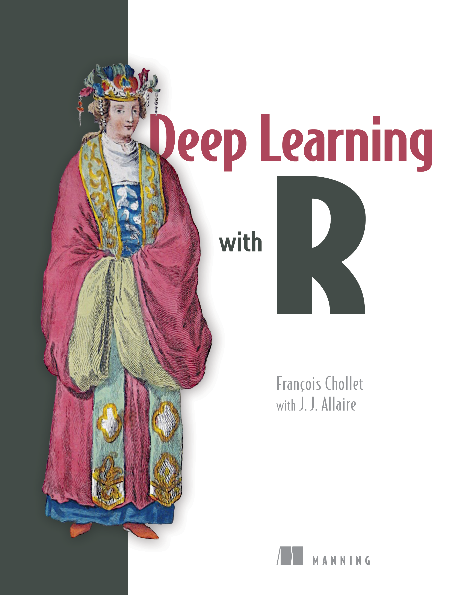

```{r include=FALSE}
color_block = function(color) {
  function(x, options) sprintf('\\color{%s}\\begin{verbatim}%s\\end{verbatim}',
                               color, x)
}

## 将错误信息用红色字体显示
knitr::knit_hooks$set(error = color_block('red'))
```


# section 1: R basics

## R语言简史

1993到2000这段时间R只在小范围内流传。2000年之后开始大爆发，用户数量直线上升。除去R本身的优秀之外，这种爆发与多个因素有关，比如自由软件的兴起，Linux的成熟等等；经济危机也促进大家采用免费的自由软件替代统计领域的传统强者如SPSS、SAS和Matlab等（注：均为收费软件）。

首先，越来越多的学术文章使用R作为分析工具。根据来自著名学术搜索引擎Google
Scholar（谷歌学术）的数据，R的流行趋势有以下两个特点：1）在学术领域的市场份额逐年增加，且增势迅猛，2）R是为数不多市场份额增加的统计软件之一。

接下来我们就用R把这个趋势画出来！如下面代码所示，所需代码包括4个部分：装入所需要的包，读取数据，处理数据和作图。运行这段代码，既专业又美观的图片就生成了！

## R的流行性调查

代码 \fontsize{7}{8}\selectfont

```{r warning=FALSE, message=FALSE}
library("ggplot2"); library("reshape2");

dat <- read.csv(file = "data/talk01/chaper01_preface_scholarly_impact_2012.4.9.csv");

cols.subset <- c("Year", "JMP","Minitab","Stata","Statistica","Systat","R");
Subset <- dat[ , cols.subset];
ScholarLong <- melt(Subset, id.vars = "Year");
names(ScholarLong) <- c("Year","Software", "Hits");

plot1 <- 
  ggplot(ScholarLong, aes(Year, Hits, group=Software)) + #准备
    geom_smooth(aes(fill=Software), position="fill", method="loess") + #画图
    ggtitle("Market share") + #设置图标题
    scale_x_continuous("Year") + # 改变X轴标题
    scale_y_continuous("Google Scholar %", labels = NULL ) +
    theme(axis.ticks = element_blank(),  text = element_text(size=14)) + 
    guides(fill=guide_legend( title = "Software",  reverse = F )) + 
    geom_text(data = data.frame( Year = 2011,  Software = "R", Hits = 0.10 ),
              aes(label = Software), hjust = 0, vjust = 0.5);
```

## Market share, result

```{r plot1, fig.width=10, fig.height=5, echo=FALSE, warning=FALSE, message=FALSE }
plot1
```

**注**：这里移除了市场占有率较大的SAS和SPSS

## R的招聘趋势

其次，统计分析相关工作的招聘信息中要求申请者会用R的也越来越多了。根据美国招聘搜索引擎indeed.com的数据，自2005年（此搜索引擎提供的最早数据）起，需要用到R的招聘信息占总体招聘的比例逐年上升，目前仅排在SAS和Matlab之后，处于第3位。而且，除了Stata之外，R是唯一一个占比上升。

同样的，我们用R把这个趋势画出来！

## R job trends

代码 \fontsize{7}{8}\selectfont

```{r warning=FALSE, message=FALSE}
library("ggplot2"); ## 主作图包

##2. -- 读取数据 --
dat <- read.table(file ="data/talk01/chaper01_preface_indeed_com_stats_2015.txt", 
                  header = T, as.is = T);
##3. 处理数据
dat$date <- as.Date(dat$date); ## 把第一列改为日期

#根据job对software进行调整
dat <- transform(dat, software = reorder(software, job)); 

plot2 <-
  ggplot( dat, aes( date, job, group = software, colour = software) ) +
    geom_line( size = 0.8  ) +
    ggtitle("Job trends (data from indeed.com)") + #设置图标题
    xlab("Year") + ylab("%") +
    #改变字体大小;要放在theme_grey()后面  
    theme( text = element_text(size=14) ) + 
    guides(colour=guide_legend( title = "Tool",  reverse = TRUE )) +
    scale_colour_brewer(palette="Set1") + #改变默认颜色
    geom_text(data = dat[dat$date == "2015-01-01" & dat$software %in% c("R"), ], 
              aes(label = software), hjust = 0, vjust = 0.5);
```

## R job trends, plot

```{r plot2,echo=FALSE,fig.width=10, fig.height=5}
plot2;
```

## Popularity of Programming language 2020

{width="70%"}

## Programming languages for bioinformatics

### Perl或Python

-   强大的文本处理能力（包括序列）
-   不错的运行速度（尤其是Python）
-   强大的生信和统计学扩展包（尤其是Python）
-   方便的并行计算

### R

-   强大的格式数据处理能力（二维表格, dplyr）
-   无以伦比的统计学专业性
-   专业而好看的数据可视化软件（ggplot2）
-   专业的生信扩展包（Bioconductor）
-   超级好用的整合开发环境IDE（RStudio）

## 我用过的 programming languages

```{=tex}
\begin{columns}
\begin{column}{0.48\textwidth}
\begin{itemize}
\item - C
\item -  \textbf{Perl}
\item -  \textbf{R}
\item -  \textbf{PHP}
\item -  \textbf{Java}
\item -  \textbf{MySQL}
\item -  HTML
\item -  Javascript
\end{itemize}

\href{https://www.evolgenius.info/evolview}{Evolview ver3.0}

cited 225 times in 2021 (ver2+3), 166 so far (as of Aug 30, 2022)

\end{column}
\begin{column}{0.48\textwidth}

\begin{figure}
  \includegraphics[width=\linewidth]{images/talk01/evolview_showcase3.png}
  \caption{.Evolview showcase 3}
  \label{fig:evolviewshowcase03}
\end{figure}

\end{column}
\end{columns}
```
## 网站链接、参考文献和扩展阅读

综上所述，R已经是最流行的免费统计分析软件，排名仅在几个传统的分析软件之后，而且大有赶超它们的趋势。学好R，不仅有助于在学术研究领域的发展，对找工作也有不少的帮助。

-   R的官方网站: <http://www.r-project.org>
-   R档案综合网络，即CRAN(Comprehensive R Archive Network):
    <http://cran.r-project.org/>
-   ggplot2: <http://ggplot2.org/>
-   RStudio: <https://posit.co/>
-   如何从Google Scholar抓取引用数据:
    <http://librestats.com/2012/04/12/statistical-software-popularity-on-google-scholar/>
-   indeed招聘趋势: www.indeed.com/jobtrends
-   R for data science: <https://r4ds.had.co.nz> (必读！！)


# Section 2: setting up working enviroment

## Install R

Go go <https://mirrors.tuna.tsinghua.edu.cn/CRAN/>
(清华镜像)，R支持主流的操作系统包括Linux，Windows和MacOS，请根据操作系统下载对应的安装文件。如下图所示：

{width="80%"}

新版本的Mac OS
X还需要安装XQuartz(<http://xquartz.macosforge.org/landing/>)。某些还需要用到Xcode，可以从App
Store免费安装。

## Install R on Linux

目前大多Linux发行版都带有R，因此可直接使用。从CRAN下载文件进行安装稍嫌复杂，要求用户对Linux系统有一定的了解，而且需要有管理员权限。建议初级用户在Linux高手指导下安装。
点击上图中的"Download R for
Linux"后，发行版为Redhat（红帽）或Suse的用户要先阅读网站上提供的readme或readme.html文件，然后其中的指示进行安装。这里就不再累述了。

{width="80%"}

## R studio

RStudio可以从 https://posit.co/download/rstudio-desktop/ 下载，支持等主流的操作系统。

{height="50%"}

## R studio versions

RStudio 有商业和免费版本；也有server版 {width="100%"}

## R studio, cont.

RStudio运行时的界面如下图所示，除了顶部的菜单栏工具栏之外，主界面还包括4个子窗口：

{width="355"}

## R studio, cont.

### 1. 代码编辑器

-   具有代码编辑、语法高亮、代码和变量提示、代码错误检查等功能
-   选中并向R控制台（窗口2）发送并运行代码。用快捷键Ctrl+Enter（MacOS下是Cmd+Enter）进行代码发送。没有代码选中时，发送光标所在行的代码
-   可同时打开编辑多个文件
-   除R代码外，还支持C++、R MarkDown、HTML等其它文件的编辑
-   也可用于显示数据

### 2. R console

-   可在此直接输入各种命令并查看运行结果。支持代码提示

### 3. 变量列表及代码运行的历史记录

## R studio, cont.

### 4. 其它窗口

-   当前工作目录下的文件列表
-   作图结果
-   可用和已安装的扩展包；在这里可以直接安装新的和升级已有的扩展包
-   帮助

注意，子窗口之间可以通过快捷键 Ctr+子窗口编号 进行切换。如 Ctrl+1
可以切换到代码编辑子窗口， Ctrl+2 则切换到R控制台。

### 其它特点

-   创建、管理 projects

## R studio 特点详解

### 代码提示/自动完成

**子窗口1和2**都提供有代码提示功能，即：用户输入3个字母时，RStudio会列出所有前3个字母相同的变量或函数名供用户选择；用户可通过键盘的上下键选择，然后用Enter（回车）选定，非常方便。
变量或函数名前面的小图标表示了它们的类型；如果当前高亮的是函数，RStudio还会显示其部分帮助内容。

{height="20%"}

## R studio 特点详解, cont.

### 查看变量内容

**子窗口3**内会列出所有当前使用的变量、变量的类型以及大小，如下图：

{height="20%"}

有些简单变量，如数组，RStudio会直接显示其部分值；对于复杂一些的变量，比如data.frame（类似于二维表格），则可以点击变量名前边的小三角标识展开其内容。
当变量的最右侧出现小网格状图标时（如上图箭头所指位置），点击它们后可以在子窗口2内察看。

## R studio 特点详解, cont.

### 导出作图并选择导出格式

RStudio的**第4子窗口**里集中了许多有用的功能，组织在不同的'Tab'（标签）内。比如作图（plots），不仅可以察看画图的结果，还可以导出当前图像至硬盘，或拷贝至剪贴板；如下图所示。支持导出格式有png和pdf。

{height="30%"}

## R studio 特点详解, cont.

### 查看已安装的**包**

通过**第4子窗口**的"包"（Packages）标签内的工具，用户可以很方便的查看已安装的包：

{height="30%"}

## install new package(s)

同样通过**第4子窗口**的"包"（Packages）标签内的工具，安装新的包：

{height="50%"}

## Packages needed for this study

大部分包都由 RStudio
公司提供；包括：ggplot2，tidyr，readr，stringr等。可以用以下命令一次性安装。不过，为方便读者直接从后面章节阅读，在每一次使用新包时，我们会再次进行提示安装方法。

\FontSmall

```{r eval=FALSE}
install.packages( c("ggplot2", "tidyr", "readr", "stringr") );
```

\FontNormal

也可以单独安装：

\FontSmall

```{r eval=FALSE}
install.packages( "ggplot2" ); #安装作图用的ggplot2
install.packages( "tidyr" ); # 数据处理用等
```

\FontNormal

第一次运行命令 install.packages()
时，系统会提示选择镜像网站；请选择地理位置上距你最近的镜像（比如中国）。

## install packages, cont.

You can also choose your CRAN mirror manually (recommended when
installing takes a long time):

\FontSmall

```{r eval=FALSE}
chooseCRANmirror();
```

\FontNormal

{height="40%"}

You can also use `chooseBioCmirror();` to choose mirror for
[BioConductor](https://bioconductor.org/) packages.

## Packages needed for this study, cont.

实际上，以上包属于一个meta-package，我们只需要安装它就可以了：

\FontSmall

```{r eval=FALSE}
install.packages("tidyverse")
```

\FontNormal

它是以下包的集合，都由 <https://www.tidyverse.org> 开发：

{width="43%"}

## R studio server

### 特点：

-   在服务器上安装，使用服务器的强大计算资源
-   通过网页登录，使用服务器帐号密码（方便，安全）
-   一直运行

{height="30%"}

## R studio server, cont.

{width="100%"}

## R studio packages for data science

### all part of (业界良心) tidyverse

-   dplyr: 强大且方便的数据处理
-   tydyr：数据转换工具
-   readr：方便的文件IO
-   stringr：文本处理
-   Tibble：代替 data.frame 的 下一代数据存储格式
-   purr：（暂时还未用到的包 \~\~ ）

## R studio packages for data visualisation

### tidyverse

-   ggplot2：专业好用（但学习曲线很陡）的画图工具

    -   <http://ggplot2.tidyverse.org>
    -   gallery: <http://www.ggplot2-exts.org/gallery/>

{width="42%"}

## RStudio packages for data visualisation, cont.

### ggvis (currently ver0.4): <http://ggvis.rstudio.com>

-   from the **ggplot2** team
-   create interactive graphics in RStudio and web browser
-   [top 50 ggplot2
    visualisations](http://r-statistics.co/Top50-Ggplot2-Visualizations-MasterList-R-Code.html)

{width="40%"}

## RStudio packages for data visualisation, cont.

### Shiny: <http://shiny.rstudio.com/gallery/>

-   build professional, interactive visualizations
-   equipped with popular web widgets
-   can be deployed as independent websites

{height="30%"}

## RStudio packages for data visualisation, cont.

### other packages

-   rmarkdown : create professional documents
-   knitr: convert rmarkdown to pdf, html and more ...

## 小结

* R语言历史
* 没有最好的语言，只有最合适的语言
* R的特色与特长
* IDE、扩展包与资源站点

# section 3: `dplyr`, efficient data wrangler

## dplyr 安装

\FontSmall

```{r eval=FALSE}
# The easiest way to get dplyr is to install the whole tidyverse:
install.packages("tidyverse")

# Alternatively, install just dplyr:
install.packages("dplyr")
```

\FontNormal

Development version

\FontSmall

```{r eval=FALSE, warning=FALSE, message=FALSE}
# install.packages("devtools")
devtools::install_github("tidyverse/dplyr")
```

\FontNormal

[Get the cheatsheet at here](https://github.com/rstudio/cheatsheets/blob/master/data-transformation.pdf)

## an example of `dplyr`

get the data ready

```{r echo=FALSE, warning=FALSE, message=FALSE}
library(tidyverse); 
```

\FontSmall

```{r}
mouse.tibble <- read_delim( file = "data/talk04/mouse_genes_biomart_sep2018.txt", 
                            delim = "\t", quote = "" );
```

## 查看 mouse.tibble 的内容

\FontSmall

```{r}
( ttype.stats <- mouse.tibble %>% count( `Transcript type` ) %>% arrange(-n) );
```

## 查看 mouse.tibble 的内容, cont.

\FontSmall

```{r}
( chr.stats <- mouse.tibble %>% count( `Chromosome/scaffold name` ) %>% arrange(-n) );
```

## 分析任务

1.  将染色体限制在常染色体和XY上（去掉未组装的小片段） ; 处理行
2.  将基因类型限制在 protein_coding, miRNA和 lincRNA 这三种；处理行
3.  统计每条染色体上不同类型基因（protein_coding, miRNA, lincRNA）的数量
4.  按染色体（正）、基因数量（倒）进行排序

## 用 `dplyr` 实现

\FontSmall

```{r}
dat <- mouse.tibble %>% 
  ## 1. 
  
  filter( `Chromosome/scaffold name` %in% c( 1:19, "X", "Y" )   ) %>% 
  
  ## 2. 
  filter( `Transcript type` %in% c( "protein_coding", "miRNA", "lincRNA" ) ) %>%
  
  ## change column name ... 
  select( CHR = `Chromosome/scaffold name`, TYPE = `Transcript type`, 
          GENE_ID = `Gene stable ID`, 
          GENE_LEN =  `Transcript length (including UTRs and CDS)`  ) %>%
  
  ## 3. 
  group_by( CHR, TYPE ) %>% 
  summarise( count = n_distinct( GENE_ID ), mean_len = mean( GENE_LEN ) ) %>% 
  
  ## 4. 
  arrange(  CHR  , desc( count ) );
```

## 检查运行结果

\FontSmall

```{r echo=FALSE}
head( dat, n = 15 );
```

\FontNormal

这种显示格式通常被称为：**长数据格式**！！又称为**数据扁平化**

## 数据扁平化的优点？

1.  便于用 dplyr 或 tapply 等进行计算；
2.  更灵活，用于保存稀疏数据

## 适合扁平化的数据举例

### 成绩单

\FontSmall

```{r message=FALSE, warning=FALSE}
library(tidyverse);
grades <- read_tsv( file = "data/talk05/grades.txt" );
head(grades, n=20);
```

灵活性：

-   应对不同学生选择不同课程的情况
-   可随时增加新的课程

## 长数据变宽

\FontSmall

```{r}
grades2 <- grades %>% spread( course, grade );
grades2;
```

\FontNormal

可以想像，如果以此为输入，用R计算每个人的平均成绩、不及格门数、总学分，将会是很繁琐的一件事（但对其它工具（如Excel）可能会比较简单）

## use gather & dplyr functions

Question: 1. 每个人平均成绩是多少？ 2. 哪个人的平均成绩最高？

\FontSmall

```{r}
res <-
  grades %>% 
  group_by(name) %>% 
  summarise( avg_grades = mean( grade ), courses_count = n() ) %>% 
  arrange( -avg_grades );

## 显示最终结果
 res;
```

## use gather & dplyr functions

问题： 每个人的最强科目是什么？？

\FontSmall

```{r}
res2 <- 
  grades %>% 
  arrange( -grade ) %>%
  group_by(name) %>% 
  summarise( best_course = first( course ),
             best_grade = first( grade ),
             avg_grades = mean( grade ),
             courses = n() ) %>% 
  arrange( -avg_grades );

## 显示最终结果
res;
```

## 更多练习，使用 `starwars` tibble

\FontSmall

```{r}
head(starwars);
```

**note** 包含87行 13 列，星战部分人物的信息，包括身高、体重、肤色等

用 `?starwars` 获取更多帮助


## dplyr::filter - 行操作

任务：从星战中挑选**金发碧眼**的人物

\FontSmall

```{r}
starwars %>% select( name, ends_with("color"), gender, species ) %>% 
  filter( hair_color == "blond" & eye_color == "blue" );
```

## 小结

* `dpylr`等扩展包，提供了基于 行， 列， 等规则数据的快速处理
* 非常高效，语法统一，可读性强
* 灵活性尚可
* 学习曲线尚可

# section 4: `ggplot2`, elegant graphics using R

## ggplot2的四个基本组成

1. 图层（layers）

 * ```geom_<图层名>```
 
2. scale：控制数据至美学属性的mapping

 * ```scale_<属性mapping方式>```，e.g. ```scale_color_identity()```

{height=30%}


## ggplot2的scale 

* ```scale_color_...```
* ```scale_shape_...```
* ```scale_size_...```
* ```scale_fill_...```

与坐标系统联动的函数

* ```scale_x_log()```
* ```scale_y_log()``` 

更多内容可以见《ggplot2: elegant graphics for data analysis》一书的第6章。

## ggplot2要素3： 坐标系统

* 正常
* log-transform

示例：

\FontSmall

```{r fig.height=3, fig.width=10}
ggplot(mtcars, aes( wt , mpg)) + geom_point() +
  scale_y_log10()
```

## ggplot2要素3： 坐标系统，cont. 

\FontSmall

```{r fig.height=3, fig.width=10}
ggplot(mtcars, aes( wt , mpg)) + geom_point() +
  coord_trans( y = "log10" );
```

```coord_trans()```的其它参数：

* limx, limy: 限制xy的显示范围


## ggplot2要素3： 坐标系统，cont. 

其它函数

* ```coord_flip()``` : x，y轴互换；竖bar变横bar；
* ```coord_polar()``` :

\FontSmall

```{r fig.height=3, fig.width=10}
plot1 <-  ggplot(mtcars, aes(x = factor(cyl))) +
  geom_bar(width = 1, colour = "black");
plot1;
```


## ggplot2要素3： 坐标系统，cont. 

\FontSmall

```{r fig.height=3, fig.width=10}
plot1 + coord_polar();
```

\FontNormal

更多内容可以见《ggplot2: elegant graphics for data analysis》一书的第7章。

## ggplot2要素4： faceting ... 

\FontSmall

```{r fig.height=3, fig.width=10}
qplot(displ, hwy, data=mpg, facets = . ~ year) + geom_smooth();
```

## ``` ggsci ```: palette for scientific journals!!!

\FontSmall

### install 
```{r eval=FALSE}
install.packages("ggsci"); # Install ggsci from CRAN:
devtools::install_github("nanxstats/ggsci"); # or from github
```

### contents

``` scale_color_<journal> ``` 和 ``` scale_fill_<journal> ``` functions and color palettes

### supported journals

* NPG `scale_color_npg()`, `scale_fill_npg()`
* AAAS, NEJM, Lancet, JAMA ... 

## ggsci 举例
\FontSmall

```{r warning=FALSE, message=FALSE}
library("ggsci")
library("ggplot2")
library("gridExtra")
data("diamonds")
p1 <- ggplot(
  subset(diamonds, carat >= 2.2),
  aes(x = table, y = price, colour = cut)
) +
  geom_point(alpha = 0.7) +
  geom_smooth(method = "loess", alpha = 0.05, size = 1, span = 1) +
  theme_bw() + labs( tag = "A" )

p2 <- ggplot(
  subset(diamonds, carat > 2.2 & depth > 55 & depth < 70),
  aes(x = depth, fill = cut)
) +
  geom_histogram(colour = "black", binwidth = 1, position = "dodge") +
  theme_bw() + labs( tag = "B" )
```

\FontNormal

**要点** 

* ``` library(gridExtra) ``` 

## ggsci 结果, Nature Style !! 

\FontSmall

```{r fig.width=10, fig.height=4}
p1_npg <- p1 + scale_color_npg()
p2_npg <- p2 + scale_fill_npg()
grid.arrange(p1_npg, p2_npg, ncol = 2)
```


## combine multiple plots

Useful packages:

* `gridExtra`
* `cowplot` 
* `grid`
* `lattice`

\FontSmall

install or load packages

```{r}
if (!require("gridExtra")){ 
  install.packages("gridExtra");
} 

if (!require("cowplot")){ 
  install.packages("cowplot");
} 

library( cowplot );
library( gridExtra );
```

## arranging multiple graphs using cowplot 

Prepare two plots

\FontSmall

```{r}
sp <- ggplot(mpg, aes(x = cty, y = hwy, colour = factor(cyl)))+ 
  geom_point(size=2.5)
# Bar plot
bp <- ggplot(diamonds, aes(clarity, fill = cut)) +
  geom_bar() +
  theme(axis.text.x = element_text(angle=70, vjust=0.5))
```

Combine the two plots (the scatter plot and the bar plot):

```{r fig.height=3, fig.width=10}
cowplot::plot_grid(sp, bp, labels=c("A", "B"), ncol = 2, nrow = 1)
```


## 用`draw_plot` 调整graph的相对大小

\FontSmall

先生成一个新的panel

```{r fig.height=3, fig.width=10}
plot.iris <- ggplot(iris, aes(Sepal.Length, Sepal.Width)) + 
  geom_point() + facet_grid(. ~ Species) + stat_smooth(method = "lm") +
  background_grid(major = 'y', minor = "none") + # add thin horizontal lines 
  panel_border();
plot.iris;
```

## 用`draw_plot` 将三个panel画在一起

\FontSmall

```{r}
plot <- 
  ggdraw() +
  draw_plot(plot.iris, x=0, y=.5, width=1, height=.5) +
  draw_plot(sp, 0, 0, .5, .5) +
  draw_plot(bp, .5, 0, .5, .5) +
  draw_plot_label(c("A", "B", "C"), c(0, 0, 0.5), c(1, 0.5, 0.5), size = 15);
```

`draw_plot(plot, x = 0, y = 0, width = 1, height = 1)` 详解：

* plot: the plot to place (ggplot2 or a gtable)
* x: The x location of the lower left corner of the plot.
* y: The y location of the lower left corner of the plot.
* width, height: the width and the height of the plot

## `draw_plot` results

\FontSmall

```{r fig.height=6, fig.width=10}
plot
```

## 如何在图中加入公式？

显示两组数据间的相关性：

\FontSmall 
```{r fig.height=3, fig.width=10}
## 作图
ggplot( swiss, aes( x = Education, y = Fertility ) ) +
  geom_point( shape = 20 );

## 分析
with( swiss, cor.test( Education, Fertility  )$estimate );
```

## 在图中加入公式和统计信息

先展示一下结果

```{r echo=FALSE, fig.width=10, fig.height=5, warning=FALSE, message=FALSE}
m = lm(Fertility ~ Education, swiss);
c = cor.test( swiss$Fertility, swiss$Education );
eq <- substitute( atop( paste( italic(y), " = ",  a + b %.% italic(x), sep = ""),
                        paste( italic(r)^2, " = ", r2, ", ", italic(p)==pvalue, sep = "" ) ),
                      list(a = as.vector( format(coef(m)[1], digits = 2) ),
                           b =  as.vector(  format(coef(m)[2], digits = 2) ),
                           r2 =  as.vector( format(summary(m)$r.squared, digits = 2) ),
                           pvalue =  as.vector( format( c$p.value , digits = 2) ) )
    ); 

eq <- as.character(as.expression(eq));

ggplot(swiss, aes( x = Education,  y = Fertility ) ) +
        geom_point( shape = 20 ) +
        geom_smooth( se = T ) +
        geom_text( data = NULL,
                   aes( x = 30, y = 80, label= eq, hjust = 0, vjust = 1),
                   size = 4, parse = TRUE, inherit.aes=FALSE);
```

## 公式详解

{height=40%}

## 公式详解，cont. 

以下代码实现两个任务：

1. 将两个公式上下放置 ``` atop ( <equation_1> , <equation_2> ) ```;
2. 将公式中的某些值替换为数值 ``` substitute( <equation>, list( ... ) ) ```

\FontSmall

```{r eval=FALSE}
## 计算 ... 
m = lm(Fertility ~ Education, swiss);
c = cor.test( swiss$Fertility, swiss$Education );

## 生成公式
eq <- substitute( atop( paste( italic(y), " = ",  a + b %.% italic(x), sep = ""),
                        paste( italic(r)^2, " = ", r2, ", ", italic(p)==pvalue, sep = "" ) ),
                      list(a = as.vector( format(coef(m)[1], digits = 2) ),
                           b =  as.vector(  format(coef(m)[2], digits = 2) ),
                           r2 =  as.vector( format(summary(m)$r.squared, digits = 2) ),
                           pvalue =  as.vector( format( c$p.value , digits = 2) ) )
    ); 

## 用 as.expression 对公式进行转化 
eq <- as.character(as.expression(eq));
```


## 完整代码

\FontSmall

```{r eval=FALSE}
## 计算 ... 
m = lm(Fertility ~ Education, swiss);
c = cor.test( swiss$Fertility, swiss$Education );

## 生成公式
eq <- substitute( atop( paste( italic(y), " = ",  a + b %.% italic(x), sep = ""),
                        paste( italic(r)^2, " = ", r2, ", ", italic(p)==pvalue, sep = "" ) ),
                      list(a = as.vector( format(coef(m)[1], digits = 2) ),
                           b =  as.vector(  format(coef(m)[2], digits = 2) ),
                           r2 =  as.vector( format(summary(m)$r.squared, digits = 2) ),
                           pvalue =  as.vector( format( c$p.value , digits = 2) ) )
    ); 

## 用 as.expression 对公式进行转化  !!!! 
eq <- as.character(as.expression(eq));

## 作图，三个图层；特别是 geom_text 使用自己的 data 和 aes ... 
ggplot(swiss, aes( x = Education,  y = Fertility ) ) +
        geom_point( shape = 20 ) +
        geom_smooth( se = T ) + ## smooth line ... 
        geom_text( data = NULL,
                   aes( x = 30, y = 80, label= eq, hjust = 0, vjust = 1), ## hjust, vjust ???
                   size = 4, parse = TRUE, inherit.aes=FALSE); ## 注意： parse = TRUE ！！！
```

## 总结，本节内容

### ggplot2 基础

* 优缺点
* 用法
* 基本组成

### ggplot2 进阶

* 颜色和色板
* 复杂layout的实现
* 公式
* ggplot2的数据统计逻辑

### 更多阅读

* Ggplot2: Elegant Graphics for Data Analysis, Book by Hadley Wickham
* ggplot2 gallery provided by RStudio on Github


## 小结

1. ggplot2 博大精深，需要一门课去讲
2. 上手容易，精通难
3. 太多记忆点
4. 本节内容只涉及了基础中的基础，更多内容，包括进阶技巧和生信相关的扩展包，更多的需要同学们自行探索
5. 遇到不会的图，先百度/Google，找包和代码

# section 5: machine learning

## 机器学习算法归纳

本节内容来自`CSDN` `Deep Learning小舟` 同学的 《机器学习：常见的机器学习算法归纳》一文。

### 机器学习可分为以下几类

\FontSmall 

1） **回归算法**

2） 基于实例的算法

3） **决策树学习**

4） 贝叶斯方法

5） 基于核的算法

6） **聚类算法**

7） **降低维度算法**

8） 关联规则学习

9） 集成算法

10） 人工神经网络

## 随机森林 – Random forest

本文大部分内容取自“easyai.tech” 网站的《随机森林 – Random forest》一文，有修改。

随机森林是一种由**决策树**构成的集成算法，适用于**小样本**数据，在很多情况下都能有不错的表现。

随机森林属于 **集成学习** 中的 Bagging（Bootstrap AGgregation 的简称） 方法。


## 决策树 - decision tree

{height="40%"}

决策树是一种很简单的算法，他的解释性强，也符合人类的直观思维。这是一种基于if-then-else规则的有监督学习算法，上面的图片可以直观的表达决策树的逻辑。

## 随机森林 – Random Forest | RF

{height="40%"}

随机森林是由很多决策树构成的，不同决策树之间没有关联。

当我们进行分类任务时，新的输入样本进入，就让森林中的每一棵决策树分别进行判断和分类，每个决策树会得到一个自己的分类结果，决策树的分类结果中哪一个分类最多，那么随机森林就会把这个结果当做最终的结果

## 随机森林的 4 个应用方向

{height="40%"}

## 随机森林实例，数据

使用`Liver cirrhosis 肝硬化`数据：

\FontSmall
```{r}
summary_tbl <- tibble(
  `Project ID` = c("PRJEB6337-cohort1", "PRJEB6337-cohort2", "PRJNA471972"),
  ID = c("Qin-cohort1", "Qin-cohort2", "Iebba-16S"),
  `Data type` = c("mNGS", "mNGS", "16S"),
  `Nr. controls` = c(83, 31, 14),
  `Nr. cases` = c(98, 25, 23),
  Country = c("China", "China", "Italy")
)
summary_tbl;
```

## 数据和代码目录

"data/talk12/"

文件:

- `rf.function.R`  : 自写的函数，将建模相关代码进行了封装；
- `working.R` : 分析代码，利用上面函数对数据进行分析；
- 子目录 `data/` ：文件夹，包括各种所需数据；

## 装入数据

- 丰度信息
- 样本分组（对照和疾病）

\FontSmall

```{r load-discovery-data, message=FALSE, warning=FALSE}
## 发现集，用于建模的数据； species 水平
discovery.featdata <- 
  read.csv("./data/talk12/data/PRJEB6337.LC.s.discovery.txt",
           sep = "\t",header = T,row.names = 1);

discovery.metadata <- 
  read.csv("./data/talk12/data/PRJEB6337.LC.s.discovery.metadata.txt",
           sep = "\t",row.names = 1);
```

用 `View()`函数查看数据内容

用 `rowSums(discovery.featdata)` 查看 细菌的丰度数据


## 装入封装好的函数

注意，需要以下包：

`tidyverse`, `ROCR`, `randomForestSRC`, `pROC`, `caret`, `progress`, `tictoc`,
`doSNOW`, `ggplot2`

\FontSmall 

```{r load-source-code-from-rf-function, message=FALSE, error=FALSE}
source("./data/talk12/rf.function.R");
```

## 封装的函数及其功能

-   `rf.setdata()` : 准备数据
-   `rf.train()`：用指定的数据构建模型
-   `rf.evaluate()`：计算模型交叉验证结果
-   `rf.external.validation()`：外部验证（即：被验证数据的分类结果已知）。
-   `rf.predict()`：预测（即：未知分类结果的情况下）

## 1. 准备数据

`rf.setdata()`有四个参数，分别是：

- `feat.data` ：丰度数据（feature data）；`data.frame`，`行`为**样本**，`列`为**物种（细菌）**；内容为数字；**行名**为样本名

- `meta.data` ：样本表型数据（疾病健康）；`data.frame`；**行名**为样本名；样本应分为**两类**；

- `grouping` ：指定 `meta.data`中包含样本**分组列**的**列名**；

- `control` ：样本**分组列**中对照组的名称，比如 `Healthy`, `CTR`等；

返回：一个`list`

## `rf.setdata`的使用

\FontSmall

```{r set-data, warning=FALSE}
## 先做过滤；去掉失败的样本
qc.fail.run<- read.csv("./data/talk12/data/qc.fail.run.csv");

dis.meta <- discovery.metadata[!rownames(discovery.metadata) %in% qc.fail.run$run.id,];
dis.feat <- discovery.featdata[!rownames(discovery.featdata) %in% qc.fail.run$run.id,];

## check data 
table(dis.meta$Group);

## set data 
dis.mod <- rf.setdata( feat.data = dis.feat, meta.data = dis.meta,
                       grouping = "Group", control = "Healthy");
```

## 2. 构建模型（train）

`rf.train()`函数，其参数为：

-  `rf`： `list`；`rf.setdata`的输出结果；包括了所需数据（样本分组、丰度信息）；
-  `fold`：折；默认为10；
-  `resample`：次数；默认为10；
-  `parallel`：是否用并行模式；默认为**否**；
-  `num.cores`：使用CPU数量；默认为10；`parallel = T`时生效；当超过系统的CPU数量时，自动变为 cpu - 1；
-  `class.weights`：默认为`NULL`；可改为 `class.weights = T`；当样本分组不均衡时使用（比如：健康对照人数是疾病组的5倍）；

## 构建模型（train）, cont.

\FontSmall

```{r train-model-using-all-features}
dis.mod <- rf.train( dis.mod, parallel = T, num.cores = 20 );
```


- 使用了 7 个CPU（指定20个，但系统只有8个）；
- 进行了 10次 * 10折 建模，共得到 100 个模型
- 没有做 `class weight`调整，因为样本分组相对均衡
  - Case group: 'LC', w/ 124 samples, 
  - Control group: 'Healthy', w/ 103 samples
  
## K折N次的实现代码

\FontSmall

```{r create-multi-folds}
sample.split <- caret::createMultiFolds( as.vector( dis.meta$Group ), times = 10, k = 10 );

## 检查结果 ... 
class(sample.split);
length(sample.split);
str(sample.split$Fold01.Rep01);
```

**注**：

- sample.split包括了**被选中样本的行号**；被选中的样本为**样本集/train data**
- 没有被选中的样本即为**测试集/test data**；

## 模型构建代码

\FontSmall

```{r train-a-tree}
## assemble data --
dat <- dis.feat;
dat$Group <- as.factor( dis.meta[ rownames(dat), "Group" ] ); ## 这一步很重要！！

## 从 list 中随机取一个出来
split <- sample( sample.split, 1 ); 

## 生成 train 和 test 数据；
train.data <- dat[ split[[1]] , ];
test.data <- dat[ -split[[1]] , ];

## 建模
model.a <- rfsrc(Group ~ .,train.data, proximity = T, importance = T, ntree = 500);
```

-  `ntree` 指定生成`500`个决策树；

## Feature 重要性检验

`RandomForest`提供对每一个`feature`重要性的评估，保存在 `model.a$importance` data.frame中。

\FontSmall

```{r relative-importance-data-from-a-model, fig.height=3}
require(tidyverse);
impo <- as.data.frame( model.a$importance * 100 ) %>% arrange( desc(all) ) %>%
  slice_head( n=20) %>% rownames_to_column( var = "Feat" ) %>% 
  ggplot( aes( x = fct_reorder(Feat, all), y = all  ) ) + geom_bar( stat = "identity" ) +
  coord_flip();
impo;
```

## 预测和结果检验（使用100个模型中的一个）

\FontSmall

```{r predict-using-a-model }
## 预测；结果为 LC和Healthy的可能性；
pred <- predict( model.a, test.data, type = "prob");

## 整理预测结果
res <- as.data.frame( pred$predicted );
res$prediction <- if_else( res$Healthy > res$LC, "Healthy", "LC" );
rownames( res ) <- rownames( test.data );
res$label <- test.data$Group;

## 比较真实和预测值；得到一个confusion matrix；
table( res[, c("prediction", "label")] );
```

## 3. 检查建模的整体结果

如上所述，100个模型就会有100个结果；我们接下来把结果总结显示出来；

\FontSmall

```{r fig.height=4, error=FALSE, message=FALSE}
dis.mod.eval <- rf.evaluate( dis.mod );
```

## 输出的 message 

\FontSmall

```
--------------------------------------------
Overall performance (AUC):  0.95 (95%CI: 0.92-0.98) 

Predicted vs. Truth (Group): 
Control group:  Healthy 
Case group:  LC 

         Predicted
Group     Healthy  LC
  Healthy      97   6
  LC           17 107
---------
Error rates: 
Healthy      LC 
  0.058   0.137 

Overall error rate: 0.101
--------------------------------------------
```

## AUC？

\FontSmall

```{r roc-plot, fig.height=5}
dis.mod.eval$roc.plot;
```

Area Under the Curve （线下面积）；

AUC >= 0.8 就算是比较好的模型；

图可用于FPR和TPR的折中选择；

## Feature 的相对重要性和特征选择

\FontSmall

```{r show-top-30-features-all-models }
## 选择最重要的30 个feature ... 
dis.mod.selected <- rf.featureselect( dis.mod, top = 30 );
```

## 显示 feature importance 

\FontSmall

```{r show-feature-importance, fig.height=5}
dis.mod.selected$feat.select.importance.plot;
```

**这个数据是怎么来的**？每一个model都有 `importance` 这一 `data.frame` ，将这些数据合并后，即可得到。

## 使用 top four species 重新建模

\FontSmall

```{r select-top-4-features-and-re-train }
## 选择 重要性排前4的feature
dis.mod.selected2 <- rf.featureselect(dis.mod, top = 4);

## 用选择的feature重新建模
dis.mod.selected2.mod <- rf.train( dis.mod.selected2, parallel = T, num.cores = 7 );
```

## 检验建模结果

\FontSmall

```{r evaluate-the-top-four-model, fig.height=4, message=FALSE, error=FALSE}
dis.mod.selected2.mod.eval <- rf.evaluate( dis.mod.selected2.mod  );
```

## 比较不同数量特征得到的结果

\FontSmall

```{r compare-roc-multiple-models, fig.height=4}
plot <- 
  rf.plot.multiple.roc( dis.mod.eval, dis.mod.selected2.mod.eval, 
                      labels = c("All features", "Top 4 features"));
```

## 4. 外部验证

外部验证是指用已知表型的另一个数据集，对模型进行检验；

\FontSmall

```{r load-test-data }
## 装入外部验证数据
validation.featdata <- 
  read.csv("./data/talk12/data/PRJEB6337.LC.s.validation.txt",
           sep = "\t",header = T,row.names = 1)
validation.metadata<-
  read.csv("./data/talk12/data/PRJEB6337.LC.s.validation.metadata.txt",
           sep = "\t",header = T,row.names = 1)

## 整理外部验证数据；去除分析失败的样本
qc.val.metadata <- validation.metadata[!rownames(validation.metadata) %in% qc.fail.run$run.id,]
qc.val.featdata <- validation.featdata[!rownames(validation.featdata) %in% qc.fail.run$run.id,];
```

## 外部验证，cont.

使用外部验证函数 `rf.external.validation()`

\FontSmall

```{r external-validation, fig.height=5}
val.res <- 
  rf.external.validation(dis.mod, qc.val.featdata, qc.val.metadata);
```

## 外部验证，cont.

\FontSmall

```{r external-validation-top-four-feature-model}
val.res2 <- 
  rf.external.validation(dis.mod.selected2.mod, qc.val.featdata, qc.val.metadata);
```

## 外部验证，cont.

\FontSmall

```{r print-validation-results, fig.height=4}
val.res2$roc.plot;
```


## 比较 cross validation和external validation结果

\FontSmall

```{r plot-multiple-roc, fig.height=5}
res <- rf.plot.multiple.roc( dis.mod.selected2.mod.eval, val.res2,
                             labels = c("Train data, top 4 features", "Test data"));
```

## 小结

* 学习机器学习的基本知识
* 每一种算法的优缺点
* 随机森林的原理、应用
* 示例

# section 6: deep learning

## Deep learning with R

{height="40%"}

## contents

### 示例

* 识别数字（多分类）

* cats vs. dogs （两分类）

### 技巧

* 提高准确率

* 迁移学习？

* 减少过拟合

# section 7: 结语

## R的优点

-   强大的格式数据处理能力（二维表格, dplyr）
-   无以伦比的统计学专业性
-   专业而好看的数据可视化软件（ggplot2）
-   专业的生信扩展包（Bioconductor）
-   超级好用的整合开发环境IDE（RStudio）

## R的缺点

- 非格式化数据处理能力差
- 运行效率一般
- 并行处理效果一般
- 机器学习效果一般

## 本课的资源

* all codes are available at Github: https://github.com/evolgeniusteam/R-for-bioinformatics
