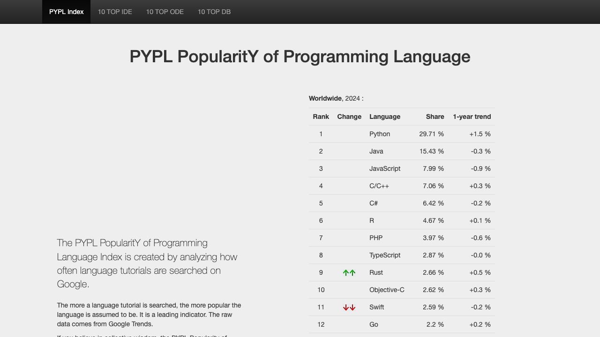

# Course Overview

## About This Course

- **"AI-powered bioinformatic analysis using R"**
- HUST Bioinformatics course series (16 lectures)
- **Part 1** (Talks 1–6): R programming foundations
- **Part 2** (Talks 7–16): multi-omics data analysis
- **AI-assisted approach**: CodeBuddy throughout the entire course

## Course Structure — Part 1

| Talk | Topic |
|------|-------|
| **1** | **Course Overview & AI-assisted Setup** ← today |
| 2 | R Language Basics I — data types, vectors, matrices |
| 3 | R Language Basics II — factors, lists, data frames |
| 4 | Data Wrangling with tidyverse (dplyr + tidyr) |
| 5 | Data Visualization with ggplot2 |
| 6 | Strings, Iteration & Functional Programming |

## Course Structure — Part 2

\footnotesize

| Talk | Topic |
|------|-------|
| 7 | Statistical Analysis & Machine Learning Basics |
| 8 | Regression & Survival Analysis |
| 9 | Transcriptome Analysis (DEGs, functional enrichment) |
| 10 | Microbiome Analysis (16S / metagenomics) |
| 11 | Genome Analysis (GWAS) |
| 12 | Single-cell RNA-seq Analysis |
| 13 | Spatial Transcriptomics |
| 14 | Network Analysis (WGCNA, PPI, GRN) |
| 15 | Multi-omics Integration & Case Studies |
| 16 | Other Omics & Course Wrap-up |

## Target Audience

- Undergraduate students in bioinformatics, computational biology, statistics, data science, or biology
- **No prior programming experience required**
- Basic biology knowledge helpful but not mandatory

## Learning Approach

- **AI-assisted**: CodeBuddy prompt-driven throughout
- **Hands-on**: live coding in every session
- **Exercises**: Quarto (.qmd) format after key lectures
- **Build a portfolio** of reproducible analysis scripts

# Why R?

## A Brief History of R

- Created in **1993** by **Ross Ihaka** and **Robert Gentleman**
  - University of Auckland, New Zealand
- Name: first letters of the two creators' first names
  - Also a playful reference to the **S language** (Bell Labs)
- **1993–2000**: small but growing academic community
- **2000**: R 1.0.0 released — the tipping point
- Now maintained by the **R Core Team** (~20 experts worldwide)
- Latest stable version: R 4.x (annual releases)

## Why R Succeeded

\footnotesize

**External factors:**

- Rise of free / open-source software movement
- Linux ecosystem maturity in the 2000s
- Economic pressures (free alternative to SAS, SPSS, Stata)

**Internal strengths:**

- Professional-grade statistical computing
- Unmatched data visualization (ggplot2)
- Rich package ecosystem: **CRAN** (>20,000 packages) + **Bioconductor**
- Strong, welcoming community
- Excellent IDE: RStudio (now Posit)

## R's Popularity Today

- Consistently **top-10** in TIOBE and PYPL programming language rankings
- The **most used** statistical software in academic publications
- Increasing adoption in pharma, biotech, finance, tech
- Growing demand in the job market (Indeed.com trends)

{width="75%"}

## R for Bioinformatics

Why R is an excellent choice for bioinformatics:

- **Bioconductor**: 2,000+ bioinformatics packages (RNA-seq, ChIP-seq, flow cytometry, etc.)
- **tidyverse**: elegant, consistent data wrangling & visualization
- **Reproducible research**: Quarto / R Markdown for literate programming
- Strong **genomics & statistics** community
- **Interoperability**: R-Python via `reticulate`, C++ via `Rcpp`, shell commands

:::: {.callout-tip}
R + CodeBuddy AI = the most productive setup for bioinformatics today.
::::

# Course Objectives

## What we will do today

- Set up an **AI-assisted programming** environment
- Use **CodeBuddy** as your AI coding companion
- Accomplish everything via natural language (**prompts**)
- Install R / RStudio / tinytex / tidyverse
- Clone the course repo and open the R project

## Traditional vs. AI-assisted

| Traditional | AI-assisted |
|-------------|-------------|
| Search for installers | AI installs directly |
| Follow tutorials | One sentence, done |
| Memorize commands | Describe what you want |
| Debug alone | AI helps diagnose |

# CodeBuddy Overview

## What is CodeBuddy?

- **Tencent Cloud** AI-native IDE (Integrated Development Environment)
- Powered by **Tencent Hunyuan + DeepSeek** dual models
- Supports **200+ programming languages** (R, Python, Julia, etc.)
- Three product forms:
    - **Standalone IDE** (what we use in this course)
    - IDE Plugins (VS Code, JetBrains)
    - CLI command-line tool

## Why CodeBuddy?

- Free to use, login with **WeChat QR scan**
- **Agent mode**: AI autonomously completes multi-file tasks
- Deep integration: terminal, Git, extension marketplace
- Full R / Quarto / LaTeX pipeline support
- Native Chinese IDE, no VPN needed

# Step 1: Install CodeBuddy

## Download

\footnotesize

1. Open your browser and visit: **<https://www.codebuddy.cn>**
2. Click **Download**, choose your system:
    - **macOS Apple Silicon** (M1/M2/M3/M4 chip)
    - **macOS Intel** (Intel chip)
    - **Windows**
3. To find your Mac chip type:
    Apple menu  → "About This Mac" → look at the "Chip" field

## Install

\footnotesize

- **macOS**: drag the installer into the `Applications` folder
- **Windows**: double-click the installer and follow the wizard

::: {.callout-tip}
After installation, open CodeBuddy from your Applications / Start menu.
:::

## Sign in

\footnotesize

1. Open CodeBuddy IDE
2. Click the **Login** button (top-right corner)
3. Select **WeChat** login
4. Scan the QR code with your phone → confirm
5. You are now signed in

::: {.callout-important}
On first launch, you may be asked to choose the UI language. We recommend **English** for consistency with this course.
:::

# Step 2: Navigating CodeBuddy

## Core interface layout

\footnotesize

| Panel | Location | Function |
|-------|----------|----------|
| **File Explorer** | Left sidebar | Browse / manage project files |
| **Editor** | Center | View and edit code |
| **Terminal** | Bottom | Execute command-line operations |
| **AI Chat** | Right sidebar (Cmd+Ctrl+I) | Interact with AI |

## Agent modes

CodeBuddy offers three core **Agent modes**:

- **Ask** — Q&A only; does not modify code
- **Craft** — Code generation and local edits (agent mode)
- **Plan** — AI drafts a plan first, then executes after your confirmation

::: {.callout-tip}
Switch modes at the bottom of the chat panel, or use **Cmd + I** (macOS) as the shortcut.
:::

# Step 3: Using Prompts with Agent Mode

## Activate Craft Agent mode

This course uses **Craft (Agent) mode** throughout — let AI complete tasks autonomously:

1. Open the AI chat panel (Cmd + Ctrl + I)
2. Switch to **Craft** at the bottom of the panel
3. Type your **prompt** into the input box

## What is a Prompt?

- A **prompt** is the natural-language instruction you give to AI
- No need to memorize commands — just describe what you want
- Example: "Please help me install R 4.4 on my Mac."

::: {.callout-important}
From this point forward, **every operation** in this course will be driven by prompts in CodeBuddy.
:::

# Step 4: Install R via AI

## Install R

Type the following prompt in CodeBuddy's Craft mode:

::: {.callout-note title="Prompt"}
```
Please help me install the latest version of R on my computer.
My OS is macOS / Windows.
If R is already installed, check the version and let me know.
```
:::

## What CodeBuddy will do

CodeBuddy will:

1. Detect your operating system
2. Guide you to download R from CRAN
3. Or install directly via **Homebrew** (macOS) / **winget** (Windows)

::: {.callout-tip}
To verify: open the terminal and type `R --version`
:::

# Step 4b: Install RStudio

## Install RStudio Desktop

::: {.callout-note title="Prompt"}
```
Please help me install the latest RStudio Desktop (free edition).
If it is already installed, skip this step.
Use the terminal or provide a download link.
```
:::

## What CodeBuddy will do

CodeBuddy will:

1. Visit the Posit website for the latest RStudio download link
2. Guide the installation or install via package manager

::: {.callout-tip}
After installation, RStudio will appear in your Applications (macOS) or Start menu (Windows).
:::

# Step 5: Install Extensions in CodeBuddy

## R-related extensions

Install these extensions in CodeBuddy for optimal R programming:

| Extension | Purpose |
|-----------|---------|
| **R Extension** (`REditorSupport.r`) | R syntax highlighting, code completion, run R code |
| **R Debugger** (`RDebugger.r-debugger`) | R code debugging |
| **Quarto** (`quarto.quarto`) | .qmd file editing, preview, and rendering |

## Install extensions via AI

::: {.callout-note title="Prompt"}
```
Please help me install these extensions in CodeBuddy:
1. R Extension (REditorSupport.r) — R syntax highlighting and code execution
2. R Debugger (RDebugger.r-debugger) — R debugging support
3. Quarto (quarto.quarto) — QMD file editing and preview

Search and install them from the extension marketplace.
```
:::

# Step 6: Clone the Course Repository

## Clone from GitHub

All course materials are hosted at:

**<https://github.com/evolgeniusteam/R-for-bioinformatics>**

::: {.callout-note title="Prompt"}
```
Please clone the following GitHub repository to my Desktop:
https://github.com/evolgeniusteam/R-for-bioinformatics

Use git clone to download it to ~/Desktop/.
```
:::

# Step 7: Open the Course Project

## Open in CodeBuddy

::: {.callout-note title="Prompt"}
```
Please open the following folder in the current CodeBuddy window:
~/Desktop/R-for-bioinformatics
```
:::

## Open the R Project in RStudio

The repository contains an `.Rproj` file for RStudio:

::: {.callout-note title="Prompt"}
```
Please help me open this R project file in RStudio:
~/Desktop/R-for-bioinformatics/R for bioinformatics.Rproj

If RStudio is not in PATH, locate it and launch it.
```
:::

# Step 7b: Switching Between Tools

## CodeBuddy vs. RStudio workflow

| Task | Where |
|------|-------|
| AI-assisted coding & debugging | **CodeBuddy** |
| Traditional R scripting | **RStudio** |
| Rendering QMD to PDF | Either (via terminal or RStudio) |
| Git operations | CodeBuddy terminal or integrated Git |

::: {.callout-tip}
You can freely switch between CodeBuddy and RStudio throughout the course — both work with the same project folder.
:::

# Step 8: Install tinytex & R Packages

## Install tinytex (LaTeX engine)

PDF output requires LaTeX; we recommend **tinytex**:

::: {.callout-note title="Prompt"}
```
Please help me install the tinytex R package.
After installation, run tinytex::install_tinytex() to install TinyTeX.
```
:::

CodeBuddy will execute in the R terminal:

```r
install.packages("tinytex")
tinytex::install_tinytex()
```

## Course R packages

::: {.callout-note title="Prompt"}
```
Please help me install these R packages:
- rmarkdown — R Markdown support
- knitr — code chunk execution engine
- bookdown — long document support
- kableExtra — table formatting

If compilation is needed, install from binary (type = "binary").
```
:::

# Step 9: tidyverse — The Most Important Package

## What is tidyverse?

**tidyverse** is a **meta-package** containing the core tools for data analysis:

\footnotesize

| Package | Purpose |
|---------|---------|
| `ggplot2` | Data visualization |
| `dplyr` | Data manipulation |
| `tidyr` | Data tidying |
| `readr` | Data import |
| `purrr` | Functional programming |
| `tibble` | Modern data frames |
| `stringr` | String handling |
| `forcats` | Factor variables |

# Step 9: Install tidyverse

## Install via AI

::: {.callout-note title="Prompt"}
```
Please install the tidyverse package in R. tidyverse is a large collection
and may take a few minutes. Use install.packages("tidyverse") and wait.
After installation, run library(tidyverse) to verify.
```
:::

## Verify installation

A successful installation will show:

```r
library(tidyverse)
#> ── Attaching core tidyverse packages ──────────── tidyverse 2.0.0 ──
#> ✔ dplyr     1.1.4     ✔ readr     2.1.5
#> ✔ forcats   1.0.0     ✔ stringr   1.5.1
#> ✔ ggplot2   3.5.1     ✔ tibble    3.2.1
#> ✔ lubridate 1.9.3     ✔ tidyr     1.3.1
#> ✔ purrr     1.0.2
```

# Verification Checklist

## Part 1

Please confirm these items are complete:

\footnotesize

- [ ] CodeBuddy IDE installed and signed in with WeChat
- [ ] Craft Agent mode activated
- [ ] R installed (`R --version` in terminal)
- [ ] RStudio installed
- [ ] R / Quarto extensions installed in CodeBuddy

## Part 2

\footnotesize

- [ ] Course repository cloned to local machine
- [ ] R Project can be opened in RStudio
- [ ] tinytex installed (`tinytex::is_tinytex()` returns TRUE)
- [ ] rmarkdown / knitr / bookdown / kableExtra installed
- [ ] **tidyverse installed and loads without errors**

::: {.callout-important}
If any item above is unchecked, ask CodeBuddy AI to help you fix it!
:::

# Prompt Cheat Sheet

## Best practices

> **"Clear input → better output"**

- **State the goal** — what you want to do (install, run, debug)
- **Describe the environment** — OS, software versions
- **Describe the expected outcome** — what success looks like
- **When errors occur** — paste the error message directly to AI

## Prompt templates

\footnotesize

| Scenario | Prompt |
|----------|--------|
| Install software | "Please install [name] version [X.X] on [OS]" |
| Run code | "Run this R code and explain the results: [code]" |
| Debug error | "I got this error: [message]. Please fix it." |
| Learn a concept | "Explain [R concept] in simple terms with examples" |

# Next Steps

## After today

1. **Explore CodeBuddy**: practice using AI chat, get comfortable with prompts
2. **Browse the course repo**: check out `data/`, `rscripts/`, `Exercises and homework/`
3. **Test tidyverse**: load it in R, verify everything works
4. **Preview next class**: R language basics

## Reference Links

\footnotesize

- CodeBuddy: <https://www.codebuddy.cn>
- CodeBuddy Docs: <https://www.codebuddy.ai/docs>
- R Project: <https://www.r-project.org>
- RStudio: <https://posit.co/products/open-source/rstudio/>
- Course Repository: <https://github.com/evolgeniusteam/R-for-bioinformatics>
- tidyverse: <https://www.tidyverse.org>
- R for Data Science (2e): <https://r4ds.hadley.nz> (must-read!)
