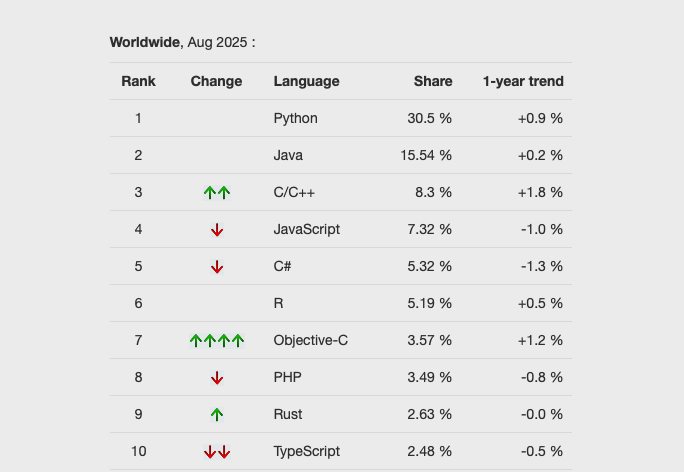

# section 1: 课程介绍

## 课程

- 《生物医学数据分析与作图》课程
- 生物医药及高端医疗设备专项系列课程之一
- 适合对象：
  - 生物信息学
  - 计算生物学
  - 统计学
  - 数据科学等相关专业
  - 研究生及科研人员
  
- 课程目标：
  - 掌握生物医学数据分析与可视化的基本技能

## 课程内容

1.  课程介绍
2.  安装软件及 IDE (integrated development environment)
3.  R 基础
4.  数据处理 (with dplyr and tidyr)
5.  数据可视化 (with ggplot2)
6.  组学数据分析
7.  机器学习及其在组学分析中的应用
8.  Case studies

## 练习与作业

1. 重要章节后有练习题
2. 练习为 Quarto 格式 (.qmd)
3. QMD 文件需转化为 PDF 格式，以显示运行结果；
4. （如需提交作业） 按要求命名并提交PDF文件。

# section 2: R语言简史

## R语言简史

- R语言是一种开源编程语言，任何人都可以免费下载和使用。

- R语言由1993年由新西兰奥克兰大学：
  - Ross Ihaka
  - Robert Gentleman 开发

- R语言的名称来源于两位创始人名字的首字母，同时也暗示了其与S语言的渊源（S语言是贝尔实验室开发的一种统计编程语言，R语言在设计上受到了S语言的启发）。

- 现由R核心团队（R Core Team）维护和更新

- 1993 - 2000：小范围内流传时期；

- 2000年后：大爆发期。

## R语言简史, cont.

### R语言成功的外在因素：

  - 自由软件的兴起；
  - Linux的成熟；
  - 经济危机；

### R 语言成功的内在因素：

  - R语言功能强大，适用于各种统计分析和数据可视化任务。
  - R语言拥有丰富的扩展包生态系统，用户可以根据需要安装各种功能包来扩展R的功能。
  - R语言具有良好的社区支持，用户可以通过论坛、邮件列表和社交媒体等渠道获取帮助和交流经验。

## R语言示例1：R的流行性调查

- 任务：调查R语言在学术研究中的流行程度
- 数据：使用Google Scholar（谷歌学术）数据分析R语言在学术文章中的引用情况（2012及以前）
- 方法：使用R语言进行数据处理和可视化

## R的流行性调查, cont. 

\footnotesize

```{r warning=FALSE, message=FALSE}
library("ggplot2")
library("tidyr")

# 读取数据
dat <- read.csv(file = "data/talk01/chaper01_preface_scholarly_impact_2012.4.9.csv")

# 选择列并转换为长格式
cols.subset <- c("Year", "JMP", "Minitab", "Stata", "Statistica", "Systat", "R")
Subset <- dat[, cols.subset]
ScholarLong <- pivot_longer(Subset, cols = -Year,
                            names_to = "Software", values_to = "Hits")

# 画图
plot1 <- 
  ggplot(ScholarLong, aes(Year, Hits, group = Software)) +
    geom_smooth(aes(fill = Software), position = "fill", method = "loess") +
    ggtitle("Market share") +
    scale_x_continuous("Year") +
    scale_y_continuous("Google Scholar %", labels = NULL) +
    theme(axis.ticks = element_blank(), text = element_text(size = 14)) + 
    guides(fill = guide_legend(title = "Software", reverse = FALSE)) + 
    geom_text(data = data.frame(Year = 2011, Software = "R", Hits = 0.10),
              aes(label = Software), hjust = 0, vjust = 0.5)
```

## R的流行性调查, 结果 

```{r plot1, fig.width=10, fig.height=4.5, echo=FALSE, cache=TRUE, warning=FALSE, message=FALSE}
plot1
```

**结论**：R（统计学软件中）的市场份额逐年上升；2000是其流行的拐点。

## R语言示例2：R的招聘趋势

- 任务：调查统计分析工作岗位对R语言的要求；
- 数据：来自美国招聘搜索引擎indeed.com（2015年以前）
- 方法：使用R语言进行数据处理和可视化

## R job trends, cont. 

\footnotesize

```{r warning=FALSE, message=FALSE}
library("ggplot2")

# 读取数据
dat <- read.table(file = "data/talk01/chaper01_preface_indeed_com_stats_2015.txt", 
                  header = TRUE, as.is = TRUE)

# 处理数据
dat$date <- as.Date(dat$date)  # 把第一列改为日期
dat <- transform(dat, software = reorder(software, job))

# 画图
plot2 <-
  ggplot(dat, aes(date, job, group = software, colour = software)) +
    geom_line(linewidth = 0.8) +
    ggtitle("Job trends (data from indeed.com)") +
    xlab("Year") + ylab("%") +
    theme(text = element_text(size = 14)) + 
    guides(colour = guide_legend(title = "Tool", reverse = TRUE)) +
    scale_colour_brewer(palette = "Set1") +
    geom_text(data = dat[dat$date == "2015-01-01" & dat$software %in% c("R"), ], 
              aes(label = software), hjust = 0, vjust = 0.5)
```

## R job trends, plot

```{r plot2, echo=FALSE, cache=TRUE, fig.width=10, fig.height=4}
plot2
```

**总结**： 需要用到R的招聘信息占总体招聘的比例逐年上升，目前仅排在SAS和Matlab之后，处于第3位。而且，除了Stata之外，R是唯一一个占比上升。

## Popularity of Programming language 2024

{width="80%"}

## PYPL 2025

{width="70%"}

## 生物医学数据分析所需的编程语言

### Python

-   强大的文本处理能力（包括序列）
-   不错的运行速度
-   强大的生信和统计学扩展包
-   方便的并行计算

### R

-   强大的格式数据处理能力（二维表格, dplyr）
-   无以伦比的统计学专业性
-   专业而好看的数据可视化软件（ggplot2）
-   专业的生信扩展包（Bioconductor）
-   超级好用的整合开发环境IDE（RStudio）

## 网站链接、参考文献和扩展阅读

综上所述，R已经是最流行的免费统计分析软件，排名仅在几个传统的分析软件之后，而且大有赶超它们的趋势。学好R，不仅有助于在学术研究领域的发展，对找工作也有不少的帮助。

-   R的官方网站: <https://www.r-project.org>
-   R档案综合网络，即CRAN (Comprehensive R Archive Network):
    <https://cran.r-project.org/>
-   ggplot2: <https://ggplot2.tidyverse.org>
-   RStudio: <https://posit.co/products/open-source/rstudio/>
-   如何从Google Scholar抓取引用数据:
    <https://librestats.com/2012/04/12/statistical-software-popularity-on-google-scholar/>
-   indeed招聘趋势: <https://www.indeed.com/jobtrends>
-   R for data science (2e): <https://r4ds.hadley.nz> (必读！！)
