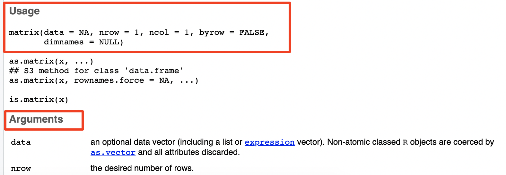

# section 1: outline

## 前情提要

- 基本数据类型

- 类型判定函数（`is.xxx` and `class()`）

- 基本算术运算

## 本次提要

1. R的数据结构
 
 - 简单数据类型：vector, matrix, array
 - 复杂数据类型：data.frame, tibble, list, factor （下次介绍）
 - 特殊值：NA, NaN, Inf, -Inf, NULL （下次介绍）

2. 变量与赋值

3. R数据类型的操作

 - 定义
 - 取部分
 - 替换
 - 其它常用操作函数
 
# section 2: R basics - 数据类型结构

## R的数据基本结构

R的数据结构可分为**简单数据类型**和**复杂数据类型**两大类。

### 简单数据类型

- 向量（vector）
- 矩阵（matrix）
- 数组（array）

### 复杂数据类型

- 列表（list）
- 数据框（data.frame）
- Tibbme（tibble）
- 因子（factor）

## 1. 向量（vector）

向量是R中最基本的数据结构，是一组具有**相同数据类型**的元素的有序集合。

\footnotesize

```{r}
## 创建一个数值型向量
num_vector <- c(90, 100, 120, 11.4, 3.5)
num_vector

## 创建一个字符型向量
char_vector <- c("A", "B", "C", "D")
char_vector

## 创建一个逻辑型向量
log_vector <- c(TRUE, FALSE, TRUE, FALSE)
log_vector
```

\normalsize

## 向量的基本操作

### 访问元素：正向索引，使用索引访问向量中的元素，例如 `num_vector[1]` 访问第一个元素。

\footnotesize

```{r}
num_vector[1]  # 访问第一个元素
num_vector[2:4]  # 访问第二到第四个元素
num_vector[ c(1,3,5) ]  # 访问第一、三、五个元素
```

### 负向索引，去除指定位置的元素，例如 `num_vector[-2]` 会返回去除第二个元素后的向量。

\footnotesize

```{r}
num_vector[-2]  # 去除第二个元素
num_vector[-(2:3)]  # 去除第二到第三个元素
```

## 向量的基本操作, cont. 

### 向量运算：向量之间可以进行加减乘除等运算

\footnotesize

```{r}
num_vector + 2  # 每个元素加2
num_vector * 3  # 每个元素乘3
```

### 等长向量运算：当两个向量长度相同时，可以进行元素对应的运算

\footnotesize

```{r}
x1 <- c(1, 2)
x2 <- c(3, 4)
x1 + x2  # [1] 4 6
x1 * x2  # [1] 3 8
```


## 向量的基本操作, cont. 

### 向量回收规则：当两个向量长度不同时，较短的向量会被重复使用以匹配较长向量的长度。例如 `num_vector + c(1, 2)`

\footnotesize

```{r}
c(1,2,3) + c(4,5)  # 等效于 c(1+4, 2+5, 3+4) → [1] 5 7 7

## 反过来也是一样的。
c(4,5) + c(1,2,3)  # 等效于 c(4+1, 5+2, 4+3) → [1] 5 7 7
```

## 向量的基本操作, cont. 

### 向量筛选：可以使用逻辑条件筛选向量中的元素，例如 `num_vector[num_vector > 3]` 会返回大于3的元素。

\footnotesize

```{r}
num_vector[num_vector > 3]  # 返回大于3的元素
```

### 向量排序：使用 `sort()` 或 `order()` 函数

\footnotesize

```{r}
sort(num_vector)  # 升序排序
order(num_vector)  # 返回排序索引
```

## 向量的基本操作, cont. 

### 连接向量：使用 `c()` 函数将多个向量连接成一个向量。

\footnotesize

```{r}
vec1 <- c(1, 2, 3)
vec2 <- c(4, 5, 6)
combined_vector <- c(vec1, vec2)  # 连接向量
combined_vector
```

### 重复元素：使用 `rep()` 函数重复向量中的元素。

\footnotesize

```{r}
repeated_vector <- rep(vec1, times = 3)  # 重复向量
repeated_vector
```

## 向量的基本操作, cont.

### 序列生成：使用 `seq()` 函数生成等差数列。

\footnotesize

```{r}
sequence_vector <- seq(from = 1, to = 10, by = 2)  # 生成序列
sequence_vector
```

### 向量替换：可以通过索引替换向量中的元素，例如 `num_vector[1] <- 99` 会将第一个元素替换为99。

\footnotesize

```{r}
num_vector[1] <- 99  # 替换第一个元素
num_vector
```

## 向量的基本操作, cont.

### 命名向量元素：使用 `names()` 函数为向量的元素命名，方便通过名称访问元素。

\footnotesize

```{r}
names(num_vector) <- c("A", "B", "C", "D", "E")  # 命名向量元素
num_vector["A"]  # 通过名称访问元素
```

## 向量的基本操作, cont.

### 统计函数：

-  `length()` 获取向量长度
-  `sum()` 计算向量元素之和
-  `mean()` 计算均值;
-  `median()` 计算中位数
-  `sd()` 计算标准差。

更多统计函数之后再做介绍。

## 向量的数据类型转换规则

- 向量只能包含一种基本数据类型。
- 因此，如果输入的数值是混合的，系统会自动进行转换，优先级为：

  * 逻辑类型 -> 数字类型
  * 逻辑类型 -> 字符串
  * 数字类型 -> 字符串
 
可用 `class()`或`str() ` 函数来判断 向量 包含的数据类型。以后会介绍两者的不同。

\footnotesize

```{r}
class( c(45, TRUE, 20, FALSE, -100) ); ## 逻辑和数字类型 -> 数字
str( c("string a", FALSE, "string b", TRUE) ); ## 逻辑和字符 -> 字符
str( c("a string", 1.2, "another string", 1e-3) ); ## 数字和字符 -> 字符
```

## 向量部分小结

- 特点：一维、同质数据类型、有序集合
- 创建：使用 `c()` 函数
- 访问：通过索引或名称访问元素
- 操作：支持算术运算、筛选、排序、连接、替换
- 应用：适用于存储和处理一维数据，如基因表达值、测量数据等

## 2. 矩阵（matrix）

矩阵是:

- 二维数组，是由行和列组成的元素集合
- 所有元素必须具有相同的数据类型
- 适用于存储和处理二维数据，例如图像数据、表格数据等。

\footnotesize

```{r}
# 创建一个3行2列的矩阵
m <- matrix( c(10,20,30, 110,120,130),
             nrow=3,
             ncol=2,
             byrow=FALSE,
             dimnames = list( c("row_A","row_B","row_C"),
                              c("A","B") )
             );
m
```

## 用`? matrix ` 命令获得帮助，查看 matrix() 函数的使用方法

在 Console 窗口中输入 `? matrix ` 命令，可在**窗口4**获得有关`matrix()`函数的帮助信息：

{height=60%}

## matrix()参数测试

\footnotesize

```{r}
matrix( c(20, 30.1, 2, 45.8, 23, 14), nrow = 2, byrow = T );
```

```{r}
matrix( c(20, 30.1, 2, 45.8, 23, 14), nrow = 2, byrow = F );
```

```{r}
matrix( c(20, 30.1, 2, 45.8, 23, 14), nrow = 2, 
       dimnames = list( c("row_A", "row_B"), c("A", "B", "C") ) );
```

## matrix()同时指定 ncol 和 nrow


矩阵的指定长度，即 nrow  ×  ncol，可以不同于输入数据的长度。

矩阵长度较小时，输入数据会被截短；而矩阵长度较大时，输入数据则会被重复使用。举例如下：

\footnotesize

```{r}
## 生成一个2x5长度为10的矩阵，但输入数据的长度为20
matrix( 1:20, nrow = 2, ncol = 5, byrow = T); 
```
```{r}
## 生成一个2x3长度为6的矩阵，但输入数据长度只有3
matrix( 1:3, nrow = 2, ncol = 3, byrow = T ); 
```

## `matrix()`更多测试， cont. 

第二种情况，矩阵长度小于输入数据的长度，且后者不是前者的整数倍。

\footnotesize

```{r}
matrix( letters[1:20], nrow = 3, ncol = 5, byrow = T );
```

## 对角线矩阵
\footnotesize
```{r}
diag( c(1,2,3,4) )  # 生成对角
```

## 矩阵的基本操作

### 设置行列名

\footnotesize
```{r}
rownames(m) <- c("Row1", "Row2", "Row3")  # 设置行名
colnames(m) <- c("Col1", "Col2")  # 设置列名
m
```

## 矩阵的基本操作, cont.

### 访问元素：使用行列索引访问矩阵中的元素，例如 `m[1, 2]` 访问第一行第二列的元素。

\footnotesize

```{r}
m[1, 2]  # 访问第一行第二列的元素
m[2, ]  # 访问第二行的所有元素
m[, 1]  # 访问第一列的所有元素

## 按名称访问向量
m["Row1", "Col2"]  # 通过名称访问元素

```

## 矩阵的基本操作, cont.

### 负向索引，去除指定行或列的元素，例如 `m[-2, ]` 会返回去除第二行后的矩阵。

\footnotesize
```{r}
m[-2, ]  # 去除第二行
m[, -1]  # 去除第一列
```

## 矩阵的基本操作, cont.

### 矩阵运算：矩阵之间可以进行加减乘除等运算，例如 `m + 2` 会将每个元素加2。
\footnotesize
```{r}
m + 2  # 每个元素加2
m * 3  # 每个元素乘3
```

## 矩阵的基本操作, cont.

### 元素级乘法：使用 `*` 运算符进行元素对应的乘法，例如 `m1 * m2`。

\footnotesize

```{r}
mat <- matrix(1:6, nrow = 2)
vec <- c(10, 20)
mat * vec  # 矩阵的每列与向量相乘
```

## 矩阵的基本操作, cont.

### 矩阵乘法：使用 `%*%` 运算符进行矩阵乘法，第一个矩阵的列数 = 第二个矩阵的行数
\footnotesize
```{r}
A <- matrix(1:6, nrow = 2, ncol = 3)  # 2x3 矩阵
B <- matrix(7:12, nrow = 3, ncol = 2) # 3x2 矩阵
A %*% B  # 矩阵乘法

# 非法矩阵乘法（维度不匹配）
tryCatch(A %*% matrix(1:4, nrow = 2), error = function(e) print(e$message))
```
## 矩阵的基本操作, cont.

### 矩阵转置：使用 `t()` 函数进行矩阵转置，例如 `t(m)`。

\footnotesize
```{r}
m; # original matrix
t(m)  # 矩阵转置
```

## 矩阵的基本操作, cont.

### 修改元素

\footnotesize
```{r}
m[1, 2] <- 99  # 修改第一行第二列的元素
m
```

### 查看或修改纬度

\footnotesize

```{r}
dim(m) ## 查看
dim(m) <- c(2, 3)  # 修改矩阵维度 
m
```

\normalsize

修改矩阵维度时，修改后的行数（nrow）和列数（ncol）的乘积必须等于原矩阵的总元素数！

## 矩阵部分小结

- 特点：二维结构，元素同类型，按列存储，默认行列名可命名
- 创建：matrix(data, nrow, ncol, byrow=FALSE)构建
- 访问：索引 mat[i,j]或逻辑筛选 mat[mat>5]
- 操作：元素级运算（+/*）、矩阵乘法（%\*%）、转置（t()）
- 应用：统计建模（线性回归）、机器学习（数据预处理）、图像处理（像素矩阵）、科学计算（特征分解）

## 3. 数组（array）

