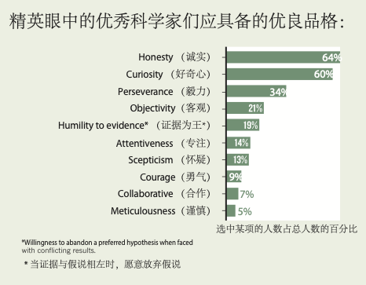
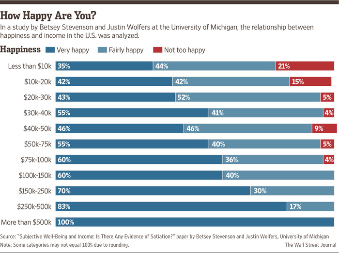

```{r include=FALSE}
color_block = function(color) {
  function(x, options) sprintf('\\color{%s}\\begin{verbatim}%s\\end{verbatim}',
                               color, x)
}

## 将错误信息用红色字体显示
knitr::knit_hooks$set(error = color_block('red'))
```

# Section 1 : outline

## Outline

-   the two most important figures in science
-   think in English
-   think creative
-   find your own truth

# section 2 : contents

## how people in science see each other

{width="60%"}

## the most important Scientific virtue

{width="60%"}

## think in English

怎么练习口语和语感？

1.  Find a short article that you know every word
2.  Read it aloud at a quiet place so that you can hear it
3.  Do this everyday for **three years**

## think creative

How?

1.  Read a research paper
2.  Find three limitations of the research
3.  Address these issues with your own ideas
4.  Do this once a week for **three years**

## try find your own truth

未经调研，不要轻易相信别人结论，特别是科普文章。

There is a reproducibility crisis in scientific community:

-   70% of researchers failed to reproduce others' experiments
-   50% failed to reproduce their own

{height="30%"}

## Religious and happiness

[Are religious people happier? (Pew research 2019)](https://www.pewresearch.org/fact-tank/2019/01/31/are-religious-people-happier-healthier-our-new-global-study-explores-this-question/#:~:text=Studies%20have%20often%20credited%20religion,more%20engaged%20in%20their%20communities.&text=Sometimes%20the%20gaps%20are%20striking,and%2025%25%20of%20the%20unaffiliated.)

[Religion, GDP and happiness.](https://github.com/evolgeniusteam/religiosity_GDP_and_happiness_2016)

```{r echo=FALSE, fig.width=10, fig.height=5, warning=FALSE, message=FALSE}
## 先展示一下结果；echo=FALSE时只展示图片，不显示代码
require(readxl, quietly = TRUE);
require(ppcor, quietly = TRUE);
require(tidyverse, quietly = TRUE);

## -- r == RELIGIOSITY, 即：被调查人自认为是有信仰的百分比；数据来源：http://www.wingia.com/web/files/news/14/file/14.pdf
r <- read_excel("data/talk00/data.xlsx", col_names = c("country", "rel"), sheet = 1);

## -- h == happiness, https://en.wikipedia.org/wiki/Satisfaction_with_Life_Index
h <- read_excel("data/talk00/data.xlsx", col_names = c("country", "happiness"), sheet = 2);

## -- p == 人均GDP: https://en.wikipedia.org/wiki/List_of_countries_by_GDP_(nominal)_per_capita
p <- read_excel("data/talk00/data.xlsx", col_names = c("country", "ppp"), sheet = 3);

## -- combine data together ... 
rhp <- list( r, h, p ) %>% reduce( inner_join, by = "country") ;

## -- 
c = pcor.test( rhp$happiness, rhp$rel , rhp$ppp);
eq <- substitute( 
                        italic(r)~"="~r2*","~italic(p)==pvalue,
                  list(
                       r2 =  as.vector( format( c$estimate , digits = 2) ),
                       pvalue =  as.vector( format( c$p.value , digits = 2) ) )
)
eq <- as.character(as.expression(eq));

HAP2_resid<-resid(lm(happiness~ppp,rhp));
REL2_resid<-resid(lm(rel~ppp,rhp));
m<-ggplot(data.frame(x = HAP2_resid, y = REL2_resid), aes(x=y, y=x)) +
    geom_point() +
    labs(x="RELIGION | PPP", y = "HAPINESS | PPP")+
    scale_size_manual(values=c(15))+
    theme_classic()
m +  geom_smooth(method=lm) + 
    geom_text( data = NULL,
               aes( x = -40, y = 50, label= eq, hjust = 0, vjust = 1),
               size = 4, parse = TRUE, inherit.aes=FALSE);
```

## The data

`data/talk00/data.xlsx`

```{R}
head(rhp);
```

## Single factor analysis

### Happiness vs. Religion

\FontSmall

```{R}
c = cor.test( rhp$happiness, rhp$rel);
eq <- substitute( 
  italic(r)~"="~r2*","~italic(p)==pvalue,
  list(
    r2 =  as.vector( format( c$estimate , digits = 2) ),
    pvalue =  as.vector( format( c$p.value , digits = 2) ) 
  ));
eq <- as.character(as.expression(eq));

m<-ggplot(rhp, aes(x=happiness, y=rel)) +
    geom_point() +
    labs(y="RELIGION", x = "HAPINESS")+
    theme_classic() +
    geom_smooth(method=lm) + 
    geom_text( data = NULL,
               aes( x = 120, y = 25, label= eq, hjust = 0, vjust = 1),
               size = 4, parse = TRUE, inherit.aes=FALSE);
```

## Plot

\FontSmall

```{R fig.width=10, fig.height=5, warning=FALSE, message=FALSE}
m
```

## Happiness vs. ppp

\FontSmall

```{R}
c = cor.test( rhp$happiness, rhp$ppp);
eq <- substitute( 
  italic(r)~"="~r2*","~italic(p)==pvalue,
  list(
    r2 =  as.vector( format( c$estimate , digits = 2) ),
    pvalue =  as.vector( format( c$p.value , digits = 2) ) 
  ));
eq <- as.character(as.expression(eq));

m2<-ggplot(rhp, aes(x=happiness, y=ppp)) +
    geom_point() +
    labs(y="PPP", x = "HAPINESS")+
    theme_classic() +
    geom_smooth(method=lm) + 
    geom_text( data = NULL,
               aes( x = 120, y = 50000, label= eq, hjust = 0, vjust = 1),
               size = 4, parse = TRUE, inherit.aes=FALSE);
```

## Plot

\FontSmall

```{R fig.width=10, fig.height=5, warning=FALSE, message=FALSE}
m2
```

## Religion vs. ppp

\FontSmall

```{R}
c = cor.test( rhp$rel, rhp$ppp);
eq <- substitute( 
  italic(r)~"="~r2*","~italic(p)==pvalue,
  list(
    r2 =  as.vector( format( c$estimate , digits = 2) ),
    pvalue =  as.vector( format( c$p.value , digits = 2) ) 
  ));
eq <- as.character(as.expression(eq));

m3<-ggplot(rhp, aes(x=rel, y=ppp)) +
    geom_point() +
    labs(y="PPP", x = "RELIGION")+
    theme_classic() +
    geom_smooth(method=lm) + 
    geom_text( data = NULL,
               aes( x = 25, y = 20000, label= eq, hjust = 0, vjust = 1),
               size = 4, parse = TRUE, inherit.aes=FALSE);
```

## Plot

\FontSmall

```{R fig.width=10, fig.height=5, warning=FALSE, message=FALSE}
m3
```

## Happiness vs. PPP vs. Religion

\FontSmall

```{R}
summary( glm( happiness ~ ppp + rel, data = rhp ) ); 
```

## How happy are you???

\FontSmall

{height="70%"}


## Concluding remarks

-   不轻信、重事实
-   有创新性
-   有用
