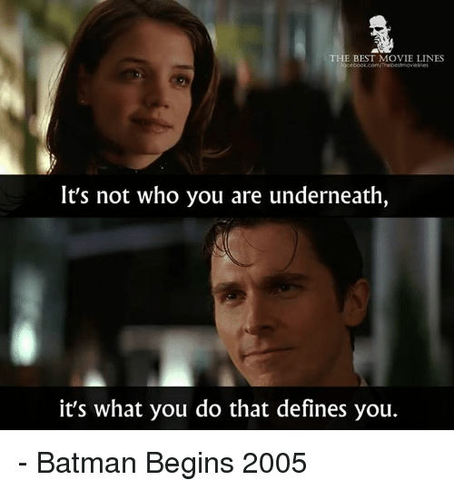
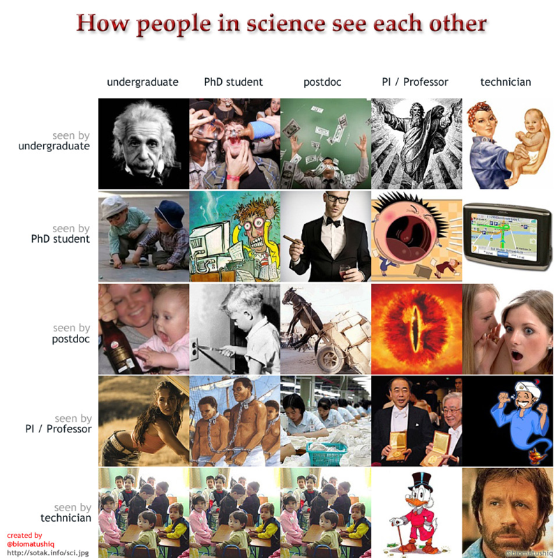
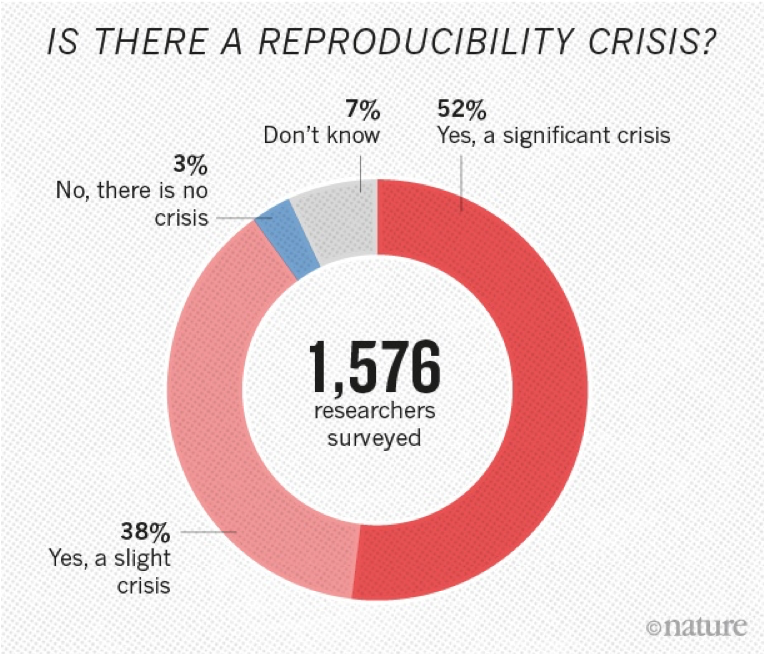

```{r setup, include=FALSE}
knitr::opts_chunk$set(echo = FALSE)
```

# Section 1 : outline

## Outline

- 实力与包装：who i am underneath vs. whom people see in me
- how people in science see each other
- think in English
- think creative

# section 2 : contents

## 信号传递理论：Michael Spence

观察：

- MBA学生在进哈佛大学之前没什么了不起
- 出去就能比教授挣几倍、甚至十几倍的钱
- “这是为什么？”

结论：

- 教育具有信号传递的作用

Michael Spence, "Job Market Signaling", Quarterly Journal of Economics, 1973

2001 Nobel price in Economics


## 信号传递理论：实力与包装

信号传递理论的核心：动态不完全信息对策

1. 发送信息
2. 决策

{height=30%}

## 包装与实力

{height=50%}

## 包装的素材

### 教育经历
  - 名校 
  - 学科
  
### 科研经历
  - 项目
  - 成果
  - 奖项
  
### 个人经历
  - 干部
  - 实习（领域知名企业）
  
## how peolpe in science see each other

{height=50%}

## lessions learned so far

- know your audiences (what they expect from you)
- be useful (in the long run)

## think in English

怎么练习口语和语感？

1. Find a short article that you know every word
2. Read it aloud at a quiet place so that you can hear it
3. Do this everyday for **three years**

## think creative

How?

1. Read a research paper
2. Find three limitations of the research
3. Address these issues with your own ideas
4. Do this once a week for **three years**

## try find your own truth

未经调研，不要轻易相信别人结论，特别是科普文章。

There is a reproducibility crisis in scientific community:

- 70% of researchers failed to reproduce others' experiments
- 50% failed to reproduce their own

{height=30%}

## Concluding remarks

- 有实力、会包装
- 不轻信
- 执着


