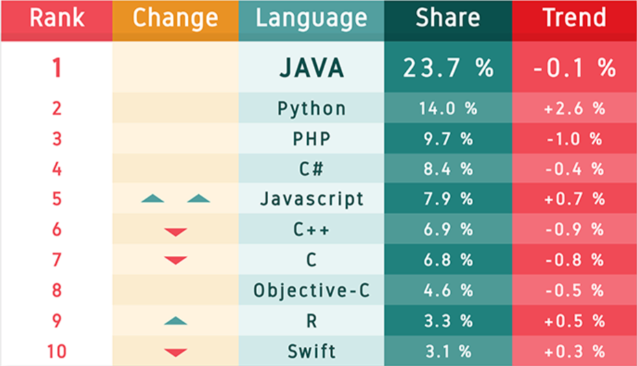
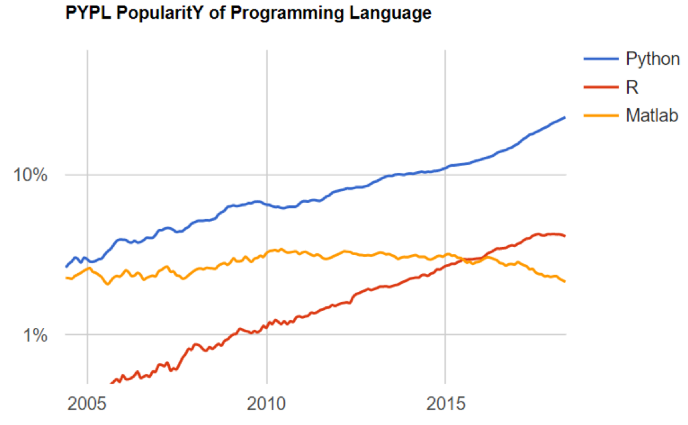
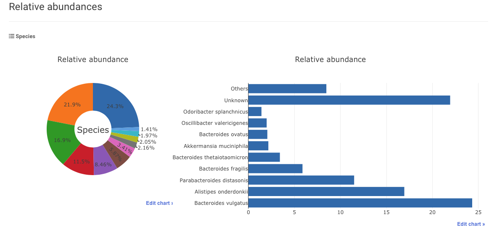
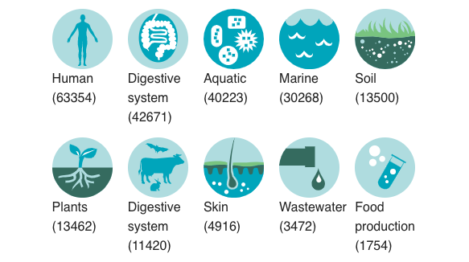
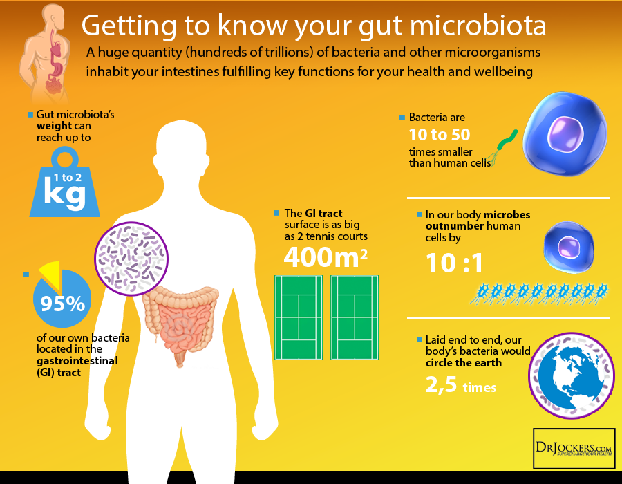

```{r include=FALSE}
color_block = function(color) {
  function(x, options) sprintf('\\color{%s}\\begin{verbatim}%s\\end{verbatim}',
                               color, x)
  
library(tidyverse);
}

## 将错误信息用红色字体显示
knitr::knit_hooks$set(error = color_block('red'))
```


```{r setup, include=FALSE}
knitr::opts_chunk$set(echo = TRUE)
```

# section 1: TOC

## Course contents

1. 开发平台相关软件安装
2. R基础知识
3. 数据处理
4. 做图
5. 常用生信分析任务与解决方法

注：不一定按上面的顺序来

## 技能树

### 前置条件

|  |                 |                  |
|---------------------|-------------------------|----|
| 编程？ |   不需要    |  plus              |
| Linux？ |   不需要    |  plus              |
| 数据处理经历？ |   不需要    |  plus              |
| 数据处理需求 |   需要    |              |


## Class rules

1. 每次随机点名
2. 课堂随机提问
3. 每人2次无理由缺课机会，占平时成绩的一半
4. 考试、平时成绩各占总成绩的50%

注: 严格按以上进行，如多次表现不好，可能会不及格

# section 2: why choose R? 

## R语言简史

1993到2000这段时间R只在小范围内流传。2000年之后开始大爆发，用户数量直线上升。除去R本身的优秀之外，这种爆发与多个因素有关，比如自由软件的兴起，Linux的成熟等等；经济危机也促进大家采用免费的自由软件替代统计领域的传统强者如SPSS、SAS和Matlab等（注：均为收费软件）。

首先，越来越多的学术文章使用R作为分析工具。根据来自著名学术搜索引擎Google Scholar（谷歌学术）的数据，R的流行趋势有以下两个特点：1）在学术领域的市场份额逐年增加，且增势迅猛，2）R是为数不多市场份额增加的统计软件之一。

接下来我们就用R把这个趋势画出来！如下面代码所示，所需代码包括4个部分：装入所需要的包，读取数据，处理数据和作图。运行这段代码，既专业又美观的图片就生成了！

## R的流行性调查

代码
\fontsize{7}{8}\selectfont
```{r warning=FALSE, message=FALSE}
library("ggplot2"); library("reshape2");

dat <- read.csv(file = "data/talk01/chaper01_preface_scholarly_impact_2012.4.9.csv");

cols.subset <- c("Year", "JMP","Minitab","Stata","Statistica","Systat","R");
Subset <- dat[ , cols.subset];
ScholarLong <- melt(Subset, id.vars = "Year");
names(ScholarLong) <- c("Year","Software", "Hits");

plot1 <- 
  ggplot(ScholarLong, aes(Year, Hits, group=Software)) + #准备
    geom_smooth(aes(fill=Software), position="fill", method="loess") + #画图
    ggtitle("Market share") + #设置图标题
    scale_x_continuous("Year") + # 改变X轴标题
    scale_y_continuous("Google Scholar %", labels = NULL ) +
    theme(axis.ticks = element_blank(),  text = element_text(size=14)) + 
    guides(fill=guide_legend( title = "Software",  reverse = F )) + 
    geom_text(data = data.frame( Year = 2011,  Software = "R", Hits = 0.10 ),
              aes(label = Software), hjust = 0, vjust = 0.5);
```


## Market share, result

```{r plot1, fig.width=10, fig.height=5, echo=FALSE, warning=FALSE, message=FALSE }
plot1
```

**注**：这里移除了市场占有率较大的SAS和SPSS

## R的招聘趋势

其次，统计分析相关工作的招聘信息中要求申请者会用R的也越来越多了。根据美国招聘搜索引擎indeed.com的数据，自2005年（此搜索引擎提供的最早数据）起，需要用到R的招聘信息占总体招聘的比例逐年上升，目前仅排在SAS和Matlab之后，处于第3位。而且，除了Stata之外，R是唯一一个占比上升。

同样的，我们用R把这个趋势画出来！

## R job trends

代码
\fontsize{7}{8}\selectfont
```{r warning=FALSE, message=FALSE}
library("ggplot2"); ## 主作图包

##2. -- 读取数据 --
dat <- read.table(file ="data/talk01/chaper01_preface_indeed_com_stats_2015.txt", 
                  header = T, as.is = T);
##3. 处理数据
dat$date <- as.Date(dat$date); ## 把第一列改为日期

#根据job对software进行调整
dat <- transform(dat, software = reorder(software, job)); 

plot2 <-
  ggplot( dat, aes( date, job, group = software, colour = software) ) +
    geom_line( size = 0.8  ) +
    ggtitle("Job trends (data from indeed.com)") + #设置图标题
    xlab("Year") + ylab("%") +
    #改变字体大小;要放在theme_grey()后面  
    theme( text = element_text(size=14) ) + 
    guides(colour=guide_legend( title = "Tool",  reverse = TRUE )) +
    scale_colour_brewer(palette="Set1") + #改变默认颜色
    geom_text(data = dat[dat$date == "2015-01-01" & dat$software %in% c("R"), ], 
              aes(label = software), hjust = 0, vjust = 0.5);
```

## R job trends, plot

```{r plot2,echo=FALSE,fig.width=10, fig.height=5}
plot2;
```

## Programming language trends 2016 vs 2015

{width=70%}

## Popularity by year

{height=50%}

Data from: http://blog.revolutionanalytics.com/2018/06/pypl-programming-language-trends.html
Accessed on: Sep 24, 2018

## Programming languages for bioinformatics

### Perl或Python
- 强大的文本处理能力（包括序列）
- 不错的运行速度（尤其是Python）
- 强大的生信和统计学扩展包（尤其是Python）
- 方便的并行计算

### R
- 强大的格式数据处理能力（二维表格, dplyr）
- 无以伦比的统计学专业性
- 专业而好看的数据可视化软件（ggplot2）
- 专业的生信扩展包（Bioconductor）
- 超级好用的整合开发环境IDE（RStudio）

## 我用过的 programming languages

\begin{columns}
\begin{column}{0.48\textwidth}
\begin{itemize}
\item - C
\item -  \textbf{Perl}
\item -  \textbf{R}
\item -  \textbf{PHP}
\item -  \textbf{Java}
\item -  \textbf{MySQL}
\item -  HTML
\item -  Javascript
\end{itemize}

\href{https://www.evolgenius.info/evolview}{Evolview ver3.0}

cited 95 times in 2018, 75 so far (as of July 19)

\end{column}
\begin{column}{0.48\textwidth}

\begin{figure}
  \includegraphics[width=\linewidth]{images/talk01/evolview_showcase3.png}
  \caption{.Evolview showcase 3}
  \label{fig:evolviewshowcase03}
\end{figure}

\end{column}
\end{columns}


# Section 3: typical applications in metagenomics

## 生信任务1 : 宏基因基因数据展示1 (单样本)

{height=60%}

Find more at the [GMrepo database](https://gmrepo.humangut.info/home).

## 什么是宏基因组？

Metagenomics is the study of genetic material recovered directly from environmental samples. 

### research contents 

- mostly prokaryotes
- unicellular eukaryotes
- viruses

### techniques

- 16S (universially conserved gene in prokaryotes)
- whole genome sequencing (WGS or metagenomics)

## what can metagenomics do?

- identify new species
- reveal species kinds and abundances 
- relate species changes to human health and disease

## biomes

{height=60%}

Screenshot taken from the [EBI metagenomics database](https://www.ebi.ac.uk/metagenomics/) on Aug 8, 2019.

## enviromental microbiome

- soil
- ocean 

{height=50%}

## host associated microbiomes 

- human body sites
- animals & plants 

{height=30%}

## why human gut microbiota is important?

{height=60%}

## tasks of human gut microbiota analysis

- identify new species
- find good, bad and commensal microbes
- link microbial variations to human health
- mechanisms
- modulation, intervention and regulation

## typical human gut microbiome data

Species abundances

\FontSmall

```{r}
abu <- read_delim(file = "data/talk06/relative_abundance_for_RUN_ERR1072629_taxonlevel_species.txt",
                  delim = "\t", quote = "", comment = "#");

nrow(abu);
```

## Species abundances, cont.

\FontSmall

```{r}
abu %>% arrange( desc( relative_abundance ) ) %>% do( head(., n = 10) );
```

## 相对丰度作图要求

1. 按丰度从高到低排序
2. 只取前10个species (保留10行)
3. 将后面的丰度累加在一起，汇总为“Others”分类

## 数据处理

\FontSmall

```{r}
library( tidytidbits );
abu.dat <- 
  abu %>% arrange( desc( relative_abundance ) ) %>% 
    lump_rows( scientific_name, relative_abundance, n = 10, other_level = "Others" );

head(abu.dat, n = 11);
```


## 尝试作图

\FontSmall

```{r fig.height=4, fig.width=10}
ggplot(abu.dat, aes(x = scientific_name, y = relative_abundance, fill = scientific_name ) ) + 
  geom_bar( stat = "identity" ) + 
  coord_flip()
```

## 调整排列顺序

\FontSmall

```{r fig.height=4, fig.width=10}
## 用 forcat 包的 fct_reorder 函数; 注意它3个参数的意义！！！
ggplot(abu.dat, aes(x = fct_reorder( scientific_name, relative_abundance, .desc = F), 
                    y = relative_abundance, fill = scientific_name ) ) + 
  geom_bar( stat = "identity" ) + 
  coord_flip() + xlab("Species") + ylab( "Relative abundance %" ) 
```

## 更多 forcats 的应用 ... 

see here: https://cran.r-project.org/web/packages/forcats/vignettes/forcats.html

更多应用将会在 作图 （ggplot2） 时讲到。

## 生信任务2：宏基因组多样本物种丰度图（多样本）

{height=50%}

## stacked bars , cont.

load data 

\FontSmall 
```{r}
speabu <-read_tsv( file = "data/talk09/mock_species_abundance.txt"  );
head( speabu );
```


## stacked bars , cont.

\FontSmall

```{r fig.width=10, fig.height=4}
ggplot( speabu, aes( x = id, y = abundance, fill = genus ) ) + 
  geom_bar( stat = "identity", position = "stack", color = "black", width = 0.8 );
```

## 指定Genus展示顺序

factor 的操纵详见第4章。

\FontSmall

```{r fig.height=4, fig.width=10}
speabu$genus <- factor( speabu$genus, levels = rev( c( "Enterobacteriaceae", "Lachnospiraceae", "Bacteroidaceae", "Lactobacillaceae", 
       "Clostridiaceae", "Ruminococcaceae", "Prevotellaceae", "Erysipelotrichaceae", "Streptococcaceae", "Enterococcaceae", "Other" ) ) );
ggplot( speabu, aes( x = id, y = abundance, fill = genus ) ) + 
  geom_bar( stat = "identity", position = "stack", color = "black", width = 0.8 );
```

## 按丰度排序

按丰度中值大小排序

\FontSmall

```{r fig.height=4, fig.width=10}
speabu$genus <- reorder( speabu$genus, speabu$abundance, median );
ggplot( speabu, aes( x = id, y = abundance, fill = genus ) ) + 
  geom_bar( stat = "identity", position = "stack", color = "white", width = 0.8 );
```


## ``` position = "stack" ``` 又是什么？？ 

``` position = "dodge" ```  : plot bars next to each other ...

\FontSmall 

``` {r fig.height=4, fig.width=10}
ggplot( speabu, aes( x = id, y = abundance, fill = genus ) ) + 
  geom_bar( stat = "identity", position = "dodge", color = "white", width = 0.8 );
```

## 显示数值  ... 

\FontSmall 

``` {r fig.height=4, fig.width=10}
## 先计算显示位置
speabu <- speabu %>% arrange( id, desc( factor( genus ) ) ) %>% 
  group_by( id ) %>% mutate( ypos = cumsum( abundance ) - abundance / 2 );
## 画图
ggplot( speabu, aes( x = id, y = abundance, fill = genus ) ) + 
  geom_bar( stat = "identity", position = "stack", color = "black", width = 0.8 ) +
  geom_text( aes( y = ypos, label = paste( abundance, "%", sep = "" ) ), color = "white" );
```

## 显示数值  ... , cont. 

**要点** 

* 使用 ``` ddplyr ``` 的 ``` cumsum() ``` 函数 ...
* 计算位置：当前累加值 - 自身值/2，使数字显示在当前值的中间
* 累加前，要对数据按 factors 进行排序；通过 ``` arrange ``` 函数实现；


# section 4: 写在后面

## 课程教材

- all codes are available at Github: https://github.com/evolgeniusteam/R-for-bioinformatics

## 网站链接、参考文献和扩展阅读

综上所述，R已经是最流行的免费统计分析软件，排名仅在几个传统的分析软件之后，而且大有赶超它们的趋势。学好R，不仅有助于在学术研究领域的发展，对找工作也有不少的帮助。

- R的官方网站: http://www.r-project.org
- R档案综合网络，即CRAN(Comprehensive R Archive Network): http://cran.r-project.org/
- ggplot2: http://ggplot2.org/
- RStudio: http://www.rstudio.com/
- 如何从Google Scholar抓取引用数据: http://librestats.com/2012/04/12/statistical-software-popularity-on-google-scholar/
- indeed招聘趋势: www.indeed.com/jobtrends
- R for data science: https://r4ds.had.co.nz (必读！！)
