```{r include=FALSE}
color_block = function(color) {
  function(x, options) sprintf('\\color{%s}\\begin{verbatim}%s\\end{verbatim}',
                               color, x)
}

## 将错误信息用红色字体显示
knitr::knit_hooks$set(error = color_block('red'))
```

```{r setup, include=FALSE}
knitr::opts_chunk$set(echo = TRUE)
```

# section 1: TOC

## Course contents

1.  开发平台相关软件安装
2.  R基础知识
3.  数据处理
4.  做图
5.  常见组学数据和分析、可视化方法
6.  机器学习在组学分析当中的应用

## 机器学习（重点新增内容）

### 内容

-   基础知识

-   应用示例

### 现有工作介绍

-   宁康：人工智能赋能菌群大数据挖掘
-   郭安源：表达数据分析
-   薛宇：机器学习在新冠标志物和图像识别当中的应用
-   陈卫华：机器学习在肠道菌群为基础的疾病标志物挖掘当中的应用

## 宁康

{width="80%"}

[SOHU页面](https://www.sohu.com/a/438990464_185627)

## 郭安源

{width="60%"}

截止2022年8月30日，已被引用321次 (Google Scholar)

## 薛宇

{width="60%"}

机器学习在新冠标志物和图像识别当中的应用

## 陈卫华

{width="60%"}

机器学习在肠道菌群为基础的疾病标志物挖掘当中的应用

## 用肠道菌群profile一次诊断多种疾病

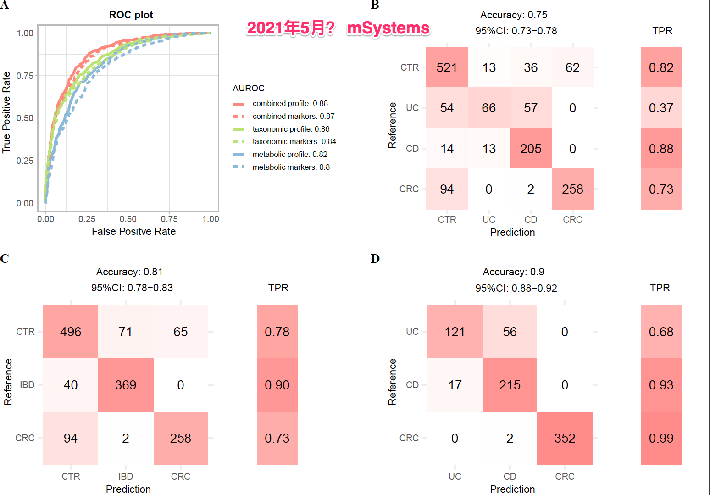{width="65%"}

诊断多种常见肠病的机器学习模型

## 身体各部位菌群与疾病关系数据库

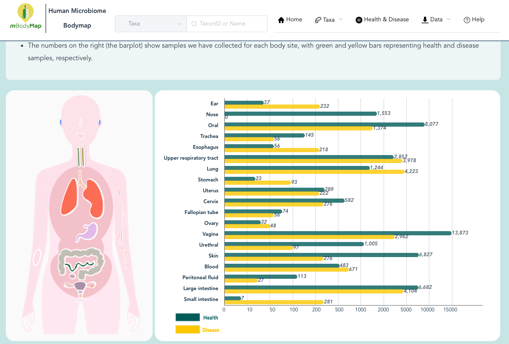{width=65%}

重点关注（面部）皮肤。与刘智老师合作课题

## 其它动物的肠道菌群

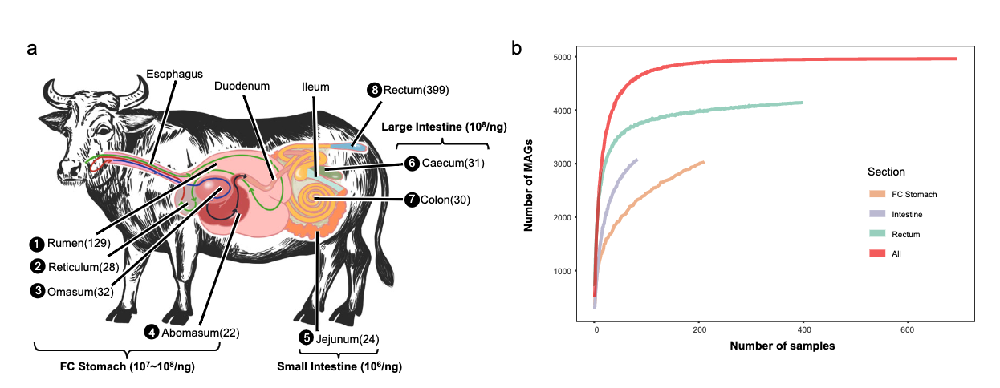{width=100%}

## 噬菌体研究

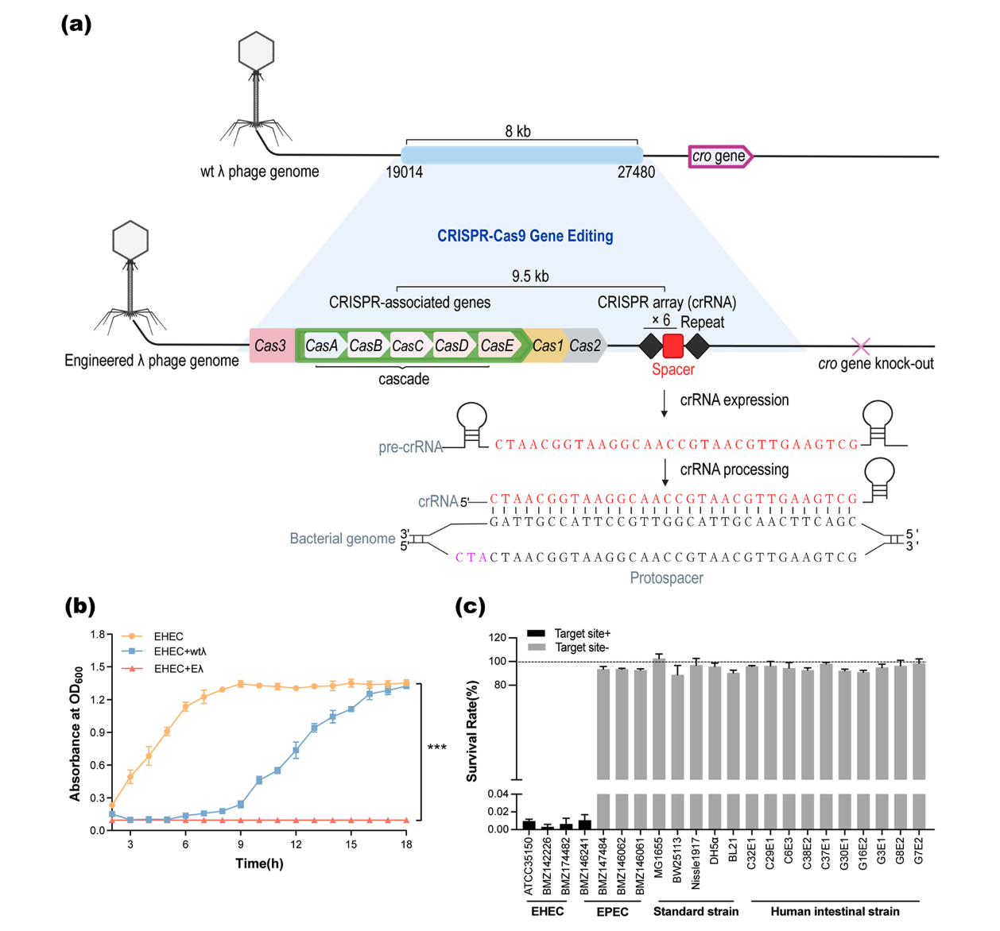{width=60%}

改造噬菌体，增强其杀伤能力和特异性。

## Class rules

1.  每次随机点名
2.  课堂随机提问
3.  每人有1次无理由缺课机会
4.  考试、平时成绩各占总成绩的50%

注: 严格按以上进行，如多次表现不好，可能会不及格

## 作业和扣分规则

1. （几乎）每次课后都有作业；
2. 直接从平时成绩50分中扣除；
2. 作业迟交三天以内每次扣3分；七天以内每次5分；七天及以上每次10分；
3. 每人有一次迟交机会（3天以内），不扣分。
4. 老师有最终解释权

## 考试

1. 开卷；允许带资料、书籍，不允许带手机电脑pad等电子设备
2. 内容都在**ppt**上或**作业**里，不会超纲
3. 考试时允许零星英文，但不允许大段英文（抄ppt）
4. 老师有最终解释权

# section 2: why choose R?

## R语言简史

1993到2000这段时间R只在小范围内流传。2000年之后开始大爆发，用户数量直线上升。除去R本身的优秀之外，这种爆发与多个因素有关，比如自由软件的兴起，Linux的成熟等等；经济危机也促进大家采用免费的自由软件替代统计领域的传统强者如SPSS、SAS和Matlab等（注：均为收费软件）。

首先，越来越多的学术文章使用R作为分析工具。根据来自著名学术搜索引擎Google
Scholar（谷歌学术）的数据，R的流行趋势有以下两个特点：1）在学术领域的市场份额逐年增加，且增势迅猛，2）R是为数不多市场份额增加的统计软件之一。

接下来我们就用R把这个趋势画出来！如下面代码所示，所需代码包括4个部分：装入所需要的包，读取数据，处理数据和作图。运行这段代码，既专业又美观的图片就生成了！

## R的流行性调查

代码 \fontsize{7}{8}\selectfont

```{r warning=FALSE, message=FALSE}
library("ggplot2"); library("reshape2");

dat <- read.csv(file = "data/talk01/chaper01_preface_scholarly_impact_2012.4.9.csv");

cols.subset <- c("Year", "JMP","Minitab","Stata","Statistica","Systat","R");
Subset <- dat[ , cols.subset];
ScholarLong <- melt(Subset, id.vars = "Year");
names(ScholarLong) <- c("Year","Software", "Hits");

plot1 <- 
  ggplot(ScholarLong, aes(Year, Hits, group=Software)) + #准备
    geom_smooth(aes(fill=Software), position="fill", method="loess") + #画图
    ggtitle("Market share") + #设置图标题
    scale_x_continuous("Year") + # 改变X轴标题
    scale_y_continuous("Google Scholar %", labels = NULL ) +
    theme(axis.ticks = element_blank(),  text = element_text(size=14)) + 
    guides(fill=guide_legend( title = "Software",  reverse = F )) + 
    geom_text(data = data.frame( Year = 2011,  Software = "R", Hits = 0.10 ),
              aes(label = Software), hjust = 0, vjust = 0.5);
```

## Market share, result

```{r plot1, fig.width=10, fig.height=5, echo=FALSE, warning=FALSE, message=FALSE }
plot1
```

**注**：这里移除了市场占有率较大的SAS和SPSS

## R的招聘趋势

其次，统计分析相关工作的招聘信息中要求申请者会用R的也越来越多了。根据美国招聘搜索引擎indeed.com的数据，自2005年（此搜索引擎提供的最早数据）起，需要用到R的招聘信息占总体招聘的比例逐年上升，目前仅排在SAS和Matlab之后，处于第3位。而且，除了Stata之外，R是唯一一个占比上升。

同样的，我们用R把这个趋势画出来！

## R job trends

代码 \fontsize{7}{8}\selectfont

```{r warning=FALSE, message=FALSE}
library("ggplot2"); ## 主作图包

##2. -- 读取数据 --
dat <- read.table(file ="data/talk01/chaper01_preface_indeed_com_stats_2015.txt", 
                  header = T, as.is = T);
##3. 处理数据
dat$date <- as.Date(dat$date); ## 把第一列改为日期

#根据job对software进行调整
dat <- transform(dat, software = reorder(software, job)); 

plot2 <-
  ggplot( dat, aes( date, job, group = software, colour = software) ) +
    geom_line( size = 0.8  ) +
    ggtitle("Job trends (data from indeed.com)") + #设置图标题
    xlab("Year") + ylab("%") +
    #改变字体大小;要放在theme_grey()后面  
    theme( text = element_text(size=14) ) + 
    guides(colour=guide_legend( title = "Tool",  reverse = TRUE )) +
    scale_colour_brewer(palette="Set1") + #改变默认颜色
    geom_text(data = dat[dat$date == "2015-01-01" & dat$software %in% c("R"), ], 
              aes(label = software), hjust = 0, vjust = 0.5);
```

## R job trends, plot

```{r plot2,echo=FALSE,fig.width=10, fig.height=5}
plot2;
```

## Popularity of Programming language 2020

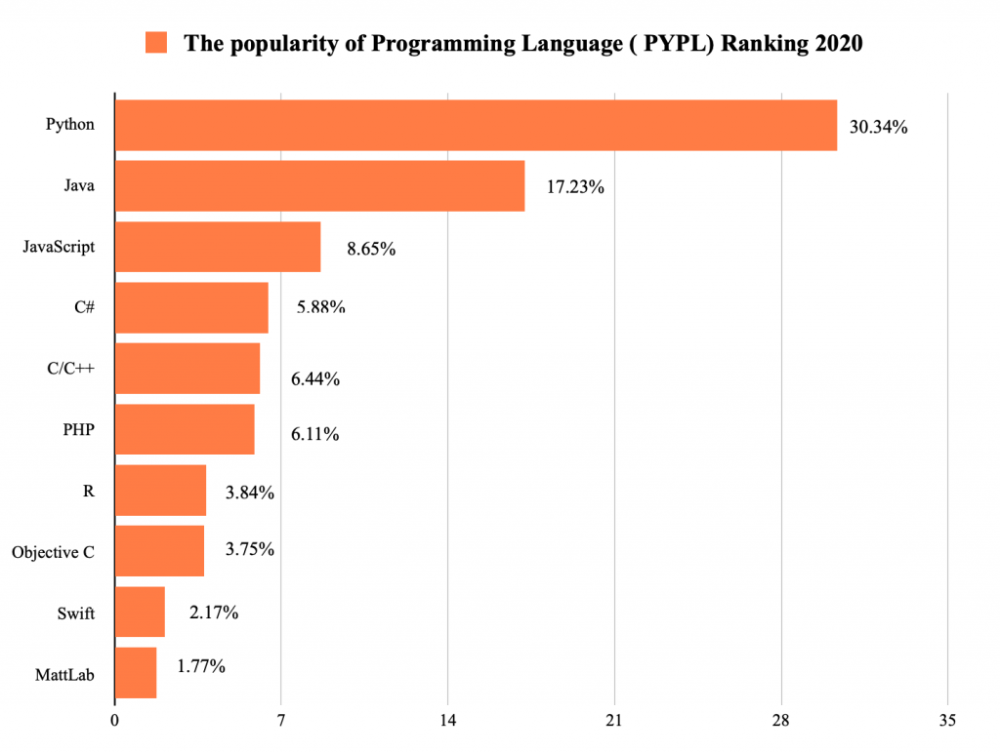{width="70%"}

## Programming languages for bioinformatics

### Perl或Python

-   强大的文本处理能力（包括序列）
-   不错的运行速度（尤其是Python）
-   强大的生信和统计学扩展包（尤其是Python）
-   方便的并行计算

### R

-   强大的格式数据处理能力（二维表格, dplyr）
-   无以伦比的统计学专业性
-   专业而好看的数据可视化软件（ggplot2）
-   专业的生信扩展包（Bioconductor）
-   超级好用的整合开发环境IDE（RStudio）

## 我用过的 programming languages

```{=tex}
\begin{columns}
\begin{column}{0.48\textwidth}
\begin{itemize}
\item - C
\item -  \textbf{Perl}
\item -  \textbf{R}
\item -  \textbf{PHP}
\item -  \textbf{Java}
\item -  \textbf{MySQL}
\item -  HTML
\item -  Javascript
\end{itemize}

\href{https://www.evolgenius.info/evolview}{Evolview ver3.0}

cited 225 times in 2021 (ver2+3), 166 so far (as of Aug 30, 2022)

\end{column}
\begin{column}{0.48\textwidth}

\begin{figure}
  \includegraphics[width=\linewidth]{images/talk01/evolview_showcase3.png}
  \caption{.Evolview showcase 3}
  \label{fig:evolviewshowcase03}
\end{figure}

\end{column}
\end{columns}
```
## 网站链接、参考文献和扩展阅读

综上所述，R已经是最流行的免费统计分析软件，排名仅在几个传统的分析软件之后，而且大有赶超它们的趋势。学好R，不仅有助于在学术研究领域的发展，对找工作也有不少的帮助。

-   R的官方网站: <http://www.r-project.org>
-   R档案综合网络，即CRAN(Comprehensive R Archive Network):
    <http://cran.r-project.org/>
-   ggplot2: <http://ggplot2.org/>
-   RStudio: <http://www.rstudio.com/>
-   如何从Google Scholar抓取引用数据:
    <http://librestats.com/2012/04/12/statistical-software-popularity-on-google-scholar/>
-   indeed招聘趋势: www.indeed.com/jobtrends
-   R for data science: <https://r4ds.had.co.nz> (必读！！)

# Section 3: setting up working enviroment

## Install R

Go go <https://mirrors.tuna.tsinghua.edu.cn/CRAN/>
(清华镜像)，R支持主流的操作系统包括Linux，Windows和MacOS，请根据操作系统下载对应的安装文件。如下图所示：

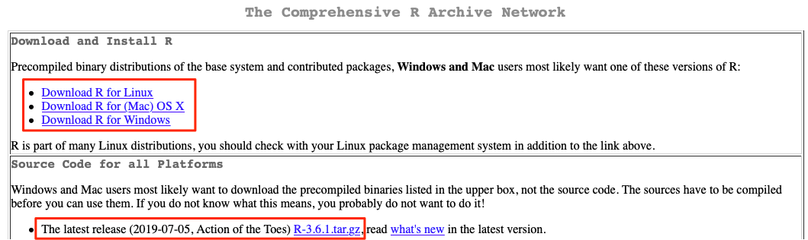{width="80%"}

新版本的Mac OS
X还需要安装XQuartz(<http://xquartz.macosforge.org/landing/>)。某些还需要用到Xcode，可以从App
Store免费安装。

## Install R on Linux

目前大多Linux发行版都带有R，因此可直接使用。从CRAN下载文件进行安装稍嫌复杂，要求用户对Linux系统有一定的了解，而且需要有管理员权限。建议初级用户在Linux高手指导下安装。
点击上图中的"Download R for
Linux"后，发行版为Redhat（红帽）或Suse的用户要先阅读网站上提供的readme或readme.html文件，然后其中的指示进行安装。这里就不再累述了。

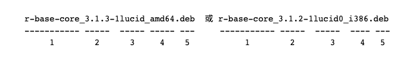{width="80%"}

## R studio

RStudio可以从http://www.rstudio.com/products/rstudio/download/下载，支持等主流的操作系统。

{height="50%"}

## R studio versions

RStudio 有商业和免费版本；也有server版 {width="100%"}

## R studio, cont.

RStudio运行时的界面如下图所示，除了顶部的菜单栏工具栏之外，主界面还包括4个子窗口：

{width="355"}

## R studio, cont.

### 1. 代码编辑器

-   具有代码编辑、语法高亮、代码和变量提示、代码错误检查等功能
-   选中并向R控制台（窗口2）发送并运行代码。用快捷键Ctrl+Enter（MacOS下是Cmd+Enter）进行代码发送。没有代码选中时，发送光标所在行的代码
-   可同时打开编辑多个文件
-   除R代码外，还支持C++、R MarkDown、HTML等其它文件的编辑
-   也可用于显示数据

### 2. R console

-   可在此直接输入各种命令并查看运行结果。支持代码提示

### 3. 变量列表及代码运行的历史记录

## R studio, cont.

### 4. 其它窗口

-   当前工作目录下的文件列表
-   作图结果
-   可用和已安装的扩展包；在这里可以直接安装新的和升级已有的扩展包
-   帮助

注意，子窗口之间可以通过快捷键 Ctr+子窗口编号 进行切换。如 Ctrl+1
可以切换到代码编辑子窗口， Ctrl+2 则切换到R控制台。

### 其它特点

-   创建、管理 projects

## R studio 特点详解

### 代码提示/自动完成

**子窗口1和2**都提供有代码提示功能，即：用户输入3个字母时，RStudio会列出所有前3个字母相同的变量或函数名供用户选择；用户可通过键盘的上下键选择，然后用Enter（回车）选定，非常方便。
变量或函数名前面的小图标表示了它们的类型；如果当前高亮的是函数，RStudio还会显示其部分帮助内容。

{height="20%"}

## R studio 特点详解, cont.

### 查看变量内容

**子窗口3**内会列出所有当前使用的变量、变量的类型以及大小，如下图：

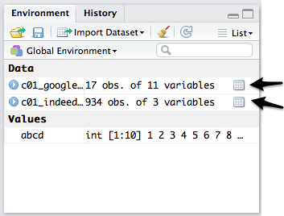{height="20%"}

有些简单变量，如数组，RStudio会直接显示其部分值；对于复杂一些的变量，比如data.frame（类似于二维表格），则可以点击变量名前边的小三角标识展开其内容。
当变量的最右侧出现小网格状图标时（如上图箭头所指位置），点击它们后可以在子窗口2内察看。

## R studio 特点详解, cont.

### 导出作图并选择导出格式

RStudio的**第4子窗口**里集中了许多有用的功能，组织在不同的'Tab'（标签）内。比如作图（plots），不仅可以察看画图的结果，还可以导出当前图像至硬盘，或拷贝至剪贴板；如下图所示。支持导出格式有png和pdf。

{height="30%"}

## R studio 特点详解, cont.

### 查看已安装的**包**

通过**第4子窗口**的"包"（Packages）标签内的工具，用户可以很方便的查看已安装的包：

{height="30%"}

## install new package(s)

同样通过**第4子窗口**的"包"（Packages）标签内的工具，安装新的包：

{height="50%"}

## Packages needed for this study

大部分包都由 RStudio
公司提供；包括：ggplot2，tidyr，readr，stringr等。可以用以下命令一次性安装。不过，为方便读者直接从后面章节阅读，在每一次使用新包时，我们会再次进行提示安装方法。

\FontSmall

```{r eval=FALSE}
install.packages( c("ggplot2", "tidyr", "readr", "stringr") );
```

\FontNormal

也可以单独安装：

\FontSmall

```{r eval=FALSE}
install.packages( "ggplot2" ); #安装作图用的ggplot2
install.packages( "tidyr" ); # 数据处理用等
```

\FontNormal

第一次运行命令 install.packages()
时，系统会提示选择镜像网站；请选择地理位置上距你最近的镜像（比如中国）。

## install packages, cont.

You can also choose your CRAN mirror manually (recommended when
installing takes a long time):

\FontSmall

```{r eval=FALSE}
chooseCRANmirror();
```

\FontNormal

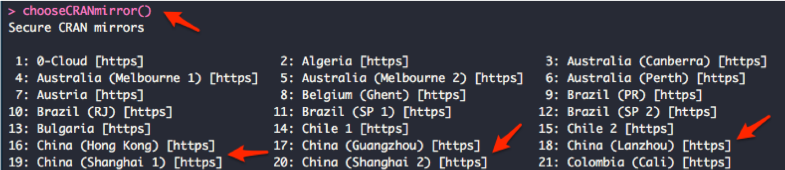{height="40%"}

You can also use `chooseBioCmirror();` to choose mirror for
[BioConductor](https://bioconductor.org/) packages.

## Packages needed for this study, cont.

实际上，以上包属于一个meta-package，我们只需要安装它就可以了：

\FontSmall

```{r eval=FALSE}
install.packages("tidyverse")
```

\FontNormal

它是以下包的集合，都由 <https://www.tidyverse.org> 开发：

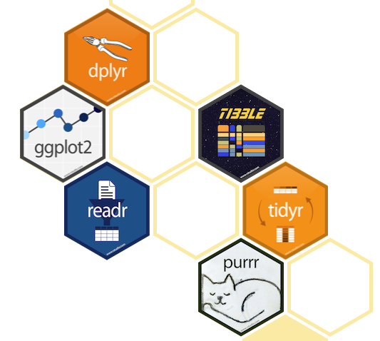{width="43%"}

## R studio server

### 特点：

-   在服务器上安装，使用服务器的强大计算资源
-   通过网页登录，使用服务器帐号密码（方便，安全）
-   一直运行

{height="30%"}

## R studio server, cont.

{width="100%"}

## R studio packages for data science

### all part of (业界良心) tidyverse

-   dplyr: 强大且方便的数据处理
-   tydyr：数据转换工具
-   readr：方便的文件IO
-   stringr：文本处理
-   Tibble：代替 data.frame 的 下一代数据存储格式
-   purr：（暂时还未用到的包 \~\~ ）

## R studio packages for data visualisation

### tidyverse

-   ggplot2：专业好用（但学习曲线很陡）的画图工具

    -   <http://ggplot2.tidyverse.org>
    -   gallery: <http://www.ggplot2-exts.org/gallery/>

{width="42%"}

## RStudio packages for data visualisation, cont.

### ggvis (currently ver0.4): <http://ggvis.rstudio.com>

-   from the **ggplot2** team
-   create interactive graphics in RStudio and web browser
-   [top 50 ggplot2
    visualisations](http://r-statistics.co/Top50-Ggplot2-Visualizations-MasterList-R-Code.html)

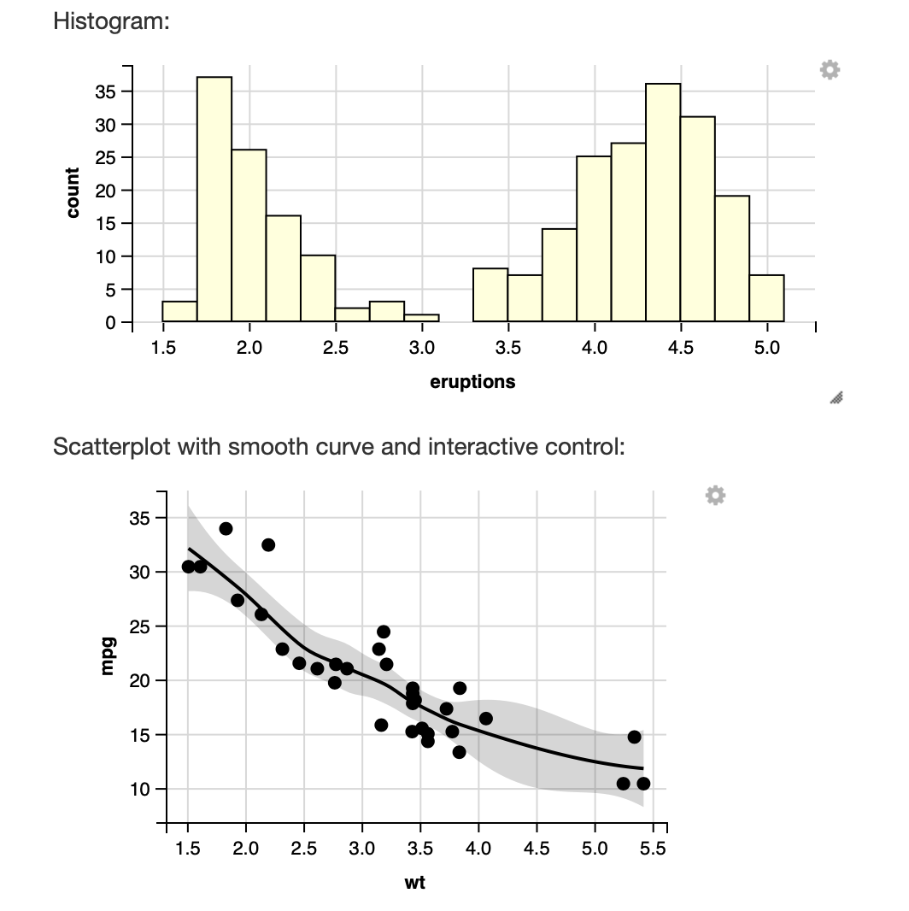{width="40%"}

## RStudio packages for data visualisation, cont.

### Shiny: <http://shiny.rstudio.com/gallery/>

-   build professional, interactive visualizations
-   equipped with popular web widgets
-   can be deployed as independent websites

{height="30%"}

## RStudio packages for data visualisation, cont.

### other packages

-   rmarkdown : create professional documents
-   knitr: convert rmarkdown to pdf, html and more ...

# Section 4: 如何做**作业**?

## Windows用户

  * 最好新建一个英文帐户，用户名只包括英文字符，比如姓名全拼或英文名： `WeihuaChen` or `JackMa`
  * 尽量**不要**更改当前用户，以免数据丢失
  * 将以下软件安装到默认目录，包括 **R** and **RStudio** 


## HOWGO: 完成**作业**并**提交**?

首先，安装必要软件

* R 4.0 or newer
* RStudio 最新版 

其次，安装 `tinytex` 包，辅助将 Rmd 文件转为 PDF

```{r eval=FALSE}
tinytex::install_tinytex(version = "latest"); ## 安装 tinytex
```

如果出现错误，可以先下载 `TinyTex.zip` 文件，在R中运行：

下载页面：https://github.com/rstudio/tinytex-releases，下载 precompiled `TinyTex.zip` （找到对应的平台）。

```{r eval=FALSE}
tinytex:::install_prebuilt("/path/to/TinyTex.zip");
```

## HOWGO: 完成**作业**并**提交**? 续

第三，安装 Github Desktop 

* 安装Github Desktop 并登入，如无帐户，则先创建；

* 在浏览器打开网址：https://github.com/evolgeniusteam/R-for-bioinformatics

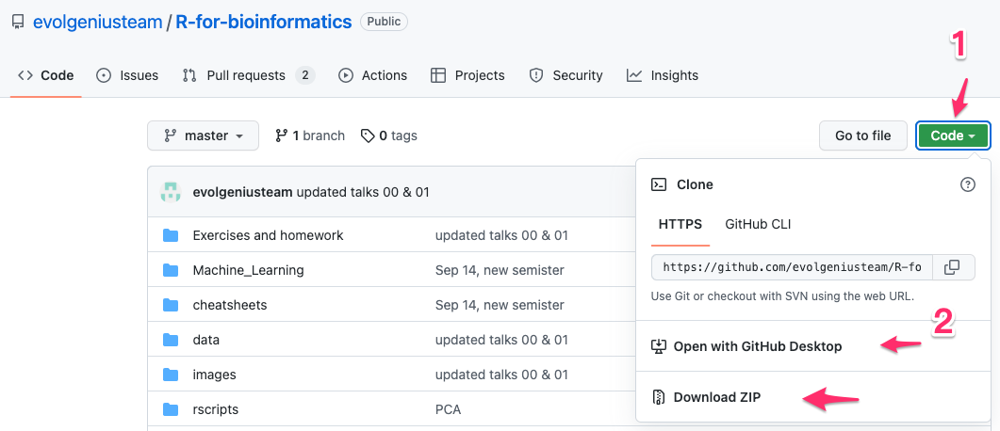{height="50%"}


## HOWGO: 完成**作业**并**提交**? 续

第四步，通过Github Desktop 下载教程和作业

* 下载到默认或指定目录
* 打开下载的目录，找到 `R for bioinformatics 讲义.Rproj` 文件，双击用`RStudio`打开

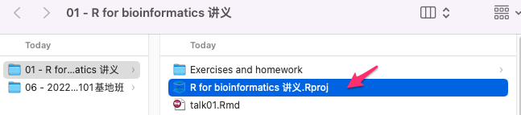{height="30%"}

## HOWGO: 完成**作业**并**提交**? 续

{height="80%"}

## HOWGO: 完成**作业**并**提交**? 续

*按`Rmd`文件的要求回答问题或/和提供代码

* Install required packages
  * 比如：**tidyverse**

* 完成作业

* 用工具栏中的 `Knit` 按钮生成与 `Rmd` 同名的 `PDF` 文件, 将文件名改为：`姓名-学号-talk##作业.pdf`

* 通过`钉钉`，在规定的时间内提交

* 现场演示 ... 

# Section 5: other tools used in our group

## Database tools

-   MySQL
-   phpmyadmin

{height="40%"}

## Database tools, cont.

{height="50%"}

## other tools

### programming languages

-   R
-   Python
-   Perl

### code depository

-   Github
-   Github desktop
-   Atom (general-purpose text editor and more)

### web development

-   AngularJS
-   Vue.js
-   Bootstrap
-   plot.ly (interactive visualisation)

## An example: cross-talking among tools

Here I use the following to show how we process data in our lab:

\FontSmall

```{r message=FALSE}
library(RMySQL); 
library(dplyr);

mysql.dbname = "r4ds_test";
dbCon <- dbConnect(MySQL(), user="r4ds", password="r4ds", 
                   dbname=mysql.dbname,
                   unix.socket="/Applications/XAMPP/xamppfiles/var/mysql/mysql.sock");

dat <- dbGetQuery(dbCon, "SELECT * FROM grades");

## -- 任务： 为每个人计算：平均成绩、上课总数、及格门数、不及格门数
stats <- dat %>% group_by(name) %>% 
  summarise( avg_grade = mean(grade), count = n(), 
             passed = sum(  grade >= 60  ), failed = sum( grade  < 60  ) ) %>% 
  arrange( -avg_grade );
```

## Show the data

```{r dat, message=FALSE, warning=FALSE, echo=FALSE}
## -- 显示原始数据 --
knitr::kable(dat);
```

## and show the results

```{r stats, message=FALSE, warning=FALSE, echo=FALSE}
## 显示计算结果
knitr::kable(stats);
```

# section 6: Concluding remarks & 作业

## Concluding remarks

### 本期回顾

-   生信分析必备编程语言
-   强大、专业又好用
-   RStudio及其众多扩展包
-   To be continued

### 下期预告

* 数字和字符串
* 整数、小数、逻辑
* 数据类型之间转换；自动规则
* ```matrix```

### About the course

-   all codes are available at Github:
    <https://github.com/evolgeniusteam/R-for-bioinformatics>

### important
* all codes are available at Github: https://github.com/evolgeniusteam/R-for-bioinformatics

## 作业

-   ```Exercises and homework``` 目录下 ```talk01-homework.Rmd``` 文件；
- 完成时间：见钉群的要求
