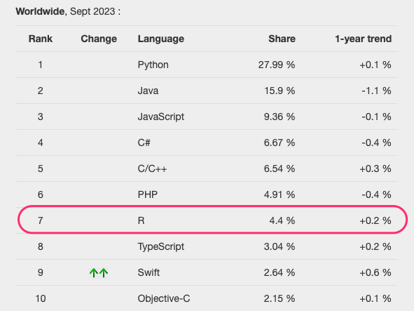
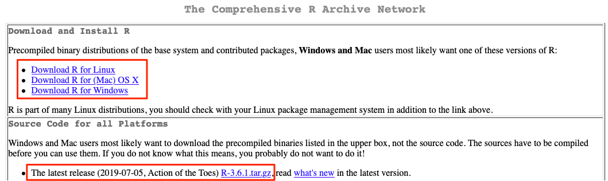
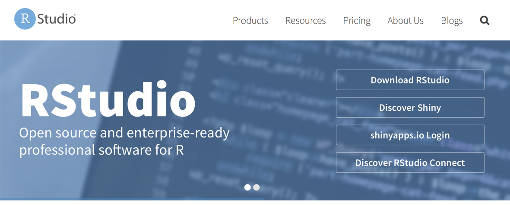
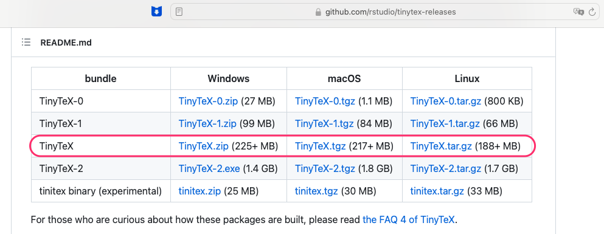
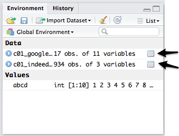
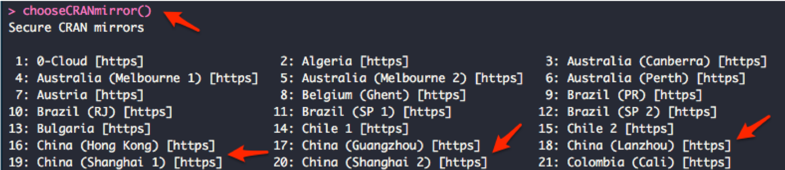
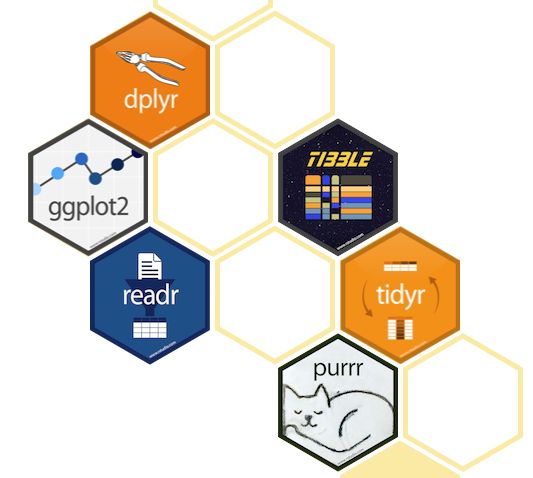
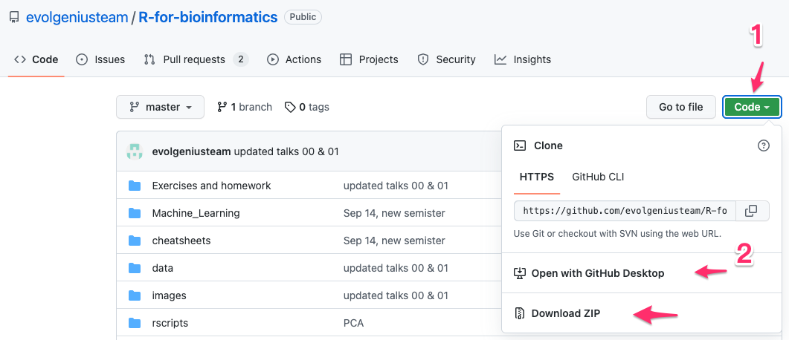
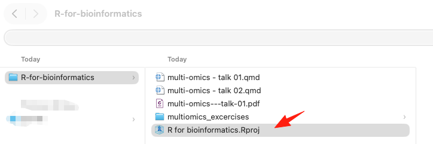
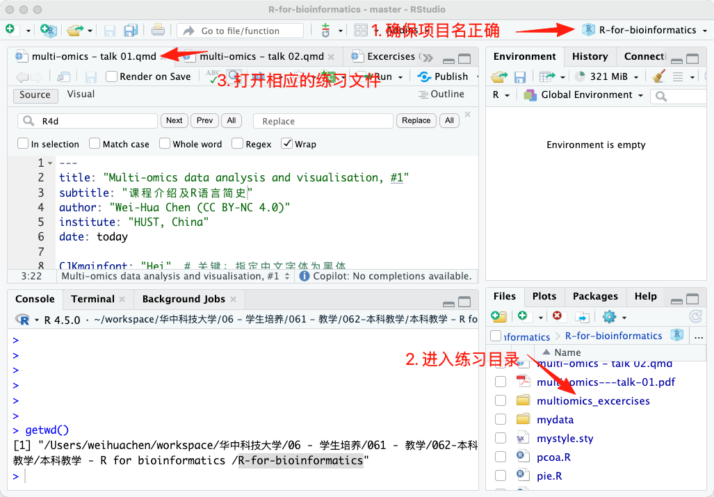

# section 1: 课程介绍

## 课程

- 《生物医学数据分析与作图》课程
- 生物医药及高端医疗设备专项系列课程之一
- 适合对象：生物信息学、计算生物学、统计学、数据科学等相关专业的研究生和本科高年级学生
- 课程目标：掌握生物医学数据分析与可视化的基本技能

## 课程内容

1.  课程介绍
2.  安装软件及 IDE (intergrated development environment)
3.  R 基础
4.  数据处理 (with dplyr and tidyr)
5.  数据可视化 (with ggplot2)
6.  组学数据分析
7.  机器学习及其在组学分析中的应用
8.  Case studies

## 练习与作业

1. 每次课后都有练习/作业
2. 作业为 Rmarkdown 格式 (.Rmd)
3. （如需提交作业） RMD 文件需转化为 PDF 格式进行提交

# section 2: R语言简史

## R语言简史

- R语言由新西兰奥克兰大学的Ross Ihaka和Robert Gentleman于1993年开发，现由R核心团队（R Core Team）维护和更新。R语言的名称来源于两位创始人名字的首字母，同时也暗示了其与S语言的渊源（S语言是贝尔实验室开发的一种统计编程语言，R语言在设计上受到了S语言的启发）。

- R语言是一种开源编程语言，任何人都可以免费下载和使用。

- 1993 - 2000：小范围内流传时期；

- 2000年后：大爆发期。

## R语言简史, cont.

### R语言成功的外在因素：

  - 自由软件的兴起；
  - Linux的成熟；
  - 经济危机；

### R 语言成功的内在因素：

  - R语言功能强大，适用于各种统计分析和数据可视化任务。
  - R语言拥有丰富的扩展包生态系统，用户可以根据需要安装各种功能包来扩展R的功能。
  - R语言具有良好的社区支持，用户可以通过论坛、邮件列表和社交媒体等渠道获取帮助和交流经验。

## R语言示例1：R的流行性调查

- 任务：调查R语言在学术研究中的流行程度
- 数据：使用Google Scholar（谷歌学术）数据分析R语言在学术文章中的引用情况（2012及以前）
- 方法：使用R语言进行数据处理和可视化

## R的流行性调查, cont. 

代码 \footnotesize

```{r warning=FALSE, message=FALSE}
library("ggplot2"); library("reshape2");

dat <- read.csv(file = "data/talk01/chaper01_preface_scholarly_impact_2012.4.9.csv");

cols.subset <- c("Year", "JMP","Minitab","Stata","Statistica","Systat","R");
Subset <- dat[ , cols.subset];
ScholarLong <- melt(Subset, id.vars = "Year");
names(ScholarLong) <- c("Year","Software", "Hits");

plot1 <- 
  ggplot(ScholarLong, aes(Year, Hits, group=Software)) + #准备
    geom_smooth(aes(fill=Software), position="fill", method="loess") + #画图
    ggtitle("Market share") + #设置图标题
    scale_x_continuous("Year") + # 改变X轴标题
    scale_y_continuous("Google Scholar %", labels = NULL ) +
    theme(axis.ticks = element_blank(),  text = element_text(size=14)) + 
    guides(fill=guide_legend( title = "Software",  reverse = F )) + 
    geom_text(data = data.frame( Year = 2011,  Software = "R", Hits = 0.10 ),
              aes(label = Software), hjust = 0, vjust = 0.5);
```

## R的流行性调查, 结果 

```{r plot1, fig.width=10, fig.height=4.5, echo=FALSE, warning=FALSE, message=FALSE }
plot1
```

**结论**：R（统计学软件中）的市场份额逐年上升；2000是其流行的拐点。

## R语言示例1：R的招聘趋势

- 任务：调查统计分析工作岗位对R语言的要求；
- 数据：来自美国招聘搜索引擎indeed.com（2015年以前）
- 方法：使用R语言进行数据处理和可视化

## R job trends, cont. 

\footnotesize

```{r warning=FALSE, message=FALSE}
library("ggplot2"); ## 主作图包
##2. -- 读取数据 --
dat <- read.table(file ="data/talk01/chaper01_preface_indeed_com_stats_2015.txt", 
                  header = T, as.is = T);
##3. 处理数据
dat$date <- as.Date(dat$date); ## 把第一列改为日期
#根据job对software进行调整
dat <- transform(dat, software = reorder(software, job)); 
plot2 <-
  ggplot( dat, aes( date, job, group = software, colour = software) ) +
    geom_line( size = 0.8  ) +
    ggtitle("Job trends (data from indeed.com)") + #设置图标题
    xlab("Year") + ylab("%") +
    #改变字体大小;要放在theme_grey()后面  
    theme( text = element_text(size=14) ) + 
    guides(colour=guide_legend( title = "Tool",  reverse = TRUE )) +
    scale_colour_brewer(palette="Set1") + #改变默认颜色
    geom_text(data = dat[dat$date == "2015-01-01" & dat$software %in% c("R"), ], 
              aes(label = software), hjust = 0, vjust = 0.5);
```

## R job trends, plot

```{r plot2,echo=FALSE,fig.width=10, fig.height=5}
plot2;
```

**总结**： 需要用到R的招聘信息占总体招聘的比例逐年上升，目前仅排在SAS和Matlab之后，处于第3位。而且，除了Stata之外，R是唯一一个占比上升。

## Popularity of Programming language 2023

{width="70%"}

## PYPL 2025

{width="70%"}

## 生物医学数据分析所需的编程语言

### Python

-   强大的文本处理能力（包括序列）
-   不错的运行速度
-   强大的生信和统计学扩展包
-   方便的并行计算

### R

-   强大的格式数据处理能力（二维表格, dplyr）
-   无以伦比的统计学专业性
-   专业而好看的数据可视化软件（ggplot2）
-   专业的生信扩展包（Bioconductor）
-   超级好用的整合开发环境IDE（RStudio）

## 网站链接、参考文献和扩展阅读

综上所述，R已经是最流行的免费统计分析软件，排名仅在几个传统的分析软件之后，而且大有赶超它们的趋势。学好R，不仅有助于在学术研究领域的发展，对找工作也有不少的帮助。

-   R的官方网站: <http://www.r-project.org>
-   R档案综合网络，即CRAN(Comprehensive R Archive Network):
    <http://cran.r-project.org/>
-   ggplot2: <http://ggplot2.org/>
-   RStudio: <https://posit.co/products/open-source/rstudio/>
-   如何从Google Scholar抓取引用数据:
    <http://librestats.com/2012/04/12/statistical-software-popularity-on-google-scholar/>
-   indeed招聘趋势: www.indeed.com/jobtrends
-   R for data science: <https://r4ds.had.co.nz> (必读！！)

# Section 3: 安装软件及开发环境（IDE）

## 本节概览

1.   安装R
2.   安装RStudio （集成开发环境IDE）
3.   安装`扩展包`
4.   安装 TinyTex （作业和练习用）

## 1. Install R

Go go <https://mirrors.tuna.tsinghua.edu.cn/CRAN/>
(清华镜像)，R支持主流的操作系统包括Linux，Windows和MacOS，请根据操作系统下载对应的安装文件。如下图所示：

{width="80%"}

新版本的Mac OS
X还需要安装XQuartz(<http://xquartz.macosforge.org/landing/>)。某些还需要用到Xcode，可以从App
Store免费安装。

## 1. Install R on Linux

- 大多Linux发行版都带有R，可直接使用
- 从命令行安装
  - 对于基于Debian的发行版（如Ubuntu），使用以下命令安装R：

    ```bash
    sudo apt-get update
    sudo apt-get install r-base
    ```

  - 对于基于Redhat的发行版（如CentOS），使用以下命令安装R：

    ```bash
    sudo yum install R
    ```

## 1. Install R on Linux, cont.

- 从源代码编译安装
  - 下载R的源代码包（tar.gz格式）；
  - 解压缩源代码包；
  - 进入解压后的目录，运行以下命令进行编译和安装：

    ```bash
    ./configure
    make
    sudo make install
    ```

## 2. 安装 R studio

{height="60%"}

RStudio 从 https://posit.co/downloads/ 下载，支持等主流的操作系统。有商业和免费版本；也有server版

## 3. 安装`扩展包`

- R语言的强大功能很大程度上依赖于其丰富的`扩展包` (package) 生态系统
- CRAN（Comprehensive R Archive Network）是R语言的主要扩展包存储库，包含了数以千计的扩展包，用户可以根据需要安装和使用这些包
- Bioconductor是一个专门用于生物信息学和计算生物学的R扩展包存储库，提供了大量用于基因组学、转录组学、蛋白质组学等领域的分析工具

## 3. 安装 扩展包, cont.

- 安装扩展包的基本命令是 `install.packages("package_name")`，其中 `package_name` 是要安装的包的名称
- 例如，要安装 `ggplot2` 包，可以运行以下命令：
```{r eval=FALSE}
install.packages("ggplot2");
```

## 3. 安装 扩展包, cont.

- 一次性安装多个包，可以将包名放在一个字符向量中：
```{r eval=FALSE}
install.packages( c("ggplot2", "dplyr", "tidyr"));
```

## 4. 安装 TinyTex (作业和练习用）

### Windows用户

  * 最好新建一个英文帐户，用户名只包括英文字符，比如姓名全拼或英文名： `WeihuaChen` or `JackMa`
  * 尽量**不要**更改当前用户，以免数据丢失
  * 将以下软件安装到默认目录，包括 **R** and **RStudio** 

## 4. 安装 TinyTex (作业和练习用）, cont.

### Step 1: 安装 `tinytex` 包，辅助将 Rmd 文件转为 PDF

```{r eval=FALSE}
install.packages("tinytex");
```

## 4. 安装 TinyTex (作业和练习用）, cont.

### Step 2: 下载 `TinyTex.zip` 文件

下载页面：https://github.com/rstudio/tinytex-releases

下载 precompiled `TinyTex.zip` （找到对应的平台）。

{height="42%"}


## 4. 安装 TinyTex (作业和练习用）, cont.

### Step 3: 安装下载的 `TinyTex.zip` 文件

```{r eval=FALSE}
tinytex:::install_prebuilt("C:/wchen/Downloads/TinyTex.zip");

## 注： 请将 “C:/wchen/Downloads/TinyTex.zip” 更换为实际下载路径
```

注意：

* 请使用 / （反斜杠）！！

* 不要解压缩！！

* 安装过程需要一些时间，请耐心等待！！

# Section 4: RStudio IDE介绍

## R studio 运行界面

RStudio运行时的界面如下图所示，除了顶部的菜单栏工具栏之外，主界面还包括4个子窗口：

{width="355"}

## R studio 运行界面, cont.

### 窗口1. 代码编辑器

-   具有代码编辑、语法高亮、代码和变量提示、代码错误检查等功能
-   选中并向R控制台（窗口2）发送并运行代码。用快捷键Ctrl+Enter（MacOS下是Cmd+Enter）进行代码发送。没有代码选中时，发送光标所在行的代码
-   可同时打开编辑多个文件
-   除R代码外，还支持C++、R MarkDown、HTML等其它文件的编辑
-   也可用于显示数据

### 窗口2. R console

-   可在此直接输入各种命令并查看运行结果。支持代码提示

### 窗口3. 变量列表及代码运行的历史记录

## R studio 运行界面, cont.

### 窗口4. 其它窗口

-   当前工作目录下的文件列表
-   作图结果
-   可用和已安装的扩展包；在这里可以直接安装新的和升级已有的扩展包
-   帮助

注意，子窗口之间可以通过快捷键 Ctr+子窗口编号 进行切换。如 Ctrl+1
可以切换到代码编辑子窗口， Ctrl+2 则切换到R控制台。

### 其它特点

-   创建、管理 projects

## R studio IDE 特点详解

### 代码提示/自动完成

**子窗口1和2**都提供有代码提示功能，即：用户输入3个字母时，RStudio会列出所有前3个字母相同的变量或函数名供用户选择；用户可通过键盘的上下键选择，然后用Enter（回车）选定，非常方便。
变量或函数名前面的小图标表示了它们的类型；如果当前高亮的是函数，RStudio还会显示其部分帮助内容。

{height="40%"}

## R studio IDE 特点详解, cont.

### 查看变量内容

**子窗口3**内会列出所有当前使用的变量、变量的类型以及大小，如下图：

{height="50%"}

直接 click 变量名即可查看变量内容。

## R studio IDE 特点详解, cont.

### 导出作图并选择导出格式

{height="50%"}

## R studio 特点详解, cont.

### 查看已安装的**包**

通过**第4子窗口**的"包"（Packages）标签内的工具，用户可以很方便的查看已安装的包：

{height="50%"}

## install new package(s)

同样通过**第4子窗口**的"包"（Packages）标签内的工具，安装新的包：

{height="60%"}

# Section 5: 第一次运行 R 代码！

## 第一次运行代码：安装包

- 任务：安排本课程需要的R包
- 方法：使用R语言进行包安装

大部分包都由 Posit （前身为RStudio）公司提供；包括：ggplot2，tidyr，readr，stringr等。可以用以下命令一次性安装。

## 安装方法

首先，打开 RStudio 软件，然后在**子窗口2**的R控制台中输入以下命令并回车运行：

\footnotesize

```{r eval=FALSE}
install.packages( c("ggplot2", "tidyr", "readr", "stringr") );
```

\normalsize

也可以单独安装：

\footnotesize

```{r eval=FALSE}
install.packages( "ggplot2" ); #安装作图用的ggplot2
install.packages( "tidyr" ); # 数据处理用等
```

## 安装方法, cont. 

\normalsize

**注意**：第一次运行命令 `install.packages()` 时，系统会提示选择镜像网站；请选择地理位置上距你最近的镜像（比如中国）。

也可以使用以下命令选择镜像：

\footnotesize

```{r eval=FALSE}
chooseCRANmirror();
```

\normalsize

{height="40%"}

## 安装方法, cont. 

实际上，以上包属于一个meta-package，我们只需要安装它就可以了：

\footnotesize

```{r eval=FALSE}
install.packages("tidyverse")
```

\normalsize

它是以下包的集合，都由 <https://www.tidyverse.org> 开发：

{width="43%"}

## `tidyverse` 包含的包

-   dplyr: 强大且方便的数据处理
-   tydyr：数据转换工具
-   readr：方便的文件IO
-   stringr：文本处理
-   Tibble：代替 data.frame 的 下一代数据存储格式
-   purr: 函数式编程工具
-   ggplot2：专业的画图工具
-   forcats：处理分类变量

## `R studio` 的服务器版本

### 特点：

-   在服务器上安装，使用服务器的强大计算资源
-   通过网页登录，使用服务器帐号密码（方便，安全）
-   一直运行

{height="50%"}

## R studio server, cont.

{height="70%"}


# Section 6: 如何做**作业**?

## 正确的做作业流程

1. 安装 R 和 RStudio
2. 安装 `tinytex` 包（用于将 Rmd 文件转换为 PDF）
3. 下载课程文件并解压缩
4. 打开 `R for bioinformatics.Rproj` 项目
5. 通过 Rstudio 打开相应的 `Excercises and homework` 文件夹，打开对应的 RMD 文件，做作业
6. 使用工具栏的 knit 命令将完成的作业转化为 pdf 格式，将生成的 PDF 文件按要求命名并提交

### 3. 下载课程文件并解压缩

* 在浏览器打开网址：https://github.com/evolgeniusteam/R-for-bioinformatics

* 下载课程 zip 文件，并**解压缩！**。

* 注意：工作目录中**不要带中文！！！**

{height="40%"}


## 4. 打开 `R for bioinformatics.Rproj` 项目

* 打开解压得到的目录，找到 `R for bioinformatics.Rproj` 文件，双击用`RStudio`打开

{height="30%"}

## 5. 通过 Rstudio 打开相应的 `Excercises and homework` 文件夹下面的 `talk01-homework.Rmd` 文件

{height="80%"}

## 6. 完成作业并提交

* 按`Rmd`文件的要求回答问题或/和提供代码

* Install required packages
  * 比如：**tidyverse**

* 完成作业

* 用工具栏中的 `Knit` 按钮生成与 `Rmd` 同名的 `PDF` 文件, 将文件名改为：`姓名-学号-talk##作业.pdf`

* 现场演示 ... 

## 注意事项

* 软件安装目录 及 工作目录，**不要带中文！！！**
* 软件安装目录 及 工作目录，**不要带中文！！！**
* 软件安装目录 及 工作目录，**不要带中文！！！**

# section 7: 结语 & 练习

## 结语

### 本期回顾

-   生信分析必备编程语言
-   强大、专业又好用
-   RStudio及其众多扩展包

## 练习

-   ```Exercises and homework``` 目录下 ```talk01-homework.Rmd``` 文件；


## 下期预告

* 数字和字符串
* 整数、小数、逻辑
* 数据类型之间转换；自动规则
* ```matrix```


## About the course

-   all codes are available at Github:
    <https://github.com/evolgeniusteam/R-for-bioinformatics>
