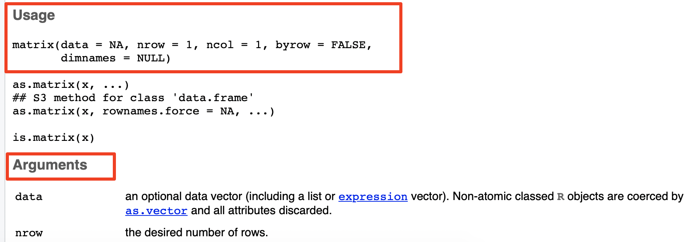
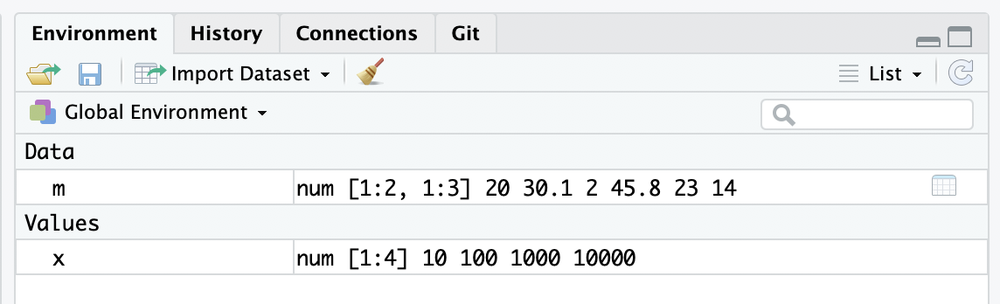

```{r include=FALSE}
color_block = function(color) {
  function(x, options) sprintf('\\color{%s}\\begin{verbatim}%s\\end{verbatim}',
                               color, x)
}

## 将错误信息用红色字体显示
knitr::knit_hooks$set(error = color_block('red'))
```

# section 1: outline

## TOC

1. 数据类型
2. 基本操作
3. 变量
4. 函数/子例程（Functions）
5. 模型和公式
6. R包
7. 获得帮助

**注**：不一定按照上述顺序

# section 2: R basics - 基本数据类型

## 基本数据类型

最基本的数据类型包括**数字**和**字符串**，是其它数据类型的基本组成部分。

数字

\fontsize{7}{8}\selectfont
```{r}
## 整数
287
```
```{r}
## 小数
99.99
```
```{r}
## 科学计数法
1e-3
1e2
```

## 逻辑符号

\fontsize{7}{8}\selectfont
真
```{r eval=FALSE}
TRUE
T
```

假
```{r eval=FALSE}
FALSE
F
```

其本质是数字
```{r}
1 + TRUE
2 * FALSE
```

## 字符串

字符串则是可以是任何字符的组合，由单引号或双引号包括。比如：

```{r eval=FALSE}
'a sentence' ## 单括号
"一个字符串" ## 双括号
'1.123'      ## 像是数字的字符串
'*%%*()!@##&@(9'  ## 乱码
```

## 简单数据类型

简单数据类型包括vector和矩阵，它们都可以包含某一种基本数据类型的多个数值，比如由多个数字组成的矩阵，多个字符串组成的vector等。但它们**只能包含单一数据类型**；这一点稍后会有解释。

```{r eval=FALSE}
c(100, 20, 30) ## 整数 vector 
c("字符串", "数组","是我") ## 字符串 vector
c(TRUE, FALSE, TRUE, T, F) ## 一个逻辑 vector
```

如上所示，数组通常用函数 c() 来定义。除此之外，还可以用 ':' 操作符号来定义包含连续整数的 vector：

```{r}
2:8
```

## vector 的数据类型转换规则

vector只能包含一种基本数据类型。因此，在定义数组时，如果输入的数值是混合的，那么某些基本数据类型会自动转换为其它类型，以保证数值类型的一致性；这在英文里称为coerce，有强制转换的意思。这种转换的优先级为：

 * 逻辑类型 -> 数字类型
 * 逻辑类型 -> 字符串
 * 数字类型 -> 字符串
 
我们可以用 ```class()```或```str() ``` 函数来判断 vector包含的数据类型。以后会介绍两者的不同。

## vector 的数据类型转换规则

\fontsize{7}{8}\selectfont
```{r}
class( c(45, TRUE, 20, FALSE, -100) ); ## 逻辑和数字类型
str( c("string a", FALSE, "string b", TRUE) ); ## 逻辑和字符
str( c("a string", 1.2, "another string", 1e-3) ); ## 数字和字符
```

## 矩阵(matrix)

矩阵也可看做是一种带有限制的二维数组，其限制是，矩阵内的数值必须是同一种类型。当输入混合有多种基本数据类型时，矩阵会按上面提到的规则进行强制转换。

矩阵由函数 ```matrix()``` 定义，比如：

```{r}
matrix( c(20, 30.1, 2, 45.8, 23, 14), nrow = 2, byrow = T );
```

## Matrix 函数的参数

\FontSmall 

| 参数    | 默认值  | 说明 | 必须 | 允许值 |
|--------|---------|---------|-----|-------------------------|
| data   | 无      | 输入数据 | 是 | NA、vector或矩阵 （NA是特殊的值）。 |
| nrow   | 1      | 指定matrix的行数 | 不 | 自然整数 |
| ncol   | 1      | 指定列数 | 不 | 自然整数 |
| byrow  | FALSE  | 是否按行将数据转化为matrix | 不 | 逻辑值  |
| dimnames | NULL | 指定矩阵的行名和列名 | 不 |  NULL 或 list (注：NULL是特殊的值，list则是一种复杂的数据类型) | 

\FontNormal 

更多细节可用 ```? matrix ``` 命令查看

## ```matrix()```参数测试

\fontsize{7}{8}\selectfont
```{r}
matrix( c(20, 30.1, 2, 45.8, 23, 14), nrow = 2, byrow = T );
```
```{r}
matrix( c(20, 30.1, 2, 45.8, 23, 14), nrow = 2, byrow = F );
```

```{r}
matrix( c(20, 30.1, 2, 45.8, 23, 14), nrow = 2, 
       dimnames = list( c("row_A", "row_B"), c("A", "B", "C") ) );
```

## ```matrix()```同时指定 ncol 和 nrow 

矩阵的指定长度，即 nrow  ×  ncol，可以不同于输入数据的长度。矩阵长度较小时，输入数据会被截短；而矩阵长度较大时，输入数据则会被重复使用。举例如下：

\fontsize{7}{8}\selectfont
```{r}
## 生成一个2x5长度为10的矩阵，但输入数据的长度为20
matrix( 1:20, nrow = 2, ncol = 5, byrow = T); 
```
```{r}
## 生成一个2x3长度为6的矩阵，但输入数据长度只有3
matrix( 1:3, nrow = 2, ncol = 3, byrow = T ); 
```

## ```matrix()```更多测试

注意：上面两种情况下，系统并不会给出任何提示。但下面两种情况，系统会报警告信息。
第一种情况，矩阵长度大于输入数据长度，且前者不是后者的整数倍。

\fontsize{7}{8}\selectfont
```{r}
matrix( 1:3, nrow = 2, ncol = 4, byrow = T );
```

## ```matrix()```更多测试， cont. 

第二种情况，矩阵长度小于输入数据的长度，且后者不是前者的整数倍。

\fontsize{7}{8}\selectfont
```{r}
matrix( letters[1:20], nrow = 3, ncol = 5, byrow = T );
```

## 用```? matrix ``` 命令获得帮助

在 Console 窗口中输入 ```? matrix ``` 命令，可在**窗口4**获得有关```matrix()```函数的帮助信息：

{height=40%}

## ```class()```和```str()```的区别

\fontsize{7}{8}\selectfont
```{r}
class(matrix( c(20, 30.1, 2, 45.8, 23, 14), 
              nrow = 2, byrow = T ));
```
```{r}
str(matrix( c(20, 30.1, 2, 45.8, 23, 14), 
            nrow = 2, byrow = T ));
```

```str()```更多功用以后会详细介绍

## 数组（arrray）

vector和矩阵都是数组。vector是一维数组，矩阵是二维数组。这就意味着：a) 还可以有更多维的数组，b)高维数组与vector和矩阵一样，只能包含一种基本数据类型。高维数组可以由函数 array() 定义：

\fontsize{7}{8}\selectfont
```{r}
array( data = LETTERS[1:16], 
      dim  = c(2,4,2), 
      dimnames = list( c("A","B"), 
                      c("one","two","three","four"), 
                      c("一", "二") ));
```


# section 3: R basics - 简单算术

## 运算符

### **加减乘除**老一套

```{r eval=FALSE}
1 + 2 - 3 * 4 / 5; ## 加减乘除
1 + (2 - 3) * 4 / 5;  ##  改变优先级
```

### 进阶操作
```{r eval=FALSE}
2 ^ 6; ## 阶乘
5 %% 2; ## 取余
```

### 逻辑运算符
```{r eval=FALSE}
T | F; ## or 
T & F; ## and
5 | 0; ## == 0 FALSE， > 0 TRUE
```

? ```5 & -1``` 结果应该是 TRUE 还是 FALSE？？？

## 数学函数

- log, log2, log10
- exp
- sin, cos, tan
- sqrt 

## 变量与赋值

在进行下一步之前，先介绍变量与赋值的基本知识

在R中，可以用任何下面的方式**赋值**给**变量**
```{r eval=FALSE}
## 常用
x <- c(10,100,1000, 10000);
## -- 也可以； 
x = c(10,100,1000, 10000);
## -- 少见
c(10,100,1000, 10000) -> x;
## -- ？？？ 
assign( "x", c(10, 100, 1000, 10000) );
```

其中```x```就叫做变量 
**注**： 赋值后，变量内容默认不再打印到 console 
**注2**: c() 又叫做 **concatenation function** （以后会再次介绍）

## 变量的管理

现在我们运行多个赋值操作：
```{r echo=TRUE, message=FALSE}
x <- c(10,100,1000, 10000);
m <- matrix( c(20, 30.1, 2, 45.8, 23, 14), nrow = 2, 
       dimnames = list( c("row_A", "row_B"), c("A", "B", "C") ) );
```

{height=30%}

## 通过 Console window 管理变量

```{r}
ls();  ## 显示当前环境下所有变量
rm( x ); ## 删除一个变量
ls(); 

##rm(list=ls()); ## 删除当前环境下所有变量！！！ 
```

## vector 算术， cont.

```vectorisation```：R最重要的一个概念

\fontsize{7}{8}\selectfont
```{r}
x <- c(10,100,1000, 10000);
( y <- sqrt( x  ) * 4 + 10  ); ## 赋值的之后打印变量内容 
```

```vectorisation```的核心在于数据**自动循环使用**

```{r}
x / c(10,100);
```

```{r}
x / c(10,100,1000); ## 会报错但仍会循环计算
```

## matrix 的算术

\fontsize{7}{8}\selectfont
先查看 m 的内容：
```{r}
knitr::kable(m);
```

```{r}
m / 10;
m /  c(1,10,100);
```

## matrix 的算术, cont.

\fontsize{7}{8}\selectfont
```{r}
m / c(1,10);
m / c(1,10,100,1000); ## 多于列数
```

## 更多  matrix 相关函数 

**注**：其中许多也要用于其它数据类型（以后会讲到）

- dim( m );
- nrow( m );
- ncol( m );
- range( m ); ## 内容是数字时
- summary( m  ); ## 也可用于 vector 

## vector manipulation

### 合并
\fontsize{7}{8}\selectfont
```{r}
a <- 1:3;
b <- LETTERS[1:3];

( ab <- c(a,b) );
mode( ab ); ## 一个新的函数~ ... 
```

## vector manipulation, cont.

### 取部分
\fontsize{7}{8}\selectfont
```{r}
ab[1];
ab[ c(1, 4, 5) ];
ab[ 2:5 ];
ab[ length(ab) ]; ## length 函数
```

## vector manipultaion, cont.

### 替换单个值
\fontsize{7}{8}\selectfont
```{r}
( ab[1] <- "一" );
```

## vector manipulation, cont.

### 替换多个值
\fontsize{7}{8}\selectfont
```{r}
ab[c(2,3)] <- c("二", "三");
ab
```

## vector manipulation, cont.

### naming elements & then replace a value
\fontsize{7}{8}\selectfont
```{r}
( names( ab ) <- as.character( ab ) ); ## 注意 names() 和 as.character() 函数的用法

ab[ c("A", "B") ] <- c("ah", "bo");

ab;
```

## vector manipulation, cont.

### other useful functions 
\fontsize{7}{8}\selectfont
```{r}
## reverse
rev(1:10);
```

```{r}
## sort  & order 
lts <- sample( LETTERS[1:20] );
sort( lts );
order( lts  ); ## 注意与 sort 的不同
```

## matrix manipulation

### 取一行、多行

\fontsize{7}{8}\selectfont
```{r}
m;

m[ 1 , ];
m[ 1:2,  ];
```

## matrix manipulation, cont.

### 取一行、多行, cont.
\fontsize{7}{8}\selectfont
```{r}
m[ "row_A", ]
m[ c( "row_B", "row_A" ), ] ## 注意取的顺序
```

## matrix manipulation, cont.

### 取一列、多列
\fontsize{7}{8}\selectfont
```{r}
m[ , 1 ];
m[, c(1,2)];
m[, c("B","A")];## 注意取的顺序
```

## matrix manipulation, cont.

### 取部分
\fontsize{7}{8}\selectfont
```{r}
m;

m[1:2, 2:3]; ## 取其中一部分
```

## matrix manipulation, cont.

### 替换一行
\fontsize{7}{8}\selectfont
```{r}
m;
m[1, ] <- c(10);
```

## matrix manipulation, cont.

### 替换一列
\fontsize{7}{8}\selectfont
```{r}
m[, "C"] <- c(230, 140);
m;
```

## matrix manipulation, cont.

### 替换多行、多列
\fontsize{7}{8}\selectfont
```{r, eval=FALSE}
## -- 替换前两行
m[ 1:2 , ] <- matrix(  1:6, nrow = 2 );

## -- 替换其中两列
m[  , c("C", "B") ] <- matrix(  100:103, nrow = 2 );
```

### 替换 subset 
\fontsize{7}{8}\selectfont
```{r, eval=FALSE}
m[ 1  , c("C", "B") ] <- matrix(  110:111, nrow = 1 );
```

### 转置
\fontsize{7}{8}\selectfont
```{r}
t(m);
```


# section 3: 特别值

## 数据类型汇总

{height=60%}

图片出自：https://r4ds.had.co.nz/vectors.html

## 用 ```typeof() ``` 函数确定以上类型

\FontSmall

```{r}
typeof(letters);
typeof(1:10);

typeof( list("a", "b", 1:10) );

typeof( 1:10 %% 3 == 0 );

typeof(1);

typeof(1L);
```

## NULL

**NULL**: expressions and functions whose value is undefined

\FontSmall

```{r}
typeof( NULL );
```

## 特别值以及它们是如何产生的

一次认识所有：

\FontSmall

```{r}
c(-1, 0, 1) / 0;
```

``` NA ```

\FontNormal

**注意** NULL 既是特别值也是特别数据类型

## 判定特别值

以下判定为 TRUE: 

\FontSmall

|                   | 判定（输入）          | **0**   | **Inf** | **NA** | **NaN** |
|-------------------|--------------|---------|---------|--------|---------|
| ```is.finite()``` |  有限值（数字）  | **x** |         |      |      |
| ```is.infinite()``` | 无限值（数字） |   |    **x**     |      |      |
| ```is.na()```       |  not available  |  |         |    **x**  |  **x**    |
| ```is.nan()```      | 不是数字  |  |         |      |   **x**   |

## 其它 is. 函数

\FontSmall

```{r eval=FALSE}
is.null( NULL );
is.numeric( NA );
is.numeric( Inf );

## 用于替代 typeof 的函数
is.list();
is.logical();
is.character();
is.vector();

## 更多 ... 
```


# section 4: 练习 & 作业

## vector 练习

- https://www.r-exercises.com/2015/10/09/vector-exercises/
- https://www.r-exercises.com/2016/11/15/vector-exercises-vol-2/

more to find at: https://www.r-exercises.com

## matrix 练习 

- https://www.r-exercises.com/2015/11/28/matrix-exercises/

## 作业

提交一份文本或doc文件，内容包含上述练习的答案，包括：

- vector练习1
- vector练习2，和
- matrix 练习

截止时间：本周日晚8点前

