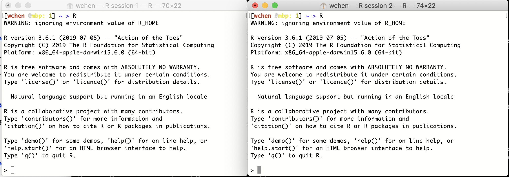
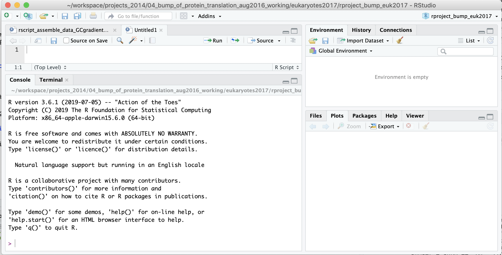
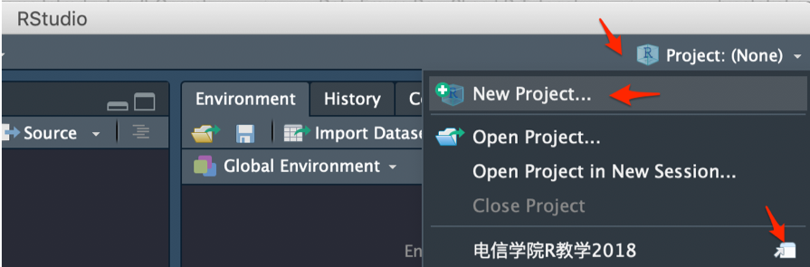
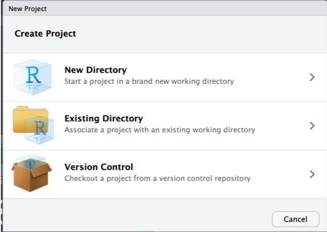
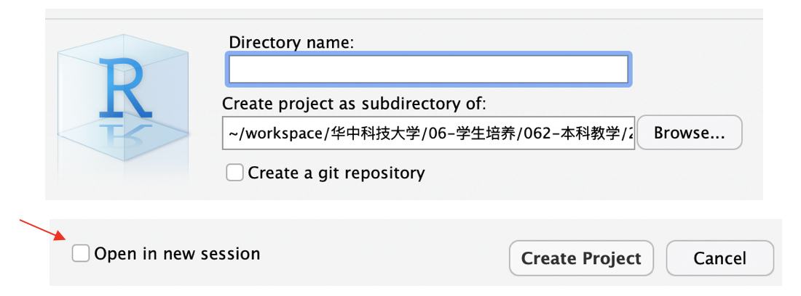
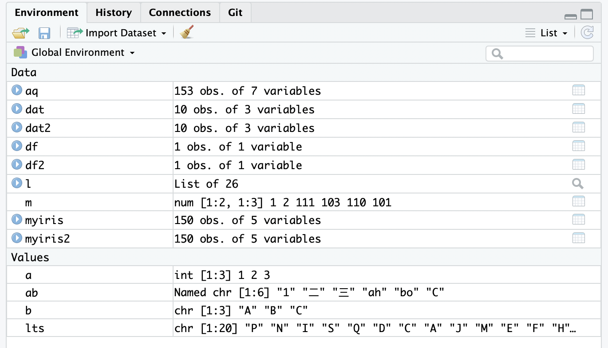
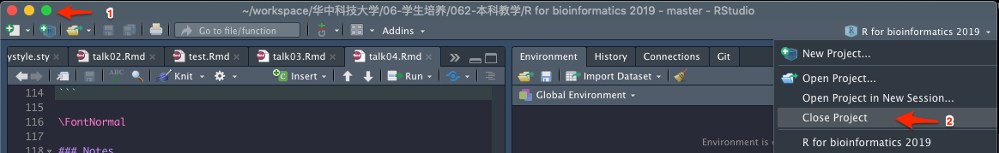
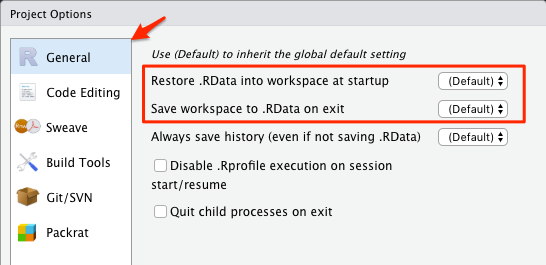
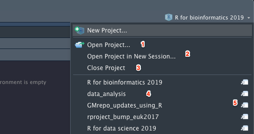

```{r include=FALSE}
color_block = function(color) {
  function(x, options) sprintf('\\color{%s}\\begin{verbatim}%s\\end{verbatim}',
                               color, x)
}

## 将错误信息用红色字体显示
knitr::knit_hooks$set(error = color_block('red'))
```

# section 1: TOC

## 前情提要

### data frame and tibble

* declaration & usage
* manipulation （更多相关内容会在介绍 ```dplyr```  时讲到）
* differences between data.frame and tibble
* advantages of using tibble (更多内容以后会介绍)
* ```with```, ```within```，```attach```, ```detach``` 等的用法

### IO

* read from files of different formats
* write to files
* use GUI to read files (& get the corresponding code)

## 今次预报

1. IO, project management, working enviroment management
2. factors: R 中最重要的概念之一 
3. exercises

# section 2: IO and working enviroment management

## R session 的概念

每个R session 是一个单独的工作空间（work space），包含各自的数据、变量和操作历史。

{height=40%}

## R session in RStudio

Each RStudio session is automatically associated with a R session

{heigh=40%}

## start a new RStudio session by creating a new project

1. 右上角的 Project 按钮，在弹出菜单里选 New Project … 

{height=40%}

## create a new project, cont.

2. Select: New directory -> New Project in the popup window 

{height=40%}

## create a new project, cont.

3. Enter a new directory name, choose its mother directory ... 

{height=40%}

## 现场演示

演示~~

## working space

当前工作空间，包括所有已装入的数据、包和自制函数

可通过以下代码管理变量
\FontSmall

```{r eval=TRUE}
ls();  ## 显示当前环境下所有变量
rm( x ); ## 删除一个变量
ls(); 

##rm(list=ls()); ## 删除当前环境下所有变量！！！ 
```

## variables in working space in RStudio

在RStudio右上角的"Enviroment"窗口显示了所有当前工作间的变量

{height=40%}

## save and restore work space

\FontSmall
```{r eval=FALSE}
## -- save all loaded variables into an external .RData file
save.image( file = "prj_r_for_bioinformatics_aug3_2019.RData" );

## -- restore ( load ) saved work space 
load( file = "prj_r_for_bioinformatics_aug3_2019.RData" );
```

\FontNormal

### Notes

* existing variables will be kept, however, those will the same names will be replaced by loaded variables
* please consider using ```rm( list=ls() )``` to remove all existing variables to have a clean start
* you may need to reload all the packages


## save selected variables 

Sometimes you need to transfer processed data to a collaborator ... 

\FontSmall
```{r eval=FALSE}
## save selected variables to external 
save(city, country, file="1.RData"); ## you can specify directory name

## --
load( "1.RData" );
```

\FontNormal

## close and (re)open a project

close a project is easy:

{height=40%}

however ... 

## 退出 projects 时的一些选项 （RStudio）

{height=30%}

### notes

* 退出时保存
* 打开时装入
* 但数据较大时，装入时间可能过长 ... 

## open a project

{height=40%}

演示项目的不同打开姿式（1-5）。

## 练习

* 创建一个项目
* 定义一些变量
* 从外部文件装入一些数据
* 保存workspace到 <file_name>.RData 
* 退出 project
* 重新打开 project 并恢复 workspace

# section 3: factors

## 什么是factors？

Factor is a data structure used for fields that takes only predefined, finite number of values (categorical data).

Facor 用于限制某个字段（列），只允许其接受某些值

\FontSmall
```{r}
x <- c("single", "married", "married", "single");
str(x);
```

```{r}
## create factor as it is ... 
x <- as.factor(x);

## please note the change in the displayed values ... 
str(x);
```


```{r}
## create factor from scratch ... 
x <- factor( c( "single", "married", "married", "single" ) );
str(x);
```

## factors, cont. 

Factors 会限制输入数据的选择范围

\FontSmall
```{r}
str(x);
x[ length(x) + 1 ] <- "widowed";
```

```{r}
x;
```

Use ```levels()``` function to add new factors 
```{r}
levels(x) <- c(levels(x), "widowed");
x[ length(x) + 1 ] <- "widowed";
str(x);
```

## factors, cont. 

Play around with ```levels()```:

\FontSmall
```{r}
## other ways of assigning factors ... 
y <-  as.factor( c( "single", "married", "married", "single" ) );
levels( y );
levels(y) <- c("single", "married", "widowed");
str(y);
```

\FontNormal

** 问题 ** 如果运行以下代码，会报错吗？ 

\FontSmall

```{r eval=FALSE}
y[ length(y) + 1 ] <- "widowed";
```

\FontNormal

[more to read](https://www.datamentor.io/r-programming/factor/)

## factor 在做图中的应用（真正精髓）

\FontSmall
```{r fig.height=2, fig.width=6}
## 一项 mock 调查结果数据
( responses <- factor( c("Agree", "Agree", "Strongly Agree", "Disagree", 
                         "Disagree", "Agree") ) );

## -- plot the results --
library(ggplot2);
barplot <-
  ggplot( data = data.frame( res = responses ), aes( x = res )) +
  geom_bar();
```

## factor 在做图中的应用, cont. 

```{r fig.height=3, fig.width=8, echo=FALSE}
barplot;
```

\FontNormal

默认情况下， factor 按字母表排序： Agree -> Disagree -> Strong Agree 。ggplot2 也会按factor的排序作图


## 调整 factor 以调整画图顺序

\FontSmall
```{r fig.heigh=2, fig.width=8}
res <- data.frame( res=responses );
## -- 按照同意程度从强->弱 排序
res$res <- factor( res$res, levels = c( "Strongly Agree", "Agree",  "Disagree" ) );
str(res);

plot2 <- 
  ggplot( data = res, aes( x = res )) +
  geom_bar() +
  xlab( "Response" );
```

## 调整 factor 以调整画图顺序， cont.

```{r fig.height=3, fig.width=8, echo=FALSE}
plot2;
```


** 练习 ** 按意程度从 弱->强 排序并作图！！ 

## ordered factor 

通过 ordered 参数，让用户知道 factors 是经过精心排序的 

\FontSmall

```{r}
( responses <- factor( c("Agree", "Agree", "Strongly Agree", "Disagree", "Disagree", "Agree"),
                       ordered = T ) );
is.ordered( responses );
```

## 通过 factor 改变 值

使用 ```dplyr``` 包的 ```recode()```函数改变 value 

\FontSmall

```{r}
( x <- factor( c( "alpha", "beta", "gamma", "theta", "beta", "alpha" ) ) );

## --
library( dplyr );
x <- recode( x, "alpha" = "one", "beta" = "two" );
str(x);
```

## 去除不用的 levels 

？什么时候会用到： 

\FontSmall

```{r}
mouse.genes <- read.delim( file = "data/talk04/mouse_genes_biomart_sep2018.txt", 
                           sep = "\t", header = T, stringsAsFactors = T );

str(mouse.genes);
```

## 去除不用的 levels, cont.

\FontSmall

```{r fig.width=10, fig.height=4}
mouse.chr_10_12 <- subset( mouse.genes,  Chromosome.scaffold.name %in% c( "10", "11", "12" ) );
## plot length distribution --

boxplot( Transcript.length..including.UTRs.and.CDS. ~ Chromosome.scaffold.name, data = mouse.chr_10_12, las = 2 );
```

\FontNormal

```subset()``` 无法去除不用的 factors ... 

## 去除不用的 levels, cont.

\FontSmall

```{r fig.width=10, fig.height=4}
mouse.chr_10_12$Chromosome.scaffold.name <- 
  droplevels( mouse.chr_10_12$Chromosome.scaffold.name );

levels( mouse.chr_10_12$Chromosome.scaffold.name );

## 再次 plot ... 
boxplot( Transcript.length..including.UTRs.and.CDS. ~ Chromosome.scaffold.name, 
         data = mouse.chr_10_12, las = 2 );
```

## 也可以使用 tibble , 完全不用担心 factor 的问题 ... 

\FontSmall

```{r fig.width=10, fig.height=5}
library( readr );
mouse.tibble <- read_delim( file = "data/talk04/mouse_genes_biomart_sep2018.txt", 
                            delim = "\t", quote = "" )

mouse.tibble.chr10_12 <- 
  mouse.tibble %>% filter( `Chromosome/scaffold name` %in%  c( "10", "11", "12" ) );

plot3 <- 
  ggplot( data = mouse.tibble.chr10_12, 
        aes( x = `Chromosome/scaffold name`, 
             y = `Transcript length (including UTRs and CDS)` ) ) +
  geom_boxplot() + 
  coord_flip() + 
  ylim( 0, 2500 ) ;
```


## 用 tibble 解决 factor 的问题 , cont. 

```{r fig.height=4, fig.width=8, echo=FALSE}
plot3;
```

## 按基因长度 中值 从 大 -> 小 排序

\FontSmall 

```{r fig.width=10, fig.height=5}
plot4 <- 
  ggplot( data = mouse.tibble.chr10_12, 
        aes( x = reorder( `Chromosome/scaffold name`, 
                          `Transcript length (including UTRs and CDS)`, 
                          median ), 
             y = `Transcript length (including UTRs and CDS)` ) ) +
  geom_boxplot() + 
  coord_flip() + 
  ylim( 0, 2500 ) ;
```

\FontNormal 

```reorder( vector_with_factor, numeric_value , FUN = mean  )``` 的用法

## 按基因长度 中值 从 大 -> 小 排序， cont. 

```{r fig.height=3, fig.width=8, echo=FALSE}
plot4;
```

\FontNormal

** 注意 ** ```reorder( `Chromosome/scaffold name`, - `Transcript length (including UTRs and CDS)`, median ) ``` 的作用


## 按基因长度 中值 从 大 -> 小 排序， cont. 

** 问题 ** 

1. 如果要按 小 -> 大 的顺序排序呢？ ( ```reorder( `Chromosome/scaffold name`, - `Transcript length (including UTRs and CDS)`, median )  )
2. ```reorder``` 的作用是什么？？ 只在 ggplot2 里有用吗？？ 

[more to read!](https://www.r-bloggers.com/how-do-i-re-arrange-ordering-a-plot-revisited/)

# section 4: 练习与作业

## more to read & 练习：

1. [R factors 基础](https://www.datamentor.io/r-programming/factor/)
2. [R阅读和练习 2, 必读！！](https://r4ds.had.co.nz/factors.html)
3. [R练习 1](https://www.r-exercises.com/2018/07/06/facing-the-facts-about-factors-exercises/)
4. [rename columns using dplyr](https://honingds.com/blog/dplyr-rename/)
5. [ggplot2 boxplot](http://www.sthda.com/english/wiki/ggplot2-box-plot-quick-start-guide-r-software-and-data-visualization)
6. [ordering a plot in ggplot2](https://www.r-bloggers.com/how-do-i-re-arrange-ordering-a-plot-revisited/)

## 作业

1. 用 readr 包中的函数读取 mouse genes 文件 （从本课程的 Github 页面下载 data/talk04/ ）
2. 选取常染色体的基因
3. 画以下两个基因长度 boxplot :
  * 按染色体序号排列，从 1 开始
  * 按基因长度 中值 排列，从 短 -> 长 ... 
  
** 要求 ** 

1. 一周内提交
2. 代码和两个 pdf 文件 ... 

