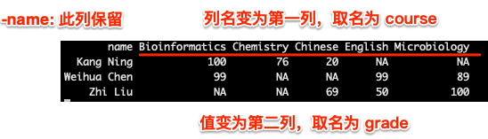
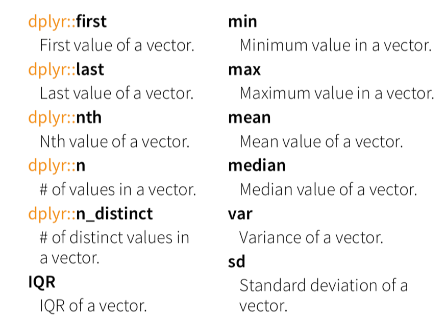
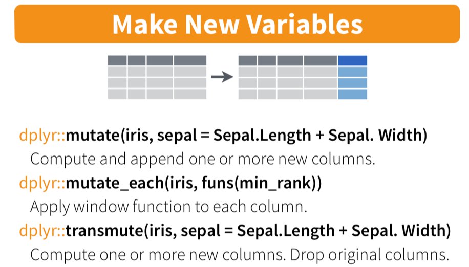
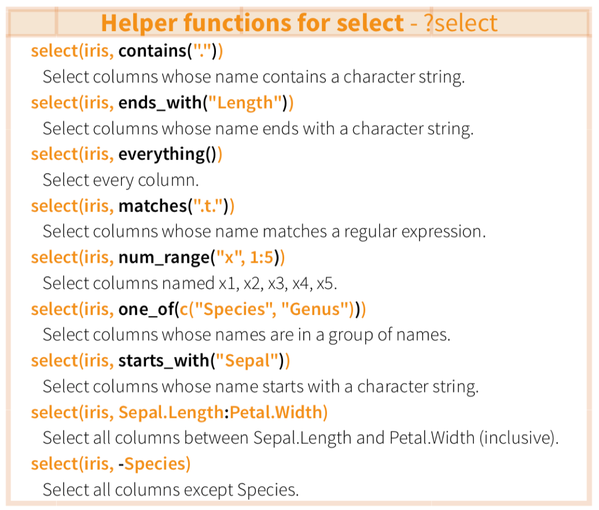
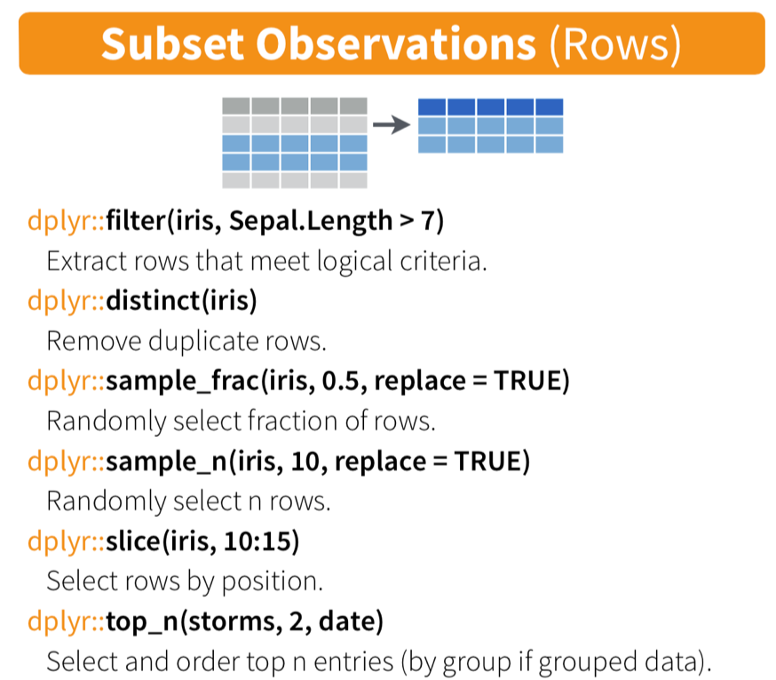

```{r include=FALSE}
color_block = function(color) {
  function(x, options) sprintf('\\color{%s}\\begin{verbatim}%s\\end{verbatim}',
                               color, x)
}

## 将错误信息用红色字体显示
knitr::knit_hooks$set(error = color_block('red'))
```

# section 1: TOC

## 前情提要

1.  IO, project management, working enviroment management
2.  factors: R 中最重要的概念之一

-   factors 基本概念
-   factors 操作
-   factors 在做图中的使用
-   ggplot2 和 dplyr 初步

## 问题点评

1.  ggplot2问题
2.  长宽数据转换 & pipe ...

\FontSmall

```{r eval=FALSE}
N %>% gather( ind, values ); 
```

## 今次提要

-   dplyr 、 tidyr (超级强大的数据处理) part 1

# section 2: data wrangler - dplyr

## dplyr

### what is `dplyr` ?

-   the next iteration of plyr,
-   focusing on only data frames (also tibble),
-   row-based manipulation,
-   dplyr is faster and has a more consistent API.

{height="50%"}

### more to read

-   [dplyr offical page at tidyverse](https://dplyr.tidyverse.org)
-   [R for data science](https://r4ds.had.co.nz)

## dplyr, overview

dplyr provides a consistent set of verbs that help you **solve the most common data manipulation challenges**:

-   [select()](https://dplyr.tidyverse.org/reference/select.html) 选择列，根据列名规则
-   [filter()](https://dplyr.tidyverse.org/reference/filter.html) 按规则过滤行
-   [mutate()](https://dplyr.tidyverse.org/reference/mutate.html) 增加新列，从其它列计算而得 （不改变行数）
-   [summarise()](https://dplyr.tidyverse.org/reference/summarise.html) 将多个值转换为单个值（通过 mean, median, sd 等操作），生成新列 （总行数减少，通常与 `group_by`配合使用 ）
-   [arrange()](https://dplyr.tidyverse.org/reference/arrange.html) 对行进行排序

## dplyr 安装

\FontSmall

```{r eval=FALSE}
# The easiest way to get dplyr is to install the whole tidyverse:
install.packages("tidyverse")

# Alternatively, install just dplyr:
install.packages("dplyr")
```

\FontNormal

Development version

\FontSmall

```{r eval=FALSE, warning=FALSE, message=FALSE}
# install.packages("devtools")
devtools::install_github("tidyverse/dplyr")
```

\FontNormal

[Get the cheatsheet at here](https://github.com/rstudio/cheatsheets/blob/master/data-transformation.pdf)

## an example of `dplyr`

get the data ready

```{r echo=FALSE, warning=FALSE, message=FALSE}
library(tidyverse); 
```

\FontSmall

```{r}
mouse.tibble <- read_delim( file = "data/talk04/mouse_genes_biomart_sep2018.txt", 
                            delim = "\t", quote = "" );
```

## 查看 mouse.tibble 的内容

\FontSmall

```{r}
( ttype.stats <- mouse.tibble %>% count( `Transcript type` ) %>% arrange(-n) );
```

## 查看 mouse.tibble 的内容, cont.

\FontSmall

```{r}
( chr.stats <- mouse.tibble %>% count( `Chromosome/scaffold name` ) %>% arrange(-n) );
```

## 分析任务

1.  将染色体限制在常染色体和XY上（去掉未组装的小片段） ; 处理行
2.  将基因类型限制在 protein_coding, miRNA和 lincRNA 这三种；处理行
3.  统计每条染色体上不同类型基因（protein_coding, miRNA, lincRNA）的数量
4.  按染色体（正）、基因数量（倒）进行排序

## 用 `dplyr` 实现

\FontSmall

```{r}
dat <- mouse.tibble %>% 
  ## 1. 
  
  filter( `Chromosome/scaffold name` %in% c( 1:19, "X", "Y" )   ) %>% 
  
  ## 2. 
  filter( `Transcript type` %in% c( "protein_coding", "miRNA", "lincRNA" ) ) %>%
  
  ## change column name ... 
  select( CHR = `Chromosome/scaffold name`, TYPE = `Transcript type`, 
          GENE_ID = `Gene stable ID`, 
          GENE_LEN =  `Transcript length (including UTRs and CDS)`  ) %>%
  
  ## 3. 
  group_by( CHR, TYPE ) %>% 
  summarise( count = n_distinct( GENE_ID ), mean_len = mean( GENE_LEN ) ) %>% 
  
  ## 4. 
  arrange(  CHR  , desc( count ) );
```

## 检查运行结果

\FontSmall

```{r echo=FALSE}
knitr::kable( head( dat, n = 15 ) );
```

\FontNormal

这种显示格式通常被称为：**长数据格式**！！又称为**数据扁平化**

## 数据扁平化的优点？

1.  便于用 dplyr 或 tapply 等进行计算；
2.  更灵活，用于保存稀疏数据

## 适合扁平化的数据举例

### 成绩单

\FontSmall

```{r message=FALSE, warning=FALSE}
library(dplyr);
grades <- read_tsv( file = "data/talk05/grades.txt" );
knitr::kable( head(grades, n=20) );
```

灵活性：

-   应对不同学生选择不同课程的情况
-   可随时增加新的课程

## 长数据变宽

\FontSmall

```{r}
grades2 <- grades %>% spread( course, grade );
knitr::kable( grades2 );
```

\FontNormal

可以想像，如果以此为输入，用R计算每个人的平均成绩、不及格门数、总学分，将会是很繁琐的一件事（但对其它工具（如Excel）可能会比较简单）

## `spread` explained!

\FontSmall

```{r eval=FALSE}
grades2 <- grades %>% spread( course, grade );
```

\FontNormal

{height="50%"}

## 宽数据转为长数据

use `gather()` function in `tidyr`

\FontSmall

```{r}
grades_melted <- grades2 %>% gather( course, grade, -name ); ## 注意参数的使用 ~~ 
knitr::kable( head( grades_melted ) );
```

## `gather` explained!

\FontSmall

```{r eval=FALSE}
grades_melted <- grades2 %>% gather( course, grade, -name ); ## 注意参数的使用 ~~ 
```

\FontNormal

{height="50%"}

## 有 `NA` 值怎么办？

\FontSmall

```{r eval=FALSE}
grades_melted1 <- grades_melted[ !is.na(grades_melted$grade),  ];
grades_melted2 <- grades_melted[ complete.cases( grades_melted )  ,  ];

## -- 更好的方法 ~~ 
grades_melted <- grades2 %>% gather( course, grade, -name , na.rm = T ); 
```

## 宽长数据转换练习

用 `spread` 和 `gather` 对下面的数据 `mini_iris` 进行宽长转换:

\FontSmall

```{r}
( mini_iris <- iris[ c(1, 51, 101),  ] )
```

\FontNormal

`iris` 是 鸢尾属 一些物种花瓣的量表

## 宽长数据转换练习， cont.

\FontSmall

```{r}
## -- 注意： 第一、二个参数可以自行命名，分别对应原始数据中的 column names 及 values ...
mini_iris.melted <- mini_iris %>% gather( type, dat, -Species );
knitr::kable( mini_iris.melted  );
```

## 长宽转换之mouse.tibble

\FontSmall

```{r}
dat2 <- dat %>% select( CHR, TYPE, `count` ) %>%  spread( TYPE, count  );
knitr::kable( head(dat2, n=10) );
```

## 比较复杂的例子

\FontSmall

```{r message=FALSE, warning=FALSE}
grades2 <- read_delim( file = "data/talk05/grades2.txt", delim = "\t",
                       quote = "", col_names = T);
knitr::kable( grades2 );
```

\FontNormal

这是哪种数据类型？长还是宽？？

## 怎么用 spread 把它变为以下的格式？

\FontSmall

```{r echo=FALSE }
( grades2_melted <- grades2 %>% spread( course, grade ) );
```

\FontNormal

又怎么把它变回来？？？

```{r echo=FALSE, eval=FALSE }
grades2_melted %>% gather( course, grade, -name, -class, na.rm = T  );
```

## dplyr 常用函数示例

先创建一个新 tibble

\FontSmall

```{r}
grades <- tibble( "Name" = c("Weihua Chen", "Mm Hu", "John Doe", "Jane Doe",
                             "Warren Buffet", "Elon Musk", "Jack Ma"),
                  "Occupation" = c("Teacher", "Student", "Teacher", "Student", 
                                   rep( "Entrepreneur", 3 ) ),
                  "English" = sample( 60:100, 7 ),
                  "ComputerScience" = sample(80:90, 7),
                  "Biology" = sample( 50:100, 7),
                  "Bioinformatics" = sample( 40:90, 7)
                  );
grades;
```

## use gather & dplyr functions

Question: 1. 每个人平均成绩是多少？ 2. 哪个人的平均成绩最高？

\FontSmall

```{r}
grades.melted <- grades %>% 
  gather( course, grade, -Name, -Occupation, na.rm = T );

## 检查数据 ... 
knitr::kable( head(grades.melted) );
```

## 成绩分析，cont

\FontSmall

```{r}
grades.melted %>% 
  group_by(Name, Occupation) %>% 
  summarise( avg_grades = mean( grade ), courses_count = n() ) %>% 
  arrange( -avg_grades );

## 显示最终结果
knitr::kable( head( grades.melted ) );
```

## use gather & dplyr functions

问题： 每个人的最强科目是什么？？

\FontSmall

```{r}

## 步骤1： 排序：
grades.melted2 <- 
  grades.melted %>% 
  arrange( Name, -grade );

knitr::kable( head(grades.melted2) );
```

## 最强科目问题，cont.

\FontSmall

```{r}
grades.melted2 %>% 
  group_by(Name) %>% 
  summarise( best_course = first( course ),
             best_grade = first( grade ),
             avg_grades = mean( grade ) ) %>% 
  arrange( -avg_grades );
```

## dplyr::summarise 的其它操作

{height="60%"}

## 更多练习，使用 `starwars` tibble

\FontSmall

```{r}
head(starwars);
```

**note** 包含87行 13 列，星战部分人物的信息，包括身高、体重、肤色等

用 `?starwars` 获取更多帮助

## dplyr::mutate - 产生新列，不改变行数

而 dplyr::summarise 则会使列数减少（通常与 group_by 联合使用）

{height="50%"}

另见下页的例子

## dplyr::select - 取列

目标：

-   取出相关列，用于计算人物的 BMI

\FontSmall

```{r}
stats <- 
  starwars %>% 
  select( name, height, mass ) %>%
  mutate( bmi = mass / ( (height / 100 ) ^ 2 ) ) ;

head(stats);
```

## dplyr::select - 取列, cont.

由于 name, height 和 mass 正好是相邻列，可以用 name:mass 获取：

\FontSmall

```{r}
stats <- 
  starwars %>% 
  select( name:mass ) %>%
  mutate( bmi = mass / ( (height / 100 ) ^ 2 ) ) ;

head(stats);
```

## dplyr::select - 取列, cont.

获取与颜色相关的列: hair_color, skin_color, eye_color

\FontSmall

```{r}
stats2 <- starwars %>% 
  select( name, ends_with("color") );

head(stats2);
```

## dplyr::select - 去除列, cont.

请自行检查以下操作的结果

\FontSmall

```{r eval=FALSE}
head( starwars %>% select( -hair_color, -eye_color )  );
```

## dplyr::select - 其它操作, cont.

{height="70%"}

## dplyr::filter - 行操作

任务：从星战中挑选**金发碧眼**的人物

\FontSmall

```{r}
starwars %>% select( name, ends_with("color"), gender, species ) %>% 
  filter( hair_color == "blond" & eye_color == "blue" );
```

## dplyr中其它取行的操作

{height="70%"}

## tidyr::separate

<https://r4ds.had.co.nz/tidy-data.html>

## tidyr::unite

<https://r4ds.had.co.nz/tidy-data.html>

# section 3 : 练习与作业

## 练习 & 作业

-   `Exercises and homework` 目录下 `talk05-homework.Rmd` 文件；

-   完成时间：见钉群的要求

## 小结

### 今次提要

-   dplyr 、 tidyr (超级强大的数据处理) part 1

### 下次预告

-   dplyr, tidyr 和 forcats 的更多功能与生信操作实例

### important

-   all codes are available at Github: <https://github.com/evolgeniusteam/R-for-bioinformatics>
