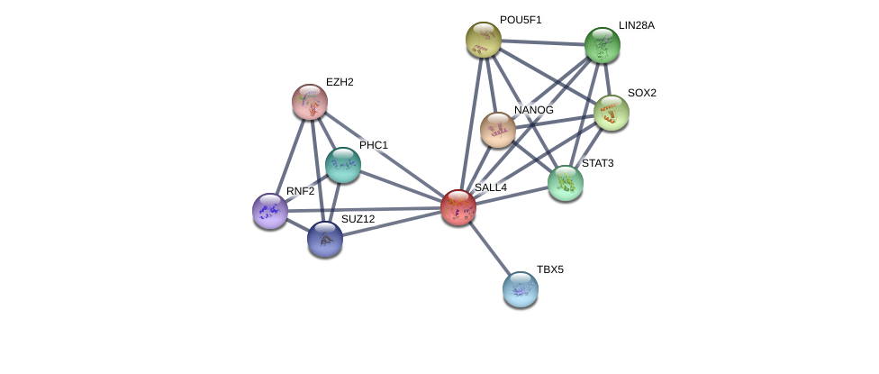
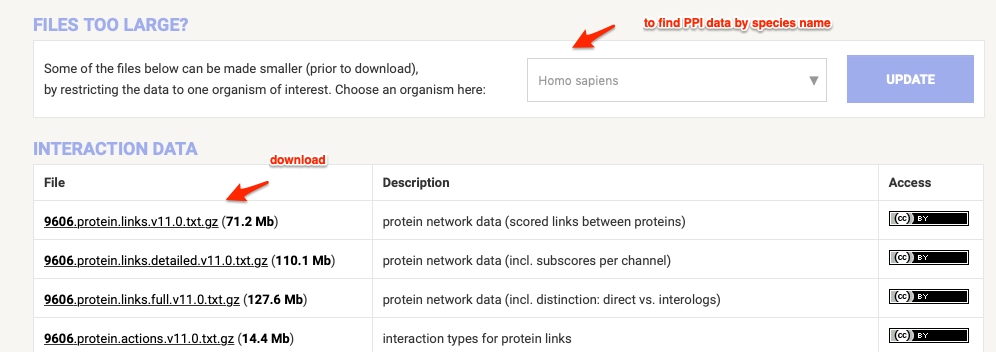
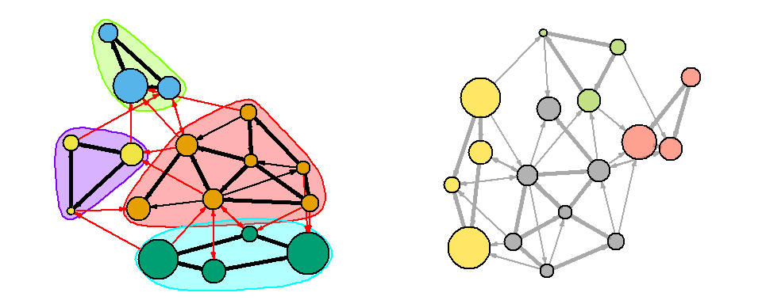
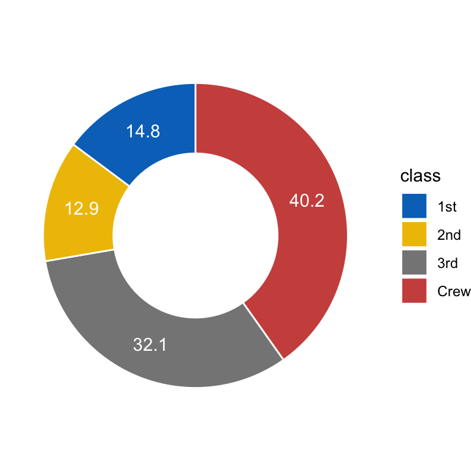

```{r include=FALSE}
color_block = function(color) {
  function(x, options) sprintf('\\color{%s}\\begin{verbatim}%s\\end{verbatim}',
                               color, x)
}

## 将错误信息用红色字体显示
knitr::knit_hooks$set(error = color_block('red'))
```

# section 1: TOC

## 前情提要

### tidyr

* gather()
* spread()
* 没有仔细讲的
 - unite()
 - separate()
 
### dplyr 

* select()
* filter()
* mutate()
* summarise()
* arrange()
* group_by() ... 

### factors (部分)

* 概念
* 应用（特别是作图）

## 本次提要

1. factors 的更多应用 (forcats)
2. 3个生信任务的R解决方案
3. pipe

**注** 不按上述顺序讲 ... 

# section 2: contents

## 生信任务1 ： network analysis and visualisation (dplyr & some plot packages )

protein-protein interaction data

### why PPI is important?

1. most of the time, protein functions together with other proteins (interctions)
2. interacting partners tend to have similar functions (guilty by association, can be used in gene annotation)


## STRING database

1. contains >2 billion interactions for 24.5 million proteins in 5090 organisms (as of Aug 2019)
2. contains: 
 * physical interaction
 * genetic interactions
 * gene co-occurance (text-mining)
 * transfers through orthologous relationships

## a typical STRING plot

{height=70%}


## note to previous plot

**note** this plot was generated using the following parameters:

* use SALL4 in human as query
* show only the top ten connectivity partners
* only connectivity score >= 900 (or 0.9) were shown

## tasks of task 1

1. get human PPI data
2. limit the interactions to those with scores >= 900 (or 0.9)
3. find SALL4 and its top ten interaction parteners
4. visualize the PPI network
5. calculate connectivities of sall4 and its top ten parteners in the dataset

**问题** 

生物学意义何在？？

## download human ppi data from STRING

go to : https://string-db.org/cgi/download.pl

{height=50%}

## load and load the human PPI data 

\FontSmall

```{r message=FALSE, warning=FALSE}
library(tidyverse);
```

```{r message=FALSE, warning=FALSE}
## read_csv 也能处理压缩文件！！！ 
ppi <- read_delim( file = "data/talk06/ppi900.txt.gz", col_names = T, 
                   delim =  "\t", quote = "" );

## 查看一下数据 --
ppi %>% filter( gene1 == "SALL4" ) %>% do( head(.,  n = 10 ) );
```

## start to process the data 

\FontSmall 

```{r}
## get top 10 interacting partners of SALL4 by interaction score ... 
toppart <- ppi %>% filter( gene1 == "SALL4" ) %>% 
  arrange( desc( score ) ) %>% slice( 1:10 );

## get the interaction network consisting the top genes --
genes <- unique( c( "SALL4", toppart$gene2 ) );
netdata <- ppi %>% filter( gene1 %in% genes & gene2 %in% genes );
nrow(netdata);
```

## load the igraph package 

\FontSmall

```{r message=FALSE, warning=FALSE}
## -- to make sure the installation will only run once ... 
if (!require("igraph")){ 
  chooseCRANmirror();
  install.packages("igraph");
} 

library( igraph );
```

## visualise the network ...

\FontSmall 

```{r fig.height=4, fig.width=10}
netnet <- graph_from_data_frame( netdata, directed = FALSE );
plot(netnet);
```

## 图的问题

* very ugly
* two lines (redundancy) between every two nodes

## redundancy among data

\FontSmall

```{r}
netdata %>% filter( gene1 %in% c("SALL4", "NANOG") & gene2 %in% c("SALL4", "NANOG") );
```

## how to remove redundancy? 

\FontSmall 

```{r}
## create a new column, sort the two gene names, and concatenate them ... 
testdata <- 
  netdata %>% filter( gene1 %in% c("SALL4", "NANOG") & gene2 %in% c("SALL4", "NANOG") ) %>% 
  mutate( group  =  
            if_else( gene1 > gene2, 
                     str_c( gene1, gene2, sep = "-" ), 
                     str_c( gene2, gene1, sep = "-" ) ) );

testdata;
```

\FontNormal

**Note** ```str_c``` is from the ```stringr``` package!! 

## remove redundancy!

\FontSmall 

```{r}
testdata %>% group_by( group ) %>% slice( 1 );
```

## remove redundancy, cont. 

\FontSmall 

```{r}
netdata.nr <- 
  netdata %>% 
  mutate( group  =  
            if_else( gene1 > gene2, 
                     str_c( gene1, gene2, sep = "-" ), 
                     str_c( gene2, gene1, sep = "-" ) ) ) %>% 
  group_by( group ) %>% slice( 1 );

nrow(netdata.nr);
```

## plot the non-redundant data 

\FontSmall

```{r fig.height=4, fig.width=8}
netnet.nr <- graph_from_data_frame( netdata.nr, directed = FALSE );
plot(netnet.nr);
```

## redundant 的数据可以用来计算 degree

\FontSmall

```{r}
net.stats <- 
  netdata %>% group_by( gene1 ) %>% summarise( degree = n() ) %>% 
  arrange( desc (degree) );
net.stats;
```

## 继续美化 network

\FontSmall

```{r}
## node大小由degree决定
## 查看网络中基因名存储的顺序
V(netnet.nr)$name; 
## 获取它们相对应的 degree ...
net.stats[match( V(netnet.nr)$name , net.stats$gene1 ),  ];
```

## 继续美化 network, cont.

\FontSmall

```{r fig.height=4, fig.width=10}
vertex_attr(netnet.nr, "size") <- 
  net.stats$degree[match( V(netnet.nr)$name , net.stats$gene1 ) ] * 2;
plot( netnet.nr );
```

## 更多美化

详见：

1. [igraph introduction](https://www.jessesadler.com/post/network-analysis-with-r/)
2. [a comprehensive network visualisation tutorial in R](https://kateto.net/network-visualization): igraph and beyond

{height=40%}

## other network visualisation packages

1. [ggnet](https://briatte.github.io/ggnet/)
2. [interactive networkD3 R package](http://www.sthda.com/english/articles/33-social-network-analysis/137-interactive-network-visualization-using-r/)
3. plotly.js
4. D3

## 生信任务2 : 宏基因基因数据展示的小应用 (forcats)

{height=60%}

Find more at the [GMrepo database](https://gmrepo.humangut.info/home).

## 什么是宏基因组？

Metagenomics is the study of genetic material recovered directly from environmental samples. 

### research contents 

- mostly prokaryotes
- unicellular eukaryotes
- viruses

### techniques

- 16S (universially conserved gene in prokaryotes)
- whole genome sequencing (WGS or metagenomics)

## what can metagenomics do?

- identify new species
- reveal species kinds and abundances 
- relate species changes to human health and disease

## biomes

{height=60%}

Screenshot taken from the [EBI metagenomics database](https://www.ebi.ac.uk/metagenomics/) on Aug 8, 2019.

## enviromental microbiome

- soil
- ocean 

{height=50%}

## host associated microbiomes 

- human body sites
- animals & plants 

{height=30%}

## why human gut microbiota is important?

{height=60%}

## tasks of human gut microbiota analysis

- identify new species
- find good, bad and commensal microbes
- link microbial variations to human health
- mechanisms
- modulation, intervention and regulation

## typical human gut microbiome data

Species abundances

\FontSmall

```{r}
abu <- read_delim(file = "data/talk06/relative_abundance_for_RUN_ERR1072629_taxonlevel_species.txt",
                  delim = "\t", quote = "", comment = "#");

nrow(abu);
```

## Species abundances, cont.

\FontSmall

```{r}
abu %>% arrange( desc( relative_abundance ) ) %>% do( head(., n = 10) );
```

## 相对丰度作图要求

1. 按丰度从高到低排序
2. 只取前10个species (保留10行)
3. 将后面的丰度累加在一起，汇总为“Others”分类

## 数据处理

\FontSmall

```{r}
library( tidytidbits );
abu.dat <- 
  abu %>% arrange( desc( relative_abundance ) ) %>% 
    lump_rows( scientific_name, relative_abundance, n = 10, other_level = "Others" );

head(abu.dat, n = 11);
```

## 尝试作图

\FontSmall

```{r fig.height=4, fig.width=10}
ggplot(abu.dat, aes(x = scientific_name, y = relative_abundance, fill = scientific_name ) ) + 
  geom_bar( stat = "identity" ) + 
  coord_flip()
```

## 调整排列顺序

\FontSmall

```{r fig.height=4, fig.width=10}
## 用 forcat 包的 fct_reorder 函数; 注意它3个参数的意义！！！
ggplot(abu.dat, aes(x = fct_reorder( scientific_name, relative_abundance, .desc = F), 
                    y = relative_abundance, fill = scientific_name ) ) + 
  geom_bar( stat = "identity" ) + 
  coord_flip() + xlab("Species") + ylab( "Relative abundance %" ) 
```

## 更多 forcats 的应用 ... 

see here: https://cran.r-project.org/web/packages/forcats/vignettes/forcats.html

更多应用将会在 作图 （ggplot2） 时讲到。

## 生信任务3 : 整合基因表达、甲基化、突变数据 (dplyr::join)

在生信分析中，常需要将多个来源的数据整合在一个表格中，以方便后续分析。

\FontSmall

```{r}
meth <- read_delim( file = "data/talk06/methylation_data.txt.gz", 
                    delim = "\t", quote = "", col_names = T);

head(meth, n = 3);
```

\FontNormal

**问题** 什么是甲基化？？

## 表达数据

\FontSmall

```{r}
expr <- read_delim( file = "data/talk06/expression_data.txt.gz",
                    delim = "\t", quote = "", col_names = T );

head( expr, n = 5);
```

## 整合后的结果应该是什么？？

| gene    | TSS200  | TSS1500 | UTR | body | expression |
|--------|---------|---------|-----|---------------|----------|
| gene1   | 0.1      | 0.2 | NA  |  0.8 | 100 | 
| gene2   | 0.12      | 0.32 | NA  | 0.9  | 18 | 

... 

## 第一种方法，使用 spread 

先合并，再 spread 
用 ```bind_rows ``` 合并两个 tibble 时，列名需要一致

\FontSmall
```{r}
meth2 <- meth %>% select( gene, group=site, value=methylation_score );
head(meth2, n=2);

expr2 <- expr %>% mutate( group = "rkpm" ) %>%
  select( gene, group, value=rkpm ) %>% 
  group_by( gene ) %>% slice( 1 );
head(expr2, n=2);
```

\FontNormal

**注：** gene name 与 group 组合必须是唯一的。即：基因A只能有一个表达量值。

## 合并 & spread 

\FontSmall

```{r}
comb <- bind_rows( meth2, expr2 );
comb.wide <- comb %>% spread( group, value );

head(comb.wide);
```

## 方法二：使用 join ...

首先对 methylation 数据进行处理

\FontSmall

```{r}
meth3 <- 
  meth %>% spread( site, methylation_score );

head(meth3);
```


## dplyr::join

\FontSmall

```{r}
comb2 <- left_join( meth3, expr2, by = "gene" ) %>% select( -group );
head(comb2);
```

\FontNormal

**注意** left_join 的语法 

## join 详解

- left_join(): return all rows from x, and all columns from x and y. Rows in x with no match in y will have NA values in the new columns. If there are multiple matches between x and y, all combinations of the matches are returned.

- inner_join()
- right_join()
- full_join()

更多请见： https://dplyr.tidyverse.org/reference/join.html

# section 3: pipe 

## 什么是 pipe ？ 

* pipe 就是 ``` %>% ```
* it comes from the ``` magrittr ``` package by **Stefan Milton Bache**
* Packages in the tidyverse load %>% for you automatically, so you don’t usually load magrittr explicitly. 
* 实质是中间值的传递

示例：

\FontSmall

```{r include=FALSE}
## 比如：这段代码可以合并为：
comb <- bind_rows( meth2, expr2 );
comb.wide <- comb %>% spread( group, value );

## -- 新代码 ... 
bind_rows( meth2, expr2 ) %>%
  spread( group, value );
```

## 是否所有函数都支持 pipe ？ 

是的。

通常需要用 ``` . ``` 指代传递来的数据，并以参数的形式赋予下游函数:

\FontSmall
```{r include=FALSE}
ppi %>% filter( gene1 == "SALL4" ) %>% do( head(.,  n = 10 ) );

## 也可以写为
ppi %>% filter( gene1 == "SALL4" ) %>% head(.,  n = 10 );
```

## 其它形式的 pipe 

``` %T>% ``` : 返回上游的值 （？？？）

\FontSmall

```{r fig.height=4, fig.width=10, message=FALSE, warning=FALSE}
library(magrittr)
## 示例：res1 是空值 ... 
res1 <- 
  rnorm(100) %>%
    matrix(ncol = 2) %>%
    plot();
```

## %T>%: 返回上游值 (left-side values)

\FontSmall 

```{r fig.height=4, fig.width=10}
## 示例：res2 是 matrix() 内容 ... 
res2 <- 
  rnorm(100) %>%
    matrix(ncol = 2) %T>%
    plot();
```

## %T>%: 返回上游值 (left-side values), cont. 

\FontSmall 

```{r}
head(res2);
```

## %$% ： attach ??? 

\FontSmall
```{r}
attach( mtcars ); ## note the warning message ... 
cor.test( cyl, mpg ); ## 汽缸数与燃油效率
```

## %$% ： attach ??? , cont. 

\FontSmall

```{r}
detach( mtcars );
with( mtcars, cor.test( cyl, mpg ) );
```

## %$% ： attach ??? , cont. 

\FontSmall

```{r}
mtcars %$% 
  cor.test( cyl, mpg );
```

## 其它 pipe 及注意事项

\FontSmall

```{r}
## 双向 pipe 
mtcars %<>% transform(cyl = cyl * 2); 
```

**注** 

* pipe 的使用可以使思路更清晰
* 因此，尽量使用 ``` %>% ``` （方向明确），而不使用其它方向不明确的 pipe 

# section 4: Exercise & home work 

## 练习

练习本堂讲到的三个示例

用示例2的数据画饼图

```{r echo=FALSE, fig.height=3, fig.width=10}
ggplot(abu.dat, aes(x = fct_reorder( scientific_name, relative_abundance, .desc = F), 
                    y = relative_abundance, fill = scientific_name ) ) + 
  geom_bar( stat = "identity" ) + 
  coord_polar(  ) + xlab("Species") + ylab( "Relative abundance %" ) 
```

## 作业： pie chart 

{height=50%}

详见： https://www.datanovia.com/en/blog/how-to-create-a-pie-chart-in-r-using-ggplot2/

## 更多练习

- join: https://r4ds.had.co.nz/relational-data.html
- forcats: https://cran.r-project.org/web/packages/forcats/vignettes/forcats.html

## 下次预告

Strings and regular expression

