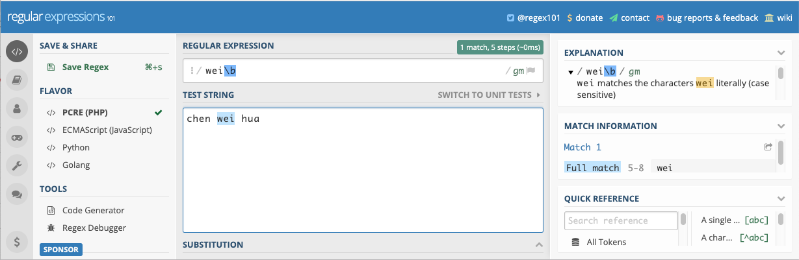
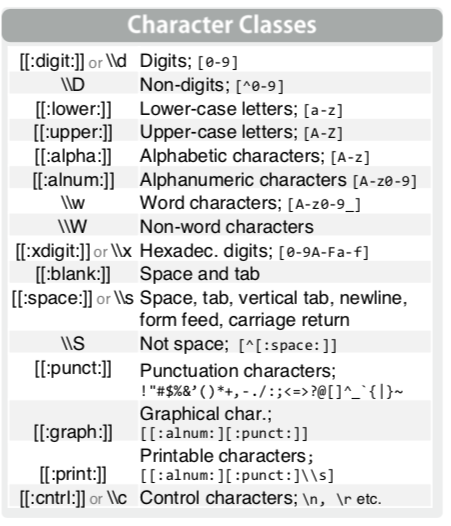
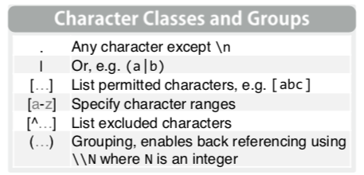
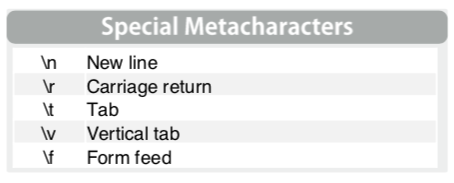
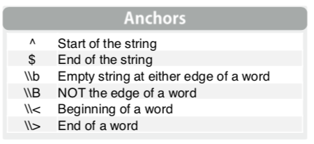
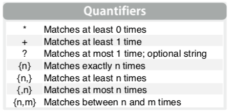

```{r include=FALSE}
color_block = function(color) {
  function(x, options) sprintf('\\color{%s}\\begin{verbatim}%s\\end{verbatim}',
                               color, x)
}

## 将错误信息用红色字体显示
knitr::knit_hooks$set(error = color_block('red'))
```

# section 1: TOC

## 前情提要

Talks so far:

1. introduction to R
2. R language basics, part 1
3. R language basics, part 2
4. R language basics, part 3, factors
5. data wrangler, part 1
6. data wrangler, part 2

## packages we have touched so far

1. tidyverse
  * dplyr
  * tidyr
  * ggplot2
2. readr
3. tibble
4. forcats
...

## 本次提要

```stringr ```

1. basics
 * length
 * uppercase, lowercase
 * unite, separate
 * string comparisons, sub string
2. regular expression

# section 2: simple `string` manipulations ... 

## get ready for the class

\FontSmall

```{r}
library(tidyverse);
library(stringr);
```

\FontNormal

其它著名的 packages 

* ```stringi```

## string

\FontSmall

```{r}
string1 <- "This is a string";
string2 <- 'If I want to include a "quote" inside a string, I use single quotes';


( string3 <- "a multiline 
string" );

## 注意与上面的区别
writeLines( string3 );
```

## quotes & other special characters

\FontSmall

```{r}
( double_quote <- "\"" );
( single_quote <- '\'' );

( x <- "\u00b5" )

## 注意不同！！！！ 
( y <- "\\" )
writeLines( y );
```

## string length

\FontSmall 

```{r}
## 系统自带
nchar( c("a", "R for data science", NA) );

## stringr
str_length(c("a", "R for data science", NA));
```

## string combine 

\FontSmall

```{r}
## 系统自带
paste( "a", "b", "c", sep = "" );

## stringr 
str_c( "a", "b", "c" );
```

```{r}
paste( c( "a", "b", "c" ), 2, sep = "" );
str_c( c( "a", "b", "c" ), 2 );
```

## string comparison

\FontSmall 

```{r}
## direct comparison ; 可用于排序 ...
"A" > "abc";

## 
library(pracma);
strcmp( "chen", "chenweihua" );
strcmpi( "chen", "CHEN" );
```


## other simple functions 

\FontSmall

```{r}
toupper( letters[1:10] );
tolower( LETTERS[1:5] );

library(stringi);
stri_reverse( "ABC" );
```

\FontNormal

**tricks**

* ``` stringi ``` package 里的 function 都以 ``` stri_ ``` 开头
* ``` strinr ``` 则以 ``` str_ ``` 开头

# section 3: regular expression basics

## what is regular expression (正则表达式) ? 

在介绍更多 string manipulation 函数之前，先介绍正则表达式:

**a sequence of characters that define a search pattern.**

\FontSmall 

```{r}
## 比如： [ab] 表示寻找a 或 b 
c( "abc", "chen", "liu", "blah" ) %>% str_subset( "[ab]" );

## 匹配并取出字符中间的数字 
c( "a1334bc", "ch13e_45n", "liu", "bl00ah" ) %>% str_extract( "\\d+" );
```

## useful tools 

https://regexr.com/
https://regex101.com/

{height=50%}

## 正则表达式的任务

1. 匹配模式

2. 匹配规则：匹配（或不匹配）什么样的字符

3. 位置规则：在何处匹配（或不匹配）

4. 数量规则：符合规则字符串的数量


## 1. 匹配模式

用于定义`模糊匹配`的模式

{height=60%}

## 1. 匹配模式2：`classes and groups`

{height=40%}


## 1. 匹配模式3：特别字符

{height=50%}

## 2. 匹配规则：匹配什么样的字符

\FontSmall

```{r}
"abc_123_??$$^" %>% str_detect( "\\s+" ); ## 此字串包括 空格 吗？ 
"abc_123_??$$^" %>% str_detect( "\\d+" ); ## 数字？？ 
"abc_123_??$$^" %>% str_detect( "\\w+" ); ## [A-z0-9_]

( string3 <- "a multiline 
string" ); ## 含有回车的字符串

string3 %>% str_detect( "\n" ); ## 
```

## 2. 匹配规则：**不匹配**什么样的字符

\FontSmall

```{r}
"abc_123_??$$^" %>% str_detect( "\\s+", negate = T ); ## 此字串 不包括 空格 吗？ 
"abc_123_??$$^" %>% str_detect( "\\d+", negate = T ); ## 数字？？ 
"abc_123_??$$^" %>% str_detect( "\\w+" , negate = T); ## [A-z0-9_]

( string3 <- "a multiline 
string" ); ## 含有回车的字符串

string3 %>% str_detect( "\n", negate = T); ## 
```

## 2. 匹配规则：**不匹配** 的其它表达方法

\FontSmall

```{r}
!str_detect( "abc_123_??$$^", "\\s+" ); ## 此字串 不包括 空格 吗？ 
!str_detect( "abc_123_??$$^", "\\d+" ); ## 数字？？ 
!str_detect( "abc_123_??$$^", "\\w+" ); ## [A-z0-9_]

( string3 <- "a multiline 
string" ); ## 含有回车的字符串

!str_detect( string3, "\n"); ## 
```

## 2. 位置规则：在何处匹配（或不匹配）

{height=40%}

## 位置匹配：示例

\FontSmall

```{r}
## 以 wei 结束的字符串
c("chen wei hua", "chen wei", "chen") %>% str_subset( "wei$" );

## 以 wei 结束的字 
c("chen wei hua", "chen wei", "chen") %>% str_subset( "wei\\b" ); 
```

## 位置**不匹配**：示例

\FontSmall

```{r}
## 以 wei 结束的字符串
c("chen wei hua", "chen wei", "chen") %>% str_subset( "wei$", negate = T );

## 以 wei 结束的字 
c("chen wei hua", "chen wei", "chen") %>% str_subset( "wei\\b" , negate = T); 
```


## 3. 数量规则：规定符合规则字符串的数量

{height=40%}

## 示例

\FontSmall

```{r}
## 
"1234abc" %>% str_extract( "\\d+" );
"1234abc" %>% str_extract( "\\d{3}" );
"1234abc" %>% str_extract( "\\d{5,6}" );
"1234abc" %>% str_extract( "\\d{2,6}" );
```


# section 4: tasks of regular expression

## tasks of regular expression 

1. detect patterns (检测)： 检查目标string里有无pattern

2. locate patterns (定位)

3. extract patterns (抽取匹配的字串)

4. replace patterns (替换)

5. split by patterns (分割)

## 1. detect patterns ： 检查目标string里有无pattern

\FontSmall

```{r}
grep( "\\d+", c( "123", "abc", "wei555hua" ) ); ## 
grepl( "\\d+", c( "123", "abc", "wei555hua" ) ); ## 
c( "123", "abc", "wei555hua" ) %>% str_detect( "\\d+" );
```


## 1. detection patterns, cont.

\FontSmall

**count patterns：统计匹配的数量**

```{r}
x <- c("why", "video", "cross", "extra", "deal", "authority");
str_detect(x, "[aeiou]");

str_count(x, "[aeiou]");
```

## 2. locate patterns (定位)

\FontSmall 

```{r}
regexpr( "\\d+", c( "123", "abc", "wei555hua" ) ); ## 
```

```{r}
 c( "123", "abc", "wei555hua" ) %>% str_locate( "\\d+" );
```


## 3. extract patterns (抽取匹配的字串)

\FontSmall 

```{r}
c( "123", "abc", "wei555hua" ) %>% str_extract ( "\\d+" );
c( "123", "abc", "wei555hua" ) %>% str_match ( "\\d+" );
```

\FontNormal 

**??** ```str_extract`` 和 ``` str_match ``` 的区别在哪？？

## `str_extract` vs. `str_match`

\FontSmall

```{r}
x;
str_extract(x, "[aeiou]");
str_match(x, "(.)[aeiou](.)"); ## extract the characters on either side of the vowel ????
```

？？ 为什么有3个输出？？？

## `str_extract_all` 和 `str_match_all` 

\FontSmall

```{r}
x;
str_extract_all( x, "[aeiou]+" );
str_match_all( x, "[aeiou]+" );
```

## 4. replace patterns (匹配并替换)

\FontSmall

```{r}
str_replace( c( "123", "abc", "wei555hua" ) , "\\d+", "###");
str_replace_all( "123_abc_456_789" , "\\d+", "###");
```

## 5. split by patterns (匹配并分割)

\FontSmall

```{r}
str_split(x, "");
```

## 其它字符串函数

\FontSmall

* sub(pattern, replacement, string)
* gsub(pattern, replacement, string)
* stringr::str_replace_all(string, pattern, replacement)

* fixed(): match exact bytes
* coll(): match human letters
* boundary(): match boundaries

更多请见 `cheatsheets/` 目录下的：

* strings.pdf
* regular_expression.pdf 

## 更多：`stringr`包内的 函数

更多内容见这里： https://stringr.tidyverse.org

## 高级应用示例

\FontSmall

```{r}
( dat <- 
tibble(chrom = readLines(textConnection("chr11:69464719-69502928
chr7:55075808-55093954
chr8:128739772-128762863
chr3:169389459-169490555
chr17:37848534-37877201
chr19:30306758-30316875
chr1:150496857-150678056
chr12:69183279-69260755
chr11:77610143-77641464
chr8:38191804-38260814
chr12:58135797-58156509")) ) );
```


## 高级应用示例, cont. 

任务：分为三列， chr, start, end

\FontSmall 

```{r}

dat$chrom %>% str_split( '[:-]', simplify = T );
```

## 高级应用示例， cont. 

另一种解决方案

\FontSmall 

```{r}
library(tidyr)
extract(dat, chrom, into=c('chr', 'chrStart', 'chrEnd'),
        '([^:]+):([^-]+)-(.*)', convert=TRUE);

## 注：直接 copy & paste 代码可能造成特殊字符有问题，比如 ^
```

# section 5: Exercise and home work

## 小结

### 今次提要

1. string basics
 * length
 * uppercase, lowercase
 * unite, separate
 * string comparisons, sub string
2. regular expression
 * detect patterns
 * locate patterns
 * extract patterns
 * replace patterns
 * split patterns ...

## 下次预告

data iteration & parallel computing

## 练习 & 作业
-   ```Exercises and homework``` 目录下 ```talk07-homework.Rmd``` 文件；

- 完成时间：见钉群的要求
