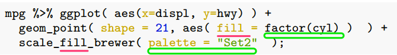

```{r include=FALSE}
color_block = function(color) {
  function(x, options) sprintf('\\color{%s}\\begin{verbatim}%s\\end{verbatim}',
                               color, x)
}

## 将错误信息用红色字体显示
knitr::knit_hooks$set(error = color_block('red'))
```


# section 1: TOC

## 前情提要

### iterations 与 并行计算

* for loop
* ``` apply ``` functions 
* ``` dplyr ``` 的本质是 遍历 
* ``` map ``` functions in ```purrr ``` package 
* 遍历 与 并行计算

### 相关包

* purrr
* parallel
* foreach
* iterators

## 本次提要

* basic plot functions
* basic ggplot2 
* special letters
* equations
* advanced ggplot2

# section 2: basic plot functions using R 

## R basic plot functions

过去几节课我们已经使用了 R basic plot 和 ggplot2 的一些绘画功能，比如讲factor时。今次我们进行系统的介绍。

基础做图由 ``` plot ``` 提供。先看示例。这里我们使用系统自带的 ``` swiss ``` 数据，它包含了47个法语地区的一些社会经济指标。

\FontSmall 

```{r}
head(swiss);
```

## 散点图 （dot plot）

我们看一下 教育 与生育率的关系：

\FontSmall

```{r fig.height=4, fig.width=10}
with( swiss, plot( Education, Fertility ) );
```

\FontNormal

**注意** ``` with ``` 的作用是什么？？

## plot 的参数初探: 先看示例

\FontSmall

```{r fig.height=4, fig.width=10}
with( swiss, plot(Education, Fertility, type = "p", main = "Swiss data 1888", 
                  sub = "Socioeconomic indicators & Fertility", 
                  xlab = "Education", ylab = "Fertility", col = "darkblue", 
                  xlim = range( Education ), ylim = range( Fertility ), 
                  pch = 20, frame.plot = F) );
```

## plot 参数， an annotated example 

{height=70%}

## plot 支持的画图类型， 参数 ``` p = '?' ``` 的取值

\FontSmall
```{r fig.height=5, fig.width=10}
par( mfrow = c(2,4) ); ### 在一张图上画 2 x 4 个 panel 
opts <- c( "p", "l", "o", "b", "c", "s", "S", "h" );
for( o in opts ){
  plot(1:5, type = o, main = paste( "type=", o ) );
}
```


## pch 是什么？ 

决定了数据点的形状，注意它的取值范围

\FontSmall

```{r fig.height=3.5, fig.width=10, warning=FALSE, message=FALSE}
library(tidyverse); library(extrafont);
ggplot( data.frame( p = c(0:25, 32:127) ) ) +
  scale_y_continuous( name = "" ) + scale_x_continuous( name = "" ) + 
  scale_shape_identity() + 
  geom_point( aes( x = p%%16, y = p%/%16, shape = p ), size = 5, fill = "red" ) + 
  geom_text( aes( x = p %% 16, y = p%/%16 + 0.4, label = p  ), size = 3 );
```

## log transform aexes 

``` plot ``` 还有一些其它有用的参数，详见： ``` ? plot.default ``` 

\FontSmall 

```{r fig.height=3.5, fig.width=10}
with( swiss, plot(Education, Fertility, type = "p", main = "Swiss data 1888", 
                  sub = "Socioeconomic indicators & Fertility", 
                  xlab = "Education", ylab = "Fertility", col = c("darkblue", "darkred"), 
                  xlim = range( Education ), ylim = range( Fertility ), 
                  pch = 0:25, frame.plot = F, log = "xy") );
## 注： 也可以用 log='x' 或 log='y' 只对一个axis 进行 log 处理
```

## ggplot 版本

\FontSmall 

```{r fig.height=4, fig.width=10}
ggplot( swiss, aes( x = Education, y = Fertility ) ) + 
  geom_point(  ) + scale_x_log10() + scale_y_log10() + 
  xlab( "Education" ) + ylab( "Fertility" ) + 
  ggtitle( "Swiss data 1888" );
```

## ggplot 更多散点示例

以 ``` mtcars ``` 为例

\FontSmall

```{r fig.height=4, fig.width=10}
ggplot( mtcars, aes( x = wt, y = mpg, colour = factor( cyl ), shape = factor(cyl) ) ) +
  geom_point() + xlab( "Weight (1000 lbs)" ) + ylab( "Miles/(US) gallon" ) +
  labs( colour = "Number of cylinders", shape = "Number of cylinders" ) ;
```

## plot: high-level vs. low-level plots

* **high level**: plotting functions create a new plot on the graphics device
* **low level**: plotting functions add more information to an existing plot

\FontSmall

```{r fig.height=4, fig.width=10}
plot( 1:10, col = "red" ); ## high level 
points( sample(1:10, 10), col = "darkgreen", pch = 20 ); ## low level
```

## low level plots 列表 
* ``` points ``` : 点图
* ``` lines ``` : 线图
* ``` abline ``` : 直线
* ``` polygon ``` : 多边形
* ``` legend ``` : 图例
* ``` title ``` ： 标题
* ``` axis ``` : 轴
... 

## high level plots 列表

* ``` plot ``` : 通用画图函数
* ``` pairs ``` 
* ``` coplot ``` 
* ``` qqnorm ``` 
* ``` hist ``` 
* ``` dotchart ``` 
* ``` image ``` 
* ``` contour ``` 
... 

**注**： 可以用 ``` add = TRUE ``` 参数（如果可用）将 high level 函数强制转换为 low level 

## 图形相关参数（系统函数）

``` par() ``` 函数： 显示或修改当前**图形设备**的参数。用以下命令查看支持的内容：

\FontSmall

```{r}
par( c( "mar", "bg" ) ); ## 显示指定参数的值
## 显示所有参数 
par(); 
```

## 调整 ``` par() ``` 参数前请备份

``` par() ``` 用于指定全局参数，因此在改变前尽量备份

\FontSmall

```{r eval=FALSE}
oldpar <- par(); ## 备份

do some changes here ... 

## 恢复
par( oldpar ); 
```

## 常用图形参数及调整: margin

图形边距（ figure margins ）

\FontSmall 
``` {r eval=FALSE} 
par( mar = c( 5.1, 4.1, 4.1, 2.1 )); ## 设置新 martin 
```

\FontNormal 

分别指定 下 -> 左 -> 上 -> 右 的边距，即从下面开始，顺时针移动。

单位是： text lines  

或：

\FontSmall 

``` {r eval=FALSE} 
par( mai = c( 5.1, 4.1, 4.1, 2.1 )); ## 设置新 martin 
```

\FontNormal 

单位是： inch 

## 常用图形参数及调整: 多panel 

画 2x3 共 6个panel，从左到右。（2行3列）

\FontSmall 

```{r fig.height=4, fig.width=10}
par( mfrow=c(2,3) );
for( i in 1:6 )
  plot( sample( 1:10, 10 ), main = i );
```

## 常用图形参数及调整: 多panel , cont.

\FontNormal

画 2x3 共 6个panel，从上到下。（2行3列）

\FontSmall 

```{r fig.height=4, fig.width=10}
par( mfcol=c(2,3) );
for( i in 1:6 )
  plot( sample( 1:10, 10 ), main = i );
```

## 重要概念：图形设备

**图形设备**是指图形输出的设备，可以将**图形设备**理解为**保存格式** 。

默认设备是：

* X11() : *nix 
* windows() : windows 
* quartz() : OS X 

图形显示在**显示器**上。

## 图形设备：cont. 

常用其它设备有：

* pdf() 
* png()
* jpeg() 

分别对应输出文件格式。

## 常用图形设备： pdf() 

使用方法如下：

\FontSmall 
```{r eval=FALSE}
pdf( file = "/path/to/dir/<file_name>.pdf", height = 5, width = 5 ); ## 创建一个新设备/ pdf 文件 
plot(1:10); ## 作图；
dev.off(); ## 关闭设备
```

\FontNormal 

**说明**

1. 默认文件名为 ``` Rplots.pdf ``` ，
2. ```dev.off() ``` 必须关闭。关闭后，返回到最近使用的图形设备
3. ``` height ``` 和 ``` width ``` 参数的单位是 inch 
4. 如果运行多个 high level 作图命令，则会产生**多页pdf** 


## 请尽量使用 pdf 作为文件输出格式

1. 生信图片大多是点线图，适合保存为矢量格式（如pdf, ps 等）；
2. 矢量图可无限放大而不失真（变成像素）；
3. 可由 Adobe Illustrator 等矢量图软件进行编辑

# section 3: ggplot2 基础

## 一个简单的示例

\FontSmall

```{r}
## 准备数据
year1 <- c(7, 12, 28, 3, 41);
year2 <- c(14, 7, 6, 19, 3);

df <- rbind( tibble( month = 1:length( year1 ), value = year1, cat = "Year1" ),
             tibble( month = 1:length( year2 ), value = year2, cat = "Year2 ") );

plot1 <-  ## 将图保存在变量中；
  ggplot( df, aes( x = month, y = value, colour = cat) ) + 
  geom_line() + geom_point() + 
  xlab( "Month" ) + ylab( "Rain fall" ) +
  labs( colour = "Year");
```


## 画图

\FontSmall

```{r fig.width=10, fig.height=4}
plot1;  ## 画图
```

## ggplot2 基础概念详解

{height=20%}

\FontSmall

1. **aes** (aesthetics)美学：控制全局参数，包括：x,y轴使用的数据，颜色( colour, fill) ，形状 ( shape )，大小 ( size )，分组 ( group ) 等等；

2. **图层**： ``` geom_<layer_name> ``` ；每张图可有多个图层（此处有两个）；图层可使用全局数据 (df) 和参数 (aes)，也可以使用自己的 aes 和 数据；

3. 其它控制函数

## ggplot2 优缺点

ggplot2 优点：

1. 强大又专业
2. 复杂又好看
3. canvas 大小，坐标会根据数据、图层自动调整，让用户专注于作图本身；

缺点：

太难学！

## 图层使用自己的数据，示例

\FontSmall

图层可从 `ggplot` 继承**数据** 和 其它参数，包括 **aes**，但也可使用自己的


```{r fig.height=3, fig.width=10}
plot1 + 
  geom_point( data = data.frame( x2 = 1:5, y2 = sample(30:100, 5) ),  ## 注意： data = 是必须的
          aes( x = x2, y = y2 ),  ## 使用自己的 aes ... 
          colour =  c("darkgreen", "red", "blue", "gold", "purple") , shape = 15, size = 4 )
```


**要点**

1. 如上所见，xy -axes 会随数据自动调整

2. ggplot2 作图结果可以保存在变量中，并可累加更多图层

3. 图层使用自己的数据时，需要用 ``` data =  ``` 指定；而全局数据则不用 ``` ggplot ( data.frame( ... ) ) ```


# section 4: ggplot2作图的四个基本组成部分详解

## 1. 图层

### ```geom_<图层名>```

* ``` geom_point ``` , ``` geom_line ```: 点线图，用于揭示两组数据间的关系；
* ``` geom_smooth ``` : 常与 ``` geom_point ``` 联合使用，揭示数据走势
* ``` geom_bar ``` ： bar 图
* ``` geom_boxplot ``` : 箱线图，用于比较N组数据，揭示区别
* ``` geom_path ``` : 与``` geom_line ``` 相似，但也可以画其它复杂图形
* ``` geom_histogram ```, `` geom_density ``` : 数据的分布，也可用于多组间的比较
* 其它十余种，请见“ggplot2 : elegant graphics for data analysis” 一书！！

## 2. ```scale``` 显示控制

### 基本规则

* ```scale_<控制内容>_<控制手段>```，e.g. ```scale_color_manual()```： 以**手选方式** 控制 **颜色**

### 四种控制类型

* ```scale_color_...```
* ```scale_fill_...```
* ```scale_shape_...```
* ```scale_size_...```

{height=25%}

## 2.1 改变颜色 

\FontSmall

```{r fig.height=2.5, fig.width=8}
library(ggplot2);
ggplot(iris, aes(x=Sepal.Length, y=Sepal.Width, color=Species)) +
  geom_point(size=2);
```


解释：

* 使用 `iris` 里 **萼片** 大小数据；

* `colour = Species`：根据 `Species` 列决定颜色；

* 共需要 **3种** 颜色；

* 由**默认色板**决定；

## 默认的色板

{height=40%}

\FontSmall

* 根据需要的颜色数量，取相应的行

## 使用其它色板，比如 `scale_colour_brewer()` 

{height=90%}

## `scale_colour_brewer()`, 使用示例

\FontSmall

```{r fig.height=3, fig.width=8}
ggplot(iris, aes(x=Sepal.Length, y=Sepal.Width, color=Species)) + geom_point(size=2) + 
  scale_color_brewer( palette = "Set1" );
```

* 使用方法：```scale_color_brewer( palette = "<palette name>" );```

* 取**前N个**颜色

## `scale_color_brewer` 提供的其它色板

\FontSmall

### Diverging

BrBG, PiYG, PRGn, PuOr, RdBu, RdGy, RdYlBu, RdYlGn, Spectral

### Qualitative
Accent, Dark2, Paired, Pastel1, Pastel2, **Set1**, Set2, Set3

### Sequential
Blues, BuGn, BuPu, GnBu, Greens, Greys, Oranges, OrRd, PuBu, PuBuGn, PuRd, Purples, RdPu, Reds, YlGn, YlGnBu, YlOrBr, YlOrRd

## 手动设置颜色 : `scale_colour_manual()`

\FontSmall

```{r fig.height=4, fig.width=10}
mtcars %>% ggplot( aes(disp, mpg) ) + geom_point( aes( color = factor(cyl) ) ) +
  scale_color_manual( breaks = c("4","6","8"), values = c("red","green","blue") );
```

## 如何对应**数量**与颜色？使用**渐变颜色**！

\FontSmall

```{r fig.height=4, fig.width=10}
mpg %>% ggplot( aes(displ, hwy) ) + geom_point( aes( color = displ ) );
```

* 根据 `displ` 排气量 的值显色；

* 默认使用2色；

## 用`scale_color_gradient()` 改变渐变颜色

\FontSmall

```{r eval=FALSE}
scale_colour_gradient(
  ...,
  low = "#132B43",
  high = "#56B1F7",
  space = "Lab",
  na.value = "grey50",
  guide = "colourbar",
  aesthetics = "colour"
)
```

改变 low 和 high 的值即可；

## `scale_color_gradient()` 举例

\FontSmall

```{r fig.height=4, fig.width=10}
mpg %>% ggplot( aes(displ, hwy) ) + geom_point( aes( color = displ ) ) +
  scale_color_gradient( low = "black", high = "yellow" );
```

## 使用**3个**渐变色？用 `scale_color_gradient2()` 

\FontSmall

```{r fig.height=4, fig.width=10}
mpg %>% ggplot( aes(displ, hwy) ) + geom_point( aes( color = displ ) ) +
  scale_colour_gradient2( low = "black", mid = "red", high = "yellow", midpoint = 4.5 );
```

* 三个颜色：`low` `mid` `high`

* **注意**  `midpoint` 参数！！

## 更多颜色？使用 `scale_colour_gradientn` 

\FontSmall

```{r fig.height=4, fig.width=10}
mpg %>% ggplot( aes(displ, hwy) ) + geom_point( aes( color = displ ) ) +
  scale_colour_gradientn( colors = c("black","red", "yellow", "blue", "pink") );
```

## 一种有趣的渐变色显示方法 ： `scale_colour_binned` 

\FontSmall

```{r fig.height=4, fig.width=10}
mpg %>% ggplot( aes(displ, hwy) ) + geom_point( aes( color = displ ) ) +
  scale_color_binned( low = "black", high = "yellow" );
```

* 渐变色，但分组显示

## 2.2 `fill` 颜色

\FontSmall

### `fill`与`colour`有什么区别？？？

* `colour` defines the colour with which a geom is **outlined** (the shape's "stroke")

* `fill`defines the colour with which a geom is **filled**

### 哪些 pch 们有 `fill` ？？

* Points generally only have a `colour` and **no fill**

* However, point shapes **21–25** that include **both** a colour and a fill.

## `fill`与`colour`有啥区别？？？(again)

\FontSmall

找一个有两种属性的 point (pch = 21)，先看 `fill` 的效果；

```{r fig.height=4, fig.width=10}
mpg %>% ggplot( aes(displ, hwy) ) + 
  geom_point( aes( colour = cyl ), shape = 21, stroke = 3);
```

### 说明

* `colour` 在 shape = 21时，为描边（stroke）色；

* 可用 `stroke` 控制 线条粗细；

## `fill`与`colour`有啥区别？？？, cont.

\FontSmall

同时有 fill 和 colour 

```{r fig.height=4, fig.width=10}
mpg %>% ggplot( aes(displ, hwy) ) + 
  geom_point( aes( colour = cyl, fill = class ), 
              shape = 21, size = 3,
              stroke = 2);
```

## fill 的调色板 与 colour 一样！

\FontSmall

先看看离散值的色板

```{r fig.height=4, fig.width=10}
mpg %>% ggplot( aes(displ, hwy) ) + 
  geom_point( aes( fill = class ), shape = 21, stroke = 1.5) +
  scale_fill_brewer( palette = "Set1" ) 
```

注： 默认的 stroke 颜色为 `black`；

## fill 的 gradient 色板

\FontSmall

```{r fig.height=4, fig.width=10}
mpg %>% ggplot( aes(displ, hwy) ) + 
  geom_point( aes( fill = cyl ), shape = 21, stroke = 1) +
  scale_fill_gradient( low = "yellow", high = "blue" ) ;
```

注： 默认的 stroke 颜色为 `black`；

## `fill` 与 `colour` 小结

\FontSmall

1. 做到两个匹配，即：

a) `aes` 参数 (如 `fill = `) 与 函数 (如 `scale_fill_xxx`) 匹配；`colour` 也是如此；
b) 数据类型与色板类型匹配：数量配渐变，离散配离散；

{height=40%}

2. 两者色板是通用的；函数也是，比如 `scale_fill_xx` 对应 `scale_colour_xx`;

3. 有些 shape / pch 只有 colour (stroke)，有些则两者都有；

## 其它颜色相关函数

\FontSmall

* scale_fill_continuous, scale_colour_continuous 

* scale_fill_manual, scale_colour_manual 

... 

## 其它包中的调色板和相应函数

### included in ggplot2

`scale_color_hue`, `scale_color_manual`, `scale_color_grey`, `scale_colour_viridis_d`, `scale_color_brewer` ...

### from the `RColorBrewer` package

`scale_color_brewer(palette = "<palette name>")` ... note: 函数属于 ggplot2

### from the `viridis` package 

`scale_color_viridis( discrete=TRUE, option="<palette name>" )` note: 提供了函数和palette

### other packages ... 

* `paletteer` package: `scale_color_paletteer_xx` functions

* `ggsci` package


## ``` ggsci ```: 论文发表用的色板!!!

\FontSmall

### install 
```{r eval=FALSE}
install.packages("ggsci"); # Install ggsci from CRAN:
devtools::install_github("nanxstats/ggsci"); # or from github
```

### contents

``` scale_color_<journal> ``` 和 ``` scale_fill_<journal> ``` functions and color palettes

### supported journals

* NPG `scale_color_npg()`, `scale_fill_npg()`
* AAAS, NEJM, Lancet, JAMA ... 

## ggsci 举例
\FontSmall

```{r warning=FALSE, message=FALSE}
library("ggsci")
library("ggplot2")
library("gridExtra")
data("diamonds")
p1 <- ggplot(
  subset(diamonds, carat >= 2.2),
  aes(x = table, y = price, colour = cut)
) +
  geom_point(alpha = 0.7) +
  geom_smooth(method = "loess", alpha = 0.05, size = 1, span = 1) +
  theme_bw() + labs( tag = "A" )

p2 <- ggplot(
  subset(diamonds, carat > 2.2 & depth > 55 & depth < 70),
  aes(x = depth, fill = cut)
) +
  geom_histogram(colour = "black", binwidth = 1, position = "dodge") +
  theme_bw() + labs( tag = "B" )
```

\FontNormal

**要点** 

* ``` library(gridExtra) ``` 

## ggsci 结果, Nature Style !! 

\FontSmall

```{r fig.width=10, fig.height=4}
p1_npg <- p1 + scale_color_npg()
p2_npg <- p2 + scale_fill_npg()
grid.arrange(p1_npg, p2_npg, ncol = 2)
```

## 2.3 `size` 

\FontSmall

```{r fig.height=4, fig.width=10}
mpg %>% ggplot( aes(displ, hwy) ) + 
  geom_point( aes( size = cyl, colour = class  ) );
```

* size : 用 cyl 列的值确定大小

## 2.4 `shape` 

\FontSmall

```{r fig.height=4, fig.width=10, warning=FALSE, message=FALSE}
mpg %>% ggplot( aes(displ, hwy) ) + 
  geom_point( aes( size = cyl, colour = class, shape = class  ) );
```

## 问题： `size`, `colour` 等参数可在 `aes()` 内部，也可在外部，有什么区别？？？

\FontSmall

在内部时，以指定列的值确定**大小**，或按 factor 的数量确定颜色、形状的**数量**：

```{r eval=FALSE}
mpg %>% ggplot( aes(displ, hwy) ) + 
  geom_point( aes( size = cyl, colour = class, shape = class  ) );
```

在外部时，则以**指定值**为准：

```{r eval=FALSE}
mpg %>% ggplot( aes(displ, hwy) ) + 
  geom_point( size = 2, colour = "green", shape = 21 );
```

注： size 等接受的值，长度要么为1，要么与行数等长；

## ggplot2要素3： 坐标系统

### 线性坐标系统
  
  * `coord_cartesian()`, 
  * `coord_flip()`, 
  * `coord_fixed()`
  
### 非线性坐标系统

  * `coord_trans()`
  * `coord_polar()`
  * `coord_map()`
  
## 3.1 线性坐标系统， coord_cartesian()

\FontSmall

默认的坐标系统，可使用 xlim, ylim 等参数，实现**缩放局部**

```{r fig.height=3, fig.width=10, warning=FALSE, message=FALSE}
p1 <- ggplot(mpg, aes(displ, hwy)) + 
  geom_point() + geom_smooth()

p1 + coord_cartesian(xlim = c(4, 6))
```

## 3.1 线性坐标系统， coord_flip()

exchange the x and y axes

\FontSmall

```{r fig.height=4, fig.width=10, warning=FALSE, message=FALSE}
ggplot(mpg, aes(displ, cty)) + 
  geom_point() + geom_smooth() + 
  coord_flip()
```

## 3.1 线性坐标系统， coord_fixed()

\FontSmall

用特定的长宽比例 (aspect ratio) 作图，如下图所示：

```{r fig.height=3, fig.width=10, warning=FALSE, message=FALSE}
ggplot(mpg, aes(displ, cty)) + 
  geom_point() + geom_smooth() + 
  coord_fixed(ratio = 1) ## ratio = y/x
```

## 3.2 非线性，`coord_trans()`

\FontSmall

x, y 轴的转换；先生成原图

```{r fig.height=3, fig.width=10}
rect <- data.frame(x = 50, y = 50)
line <- data.frame(x = c(1, 200), y = c(100, 1))
base <- ggplot(mapping = aes(x, y)) + 
  geom_tile(data = rect, aes(width = 50, height = 50)) + 
  geom_line(data = line)

base ; ## 画出来
```

## 3.2 非线性，`coord_trans()`, cont.

\FontSmall

log10(y): 

```{r fig.height=3, fig.width=10}
base + coord_trans(y = "log10");
```

```coord_trans()```的其它参数：

* limx, limy: 限制xy的显示范围


## 3.2 非线性，coord_polar()

\FontSmall

```{r fig.height=3, fig.width=10}
base + coord_polar(); ## 默认为 coord_polar("x")
```

## 3.2 非线性，coord_polar(), cont.

\FontSmall

```{r fig.height=3, fig.width=10}
base + coord_polar("y");
```

## 3.2 非线性，coord_polar(), 柱图变饼图

\FontSmall

```{r fig.height=2.6, fig.width=10}
base <- ggplot(mtcars, aes(factor(1), fill = factor(cyl))) +
  geom_bar(width = 1) + theme(legend.position = "none") + 
  scale_x_discrete(NULL, expand = c(0, 0)) +
  scale_y_continuous(NULL, expand = c(0, 0))

base + coord_polar(theta = "y") ## 变饼图
```

## 3.2 非线性，coord_map()

\FontSmall

世界地图

```{r fig.height=3, fig.width=10}
world <- map_data("world")
worldmap <- ggplot(world, aes(long, lat, group = group)) +
  geom_path() +
  scale_y_continuous(NULL, breaks = (-2:3) * 30, labels = NULL) +
  scale_x_continuous(NULL, breaks = (-4:4) * 45, labels = NULL)

worldmap; ## 画出来
```


## 3.2 非线性，coord_map(), cont.

\FontSmall

球形图

```{r fig.height=3, fig.width=10, message=FALSE, warning=FALSE}
library(mapproj);
worldmap + coord_map("ortho");
```

更多内容可以见《ggplot2: elegant graphics for data analysis》一书的第7章。

## ggplot2要素4： faceting ... 

Faceting generates small multiples each showing a different subset of the data.

``` facet_grid( <by_row> ~ <by_col> ) ``` 汽缸、车重与燃油效率间的关系

\FontSmall 

```{r fig.height=3, fig.width=10}
ggplot( mtcars, aes( x = wt, y = mpg ) ) +
  geom_point() +
  facet_grid( . ~ cyl, scales = "free" );
```

## faceting , cont. 

\FontSmall 

```{r fig.height=3, fig.width=10}
ggplot( mtcars, aes( x = wt, y = mpg ) ) +
  geom_point() +
  facet_grid( cyl ~ . );
```

** 注意 ** 

作图相关概念： panel, strip, axis, tick, tick label, axis label

## ``` facet_grid ``` , cont.

\FontSmall

```{r fig.height=4, fig.width=10}
ggplot( mtcars, aes( x = wt, y = mpg ) ) +
  geom_point() + geom_smooth( method = "lm" ) + 
  facet_grid( . ~ cyl );
```

## ``` facet_wrap ``` 

指定行、列数和方向

\FontSmall

```{r fig.height=4, fig.width=10}
ggplot( mtcars, aes( x = wt, y = mpg ) ) +
  geom_point() + geom_smooth( method = "lm" ) + 
  facet_wrap( . ~ cyl , ncol = 2, dir = "v" );
```

## parameters of `facet_wrap`

\FontSmall

```{r eval=FALSE}
facet_wrap(
  facets,
  nrow = NULL,
  ncol = NULL,
  scales = "fixed",
  shrink = TRUE,
  labeller = "label_value",
  as.table = TRUE,
  switch = NULL,
  drop = TRUE,
  dir = "h",
  strip.position = "top"
)
```


## ggplot2 小结

\FontSmall

### layered grammer (图层语法) 的成分

* 图层 ( geom_xxx )
* scale ( scale_xxx )
* 坐标系统
* faceting ( facet_xxx )

# ggplot2 进阶 1 ：如何在一张图中画多个panel？

## key requirements for multi-panel plots

* order / position
* labeling
* layout 

## combine multiple plots

Useful packages:

* `gridExtra`
* `cowplot` 
* `grid`
* `lattice`

\FontSmall

install or load packages

```{r}
if (!require("gridExtra")){ 
  install.packages("gridExtra");
} 

if (!require("cowplot")){ 
  install.packages("cowplot");
} 

library( cowplot );
library( gridExtra );
```

## arranging multiple graphs using cowplot 

Prepare two plots

\FontSmall

```{r}
sp <- ggplot(mpg, aes(x = cty, y = hwy, colour = factor(cyl)))+ 
  geom_point(size=2.5)
# Bar plot
bp <- ggplot(diamonds, aes(clarity, fill = cut)) +
  geom_bar() +
  theme(axis.text.x = element_text(angle=70, vjust=0.5))
```

Combine the two plots (the scatter plot and the bar plot):

```{r fig.height=3, fig.width=10}
cowplot::plot_grid(sp, bp, labels=c("A", "B"), ncol = 2, nrow = 1)
```

## `plot_grid` parameters

\FontSmall

```{r eval=FALSE}
plot_grid(
  ...,
  plotlist = NULL,
  align = c("none", "h", "v", "hv"),
  axis = c("none", "l", "r", "t", "b", "lr", "tb", "tblr"),
  nrow = NULL,
  ncol = NULL,
  rel_widths = 1,
  rel_heights = 1,
  labels = NULL,
  label_size = 14,
  label_fontfamily = NULL,
  label_fontface = "bold",
  label_colour = NULL,
  label_x = 0,
  label_y = 1,
  hjust = -0.5,
  vjust = 1.5,
  scale = 1,
  greedy = TRUE,
  byrow = TRUE,
  cols = NULL,
  rows = NULL
)
```

## 用`draw_plot` 调整graph的相对大小

\FontSmall

先生成一个新的panel

```{r fig.height=3, fig.width=10}
plot.iris <- ggplot(iris, aes(Sepal.Length, Sepal.Width)) + 
  geom_point() + facet_grid(. ~ Species) + stat_smooth(method = "lm") +
  background_grid(major = 'y', minor = "none") + # add thin horizontal lines 
  panel_border();
plot.iris;
```

## 用`draw_plot` 将三个panel画在一起

\FontSmall

```{r}
plot <- 
  ggdraw() +
  draw_plot(plot.iris, x=0, y=.5, width=1, height=.5) +
  draw_plot(sp, 0, 0, .5, .5) +
  draw_plot(bp, .5, 0, .5, .5) +
  draw_plot_label(c("A", "B", "C"), c(0, 0, 0.5), c(1, 0.5, 0.5), size = 15);
```

`draw_plot(plot, x = 0, y = 0, width = 1, height = 1)` 详解：

* plot: the plot to place (ggplot2 or a gtable)
* x: The x location of the lower left corner of the plot.
* y: The y location of the lower left corner of the plot.
* width, height: the width and the height of the plot

## `draw_plot` results

\FontSmall

```{r fig.height=6, fig.width=10}
plot
```

## ```draw_plot_label``` parameters

\FontSmall

Use `draw_plot_label` to add the labels

```{r eval=FALSE}
draw_plot_label(c("A", "B", "C"), c(0, 0, 0.5), c(1, 0.5, 0.5), size = 15);

draw_plot_label(
  label,
  x = 0,
  y = 1,
  hjust = -0.5,
  vjust = 1.5,
  size = 16,
  fontface = "bold",
  family = NULL,
  color = NULL,
  colour,
  ...
)
```

## use `gridExtra::grid.arrange` to arrange multiple graphs

\FontSmall

Create four plots

```{r message=FALSE, warning=FALSE, error=FALSE}
library(ggplot2); library("gridExtra");
df <- ToothGrowth
df$dose <- as.factor(df$dose)

bp <- ggplot(df, aes(x=dose, y=len, color=dose)) +
  geom_boxplot() + 
  theme(legend.position = "none") + labs( tag = "A");
dp <- ggplot(df, aes(x=dose, y=len, fill=dose)) +
  geom_dotplot(binaxis='y', stackdir='center')+
  stat_summary(fun.data=mean_sdl, mult=1, 
                 geom="pointrange", color="red")+
   theme(legend.position = "none") + labs( tag = "B")
vp <- ggplot(df, aes(x=factor(dose), y=len)) +
  geom_violin()+
  geom_boxplot(width=0.1) + labs( tag = "C")
sc <- ggplot(df, aes(x=dose, y=len, color=dose, shape=dose)) +
  geom_jitter(position=position_jitter(0.2))+
  theme(legend.position = "none") +
  theme_gray() + labs( tag = "D")
```

## use `gridExtra::grid.arrange` to arrange multiple graphs, cont.

\FontSmall

```{r fig.height=6, fig.width=10}
grid.arrange(bp, dp, vp, sc, ncol=2, nrow =2);
```

## use `layout_matrix` parameter in `grid.arrange` 

\FontSmall

```{r fig.height=6, fig.width=10}
grid.arrange(bp, dp, vp, sc, ncol = 2, 
             layout_matrix = cbind(c(1,1,1), c(2,3,4)));
```

## explain `layout_matrix`

\FontSmall

```{r eval=FALSE, fig.width=8, fig.height=6}
grid.arrange(bp, dp, vp, sc, 
             ncol = 2,  ## two columns 
             layout_matrix = cbind(c(1,1,1), c(2,3,4)) ## specify the layout
             );
```

How the layout look like??

```{r}
cbind(c(1,1,1), c(2,3,4));
```

## make a different layout??? 

\FontSmall

three columns, A and B take the first two, C and D take the third one.

```{r}
( laymat = cbind(c(1,1), c(2,2), c(3,4)) );
```

```{r fig.width=8, fig.height=4, message=FALSE, error=FALSE, warning=FALSE}
grid.arrange(bp, dp, vp, sc,
             ncol = 3, layout_matrix = laymat);
```

## Add a common legend for multiple ggplot2 graphs

\FontSmall

Prepare a function to extract legend from a plot. Note **the legend should exist**.

```{r}
library(gridExtra)
get_legend<-function(myggplot){
  tmp <- ggplot_gtable(ggplot_build(myggplot))
  leg <- which(sapply(tmp$grobs, function(x) x$name) == "guide-box")
  legend <- tmp$grobs[[leg]]
  return(legend)
}
```

## Prepare the graphs and a legend 

\FontSmall

```{r}
## 1. Create a box plot WITH legend
bp <- ggplot(df, aes(x=dose, y=len, color=dose)) +
  geom_boxplot() + labs(tag = "A");
## 2. Create a violin plot WITHOUT legend
vp <- ggplot(df, aes(x=dose, y=len, color=dose)) +
  geom_violin()+ geom_boxplot(width=0.1) + labs( tag = "B") +
  theme(legend.position="none") ## no legend 
## 3. extract the legend from the first plot 
legend <- get_legend(bp);
## 4. remove the legend from the first plot 
bp2 <- bp + theme(legend.position="none");
```

## plot the common legned to the right 

\FontSmall

```{r fig.width=8, fig.height=4}
grid.arrange(bp2, vp, legend, ## three objects to plot
             ncol=3, ## plot by column 
             widths=c(2.3, 2.3, 0.8)); ## set the width of each graph
```

缺点：legend看起来属于B，而不是共同的。

## SOLUTION: place the legend at top and align to the center

\FontSmall

```{r fig.width=8, fig.height=4.5 }
## 1. re-make bp WITH legend, place the legend at top
bp <- ggplot(df, aes(x=dose, y=len, color=dose)) +
  geom_boxplot() + labs(tag = "A") + theme(legend.position = "top");
## 2. extract the legend 
legend <- get_legend(bp);
## 3. remove teh legend from the plot 
bp2 <- bp + theme(legend.position = "none")
## 4. plot 
grid.arrange(legend, bp2, vp,  ncol=2, nrow = 2, 
             layout_matrix = rbind(c(1,1), c(2,3)),
             widths = c(2.7, 2.7), heights = c(0.2, 2.5));
```

## Explain

\FontSmall

```{r eval=FALSE}
grid.arrange(legend, bp2, vp,  
             ncol=2, nrow = 2, 
             layout_matrix = rbind(c(1,1), c(2,3)),
             widths = c(2.7, 2.7), heights = c(0.2, 2.5));
```

```{r}
rbind(c(1,1), c(2,3));
```

* `legend` takes the first row, and has a height of `0.2`
* the other two graphs take the second row and has a height of `2.5`

## Practise on your own

\FontSmall

To place the legend at:

* the bottom, centered at the middle
* top-left
* top-right
* bottom-left
* bottom-right

## ggExtra - Add marginal histograms to ggplot2

\FontSmall

please install the package if not exists ...

`install.packages("ggExtra")`

```{r fig.width=8, fig.height=4, warning=FALSE, error=FALSE, message=FALSE}
library(ggExtra);
piris <- ggplot(iris, aes(Sepal.Length, Sepal.Width, colour = Species)) +
  geom_point()
ggMarginal(piris, groupColour = TRUE, groupFill = TRUE)
```

## 也可自己写代码实现

\FontSmall

```{r fig.height=4, fig.width=10}
piris <- ggplot(iris, aes(Sepal.Length, Sepal.Width, colour = Species)) +
  geom_point() + theme(legend.position=c(0,1), legend.justification=c(0,1))
xdensity <- ggplot(iris, aes(Sepal.Length, fill = Species)) + 
  geom_density(alpha=.5) + theme(legend.position = "none")
ydensity <- ggplot(iris, aes(Sepal.Width, fill=Species)) + 
  geom_density(alpha=.5) + theme(legend.position = "none") + coord_flip()
grid.arrange(xdensity, NULL, piris, ydensity, 
        ncol=2, nrow=2, widths=c(4, 1.4), heights=c(1.4, 4));
```

## Extended reading

### Other ggplot2 extensions

See the gallery at https://exts.ggplot2.tidyverse.org/gallery/. Or Google `ggplot2 extensions gallery`.

### Explore the `grid` package

* create graphical objects (`grobs`)
* arrange multiple grobs using `arrangeGrob` function

### Explore the `gridExtra` package

* plot table 
* ...

## 小结

Essentials for combining multiple graphs in one:

* ordering
* layout

# ggplot2 进阶 2：如何写公式？

## 散点图的进一步分析

显示两组数据间的相关性：

\FontSmall 
```{r fig.height=3, fig.width=10}
## 作图
ggplot( swiss, aes( x = Education, y = Fertility ) ) +
  geom_point( shape = 20 );

## 分析
with( swiss, cor.test( Education, Fertility  )$estimate );
```

## 在图中加入公式和统计信息

先展示一下结果

```{r echo=FALSE, fig.width=10, fig.height=5, warning=FALSE, message=FALSE}
m = lm(Fertility ~ Education, swiss);
c = cor.test( swiss$Fertility, swiss$Education );
eq <- substitute( atop( paste( italic(y), " = ",  a + b %.% italic(x), sep = ""),
                        paste( italic(r)^2, " = ", r2, ", ", italic(p)==pvalue, sep = "" ) ),
                      list(a = as.vector( format(coef(m)[1], digits = 2) ),
                           b =  as.vector(  format(coef(m)[2], digits = 2) ),
                           r2 =  as.vector( format(summary(m)$r.squared, digits = 2) ),
                           pvalue =  as.vector( format( c$p.value , digits = 2) ) )
    ); 

eq <- as.character(as.expression(eq));

ggplot(swiss, aes( x = Education,  y = Fertility ) ) +
        geom_point( shape = 20 ) +
        geom_smooth( se = T ) +
        geom_text( data = NULL,
                   aes( x = 30, y = 80, label= eq, hjust = 0, vjust = 1),
                   size = 4, parse = TRUE, inherit.aes=FALSE);
```

## 公式详解

{height=40%}

## 公式详解，cont. 

以下代码实现两个任务：

1. 将两个公式上下放置 ``` atop ( <equation_1> , <equation_2> ) ```;
2. 将公式中的某些值替换为数值 ``` substitute( <equation>, list( ... ) ) ```

\FontSmall

```{r eval=FALSE}
## 计算 ... 
m = lm(Fertility ~ Education, swiss);
c = cor.test( swiss$Fertility, swiss$Education );

## 生成公式
eq <- substitute( atop( paste( italic(y), " = ",  a + b %.% italic(x), sep = ""),
                        paste( italic(r)^2, " = ", r2, ", ", italic(p)==pvalue, sep = "" ) ),
                      list(a = as.vector( format(coef(m)[1], digits = 2) ),
                           b =  as.vector(  format(coef(m)[2], digits = 2) ),
                           r2 =  as.vector( format(summary(m)$r.squared, digits = 2) ),
                           pvalue =  as.vector( format( c$p.value , digits = 2) ) )
    ); 

## 用 as.expression 对公式进行转化 
eq <- as.character(as.expression(eq));
```


## 完整代码

\FontSmall

```{r eval=FALSE}
## 计算 ... 
m = lm(Fertility ~ Education, swiss);
c = cor.test( swiss$Fertility, swiss$Education );

## 生成公式
eq <- substitute( atop( paste( italic(y), " = ",  a + b %.% italic(x), sep = ""),
                        paste( italic(r)^2, " = ", r2, ", ", italic(p)==pvalue, sep = "" ) ),
                      list(a = as.vector( format(coef(m)[1], digits = 2) ),
                           b =  as.vector(  format(coef(m)[2], digits = 2) ),
                           r2 =  as.vector( format(summary(m)$r.squared, digits = 2) ),
                           pvalue =  as.vector( format( c$p.value , digits = 2) ) )
    ); 

## 用 as.expression 对公式进行转化  !!!! 
eq <- as.character(as.expression(eq));

## 作图，三个图层；特别是 geom_text 使用自己的 data 和 aes ... 
ggplot(swiss, aes( x = Education,  y = Fertility ) ) +
        geom_point( shape = 20 ) +
        geom_smooth( se = T ) + ## smooth line ... 
        geom_text( data = NULL,
                   aes( x = 30, y = 80, label= eq, hjust = 0, vjust = 1), ## hjust, vjust ???
                   size = 4, parse = TRUE, inherit.aes=FALSE); ## 注意： parse = TRUE ！！！
```


## equation 的其它写法（更复杂难懂）

\FontSmall

```{r eval=FALSE}
## 计算 ... 
m = lm(Fertility ~ Education, swiss);
c = cor.test( swiss$Fertility, swiss$Education );

## 生成公式
eq <- substitute( atop( italic(y) == a + b %.% italic(x),
                            italic(r)^2~"="~r2*","~italic(p)==pvalue ),
                      list(a = as.vector( format(coef(m)[1], digits = 2) ),
                           b =  as.vector(  format(coef(m)[2], digits = 2) ),
                           r2 =  as.vector( format(summary(m)$r.squared, digits = 2) ),
                           pvalue =  as.vector( format( c$p.value , digits = 2) ) )
    ); 
## 用 as.expression 对公式进行转化  !!!! 
eq <- as.character(as.expression(eq));

## 作图，三个图层；特别是 geom_text 使用自己的 data 和 aes ... 
ggplot(swiss, aes( x = Education,  y = Fertility ) ) +
        geom_point( shape = 20 ) +
        geom_smooth( se = T ) + ## smooth line ... 
        geom_text( data = NULL,
                   aes( x = 30, y = 80, label= eq, hjust = 0, vjust = 1), ## hjust, vjust ???
                   size = 4, parse = TRUE, inherit.aes=FALSE); ## 注意： parse = TRUE ！！！
```

## 公式详解

{height=40%}

**注**

* 引号两边必须有 * 或 ~ 字符，~ 表示空格，* 表示什么都没有。~~ 表示两个空格。如果公式中需要 ~ 字符怎么办？？见下面“公式示例3”。


## `hjust` 和 `vjust` 

\FontNormal

```geom_text( aes(  angle, hjust, vjust  ) ) ``` 三参数详解

\FontSmall 

```{r echo=FALSE, message=FALSE, error=FALSE, fig.width=10, fig.height=4}
td <- expand.grid(
    hjust=c(0, 0.5, 1),
    vjust=c(0, 0.5, 1),
    angle=c(0, 45, 90),
    text="text"
)

ggplot(td, aes(x=hjust, y=vjust)) + 
    geom_point() +
    geom_text(aes(label=text, angle=angle, hjust=hjust, vjust=vjust)) + 
    facet_grid(~angle) +
    scale_x_continuous(breaks=c(0, 0.5, 1), expand=c(0, 0.2)) +
    scale_y_continuous(breaks=c(0, 0.5, 1), expand=c(0, 0.2))
```


## 公式中的写法之**代数符号**

\FontSmall

|分类| R的表达式                | 显示结果                 |
|---------------------|-------------------------|----|
|代数符号|  ```expression(x + y)```  |  $x + y$         |
||```expression(x - y)```| $x-y$ |
||```expression(x * y)```|$xy$|
||```expression(x / y)```| $x/y$ |
||```expression(x %+-% y)```| $x \pm y$ |
||```expression(x %/% y)```| $x \div y$ |
||```expression(x %*% y)```| $x \times y$ |
||```expression(x %.% y)```|$x \cdot y$|
|| ```expression(x[i])``` | $x_{i}$ |
|| ```expression(x^2)``` | $x^{2}$ |
||```expression(sqrt(x))```| $\sqrt{x}$ |
||```expression(sqrt(x,y))```| $\sqrt[y]{x}$ |
||```expression(list(x,yz))```| $x,y,z$ |

... 更多，不在这里介绍了。

## 希腊字符

代码

\FontSmall 

```{r}
library(ggplot2);
greeks <- c("Alpha", "Beta", "Gamma", "Delta", "Epsilon", "Zeta",
            "Eta", "Theta", "Iota", "Kappa", "Lambda", "Mu",
            "Nu", "Xi", "Omicron", "Pi", "Rho", "Sigma",
            "Tau", "Upsilon", "Phi", "Chi", "Psi", "Omega");

dat <- data.frame( x = rep( 1:6, 4 ), y = rep( 4:1, each = 6), greek = greeks );

plot2 <- 
  ggplot( dat, aes(x=x,y=y) ) + geom_point(size = 0) +
    # 画希腊字符，注意下面两行代码的区别
    geom_text( aes( x, y + 0.1, label = tolower( greek ) ), size = 10, parse = T ) +
    geom_text( aes( x, y - 0.1, label = tolower( greek ) ), size = 5  );
```

## 希腊字符, cont. 

```{r echo=FALSE, message=FALSE, error=FALSE, fig.height=4, fig.width=10}
plot2;
```

## 公式示例

**注** 写公式的方式很多

\FontSmall

```{r fig.width=10, fig.height=4}
eq <- expression(paste(frac(1, sigma*sqrt(2*pi)), " ",
                       plain(e)^{frac(-(x-mu)^2, 2*sigma^2)}));

ggplot( data.frame(x=1:10, y=1:10), aes( x,y ) ) + 
    geom_point( size = 0 ) +
    geom_text(data = NULL, x = 5, y = 5, size = 12,
              label = as.character(eq), parse = TRUE );
```

## 公式示例2 

另一种代入变量值的方法：

\FontSmall

```{r fig.width=10, fig.height=4}
x <- 1.24;
y <- 0.6;

ex <- bquote(.(parse(text=paste( "observed (", "italic(R)^2==", 
                               x,  "^bold(", x, "), n == ", y, ")", 
                               sep = "  " ))) );

ggplot( data.frame(x=1:10, y=1:10), aes( x,y ) ) + geom_point( size = 0 ) +
    geom_text(data = NULL, x = 5, y = 5, size = 8,
              label = as.character(ex), parse = TRUE );
```

## 公式示例3

使用 paste 和 substitute :

\FontSmall

```{r fig.height=4, fig.width=10}
x_mean <- 1.5;
x_sd <- 1.2;

# 表达式
ex <- substitute(
    paste(X[i], " ~ N(", mu, "=", m, ", ", sigma^2, "=", s2, ")"),
    list(m = x_mean, s2 = x_sd^2)
);

# histogram
ggplot( data.frame( x = rnorm(100, x_mean, x_sd) ), aes( x ) ) +
    geom_histogram( binwidth=0.5 ) +
    ggtitle(ex); ## 为什么不需要 parse = TURE ???? 
```


# ggplot2 进阶3: 核心在于先计算再做图

## 举例说明

先看数据（来自talk05）：

\FontSmall
```{r message=FALSE, warning=FALSE}
grades2 <- read_delim( file = "data/talk05/grades2.txt", delim = "\t",
                       quote = "", col_names = T);
knitr::kable( grades2 );
```

## geom_bar 

任务：画出每位学生及格的课程数

\FontSmall

```{r fig.width=10, fig.height=4}
ggplot( grades2 %>% filter( grade >= 60 ), aes( name ) ) +
  geom_bar();
```

\FontNormal 

为什么会这样呢？因为 ``` geom_bar(  stat = "count" ) ``` 的默认参数是 ``` count ``` ，即数一下每个 factor 的 出现次数 。

## geom_bar , cont. 

以上命令，实际上等于：

\FontSmall 
```{r fig.width=10, fig.height=4}
## 先做统计
cnt <- grades2 %>% group_by( name ) %>% summarise( cnt = sum( grade >= 60 )  );
ggplot( cnt, aes( x = name, y = cnt ) ) +
  geom_bar( stat = "identity" );
```

## default stat behaviors (默认计算方法)

* ``` geom_bar ``` : count 
* ``` geom_boxplot ``` : boxplot 
* ``` geom_count ``` : sum
* ``` geom_density ``` : density
* ``` geom_histogram ``` : bin
* ``` geom_quantile ``` : quantile
... 

## stacked bars 

应用场景：宏基因组多样本物种丰度图

{height=50%}

## stacked bars , cont.

load data 

\FontSmall 
```{r}
speabu <-read_tsv( file = "data/talk09/mock_species_abundance.txt"  );
head( speabu );
```


## stacked bars , cont.

\FontSmall

```{r fig.width=10, fig.height=4}
ggplot( speabu, aes( x = id, y = abundance, fill = genus ) ) + 
  geom_bar( stat = "identity", position = "stack", color = "black", width = 0.2 );
```

## 指定Genus展示顺序

factor 的操纵详见第4章。

\FontSmall

```{r fig.height=4, fig.width=10}
speabu$genus <- factor( speabu$genus, levels = rev( c( "Enterobacteriaceae", "Lachnospiraceae", "Bacteroidaceae", "Lactobacillaceae", 
       "Clostridiaceae", "Ruminococcaceae", "Prevotellaceae", "Erysipelotrichaceae", "Streptococcaceae", "Enterococcaceae", "Other" ) ) );
ggplot( speabu, aes( x = id, y = abundance, fill = genus ) ) + 
  geom_bar( stat = "identity", position = "stack", color = "black", width = 0.8 );
```

## 按丰度排序

按丰度中值大小排序

\FontSmall

```{r fig.height=4, fig.width=10}
speabu$genus <- reorder( speabu$genus, speabu$abundance, median );
ggplot( speabu, aes( x = id, y = abundance, fill = genus ) ) + 
  geom_bar( stat = "identity", position = "stack", color = "white", width = 0.8 );
```


## ``` position = "stack" ``` 又是什么？？ 

``` position = "dodge" ```  : plot bars next to each other ...

\FontSmall 

``` {r fig.height=4, fig.width=10}
ggplot( speabu, aes( x = id, y = abundance, fill = genus ) ) + 
  geom_bar( stat = "identity", position = "dodge", color = "white", width = 0.8 );
```

## 显示数值  ... 

\FontSmall 

``` {r fig.height=4, fig.width=10}
## 先计算显示位置
speabu <- speabu %>% arrange( id, desc( factor( genus ) ) ) %>% 
  group_by( id ) %>% mutate( ypos = cumsum( abundance ) - abundance / 2 );
## 画图
ggplot( speabu, aes( x = id, y = abundance, fill = genus ) ) + 
  geom_bar( stat = "identity", position = "stack", color = "black", width = 0.8 ) +
  geom_text( aes( y = ypos, label = paste( abundance, "%", sep = "" ) ), color = "white" );
```

## 显示数值  ... , cont. 

**要点** 

* 使用 ``` ddplyr ``` 的 ``` cumsum() ``` 函数 ...
* 计算位置：当前累加值 - 自身值/2，使数字显示在当前值的中间
* 累加前，要对数据按 factors 进行排序；通过 ``` arrange ``` 函数实现；

## 在 ``` position = "dodge" ``` 的情况下添加 label 

\FontSmall 

```{r fig.width=10, fig.height=3}
df2 <- data.frame(supp=rep(c("VC", "OJ"), each=3),
               dose=rep(c("D0.5", "D1", "D2"),2),
              len=c(6.8, 15, 33, 4.2, 10, 29.5))
ggplot( df2, aes(x=factor(dose), y=len, fill=supp)) +
  geom_bar(stat="identity", position=position_dodge())+
  geom_text(aes(label=len), vjust=1.6, color="black",
            position = position_dodge(0.9), size=3.5)
```

## ``` position ``` 的其它取值

除了 "dodge", "stack" 之外，``` position ``` 还可以：

* ``` position = position_stack(reverse = TRUE) ```
* ``` position = position_dodge(reverse = TRUE) ```
* ``` position = position_identity() ```
* ``` position = position_jitter() ``` : jitter points to avoid overplotting ... 
* ``` position = position_nudge() ``` : is generally useful for adjusting the position of items on discrete scales by a small amount

## 不同的图层有不同默认值

\FontSmall 

```{r fig.height=3, fig.width=10}
ggplot(ToothGrowth, aes(x=factor( dose ), y=len, fill=supp)) +
  geom_boxplot()
```

\FontNormal

``` geom_boxplot() ``` : 默认为 ``` dodge ```


## 改变 `theme()`

\FontSmall 

theme调整 包括 theme() 函数，用于调整各个 elements

和 `theme_xxx()` 函数，直接使用已经定制好的内容；

```{r fig.height=4, fig.width=10}
ggplot(ToothGrowth, aes(x=factor( dose ), y=len, fill=supp)) +
  geom_boxplot() + scale_fill_brewer( palette = "Paired" ) + theme_classic();
```

## ggplot2 中的主题

* ``` theme_gray ``` : 系统默认主题
* ``` theme_bw ``` , ``` theme_linedraw ```, ``` theme_light ```, ``` theme_dark ```, ``` theme_minimal ``` , ``` theme_classic ```, ``` theme_void() ``` 

see here for a complete list: https://ggplot2.tidyverse.org/reference/ggtheme.html

## ``` theme() ``` 函数

除了 theme_<preset_name> 用于调整整体视觉效果外， ggplot2 还提供了 ``` theme() ```  函数用于细调。

* ``` line ```, ``` rect ```, ``` text ```, ``` title ``` ： 整体框架
* ``` axis.<compoment> ``` : 调整坐标轴
* ``` legend.<parameter> ``` : 调整图例
* ``` plot.<> ``` : 控制 title, subtitle 等细节
* ``` panel.<...> ``` : 调整 facet 情况下的panel （facet 下面会介绍）
* ``` strip.<...> ``` : 调整 facet 的 标题细节
... 

更多详见：

官方：https://ggplot2.tidyverse.org/reference/theme.html


## legend 细调

\FontSmall 

```{r fig.height=4, fig.width=10}
ggplot(ToothGrowth, aes(x=factor( dose ), y=len, fill=supp)) +
  geom_boxplot() + scale_fill_brewer( palette = "Paired" ) + 
  labs( fill = "Supplement", x = "Dose (mg)" ) + 
  theme( legend.position = "top" )
```


## `labs()` function: Modify axis, legend, and plot labels

\FontSmall

```{r eval=FALSE}
labs(
  ...,
  x = "<x label>",
  y = "<y label>",
  colour = "<legend title>", # 与 aes 里的 colour 配合使用
  fill = "<legend title>", # 与 aes 里的 fill 配合使用
  shape = "<legend title>", # 与 aes 里的 shape 配合使用
  title = waiver(),
  subtitle = waiver(),
  caption = waiver(),
  tag = waiver(),
  alt = waiver(),
  alt_insight = waiver()
)
```

## `labs()` with examples 

\FontSmall

```{r fig.height=4, fig.width=10}
grid.arrange(sc + labs(tag = "A"), 
             sc + labs( colour = "Dose (mg)" , tag = "B"),
             sc + labs( shape = "Dose (mg)" , tag = "C"),
             sc + labs( colour = "Dose (mg)", shape = "Dose (mg)", tag = "D"  ),
             ncol=4, nrow =1);
```

## more to read

ggplot2 的在线书

https://ggplot2-book.org/themes

# Exercise and home work

## 总结，本节内容

### ggplot2 基础

* 优缺点
* 用法
* 基本组成

### ggplot2 进阶

* 颜色和色板
* 复杂layout的实现
* 公式
* ggplot2的数据统计逻辑

### 更多阅读

* Ggplot2: Elegant Graphics for Data Analysis, Book by Hadley Wickham
* ggplot2 gallery provided by RStudio on Github

## 写在后面

1. ggplot2 博大精深，需要一门课去讲
2. 上手容易，精通难
3. 太多记忆点
4. 本节内容只涉及了基础中的基础，更多内容，包括进阶技巧和生信相关的扩展包，更多的需要同学们自行探索
5. 遇到不会的图，先百度/Google，找包和代码

## 下次预告

data summary and modeling

## 作业

-   ```Exercises and homework``` 目录下 ```talk09-homework.Rmd``` 文件；

- 完成时间：见钉群的要求