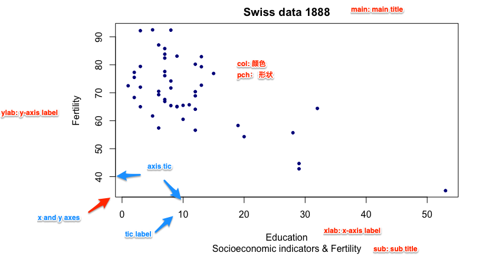
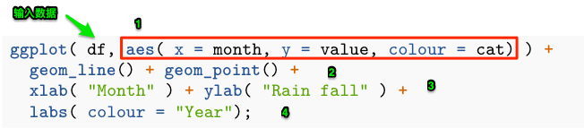
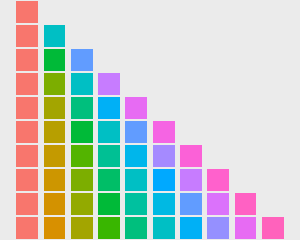
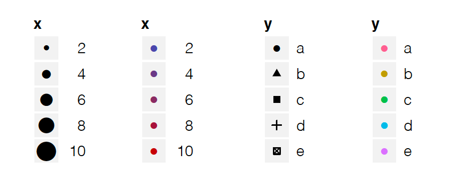
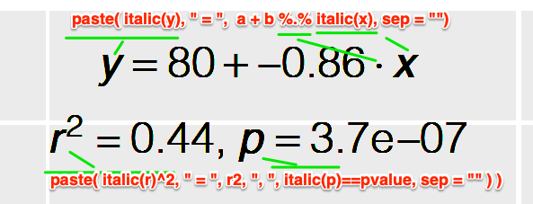
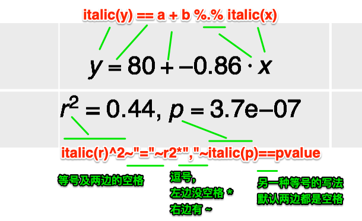
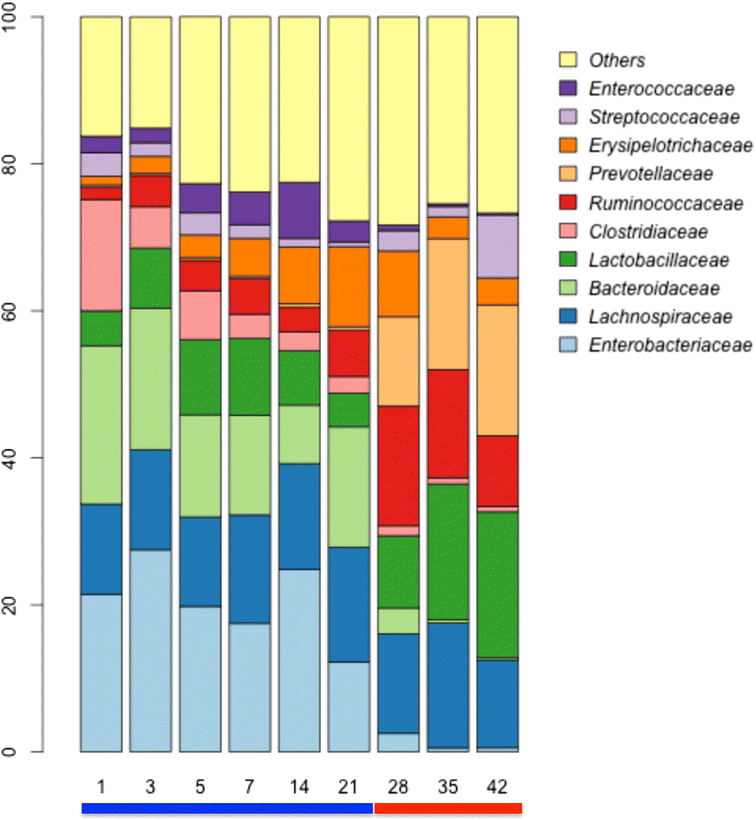
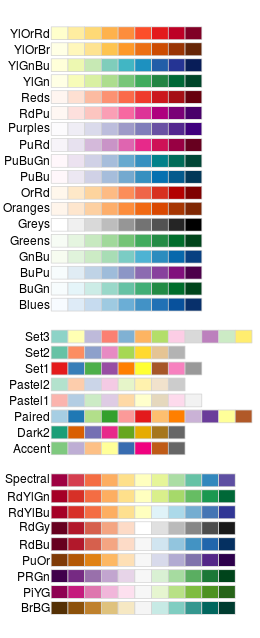

```{r include=FALSE}
color_block = function(color) {
  function(x, options) sprintf('\\color{%s}\\begin{verbatim}%s\\end{verbatim}',
                               color, x)
}

## 将错误信息用红色字体显示
knitr::knit_hooks$set(error = color_block('red'))
```


# section 1: TOC

## 前情提要

### iterations 与 并行计算

* for loop
* ``` apply ``` functions 
* ``` dplyr ``` 的本质是 遍历 
* ``` map ``` functions in ```purrr ``` package 
* 遍历 与 并行计算

### 相关包

* purrr
* parallel
* foreach
* iterators

## 本次提要

* basic plot functions
* basic ggplot2 
* special letters
* equations
* advanced ggplot2

# section 2: basic plot functions using R 

## R basic plot functions

过去几节课我们已经使用了 R basic plot 和 ggplot2 的一些绘画功能，比如讲factor时。今次我们进行系统的介绍。

基础做图由 ``` plot ``` 提供。先看示例。这里我们使用系统自带的 ``` swiss ``` 数据，它包含了47个法语地区的一些社会经济指标。

\FontSmall 

```{r}
head(swiss);
```

## 散点图 （dot plot）

我们看一下 教育 与生育率的关系：

\FontSmall

```{r fig.height=4, fig.width=10}
with( swiss, plot( Education, Fertility ) );
```

\FontNormal

**注意** ``` with ``` 的作用是什么？？

## plot 的参数初探: 先看示例

\FontSmall

```{r fig.height=4, fig.width=10}
with( swiss, plot(Education, Fertility, type = "p", main = "Swiss data 1888", 
                  sub = "Socioeconomic indicators & Fertility", 
                  xlab = "Education", ylab = "Fertility", col = "darkblue", 
                  xlim = range( Education ), ylim = range( Fertility ), 
                  pch = 20, frame.plot = F) );
```

## plot 参数， an annotated example 

{height=70%}

## plot 支持的画图类型， 参数 ``` p = '?' ``` 的取值

\FontSmall
```{r fig.height=5, fig.width=10}
par( mfrow = c(2,4) ); ### 在一张图上画 2 x 4 个 panel 
opts <- c( "p", "l", "o", "b", "c", "s", "S", "h" );
for( o in opts ){
  plot(1:5, type = o, main = paste( "type=", o ) );
}
```


## pch 是什么？ 

决定了数据点的形状，注意它的取值范围

\FontSmall

```{r fig.height=3.5, fig.width=10, warning=FALSE, message=FALSE}
library(tidyverse);
ggplot( data.frame( p = c(0:25, 32:127) ) ) +
  scale_y_continuous( name = "" ) + scale_x_continuous( name = "" ) + 
  scale_shape_identity() + 
  geom_point( aes( x = p%%16, y = p%/%16, shape = p ), size = 5, fill = "red" ) + 
  geom_text( aes( x = p %% 16, y = p%/%16 + 0.4, label = p  ), size = 3 );
```

## log transform aexes 

``` plot ``` 还有一些其它有用的参数，详见： ``` ? plot.default ``` 

\FontSmall 

```{r fig.height=3.5, fig.width=10}
with( swiss, plot(Education, Fertility, type = "p", main = "Swiss data 1888", 
                  sub = "Socioeconomic indicators & Fertility", 
                  xlab = "Education", ylab = "Fertility", col = c("darkblue", "darkred"), 
                  xlim = range( Education ), ylim = range( Fertility ), 
                  pch = 0:25, frame.plot = F, log = "xy") );
## 注： 也可以用 log='x' 或 log='y' 只对一个axis 进行 log 处理
```

## ggplot 版本

\FontSmall 

```{r fig.height=4, fig.width=10}
ggplot( swiss, aes( x = Education, y = Fertility ) ) + 
  geom_point(  ) + scale_x_log10() + scale_y_log10() + 
  xlab( "Education" ) + ylab( "Fertility" ) + 
  ggtitle( "Swiss data 1888" );
```

## ggplot 更多散点示例

以 ``` mtcars ``` 为例

\FontSmall

```{r fig.height=4, fig.width=10}
ggplot( mtcars, aes( x = wt, y = mpg, colour = factor( cyl ), shape = factor(cyl) ) ) +
  geom_point() + xlab( "Weight (1000 lbs)" ) + ylab( "Miles/(US) gallon" ) +
  labs( colour = "Number of cylinders", shape = "Number of cylinders" ) ;
```

## plot: high-level vs. low-level plots

* **high level**: plotting functions create a new plot on the graphics device
* **low level**: plotting functions add more information to an existing plot

\FontSmall

```{r fig.height=4, fig.width=10}
plot( 1:10, col = "red" ); ## high level 
points( sample(1:10, 10), col = "darkgreen", pch = 20 ); ## low level
```

## low level plots 列表 
* ``` points ``` : 点图
* ``` lines ``` : 线图
* ``` abline ``` : 直线
* ``` polygon ``` : 多边形
* ``` legend ``` : 图例
* ``` title ``` ： 标题
* ``` axis ``` : 轴
... 

## high level plots 列表

* ``` plot ``` : 通用画图函数
* ``` pairs ``` 
* ``` coplot ``` 
* ``` qqnorm ``` 
* ``` hist ``` 
* ``` dotchart ``` 
* ``` image ``` 
* ``` contour ``` 
... 

**注**： 可以用 ``` add = TRUE ``` 参数（如果可用）将 high level 函数强制转换为 low level 

## 图形相关参数（系统函数）

``` par() ``` 函数： 显示或修改当前**图形设备**的参数。用以下命令查看支持的内容：

\FontSmall

```{r}
par( c( "mar", "bg" ) ); ## 显示指定参数的值
## 显示所有参数 
par(); 
```

## 调整 ``` par() ``` 参数前请备份

``` par() ``` 用于指定全局参数，因此在改变前尽量备份

\FontSmall

```{r eval=FALSE}
oldpar <- par(); ## 备份

do some changes here ... 

## 恢复
par( oldpar ); 
```

## 常用图形参数及调整: margin

图形边距（ figure margins ）

\FontSmall 
``` {r eval=FALSE} 
par( mar = c( 5.1, 4.1, 4.1, 2.1 )); ## 设置新 martin 
```

\FontNormal 

分别指定 下 -> 左 -> 上 -> 右 的边距，即从下面开始，顺时针移动。

单位是： text lines  

或：

\FontSmall 

``` {r eval=FALSE} 
par( mai = c( 5.1, 4.1, 4.1, 2.1 )); ## 设置新 martin 
```

\FontNormal 

单位是： inch 

## 常用图形参数及调整: 多panel 

画 2x3 共 6个panel，从左到右。（2行3列）

\FontSmall 

```{r fig.height=4, fig.width=10}
par( mfrow=c(2,3) );
for( i in 1:6 )
  plot( sample( 1:10, 10 ), main = i );
```

## 常用图形参数及调整: 多panel , cont.

\FontNormal

画 2x3 共 6个panel，从上到下。（2行3列）

\FontSmall 

```{r fig.height=4, fig.width=10}
par( mfcol=c(2,3) );
for( i in 1:6 )
  plot( sample( 1:10, 10 ), main = i );
```

## 重要概念：图形设备

**图形设备**是指图形输出的设备，可以将**图形设备**理解为**保存格式** 。

默认设备是：

* X11() : *nix 
* windows() : windows 
* quartz() : OS X 

图形显示在**显示器**上。

## 图形设备：cont. 

常用其它设备有：

* pdf() 
* png()
* jpeg() 

分别对应输出文件格式。

## 常用图形设备： pdf() 

使用方法如下：

\FontSmall 
```{r eval=FALSE}
pdf( file = "/path/to/dir/<file_name>.pdf", height = 5, width = 5 ); ## 创建一个新设备/ pdf 文件 
plot(1:10); ## 作图；
dev.off(); ## 关闭设备
```

\FontNormal 

**说明**

1. 默认文件名为 ``` Rplots.pdf ``` ，
2. ```dev.off() ``` 必须关闭。关闭后，返回到最近使用的图形设备
3. ``` height ``` 和 ``` width ``` 参数的单位是 inch 
4. 如果运行多个 high level 作图命令，则会产生**多页pdf** 


## 请尽量使用 pdf 作为文件输出格式

1. 生信图片大多是点线图，适合保存为矢量格式（如pdf, ps 等）；
2. 矢量图可无限放大而不失真（变成像素）；
3. 可由 Adobe Illustrator 等矢量图软件进行编辑

# section 3: ggplot2 基础

## 为什么要使用 ggplot2 ? 从一个简单示例开始

假设画两条线：

\FontSmall

```{r fig.width=10, fig.height=4}
year1 <- c(7, 12, 28, 3, 41);
year2 <- c(14, 7, 6, 19, 3);

plot( year1, type = "o", pch = 20, col = "red", xlab = "Month", ylab = "Rain fall", 
      main = "Rain fall chart");
lines( year2, type = "o", pch = 20, col = "blue");
```

## 如果改变画线的顺序？

\FontSmall

```{r fig.width=10, fig.height=4}
plot( year2, type = "o", pch = 20, col = "blue", xlab = "Month", ylab = "Rain fall", 
      main = "Rain fall chart");
lines( year1, type = "o", pch = 20, col = "red");
```

## ggplot2 的方法

\FontSmall 

```{r fig.width=10, fig.height=3}
df <- rbind( tibble( month = 1:length( year1 ), value = year1, cat = "Year1" ), tibble( month = 1:length( year2 ), value = year2, cat = "Year2 ") );

plot1 <-  ## 将图保存在变量中；
  ggplot( df, aes( x = month, y = value, colour = cat) ) + 
  geom_line() + geom_point() + 
  xlab( "Month" ) + ylab( "Rain fall" ) +
  labs( colour = "Year");
plot1;  ## 画图
```

## ggplot2 基础概念详解

{height=20%}

1. aes (aesthetics)美学：控制全局参数，包括：x,y轴使用的数据，颜色( colour, fill) ，形状 ( shape )，大小 ( size )，分组 ( group ) 等等；
2. 图层： ``` geom_<layer_name> ``` ；每张图可有多个图层（此处有两个）；图层可使用全局数据 (df) 和参数 (aes)，也可以使用自己的 aes 和 数据；
3-4. 其它参数

## ggplot2 优缺点

ggplot2 优点：

1. 强大又专业
2. 复杂又好看
3. canvas 大小，坐标会根据数据、图层自动调整，让用户专注于作图本身；

缺点：

太难学！

## 图层使用自己的数据，示例

\FontSmall

```{r fig.height=3, fig.width=10}
plot1 + 
  geom_point( data = data.frame( x2 = 1:5, y2 = sample(30:100, 5) ),  ## 注意： data = 是必须的
          aes( x = x2, y = y2 ),  ## 使用自己的 aes ... 
          colour =  c("darkgreen", "red", "blue", "gold", "purple") , shape = 15, size = 4 )
```

\FontNormal 

**要点**

1. 如上所见，xy -axes 会随数据自动调整
2. ggplot2 作图结果可以保存在变量中，并可累加更多图层
3. 图层使用自己的数据时，需要用 ``` data =  ``` 指定；而全局数据则不用 ``` ggplot ( data.frame( ... ) ) ```

## ``` aes(  ) ``` 内部和外部的 coulor, size, shape 参数有何区别？

在内部时， ``` colour = <列名> ``` 或 ``` colour = factor( <列名> ) ``` ，其真实结果是取 <列名> 的 factor ，然后按顺序为每个 factor **自动指定**一个颜色。默认**颜色顺序**为：

{height=40%}

## color 举例

\FontSmall

```{r fig.height=3, fig.width=10}
plot1 + 
  geom_point( data = data.frame( x2 = 1:5, y2 = sample(30:100, 5) ),  ## 注意： data = 是必须的
              aes( x = x2, y = y2 , colour = factor( y2 ) ),  ## colour 在 aes 内部
              shape = 15, size = 4 )
```

\FontNormal

共有7个颜色；注意与上页图的第7行对应一下！


## 当 ``` colour = <数字列> ``` ，则显示 color gradient 

\FontSmall 
```{r fig.height=3, fig.width=10}
ggplot( data = data.frame( x2 = 1:5, y2 = sample(30:100, 5) ),
        aes( x = x2, y = y2 , colour = y2 ) ) + 
  geom_point( shape = 15, size = 4 )
```

\FontNormal 

**注意** discrete color  (上页图) 和 continous color ( or color gradient )的默认画板 (color palette) 是不一样的！

## 更改画板，使用指定的颜色（不作为factor使用）

\FontSmall

```{r fig.height=4, fig.width=10}
df$col <- sample( colours(), 10 ); ## 现有我们有颜色了！
ggplot(df, aes( x = month, y = value, colour = col ) ) +  
  geom_point( size = 4, shape = 15 ) + facet_grid( ~ cat );
```

\FontNormal 

** 注 ** 默认情况下， ``` col ``` （颜色）列是作为 factor 使用。

## 更改画板，使用指定的颜色（不作为factor使用），cont. 

解决方案： ``` scale_color_identity ```

\FontSmall

```{r fig.height=4, fig.width=10}
ggplot(df, aes( x = month, y = value, colour = col ) ) + 
  geom_point( size = 4, shape = 15 ) + facet_grid( ~ cat ) +  ##  facet_grid 又是什么？？ 
  scale_color_identity(); ## magic !! 
```

## 图层简介

* ``` geom_point ``` , ``` geom_line ```: 点线图，用于揭示两组数据间的关系；
* ``` geom_smooth ``` : 常与 ``` geom_point ``` 联合使用，揭示数据走势
* ``` geom_bar ``` ： bar 图
* ``` geom_boxplot ``` : 箱线图，用于比较N组数据，揭示区别
* ``` geom_path ``` : 与``` geom_line ``` 相似，但也可以画其它复杂图形
* ``` geom_histogram ```, `` geom_density ``` : 数据的分布，也可用于多组间的比较
* 其它十余种，请见“ggplot2 : elegant graphics for data analysis” 一书！！

# section 4: ggplot2作图的四个基本组成部分

## ggplot2的四个基本组成

1. 图层（layers）

 * ```geom_<图层名>```
 
2. scale：控制数据至美学属性的mapping

 * ```scale_<属性mapping方式>```，e.g. ```scale_color_identity()```

{height=30%}


## ggplot2的scale 

* ```scale_color_...```
* ```scale_shape_...```
* ```scale_size_...```
* ```scale_fill_...```

与坐标系统联动的函数

* ```scale_x_log()```
* ```scale_y_log()``` 

更多内容可以见《ggplot2: elegant graphics for data analysis》一书的第6章。

## ggplot2要素3： 坐标系统

* 正常
* log-transform

示例：

\FontSmall

```{r fig.height=3, fig.width=10}
ggplot(mtcars, aes( wt , mpg)) + geom_point() +
  scale_y_log10()
```

## ggplot2要素3： 坐标系统，cont. 

\FontSmall

```{r fig.height=3, fig.width=10}
ggplot(mtcars, aes( wt , mpg)) + geom_point() +
  coord_trans( y = "log10" );
```


```coord_trans()```的其它参数：

* limx, limy: 限制xy的显示范围


## ggplot2要素3： 坐标系统，cont. 

其它函数

* ```coord_flip()``` : x，y轴互换；竖bar变横bar；
* ```coord_polar()``` :

\FontSmall

```{r fig.height=3, fig.width=10}
plot1 <-  ggplot(mtcars, aes(x = factor(cyl))) +
  geom_bar(width = 1, colour = "black");
plot1;
```


## ggplot2要素3： 坐标系统，cont. 

\FontSmall

```{r fig.height=3, fig.width=10}
plot1 + coord_polar();
```

\FontNormal

更多内容可以见《ggplot2: elegant graphics for data analysis》一书的第7章。

## ggplot2要素4： faceting ... 

\FontSmall

```{r fig.height=3, fig.width=10}
qplot(displ, hwy, data=mpg, facets = . ~ year) + geom_smooth();
```

# section 5: ggplot2 进阶1

## 散点图的进一步分析

显示两组数据间的相关性：

\FontSmall 
```{r fig.height=3, fig.width=10}
## 作图
ggplot( swiss, aes( x = Education, y = Fertility ) ) +
  geom_point( shape = 20 );

## 分析
with( swiss, cor.test( Education, Fertility  )$estimate );
```

## 在图中加入公式和统计信息

先展示一下结果

```{r echo=FALSE, fig.width=10, fig.height=5, warning=FALSE, message=FALSE}
m = lm(Fertility ~ Education, swiss);
c = cor.test( swiss$Fertility, swiss$Education );
eq <- substitute( atop( paste( italic(y), " = ",  a + b %.% italic(x), sep = ""),
                        paste( italic(r)^2, " = ", r2, ", ", italic(p)==pvalue, sep = "" ) ),
                      list(a = as.vector( format(coef(m)[1], digits = 2) ),
                           b =  as.vector(  format(coef(m)[2], digits = 2) ),
                           r2 =  as.vector( format(summary(m)$r.squared, digits = 2) ),
                           pvalue =  as.vector( format( c$p.value , digits = 2) ) )
    ); 

eq <- as.character(as.expression(eq));

ggplot(swiss, aes( x = Education,  y = Fertility ) ) +
        geom_point( shape = 20 ) +
        geom_smooth( se = T ) +
        geom_text( data = NULL,
                   aes( x = 30, y = 80, label= eq, hjust = 0, vjust = 1),
                   size = 4, parse = TRUE, inherit.aes=FALSE);
```

## 公式详解

{height=40%}

## 公式详解，cont. 

以下代码实现两个任务：

1. 将两个公式上下放置 ``` atop ( <equation_1> , <equation_2> ) ```;
2. 将公式中的某些值替换为数值 ``` substitute( <equation>, list( ... ) ) ```

\FontSmall

```{r eval=FALSE}
## 计算 ... 
m = lm(Fertility ~ Education, swiss);
c = cor.test( swiss$Fertility, swiss$Education );

## 生成公式
eq <- substitute( atop( paste( italic(y), " = ",  a + b %.% italic(x), sep = ""),
                        paste( italic(r)^2, " = ", r2, ", ", italic(p)==pvalue, sep = "" ) ),
                      list(a = as.vector( format(coef(m)[1], digits = 2) ),
                           b =  as.vector(  format(coef(m)[2], digits = 2) ),
                           r2 =  as.vector( format(summary(m)$r.squared, digits = 2) ),
                           pvalue =  as.vector( format( c$p.value , digits = 2) ) )
    ); 

## 用 as.expression 对公式进行转化 
eq <- as.character(as.expression(eq));
```


## 完整代码

\FontSmall

```{r eval=FALSE}
## 计算 ... 
m = lm(Fertility ~ Education, swiss);
c = cor.test( swiss$Fertility, swiss$Education );

## 生成公式
eq <- substitute( atop( paste( italic(y), " = ",  a + b %.% italic(x), sep = ""),
                        paste( italic(r)^2, " = ", r2, ", ", italic(p)==pvalue, sep = "" ) ),
                      list(a = as.vector( format(coef(m)[1], digits = 2) ),
                           b =  as.vector(  format(coef(m)[2], digits = 2) ),
                           r2 =  as.vector( format(summary(m)$r.squared, digits = 2) ),
                           pvalue =  as.vector( format( c$p.value , digits = 2) ) )
    ); 

## 用 as.expression 对公式进行转化  !!!! 
eq <- as.character(as.expression(eq));

## 作图，三个图层；特别是 geom_text 使用自己的 data 和 aes ... 
ggplot(swiss, aes( x = Education,  y = Fertility ) ) +
        geom_point( shape = 20 ) +
        geom_smooth( se = T ) + ## smooth line ... 
        geom_text( data = NULL,
                   aes( x = 30, y = 80, label= eq, hjust = 0, vjust = 1), ## hjust, vjust ???
                   size = 4, parse = TRUE, inherit.aes=FALSE); ## 注意： parse = TRUE ！！！
```


## equation 的其它写法（更复杂难懂）

\FontSmall

```{r eval=FALSE}
## 计算 ... 
m = lm(Fertility ~ Education, swiss);
c = cor.test( swiss$Fertility, swiss$Education );

## 生成公式
eq <- substitute( atop( italic(y) == a + b %.% italic(x),
                            italic(r)^2~"="~r2*","~italic(p)==pvalue ),
                      list(a = as.vector( format(coef(m)[1], digits = 2) ),
                           b =  as.vector(  format(coef(m)[2], digits = 2) ),
                           r2 =  as.vector( format(summary(m)$r.squared, digits = 2) ),
                           pvalue =  as.vector( format( c$p.value , digits = 2) ) )
    ); 
## 用 as.expression 对公式进行转化  !!!! 
eq <- as.character(as.expression(eq));

## 作图，三个图层；特别是 geom_text 使用自己的 data 和 aes ... 
ggplot(swiss, aes( x = Education,  y = Fertility ) ) +
        geom_point( shape = 20 ) +
        geom_smooth( se = T ) + ## smooth line ... 
        geom_text( data = NULL,
                   aes( x = 30, y = 80, label= eq, hjust = 0, vjust = 1), ## hjust, vjust ???
                   size = 4, parse = TRUE, inherit.aes=FALSE); ## 注意： parse = TRUE ！！！
```

## 公式详解

{height=40%}

**注**

* 引号两边必须有 * 或 ~ 字符，~ 表示空格，* 表示什么都没有。~~ 表示两个空格。如果公式中需要 ~ 字符怎么办？？见下面“公式示例3”。


## `hjust` 和 `vjust` 

\FontNormal

```geom_text( aes(  angle, hjust, vjust  ) ) ``` 三参数详解

\FontSmall 

```{r echo=FALSE, message=FALSE, error=FALSE, fig.width=10, fig.height=4}
td <- expand.grid(
    hjust=c(0, 0.5, 1),
    vjust=c(0, 0.5, 1),
    angle=c(0, 45, 90),
    text="text"
)

ggplot(td, aes(x=hjust, y=vjust)) + 
    geom_point() +
    geom_text(aes(label=text, angle=angle, hjust=hjust, vjust=vjust)) + 
    facet_grid(~angle) +
    scale_x_continuous(breaks=c(0, 0.5, 1), expand=c(0, 0.2)) +
    scale_y_continuous(breaks=c(0, 0.5, 1), expand=c(0, 0.2))
```

## 公式中的写法之**代数符号**

\FontSmall

|分类| R的表达式                | 显示结果                 |
|---------------------|-------------------------|----|
|代数符号|  ```expression(x + y)```  |  $x + y$         |
||```expression(x - y)```| $x-y$ |
||```expression(x * y)```|$xy$|
||```expression(x / y)```| $x/y$ |
||```expression(x %+-% y)```| $x \pm y$ |
||```expression(x %/% y)```| $x \div y$ |
||```expression(x %*% y)```| $x \times y$ |
||```expression(x %.% y)```|$x \cdot y$|
|| ```expression(x[i])``` | $x_{i}$ |
|| ```expression(x^2)``` | $x^{2}$ |
||```expression(sqrt(x))```| $\sqrt{x}$ |
||```expression(sqrt(x,y))```| $\sqrt[y]{x}$ |
||```expression(list(x,yz))```| $x,y,z$ |

## 公式, cont. 

\FontSmall

|分类| R的表达式                | 显示结果                 |
|---------------------|-------------------------|----|
|变量间的关系符号|```expression(x==y)```| $x=y$ |
||```expression(x!=y)```| $x \neq y$ |
||```expression(x<=y)```| $x \leqslant y$ |
||```expression(x>=y)```| $x \geqslant y$ |
||```expression(x %~~% y)```| $x \approx y$ |
||```expression(x %=~% y)```| $x \cong y$ |
||```expression(x %==% y)```| $x \equiv y$ |
||```expression(x %prop% y)```| $x \propto   y$ |
||```expression(x %~% y)```| $x \sim y$ |
|列表符号|```expression( list(x[1], ..., x[n] )```| $x_{1}, ... , x_{n}$ |
||```expression( list(x[1]+...+x[n]) )```| $x_{1} + ... + x_{n}$ |

## 公式, cont. 

\FontSmall

|分类| R的表达式                | 显示结果                 |
|---------------------|-------------------------|----|
|数组之间关系的符号|```expression( x %subset% y )```| $x \subset y$ |
||```expression( x %subseteq% y )```| $x \subseteq y$ |
||```expression( x %supset% y )```| $x \supset y$ |
||```expression( x %supseteq% y )```| $x \supseteq y$ |
||```expression( x %notsubset% y )```| $x \not\subset y$ |
||```expression( x %in% y )```| $x \in   y$ |
|注音符号|```expression( hat(x) )```| $\hat{x}$ |
||```expression( tilde(x) )```| $\tilde{x}$ |
||```expression( bar(xy) )```| $\bar{xy}$ |
||```expression( widehat(xy) )```| $\widehat{xy}$ |
||```expression( widetilde(x) )```| $\widetilde{xy}$ |


## 公式, cont. 

\FontSmall

|分类| R的表达式                | 显示结果                 |
|---------------------|-------------------------|----|
|各种箭头|```expression( x %<->% y )```| $x \leftrightarrow   y$ |
||```expression( x %->% y )```| $x \rightarrow   y$ |
||```expression( x %<-% y )```| $x \leftarrow   y$ |
||```expression( x %up% y )```| $x \uparrow   y$ |
||```expression( x %down% y )```| $x \downarrow   y$ |
||```expression( x %<=>% y )```| $x \Leftrightarrow   y$ |
||```expression( x %=>% y )```| $x \Rightarrow   y$ |
||```expression( x %<=% y )```| $x \Leftarrow   y$ |
||```expression( x %dblup% y )```| $x \Uparrow   y$ |
||```expression( x %dbldown% y )```| $x \Downarrow   y$ |


## 公式, cont. 

\FontSmall

|分类| R的表达式                | 显示结果                 |
|---------------------|-------------------------|----|
|特殊符号|```expression( infinity )```| $\infty$ |
||```expression( 32 * degree )```| $32^\circ$ |
||```expression( 60 * minute )```| $60^\prime$ |
||```expression( 30 * second )```| $30^{\prime\prime}$ |
|空白|```expression( x ~~ y )```| $x\;y$ |
||```expression( x + phantom() + y )```| $x+\;+y$ |
|分式|```expression( frac(x,y) ) ```| $\frac{x}{y}$ |
||```expression( over(x,y) ) ```| $x+\frac{1}{}$ |
||```expression( atop(x,y ) ) ```| $x \atop{y}$ |


## 公式, cont. 

\FontSmall

|分类| R的表达式                | 显示结果                 |
|---------------------|-------------------------|----|
|大型操作符|```expression( sum(x[i], i = 1, n ) ) ```| $\sum_{1}^{n}x_{i}$ |
||```expression( prod(plain(P)(X==x),x ) ```| $\prod_{x}^{} P(X=x)$ |
||```expression( integral( f(x) * dx, a,b ) ) ```| $\int_{a}^{b}f(x)dx$ |
||```expression( union(A[i], i==1,n) ) ```| $\bigcup_{i=1}^{n}A_{i}$ |
||```expression( intersect(A[i], i==1, n) ) ```|$\bigcap_{i=1}^{n}A_{i}$ |
||```expression( lim(f(x), x %->% 0) ) ```| $\lim_{x\rightarrow0}f(x)$ |
||```expression( min(g(x), x >= 0) ) ```| $\min_{x\geqslant0 }g(x)$ |
|分组|```expression( group("(", list(a, b), "]") ) ```| $(a,b]$ |
||```expression( bgroup("(", atop(x, y), ")") ) ```| $\binom{x}{y}$ |
||```expression( group(lceil, x, rceil) ) ```| $\left \lceil x \right \rceil$ |
||```expression( group(lfloor, x, rfloor) ) ```| $\left \lfloor x \right \rfloor$ |


## 希腊字符

代码

\FontSmall 

```{r}
greeks <- c("Alpha", "Beta", "Gamma", "Delta", "Epsilon", "Zeta",
            "Eta", "Theta", "Iota", "Kappa", "Lambda", "Mu",
            "Nu", "Xi", "Omicron", "Pi", "Rho", "Sigma",
            "Tau", "Upsilon", "Phi", "Chi", "Psi", "Omega");

dat <- data.frame( x = rep( 1:6, 4 ), y = rep( 4:1, each = 6), greek = greeks );

plot2 <- 
  ggplot( dat, aes(x=x,y=y) ) + geom_point(size = 0) +
    # 画希腊字符，注意下面两行代码的区别
    geom_text( aes( x, y + 0.1, label = tolower( greek ) ), size = 10, parse = T ) +
    geom_text( aes( x, y - 0.1, label = tolower( greek ) ), size = 5  );
```

## 希腊字符, cont. 

```{r echo=FALSE, message=FALSE, error=FALSE, fig.height=4, fig.width=10}
plot2;
```

## 公式示例

**注** 写公式的方式很多

\FontSmall

```{r fig.width=10, fig.height=4}
eq <- expression(paste(frac(1, sigma*sqrt(2*pi)), " ",
                       plain(e)^{frac(-(x-mu)^2, 2*sigma^2)}));

ggplot( data.frame(x=1:10, y=1:10), aes( x,y ) ) + 
    geom_point( size = 0 ) +
    geom_text(data = NULL, x = 5, y = 5, size = 12,
              label = as.character(eq), parse = TRUE );
```

## 公式示例2 

另一种代入变量值的方法：

\FontSmall

```{r fig.width=10, fig.height=4}
x <- 1.24;
y <- 0.6;

ex <- bquote(.(parse(text=paste( "observed (", "italic(R)^2==", 
                               x,  "^bold(", x, "), n == ", y, ")", 
                               sep = "  " ))) );

ggplot( data.frame(x=1:10, y=1:10), aes( x,y ) ) + geom_point( size = 0 ) +
    geom_text(data = NULL, x = 5, y = 5, size = 8,
              label = as.character(ex), parse = TRUE );
```

## 公式示例3

使用 paste 和 substitute :

\FontSmall

```{r fig.height=4, fig.width=10}
x_mean <- 1.5;
x_sd <- 1.2;

# 表达式
ex <- substitute(
    paste(X[i], " ~ N(", mu, "=", m, ", ", sigma^2, "=", s2, ")"),
    list(m = x_mean, s2 = x_sd^2)
);

# histogram
ggplot( data.frame( x = rnorm(100, x_mean, x_sd) ), aes( x ) ) +
    geom_histogram( binwidth=0.5 ) +
    ggtitle(ex); ## 为什么不需要 parse = TURE ???? 
```

# section 6: ggplot2 进阶2 

## ggplot2的核心在于先计算再做图

先看数据（来自talk05）：

\FontSmall
```{r message=FALSE, warning=FALSE}
grades2 <- read_delim( file = "data/talk05/grades2.txt", delim = "\t",
                       quote = "", col_names = T);
knitr::kable( grades2 );
```

## geom_bar 

任务：画出每位学生及格的课程数

\FontSmall

```{r fig.width=10, fig.height=4}
ggplot( grades2 %>% filter( grade >= 60 ), aes( name ) ) +
  geom_bar();
```

\FontNormal 

为什么会这样呢？因为 ``` geom_bar(  stat = "count" ) ``` 的默认参数是 ``` count ``` ，即数一下每个 factor 的 出现次数 。

## geom_bar , cont. 

以上命令，实际上等于：

\FontSmall 
```{r fig.width=10, fig.height=4}
## 先做统计
cnt <- grades2 %>% group_by( name ) %>% summarise( cnt = sum( grade >= 60 )  );
ggplot( cnt, aes( x = name, y = cnt ) ) +
  geom_bar( stat = "identity" );
```

## default stat behaviors (默认计算方法)

* ``` geom_bar ``` : count 
* ``` geom_boxplot ``` : boxplot 
* ``` geom_count ``` : sum
* ``` geom_density ``` : density
* ``` geom_histogram ``` : bin
* ``` geom_quantile ``` : quantile
... 

## stacked bars 

应用场景：宏基因组多样本物种丰度图

{height=50%}

## stacked bars , cont.

load data 

\FontSmall 
```{r}
speabu <-read_tsv( file = "data/talk09/mock_species_abundance.txt"  );
head( speabu );
```


## stacked bars , cont.

\FontSmall

```{r fig.width=10, fig.height=4}
ggplot( speabu, aes( x = id, y = abundance, fill = genus ) ) + 
  geom_bar( stat = "identity", position = "stack", color = "black", width = 0.2 );
```

## 指定Genus展示顺序

factor 的操纵详见第4章。

\FontSmall

```{r fig.height=4, fig.width=10}
speabu$genus <- factor( speabu$genus, levels = rev( c( "Enterobacteriaceae", "Lachnospiraceae", "Bacteroidaceae", "Lactobacillaceae", 
       "Clostridiaceae", "Ruminococcaceae", "Prevotellaceae", "Erysipelotrichaceae", "Streptococcaceae", "Enterococcaceae", "Other" ) ) );
ggplot( speabu, aes( x = id, y = abundance, fill = genus ) ) + 
  geom_bar( stat = "identity", position = "stack", color = "black", width = 0.8 );
```

## 按丰度排序

按丰度中值大小排序

\FontSmall

```{r fig.height=4, fig.width=10}
speabu$genus <- reorder( speabu$genus, speabu$abundance, median );
ggplot( speabu, aes( x = id, y = abundance, fill = genus ) ) + 
  geom_bar( stat = "identity", position = "stack", color = "white", width = 0.8 );
```


## ``` position = "stack" ``` 又是什么？？ 

``` position = "dodge" ```  : plot bars next to each other ...

\FontSmall 

``` {r fig.height=4, fig.width=10}
ggplot( speabu, aes( x = id, y = abundance, fill = genus ) ) + 
  geom_bar( stat = "identity", position = "dodge", color = "white", width = 0.8 );
```

## 显示数值  ... 

\FontSmall 

``` {r fig.height=4, fig.width=10}
## 先计算显示位置
speabu <- speabu %>% arrange( id, desc( factor( genus ) ) ) %>% 
  group_by( id ) %>% mutate( ypos = cumsum( abundance ) - abundance / 2 );
## 画图
ggplot( speabu, aes( x = id, y = abundance, fill = genus ) ) + 
  geom_bar( stat = "identity", position = "stack", color = "black", width = 0.8 ) +
  geom_text( aes( y = ypos, label = paste( abundance, "%", sep = "" ) ), color = "white" );
```

## 显示数值  ... , cont. 

**要点** 

* 使用 ``` ddplyr ``` 的 ``` cumsum() ``` 函数 ...
* 计算位置：当前累加值 - 自身值/2，使数字显示在当前值的中间
* 累加前，要对数据按 factors 进行排序；通过 ``` arrange ``` 函数实现；

## 在 ``` position = "dodge" ``` 的情况下添加 label 

\FontSmall 

```{r fig.width=10, fig.height=3}
df2 <- data.frame(supp=rep(c("VC", "OJ"), each=3),
               dose=rep(c("D0.5", "D1", "D2"),2),
              len=c(6.8, 15, 33, 4.2, 10, 29.5))
ggplot( df2, aes(x=factor(dose), y=len, fill=supp)) +
  geom_bar(stat="identity", position=position_dodge())+
  geom_text(aes(label=len), vjust=1.6, color="black",
            position = position_dodge(0.9), size=3.5)
```

## ``` position ``` 的其它取值

除了 "dodge", "stack" 之外，``` position ``` 还可以：

* ``` position = position_stack(reverse = TRUE) ```
* ``` position = position_dodge(reverse = TRUE) ```
* ``` position = position_identity() ```
* ``` position = position_jitter() ``` : jitter points to avoid overplotting ... 
* ``` position = position_nudge() ``` : is generally useful for adjusting the position of items on discrete scales by a small amount

## 不同的图层有不同默认值

\FontSmall 

```{r fig.height=3, fig.width=10}
ggplot(ToothGrowth, aes(x=factor( dose ), y=len, fill=supp)) +
  geom_boxplot()
```

\FontNormal

``` geom_boxplot() ``` : 默认为 ``` dodge ```


## change color palette 

\FontSmall 

```{r fig.height=4, fig.width=10}
ggplot(ToothGrowth, aes(x=factor( dose ), y=len, fill=supp)) +
  geom_boxplot() + scale_fill_brewer( palette = "Paired" ) + theme_classic();
```

**要点** 

1. 颜色 palette 的用法
2. theme 系统

## theme in ggplot2 

* ``` theme_gray ``` : 系统默认主题
* ``` theme_bw ``` , ``` theme_linedraw ```, ``` theme_light ```, ``` theme_dark ```, ``` theme_minimal ``` , ``` theme_classic ```, ``` theme_void() ``` 

see here for a complete list: https://ggplot2.tidyverse.org/reference/ggtheme.html

## ``` theme() ``` 函数

除了 theme_<preset_name> 用于调整整体视觉效果外， ggplot2 还提供了 ``` theme() ```  函数用于细调。

* ``` line ```, ``` rect ```, ``` text ```, ``` title ``` ： 整体框架
* ``` axis.<compoment> ``` : 调整坐标轴
* ``` legend.<parameter> ``` : 调整图例
* ``` plot.<> ``` : 控制 title, subtitle 等细节
* ``` panel.<...> ``` : 调整 facet 情况下的panel （facet 下面会介绍）
* ``` strip.<...> ``` : 调整 facet 的 标题细节
... 

更多详见：

官方：https://ggplot2.tidyverse.org/reference/theme.html


## legend 细调

\FontSmall 

```{r fig.height=4, fig.width=10}
ggplot(ToothGrowth, aes(x=factor( dose ), y=len, fill=supp)) +
  geom_boxplot() + scale_fill_brewer( palette = "Paired" ) + theme_minimal() +
  labs( fill = "Supplement" ) + theme( legend.position = "top", axis.title.x = element_text("Dose") );
```

## ``` ggsci ```: palette for scientific journals!!!

\FontSmall

```{r eval=FALSE}
# Install ggsci from CRAN:
install.packages("ggsci");

# Or try the development version on GitHub:
# install.packages("devtools")
devtools::install_github("nanxstats/ggsci")
```

\FontNormal

提供了一系列

``` scale_color_<journal> ``` 和 ``` scale_fill_<journal> ``` 函数

详见：https://cran.r-project.org/web/packages/ggsci/vignettes/ggsci.html

## ggsci 举例
\FontSmall

```{r warning=FALSE, message=FALSE}
library("ggsci")
library("ggplot2")
library("gridExtra")
data("diamonds")
p1 <- ggplot(
  subset(diamonds, carat >= 2.2),
  aes(x = table, y = price, colour = cut)
) +
  geom_point(alpha = 0.7) +
  geom_smooth(method = "loess", alpha = 0.05, size = 1, span = 1) +
  theme_bw()

p2 <- ggplot(
  subset(diamonds, carat > 2.2 & depth > 55 & depth < 70),
  aes(x = depth, fill = cut)
) +
  geom_histogram(colour = "black", binwidth = 1, position = "dodge") +
  theme_bw()
```

\FontNormal

**要点** 

* ``` library(gridExtra) ``` 

## ggsci 结果, Nature Style !! 

\FontSmall

```{r fig.width=10, fig.height=4}
p1_npg <- p1 + scale_color_npg()
p2_npg <- p2 + scale_fill_npg()
grid.arrange(p1_npg, p2_npg, ncol = 2)
```

## faceting ... 

Faceting generates small multiples each showing a different subset of the data.

``` facet_grid( <by_row> ~ <by_col> ) ``` 汽缸、车重与燃油效率间的关系

\FontSmall 

```{r fig.height=3, fig.width=10}
ggplot( mtcars, aes( x = wt, y = mpg ) ) +
  geom_point() +
  facet_grid( . ~ cyl, scales = "free" );
```


## faceting , cont. 

by col: 请自行尝试~ 

\FontSmall 

```{r eval=FALSE}
ggplot( mtcars, aes( x = wt, y = mpg ) ) +
  geom_point() +
  facet_grid( cyl ~ . );
```

** 注意 ** 

作图相关概念： panel, strip, axis, tick, tick label, axis label

## ``` facet_grid ``` 的适用范围是**全局**

\FontSmall

```{r fig.height=4, fig.width=10}
ggplot( mtcars, aes( x = wt, y = mpg ) ) +
  geom_point() + geom_smooth( method = "lm" ) + 
  facet_grid( . ~ cyl );
```

## ``` facet_wrap ``` 

指定行、列数和方向

\FontSmall

```{r fig.height=4, fig.width=10}
ggplot( mtcars, aes( x = wt, y = mpg ) ) +
  geom_point() + geom_smooth( method = "lm" ) + 
  facet_wrap( . ~ cyl , ncol = 2, dir = "v" );
```

# 重点讲述： `ggplot2` 的颜色系统

## 非连续颜色

\FontSmall

```{r fig.height=4, fig.width=10}
mtcars %>% ggplot( aes(disp, mpg) ) + geom_point( aes( color = factor(cyl) ) )
```

默认使用 `scale_colour_hue()` 颜色；

## `scale_colour_hue()` 

{height=40%}

\FontSmall
```{r eval=FALSE}
scale_colour_hue(
  ...,
  h = c(0, 360) + 15,
  c = 100,
  l = 65,
  h.start = 0,
  direction = 1,
  na.value = "grey50",
  aesthetics = "colour"
)
```

## `scale_colour_brewer()` 更易用

{height=90%}

## `scale_colour_brewer()`, cont.

\FontSmall

```{r fig.height=4, fig.width=10}
mtcars %>% ggplot( aes(disp, mpg) ) + geom_point( aes( color = factor(cyl) ) ) +
  scale_color_brewer( palette = "Set1" );
```

## `scale_colour_manual()`

\FontSmall

```{r fig.height=4, fig.width=10}
mtcars %>% ggplot( aes(disp, mpg) ) + geom_point( aes( color = factor(cyl) ) ) +
  scale_color_manual( breaks = c("4","6","8"), values = c("red","green","blue") );
```

## 连续颜色

\FontSmall

```{r fig.height=4, fig.width=10}
mpg %>% ggplot( aes(displ, hwy) ) + geom_point( aes( color = cyl ) );
```

默认为： `scale_color_gradient()`

## `scale_color_gradient()` 改变颜色更容易一些

\FontSmall

```{r eval=FALSE}
scale_colour_gradient(
  ...,
  low = "#132B43",
  high = "#56B1F7",
  space = "Lab",
  na.value = "grey50",
  guide = "colourbar",
  aesthetics = "colour"
)
```

改变 low 和 high 的值即可；

## `scale_color_gradient()` 举例

\FontSmall

```{r fig.height=4, fig.width=10}
mpg %>% ggplot( aes(displ, hwy) ) + geom_point( aes( color = cyl ) ) +
  scale_color_gradient( low = "black", high = "yellow" );
```

## `scale_color_gradient2()` 3个颜色

\FontSmall

```{r fig.height=4, fig.width=10}
mpg %>% ggplot( aes(displ, hwy) ) + geom_point( aes( color = cyl ) ) +
  scale_colour_gradient2( low = "black", mid = "red", high = "yellow", midpoint = 6 );
```

**注意** `midpoint` 参数

## `scale_colour_gradientn` 多个颜色

\FontSmall

```{r fig.height=4, fig.width=10}
mpg %>% ggplot( aes(displ, hwy) ) + geom_point( aes( color = cyl ) ) +
  scale_colour_gradientn( colors = c("black","red", "yellow") );
```

## `scale_colour_binned` gradient 颜色的另一种方式

\FontSmall

```{r fig.height=4, fig.width=10}
mpg %>% ggplot( aes(displ, hwy) ) + geom_point( aes( color = cyl ) ) +
  scale_color_binned( low = "black", high = "yellow" );
```

## `scale_fill_XX`

* 颜色的使用与 `aes` 是配套的：

\FontSmall
```{r eval=FALSE}
## color --> scale_colour_xxx 
mpg %>% ggplot( aes(displ, hwy) ) + geom_point( aes( color = cyl ) ) +
  scale_colour_gradientn( colors = c("black","red", "yellow") );
```

## 更多举例

\FontSmall 

```{r fig.height=4, fig.width=10}
ggplot(ToothGrowth, aes(x=factor(dose), y=len, fill=dose, color = factor(dose))) +
  geom_boxplot() + scale_fill_gradientn( colors = c("black","red", "yellow") ) +
  scale_colour_manual( values = c("pink", "green", "blue") )
```

## 查看  RColorBrewer palette

\FontSmall
```{r fig.height=2, fig.width=10}
library(RColorBrewer);
## 画图
display.brewer.pal(n = 8, name = 'Dark2')

## 查看颜色的值
brewer.pal(n = 8, name = "Dark2")
```


## ggplot2 小结

\FontSmall

### layered grammer (图层语法) 的成分

* 图层 ( geom_xxx )
* scale ( scale_xxx )
* faceting ( facet_xxx )
* 坐标系统

### 图象类型

* 点图
* bars 
* boxplots

### 其它重要内容（部分需要自学）

* colours
* theme
* 其它图像类型
* 图例（legends）和 坐标轴
* 图形注释和其它定制 

## 写在后面

1. ggplot2 博大精深，需要一门课去讲
2. 上手容易，精通难
3. 太多记忆点
4. 本节内容只涉及了基础中的基础，更多内容，包括进阶技巧和生信相关的扩展包，更多的需要同学们自行探索。

请见“ggplot2 : elegant graphics for data analysis” 一书！！

# section 7: Exercise and home work

## 下次预告

data summary and modeling

## 作业

-   ```Exercises and homework``` 目录下 ```talk09-homework.Rmd``` 文件；

- 完成时间：见钉群的要求