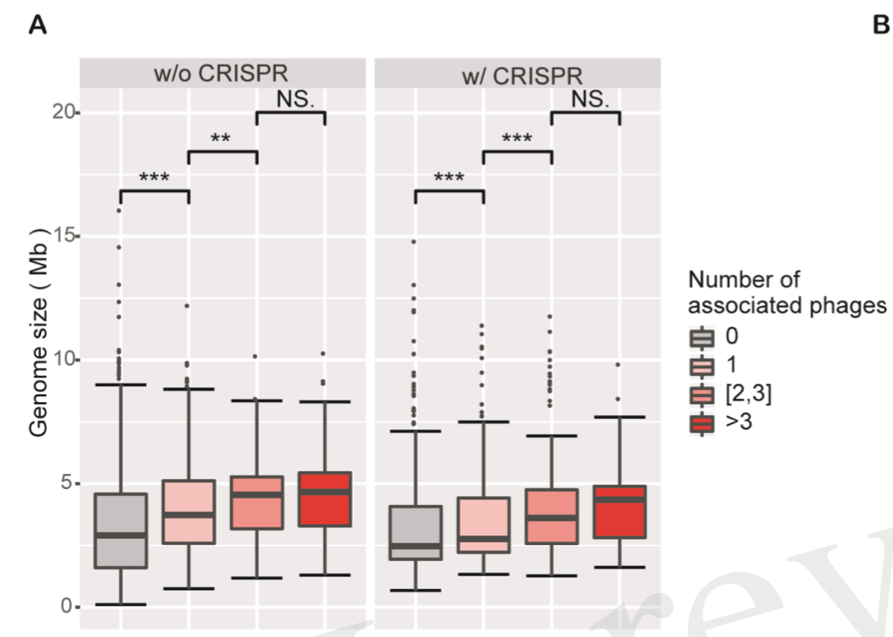
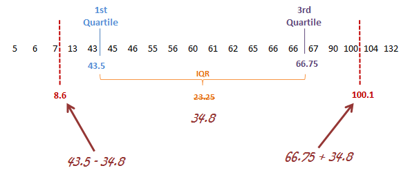

```{r include=FALSE}
color_block = function(color) {
  function(x, options) sprintf('\\color{%s}\\begin{verbatim}%s\\end{verbatim}',
                               color, x)
}

## 将错误信息用红色字体显示
knitr::knit_hooks$set(error = color_block('red'))
```

# section 1: TOC

## 前情提要

-   basic plot functions
-   basic ggplot2
-   special letters
-   equations
-   advanced ggplot2

## 本次提要

-   data summarisation functions (vector data)

    -   median, mean, sd, quantile, summary

-   图形化的 data summarisation (two-D data/ tibble/ table)

    -   dot plot
    -   smooth
    -   linear regression
    -   correlation & variance explained
    -   groupping & bar/ box/ plots

-   statistics

    -   parametric tests

        -   t-test
        -   one way ANNOVA
        -   two way ANNOVA
        -   linear regression
        -   model / prediction / coefficients

    -   non-parametric comparison

# section 2: vector summarisation

## vector data

1.  distribution

\FontSmall

```{r fig.height=3, fig.width=6, message=FALSE}
library(tidyverse);
ggplot( swiss, aes( x = Infant.Mortality ) ) + geom_density() +
   ggtitle("Swiss Fertility and Socioeconomic Indicators (1888) Data")
```

## describe normal distributions

可以用 mean 和 sd 来描述

(A) It's symmetrical.
(B) Mean and median are the same.
(C) Most common values are near the mean; less common values are farther from it.
(D) Standard deviation marks the distance from the mean to the inflection point.

(mean + 1 \* sd) \>= 68%

(mean + 2 \* sd) \>= 95% 的数据

## functions to generate random normal distrubions

\FontSmall

```{r fig.height=3, fig.width=6}
# 生成 10000 个随机数字，使其 mean = 0, sd = 1，且为 normal distribution ...
x <- rnorm(10000, mean = 0, sd = 1);
ggplot( data.frame( data = x ), aes( data ) ) + geom_density(  );
```

\FontNormal

More to read: <http://uc-r.github.io/generating_random_numbers/>

## other functions to generate random normal distributions

注意，以下函数中的 q, p, x 需要自行提供

\FontSmall

```{r eval=FALSE}
# generate CDF probabilities for value(s) in vector q 
pnorm(q, mean = 0, sd = 1)    

# generate quantile for probabilities in vector p
qnorm(p, mean = 0, sd = 1)    

# generate density function probabilites for value(s) in vector x
dnorm(x, mean = 0, sd = 1)
```

## 其它规律的 distributions

1.  uniform distributions

\FontSmall

```{r fig.width=6, fig.height=3, message=FALSE}
x <- runif( 10000 ); ## random numbers of uniform distributions between 0 and 1 
ggplot( data.frame( dat = x ), aes( x ) ) + geom_histogram();
```

## uniform distribution 的各种函数

注：以下函数中的 n 需要自行决定

\FontSmall

```{r eval=FALSE}
# generate n random numbers between 0 and 25
runif(n, min = 0, max = 25)       

# generate n random numbers between 0 and 25 (with replacement)
sample(0:25, n, replace = TRUE)   

# generate n random numbers between 0 and 25 (without replacement)
sample(0:25, n, replace = FALSE)  
```

## other distributions, cont.

\FontSmall

```{r fig.height=3, fig.width=6}
n <- 10000;
uni <- tibble( dat = runif(n), type = "uni" );
norm <- tibble( dat = rnorm(n), type = "norm" );
binom <- tibble( dat = rbinom(n, size = 100, prob = 0.5), type = "binom" );
poisson <- tibble( dat = rpois(n, lambda = 4), type = "poisson" );
exp <- tibble( dat = rexp(n, rate = 1) , type = "exp");
gamma <- tibble( dat = rgamma(n, shape = 1) , type = "gamma");

combined <- bind_rows( uni, norm, binom, poisson, exp, gamma );

plot1 <- 
   ggplot( combined , aes( dat ) ) + geom_density() +
      facet_wrap( ~type, ncol = 3, scales = "free");
```

## other distributions, plot

\FontSmall

```{r fig.height=3, fig.width=6}
plot1;
```

## non-parametric distribution

\FontSmall

```{r fig.height=3, fig.width=6}
## votes on people's desire to visit 
bi <- c(7, 3, 2, 1, 7, 3, 4, 5, 7, 6, 2, 2, 1, 3, 7, 2, 6, 8, 2, 7, 2, 2, 1, 
3, 5, 8, 2, 6, 7, 8, 6, 2, 8, 7, 9, 2, 7, 5, 1, 8, 8, 2, 3, 7, 3, 8);
ggplot( data.frame( dat = bi ), aes(dat)) + geom_density();
```

note: data from: <https://www.ai-therapy.com/psychology-statistics/distributions/nonparametric>

## 量化描述数据

使用以下同名函数

**mean**: aka average, is the sum of all of the numbers in the data set divided by the size of the data set.

**median**: The median is the value that is in the middle when the numbers in a data set are sorted in increasing order.

**sd**: standard deviation

**var**: measures how far a set of numbers are spread out

**range**: 取值范围

note: from: <https://www.ai-therapy.com/psychology-statistics/descriptive/mean-mode-median>

## 量化描述函数

\FontSmall

```{r eval=FALSE}
mean( norm$dat );
median( norm$dat );
## mode( norm$dat ); ## ??? 

sd(norm$dat);
var(norm$dat);
range(norm$dat);
```

## `quantile` and `summary`

\FontSmall

```{r}
quantile( norm$dat );

## quantile 还接受其它参数 
quantile( norm$dat, probs = seq(0, 1, length = 11));

## summary ... 
summary( norm$dat );
## summary 也可应用于非数值
summary( combined$type );
```

## `summary`, cont.

\FontSmall

```{r}
## summary 可应用于整个表格; 相当于对每列进行 summary ... 
summary( combined );
```

## `table`函数

返回vector当中 unique 值和它们的出现次数

\FontSmall

```{r}
table( combined$type );
```

\FontNormal

\*\* 注 \*\* ： `table` 还接受 `data.frame` 作为输入，比如 `table( combined )`。请自行尝试并理解结果

## `count` in `dplyr` 

\FontSmall

```{r}
combined %>% dplyr::count( type );

## which is similar to:
combined %>% group_by(type) %>% count( name = "my_count" );
```
## `dplyr::count` cont.

\FontSmall

```{r}
# For table()-like output with two factors:

iris %>% 
  group_by(Species) %>% 
  count(Petal.Width)

## which is similar to
iris %>% count(Species, Petal.Width);
```

# section 3: two column data: part 1

## 数据介绍: a numeric vector and a facterial vector

此类数据，通常一列是数值，另一列是分组信息，如下例：

\FontSmall

```{r message=FALSE}
data.fig3a <- read_csv( file = "data/talk10/nc2015_data_for_fig3a.csv" );

head( data.fig3a[ c("tai", "trans.at") ] ); ## 只显示有用的两列
```

## 数据介绍，cont.

tai: 表达量的一种计算方式，1 == lowest, 5 == highest

trans.at： A - T 碱基使用偏好；

假说：

(a) de novo synthesis cost of A is higher than T,
(b) therefore highly expressed genes will tend to use T than A when possible.
(c) 因此，在高表达的基因当中， A - T 的差值会变大（更负）。

**data source**: [Chen et al, Nature Communications, 2016](https://www.nature.com/articles/ncomms11334)

## boxplot

\FontSmall

```{r fig.width=6, fig.height=4}
fig3a <- 
   ggplot( data.fig3a, aes( factor(tai), trans.at ) ) + 
      geom_boxplot( fill = "#22AD5C", linetype = 1 ,outlier.size = 1, width = 0.6) +
      xlab( "tAI group" ) + 
      ylab( expression( paste( italic(S[RNA]) ) ) ) +
      scale_x_discrete(breaks= 1:5 , labels= paste("Q", 1:5, sep = "") ) +
      geom_hline( yintercept = 0, colour = "red", linetype = 2);
```

## show the plot

\FontSmall

```{r fig.width=6, fig.height=3}
fig3a;
```

**说明**：

1.  此种情况下，我们通常只看 median 值的趋势；

2.  也可增加 Q1 与 Q5 之间的差异分析 (wilcoxon Rank sum test)； p value = **3.243538e-87**

## another example plot

{height="70%"}

## how to add significance indicators to plot??

ggplot2 的扩展包， `geom_signif`；如果第一次使用，请先安装。

\FontSmall

```{r fig.height=3, fig.width=6}
library(ggsignif);
fig3a + geom_signif( comparisons = list(1:2, 2:3, 3:4, 4:5), test = wilcox.test, 
                     step_increase = 0.1 );
```

## boxplot 画图注意事项

正确的画法为：要高瘦，不要矮胖！！！！

\FontSmall

```{r fig.height=2.5, fig.width=2}
fig3a;
```

## 此类数据的另一种可视化方式

density plot; 但在此例中，不如 boxplot 好。

\FontSmall

```{r fig.height=3, fig.width=6}
ggplot( data.fig3a, aes( trans.at, colour = factor(tai) ) ) + geom_density( ) + 
   xlab( "tAI group" ) + ylab( expression( paste( italic(S[RNA]) ) ) );
```

# section 4: two column data: part 2

## 数据介绍：two numerical vectors

多用于描述两组（量化）数据之间的关系；

以 `mtcars` 为例：

\FontSmall

```{r}
head(mtcars);
```

## 查看重量与燃油效率之间的关系

\FontSmall

```{r fig.height=3, fig.width=6}
plotcars <- 
   ggplot( mtcars, aes( x = wt, y = mpg ) ) + 
      geom_point() + xlab( "Weight (1000 lbs)" ) + ylab( "Miles/(US) gallon" );
plotcars;
```

## smooth, 减少噪音

\FontSmall

```{r fig.height=3, fig.width=6}
plotcars + geom_smooth( method = "lm" ); ## default is lowess 
```

## `expression( R^2 )` variance of x explained by y ...

\FontSmall

```{r}
( r <- with( mtcars, cor.test( mpg, wt )$estimate ) );

## variance of mpg can be explained by weight 
r^2;
```

## 当趋势不明显时，可以按另一组数据分组

这里还以 mtcars 为例。

两种分组（binning）方法 equal-distance, equal-size binning

举例：

\FontSmall

```{r}
mtcars2 <- mtcars %>% 
   mutate( group1 = ntile( wt, 4 ), ## equal-size bining 
           group2 = cut( wt, 
                         breaks = seq( from = min(wt), to = max(wt), 
                                       by = (max(wt) - min(wt)) / 4 ), 
                         include.lowest = T ) ## equal-distance ... 
           ) ;
```

## `ntile` 函数的参数

... `*tile` 函数都是 equal size

\FontSmall

```{r}
## ntile 的结果 
table( mtcars2$group1 );
```

## `cut` 函数

按指定的间隔 (breaks) 对数据进行分割。

\FontSmall

```{r}
table( mtcars2$group2);
```

\FontNormal

使用方法：

\FontSmall

```{r eval=FALSE}
cut(x, …)
# S3 method for default
cut(x, breaks, labels = NULL,
    include.lowest = FALSE, right = TRUE, dig.lab = 3,
    ordered_result = FALSE, …)
```

## `cut` 示例

\FontNormal

不仅可用于 equal distance，还可以用于任意间距

\FontSmall

```{r}
mtcars3 <- mtcars2 %>%
   mutate( group3 = cut( mtcars$wt, breaks = c(0,1,2,3,4,5,6) ) )  ;
table(mtcars3$group3);
```

## 分组后的数据适合用 boxplot

\FontSmall

```{r fig.height=3, fig.width=6}
ggplot( mtcars3, aes( group3, mpg ) ) + 
   geom_boxplot();
```

## 小结

目前讲述了以下内容：

### 一维数据

`table`, `summary`, `range`, `quantile`, `mean`, `median` ...

### 二维数据

-   boxplot
-   point plot
-   correlation
-   分组： equal distance, equal size binning ...

# section 5: parametric tests

## parametric tests

1.  包括：

-   t-test
-   analysis of variance
-   linear regression

2.  数据有较明确的分布（e.g. normal distribution），或假设数据有明确的分布；当**假设**不成立时，检测会无效；

3.  更灵敏（相比 nonparametric test），p-value更低

more to read: <http://rcompanion.org/handbook/I_01.html>

## 适用性

### 适用于

-   数量化性状，比如：身高、体重、产量、污染值

-   整数值：成绩、年龄、每天步数

### 不适用于

-   其它 count data或者discrete data；

-   或者有太多趋向于 min 或 max 的值

-   百分比或比例

详见：<http://rcompanion.org/handbook/index.html>

## 需要的 packages

需要的packages

\FontSmall

```{r eval=FALSE}
## chooseCRANmirror() 
if(!require(psych)) {
   install.packages("psych");
}
if( !require(rcompanion) ) {
   install.packages("rcompanion");
}

library(psych);
library(rcompanion)
```

## 数据

注意 `source()` 函数的用法

\FontSmall

```{r}
source("data/talk10/input_data1.R"); ## 装入 Data data.frame ... 

str(Data);
```

## 检查数据

\FontSmall

```{r}
library(psych)
headTail(Data); ## psych 包提供的函数
```

## 查看数据, cont.

\FontSmall

```{r}
## 其它常用函数
str(Data)
summary(Data)
```

## parametric test 的要求

1.  随机取样

2.  值或 residuals 为正态分布；residules 是指观察值与预测值(mean)之差

## 数据的分布

\FontSmall

```{r fig.width=6, fig.height=3}
ggplot(Data, aes(Steps, fill = Sex)) +
       geom_density(position="dodge", alpha = 1)
```

## parametric test 的要求， cont.

3.  有相同的variance

\FontSmall

```{r fig.width=6, fig.height=2.5}
M1 = mean(Data$Steps[Data$Sex=="female"])
M2 = mean(Data$Steps[Data$Sex=="male"])

Data$Mean[Data$Sex=="female"] = M1
Data$Mean[Data$Sex=="male"]   = M2

Data$Residual = Data$Steps - Data$Mean

plot(jitter(Residual) ~ Mean, data = Data, las = 1);
```

## how to detect outlier ??

一个很模糊的定义：Outliers are extreme values that fall a long way outside of the other observations. For example, in a normal distribution, outliers may be values on the tails of the distribution.

对于 normal distribution，通常 mean +- 2 or 3 \* sd

对于 non-parametric distribution (注： IRQ计算可使用同名函数：`IRQ`) ：

{height="40%"}

## an example of outlier values

\FontSmall

```{r fig.width=6, fig.height=2}
s <- summary( swiss$Infant.Mortality );
irq <- IQR(swiss$Infant.Mortality);
ggplot( swiss, aes( y =  Infant.Mortality ) ) + geom_boxplot() + coord_flip() +
   geom_hline( yintercept = s, colour = sample( colors(), length(s) ) ) +
   geom_hline( yintercept = c( s["1st Qu."] - 1.5 * irq, s["3rd Qu."] + 1.5 * irq ), 
               colour = "red", size = 2, linetype = 2);
```

## one sample t-test

检测分布是否与预期一致；比如：男生每天的步数是否显著区别于1万

\FontSmall

```{r}
with( Data, t.test( Steps[ Sex == "male" ], mu = 10000 ) );
```

## two samples t-test

比较 sd 和 mean ，可应用于正态分布。几种使用方法：

\FontSmall

```{r}
with( Data, t.test( Steps ~ Sex ) )
```

## two sample t-test 使用方法 2

\FontSmall

```{r}
with( Data, t.test( Steps[ Sex == "male" ], Steps[ Sex == "female" ] ) );
```

## two sample t test 检测结果

\FontSmall

```{r}
res <- with( Data, t.test( Steps ~ Sex ) );
str(res);
```

## paired two sample t test

例如：辅导前后的学生成绩：

\FontSmall

```{r}
source("data/talk10/input_data2.R");

head(scores);
```

## paired two sample t test

\FontSmall

```{r}
scores.wide <- scores %>% spread( Time, Score );
head(scores.wide, n = 3);

with( scores.wide, t.test( After, Before,  paired = T ) );
```

## one way ANOVA

**ANOVA**: similar to independent t-test, but can be applied to multiple groups

主要分析一个变量（多组）对另一变量的贡献度/解释度/影响度。

比如：年级对学生的体重是否有影响？

准备：**3个班学生的体重**

\FontSmall

```{r fig.height=2, fig.width=6}
wts <- bind_rows( tibble( class = 1, wt = sample( seq(50, 60, by = 0.1), 20 ) ),
                  tibble( class = 2, wt = sample( seq(55, 65, by = 0.1), 20 ) ),
                  tibble( class = 3, wt = sample( seq(60, 70, by = 0.1), 20 ) )
                  );

ggplot(wts, aes( factor( class ), wt ) ) + geom_boxplot() + coord_flip();
```

## one way ANOVA, cont.

\FontSmall

```{r}
library(FSA); ## 如果没有这个包，请先安装 ... 
with( wts, Summarize( wt ~ class, digits = 3 ) );
```

## linear model

两个问题：

1.  组间有显著区别吗？

\FontSmall

```{r}
model <- lm( wt ~ class, data = wts );

anova( model );
```

## ANOVA

2.  分组对变量的贡献（ r-square, aka. variance explained ）

\FontSmall

```{r}
summary( model );
```

\FontNormal

其中的值都是什么意思？？？

更多内容见： <http://rcompanion.org/handbook/I_05.html>

## one way ANOVA with blocks

同时有多个因素影响**体重**时，哪些才是主要的？

\FontSmall

```{r fig.width=6, fig.height=2}
wts2 <- bind_rows( 
   tibble( class = 1, age = sample( 13:15, 20, replace = T ), wt = sample( seq(50, 60, by = 0.1), 20 ) ),
   tibble( class = 2, age = sample( 14:16, 20, replace = T ), wt = sample( seq(55, 65, by = 0.1), 20 ) ),
   tibble( class = 3, age = sample( 15:17, 20, replace = T ), wt = sample( seq(60, 70, by = 0.1), 20 ) )
);

ggplot(wts2, aes( factor( age ), wt ) ) + geom_boxplot() + coord_flip();

```

## one way ANOVA with blocks, cont.

\FontSmall

```{r}
model2 <- lm( wt ~ class + age, data = wts2);
anova( model2 );
```

\FontSmall

如何获得 r.squre value ???

## one way ANOVA with blocks, 各个factor的重要性？？

\FontSmall

```{r echo=FALSE, warning=FALSE, message=FALSE}
library(relaimpo);
```

```{r eval=FALSE}
library(relaimpo);
```

```{r}
res3 <- calc.relimp( wt ~ factor(class) + age, data = wts2 );
res3$R2; ## 总 R2
res3$lmg; ## 每个因素的贡献； 

## 测试 rela 参数：
res4 <- calc.relimp( wt ~ factor(class) + age, data = wts2, rela = T);
res4$R2; ## 总 R2
res4$lmg; ## 每个因素的贡献； 
```

\FontNormal

更多请见： <http://rcompanion.org/handbook/I_06.html>

## two way ANOVA

一个变量受另外两个因素影响的分；比如上例中 **体重** 受 **年级** 和 **年龄** 的影响。

**年级** 和 **年龄** 至少有 4 个 unique combinations .

实际上，上面的 block test 可以认为是 two-way ANOVA 分析

\FontSmall

```{r}
Summarize(wt ~ age + class, data = wts2, digits=3);
```

## two way ANOVA, cont.

\FontSmall

```{r}
model3 <- lm( wt ~ class + age + class:age, data = wts2);
anova( model3 );

```

\FontNormal

其中： class 和 age 称为 **main effects**， class:age 称为 **interaction effects**

## relative importance of interactions

\FontSmall

```{r}
res5 <- calc.relimp( wt ~ factor(class) + age + factor(class):age, data = wts2);
res5$R2; ## 总 R2
res5$lmg; ## 每个因素的贡献； 
```

## 用模型进行预测 `predict`

`model2 = lm(formula = wt ~ class + age, data = wts2)`

\FontSmall

```{r fig.width=6, fig.height=2.5}
newdata <- wts2 %>% dplyr::select( class, age );
wt.predicted <- predict( model2, newdata );

dat <- data.frame( reference = wts2$wt, prediction = wt.predicted );
ggplot( dat , aes( x = reference, y = prediction ) ) + geom_point() +
   geom_smooth( method = "lm", se = F );
```

## prediction 与 original data 的 correlation 是多少？？

\FontSmall

```{r}
with( dat, cor.test( prediction, reference ) )$estimate;

## R ^ 2 
with( dat, cor.test( prediction, reference ) )$estimate ^2;

## 正好是 model2 的 r.squred ... 
summary( model2 )$r.squared;  
```

## 手动计算 prediction

在一个 linear model 中， `wt = intercept + a * class + b * age`

而 `intercept` , `a`, `b` 的值分别为：

\FontSmall

```{r fig.width=6, fig.height=2}
( paras <- coef( model2 ) );

predicted2 <- 
   paras[1] + paras["age"] * wts2$age + paras["class"] * wts2$class;

plot <- 
   ggplot( data.frame( predicted = wt.predicted, manual = predicted2 ), 
           aes( predicted, manual ) ) +
      geom_point() + geom_smooth( method = "lm", se = F );
```

## show the plot

\FontSmall

```{r fig.width=6, fig.height=3}
plot;
```

## 更多更方便的函数

以下函数也可以用于 multivariable analysis / multiple regression

\FontSmall

```{r eval=FALSE}
fit <- lm(y ~ x1 + x2 + x3, data=mydata)
summary(fit) # show results

# Other useful functions 
coefficients(fit) # model coefficients
confint(fit, level=0.95) # CIs for model parameters 
fitted(fit) # predicted values
residuals(fit) # residuals
anova(fit) # anova table 
vcov(fit) # covariance matrix for model parameters 
influence(fit) # regression diagnostics
```

## linear regression 注意事项

1.  是 parametric test

2.  假设变量之间独立（比如：**年龄**和**班级**之间没有关联）

3.  homogeneity of variance

但实际上 ...

## multivariable analysis

\FontSmall

```{r eval=FALSE}
# Multiple Linear Regression Example 
fit <- lm(y ~ x1 + x2 + x3, data=mydata)
summary(fit) # show results

# compare models
fit1 <- lm(y ~ x1 + x2 + x3 + x4, data=mydata)
fit2 <- lm(y ~ x1 + x2)
anova(fit1, fit2)

# K-fold cross-validation
library(DAAG)
cv.lm(df=mydata, fit, m=3) # 3 fold cross-validation

# Stepwise Regression; feature selection 
library(MASS)
fit <- lm(y~x1+x2+x3,data=mydata)
step <- stepAIC(fit, direction="both")
step$anova # display results
```

## extended reading

1.  repeated measures ANOVA , 同一变量、不同时间段的重复测量（ 对上例中学生的体重进行多次测量 ）

2.  correlation and linear regression 

3.  non-linear regression

# section 6: non-parametric test

## `wilcox.test` and `kruskal.test`

\FontSmall

```{r}
# independent 2-group Mann-Whitney U Test 
with( Data, wilcox.test( Steps ~ Sex ) );

# Kruskal Wallis Test One Way Anova by Ranks 
with( Data, kruskal.test( Steps ~ Sex ) );
```

# 作业与练习

## 作业与练习

-   `Exercises and homework` 目录下 `talk10-homework.Rmd` 文件

-   完成时间：见钉群的要求
