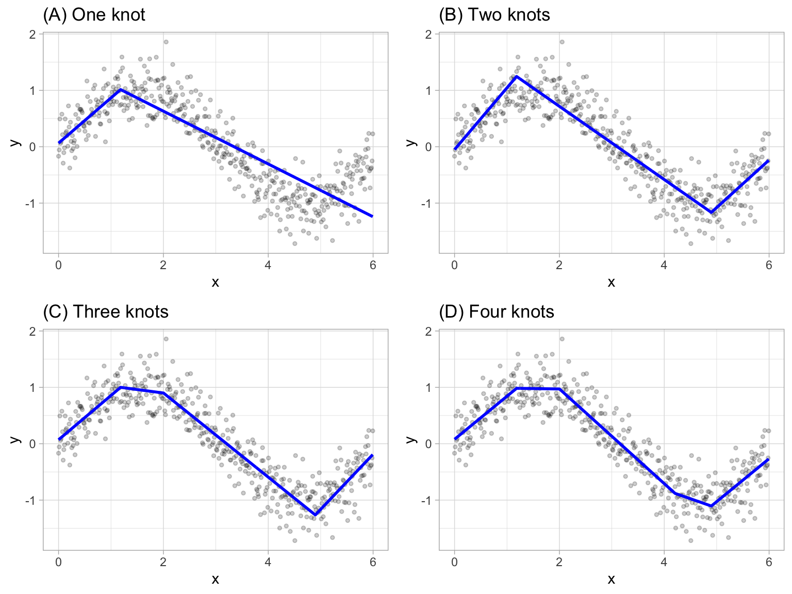
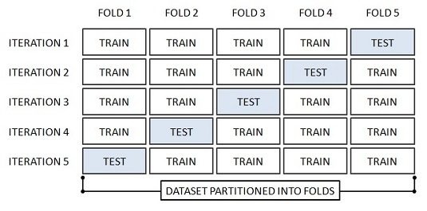
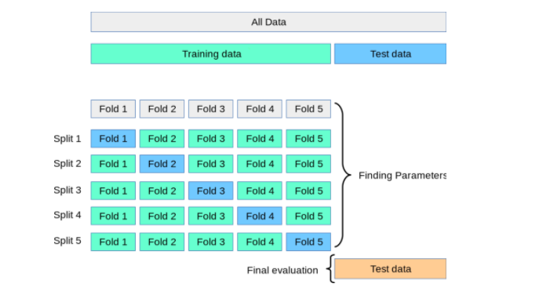

```{r include=FALSE}
color_block = function(color) {
  function(x, options) sprintf('\\color{%s}\\begin{verbatim}%s\\end{verbatim}',
                               color, x)
}

## 将错误信息用红色字体显示
knitr::knit_hooks$set(error = color_block('red'))
```

# section 1: TOC

## 前情提要

-   R basics
-   R data wrangler
-   R plot
-   R string, regular expression
-   R parallel computing

## 本次提要

-   linear regression
-   nonlinear regression
-   modeling and prediction
-   **K-fold** & **X times** cross-validation
-   external validation

# section 2: Linear regression

## what is linear regression?

线性回归是利用数理统计中回归分析，来确定两种或两种以上变量间相互依赖的定量关系的一种统计分析方法

-   Y 可以被 一个变量 `X` 解释；一元线性回归

-   Y 可以被 `X`, `Z` 等多个变量解释；multivariate linear regression

## 举例

\FontSmall

```{r echo=FALSE, fig.width=10, fig.height=5, warning=FALSE, message=FALSE}
library(tidyverse);
m = lm(Fertility ~ Education, swiss);
eq <- substitute( paste( italic(y), " = ",  a + b %.% italic(x), sep = "" ), 
                  list(a = as.vector( format(coef(m)[1], digits = 2) ),
                       b =  as.vector(  format(coef(m)[2], digits = 2) )
                  ));
eq <- as.character(as.expression(eq));

swiss %>% ggplot( aes( x = Education, y = Fertility )) + 
  geom_point() + geom_smooth( method = "lm" ) + ggtitle("SWISS data 1888") +
  geom_text( data = NULL,
                   aes( x = 30, y = 80, label= eq, hjust = 0, vjust = 1),
                   size = 4, parse = TRUE, inherit.aes=FALSE)
```

## 解释

\FontSmall

```{r message=FALSE, warning=FALSE}
m <- lm(Fertility ~ Education, data = swiss);
summary(m);
```

**lm(\[target variable\] \~ \[predictor variables\], data = \[data source\])**

## 得到 Coefficients

\FontSmall

```{r message=FALSE, warning=FALSE}
coef( m ); 
```

## other useful functions

\FontSmall

```{r eval=FALSE}
# Other useful functions
coefficients(m) # model coefficients
confint(m, level=0.95) # CIs for model parameters
fitted(m) # predicted values
residuals(m) # residuals
anova(m) # anova table
vcov(m) # covariance matrix for model parameters
influence(m) # regression diagnostics
```

## R-squred a.k.a R2 是怎么来的？

\FontSmall

```{r warning=FALSE, message=FALSE}
library(magrittr);
library(caret);
predictions <- m %>% predict( swiss ); ## or use fitted(m) instead ... 

# Model performance
data.frame(
  RMSE = RMSE(predictions, swiss$Fertility),
  R2 = R2(predictions, swiss$Fertility)
)
```

**RMSE** mean squared error, the smaller the better **R2** R, higher the better \* F-statistic: Higher the better

## R-squred a.k.a R2 是怎么来的？ cont.

\FontSmall

```{r fig.width=10, fig.height=5}
data.frame( PREDICITON = predictions, ACTUAL = swiss$Fertility ) %>% 
  ggplot(aes( PREDICITON, ACTUAL )) + geom_point() + 
  ggtitle( "SWISS DATA 1888 Fertility" ) + 
  geom_abline(intercept = 0, slope = 1, colour = "red")
```

## Multivariate linear modeling

`datarium` package

\FontSmall

```{r eval=FALSE}
install.packages("datarium");
```

```{r message=FALSE, warning=FALSE}
library(datarium);
head(marketing);
```

**问题**： 广告投放在哪里对**销售**有帮助？？

## multivariate linear modeling , cont.

\FontSmall

```{r message=FALSE, warning=FALSE}
m1 <- lm( sales ~ youtube + facebook + newspaper, data = marketing );
m2 <- lm( sales ~ youtube, data = marketing);
m3 <- lm( sales ~ facebook, data = marketing);

summary(m1);
```

## facebook vs. youtube

\FontSmall

```{r}
coef( m1 );
data.frame( YOUTUBE = summary(m2)$r.squared, FACEBOOK = summary(m3)$r.squared);
```

## predicted vs. actual

\FontSmall

```{r fig.width=10, fig.height=4}
predicted.m1 <- m1 %>% predict( marketing );
data.frame(p = predicted.m1, actual = marketing$sales ) %>% 
  ggplot( aes(x = p, y = actual) ) + geom_point() + 
  geom_abline(intercept = 0, slope = 1, colour = "red");
```

## performance evaluation

\FontSmall

```{r}
# Model performance
data.frame(
  RMSE = RMSE(predicted.m1, marketing$sales ),
  R2 = R2(predicted.m1, marketing$sales )
)
```

## get rid of `newspaper`

\FontSmall

```{r}
m4 <- lm( sales ~ youtube + facebook, data = marketing );
anova(m1, m4);

data.frame(
  with_newspapers = summary(m1)$r.squared,
  without_newspapers = summary(m4)$r.squared
)
```

## relative importance analysis

\FontSmall

```{r message=FALSE, error=FALSE}
library(relaimpo);
calc.relimp( sales ~ youtube + facebook + newspaper, data = marketing );
```

## interactions

**interactions**考虑因素之间的依赖关系或互作关系，比如，在一平台上投放广告会促进另一个平台上广告的效果，因为两个平台的用户可能是重叠的。他们在两个平台都看到广告时，更可能购买产品。

\FontSmall

```{r}
m5 <- lm( sales ~ youtube + facebook + youtube:facebook, data = marketing );
anova(m4, m5);

data.frame(
  no_interactions = summary(m4)$r.squared,
  with_interactions = summary(m5)$r.squared
)
```

**结论**：两个平台同时投放广告最好；

## interactions, cont.

\FontSmall

```{r}
## m5 <- lm( sales ~ youtube + facebook + youtube:facebook, data = marketing );

## 上面的 m5 可以直接写为：
m6 <- lm( sales ~ youtube*facebook, data = marketing );
summary(m6);
```

## visualize interactions

\FontSmall

```{r fig.width=6, fig.height=3, message=FALSE, warning=FALSE}
## install.packages("interactions"); 如需要，请安装这个包
library(interactions); ## 装入 
sim_slopes(m6, pred = youtube, modx = facebook, jnplot = TRUE)
```

## relative importance analysis including interactions

\FontSmall

```{r message=FALSE, error=FALSE}
library(relaimpo);
calc.relimp( sales ~ youtube*facebook, data = marketing );
```

## **assumptions** of `linear regression`

### 重要信息

1.  任何检验都有基本的**假设**
2.  将检验应用于不符合**假设**的数据是统计学最大的滥用

### **assumptions**

1.  Linearity: The relationship between X and the mean of Y is linear.
2.  Homoscedasticity: The variance of residual is the same for any value of X.
3.  Independence: Observations are independent of each other.
4.  Normality: For any fixed value of X, Y is normally distributed.

## `glm` vs. `lm`

\FontSmall

    lm(formula, data, …)
    glm(formula, family=gaussian, data, …)

**glm**:

1.  当`family=gaussian`时，二者是一样的。

```{r warning=FALSE, message=FALSE}
library(texreg);
m.lm <- lm(am ~ disp + hp, data=mtcars);
m.glm <- glm(am ~ disp + hp, data=mtcars);
screenreg(l = list(m.lm, m.glm))
```

## `glm` 还可用于其它类型数据的分析

1.  Logistic regression (family=binomial)

预测的结果（Y）是binary的分类，比如`Yes`, `No`，且只能有两个值；

\FontSmall

```{r warning=FALSE, message=FALSE}
dat <- iris %>% filter( Species %in% c("setosa", "virginica") );
bm <- glm( Species ~ Sepal.Length + Sepal.Width + Petal.Length + Petal.Width, 
           data = dat, family = binomial );

data.frame( predicted = bm %>% predict( dat, type = "response" ),
            original = dat$Species ) %>% sample_n(6) %>% arrange( original );
```

**注意：**

`predict(., type = "response")` 的意义是什么？？

## `glm`的`Poisson regression (family=poisson)`

**Poisson regression** is a special type of regression in which the response variable consists of **count data**.

**Asumptions**:

1.  The response variable consists of count data.
2.  Observations are independent.
3.  The mean and variance of the model are equal.
4.  The distribution of counts follows a Poisson distribution.

# section 3: Non-linear regression (`nls`)

## 一元 `nls`

什么是 `nls`？to predict **a target variable** using **a non-linear function** consisting of **parameters** and **one or more independent variables**.

**non-linear least squares**

\FontSmall

```{r echo=FALSE, fig.width=10, fig.height=4, error=FALSE, message=FALSE, warning=FALSE}
set.seed(20160227)
x<-seq(0,50,1)
y<-((runif(1,10,20)*x)/(runif(1,0,10)+x))+rnorm(51,0,1)
#for simple models nls find good starting values for the parameters even if it throw a warning
m<-nls(y~a*x/(b+x), start = list(a=0.1, b=0.1));
#get some estimation of goodness of fit
plot(x,y)
lines(x,predict(m),lty=2,col="red",lwd=3)
```

## non-linear least squares

\FontSmall

```{r eval=FALSE}
## 1. generate data
set.seed(20160227)
x<-seq(0,50,1)
y<-((runif(1,10,20)*x)/(runif(1,0,10)+x))+rnorm(51,0,1)

## 2. fit model using nls
m<-nls(y~a*x/(b+x), start = list(a=0.1, b=0.1));

## 3. show how good is the fitting ... 
#get some estimation of goodness of fit
plot(x,y)
lines(x,predict(m),lty=2,col="red",lwd=3)
```

1.  `nls( equation, data = data, start = ... )`
2.  `y~a*x/(b+x)`

## non-linear least squares, using `drc`

\FontSmall

```{r warning=FALSE, message=FALSE, fig.width=10, fig.height=4}
library(drc); ## Analysis of Dose-Response Curves
m13 <- drm( y ~ x, fct = LL.3() ); ## here LL.3() is a least square function
data.frame( x = x, y = y, fitted = predict(m13) ) %>% ggplot( aes(x=x,y=y) ) +
  geom_point() + geom_line( aes(x = x, y = fitted), colour = "red", linetype = 2 );
```

## non-linear functions

### Polynomials

-   Linear equation
-   Quadratic polynomial

### Concave/Convex curves (no inflection)

-   Exponential equation
-   Asymptotic equation
-   Negative exponential equation
-   Power curve equation
-   Logarithmic equation
-   Rectangular hyperbola

### Sygmoidal curves

-   Logistic equation
-   Gompertz equation
-   Log-logistic equation (Hill equation)
-   Weibull-type 1
-   Weibull-type 2

### Curves with a maximum

-   Brain-Cousens equation

## example: `Exponential equation`

`Exponential decay`

`y = a * (exp(k * X) * k)`

\FontSmall

install `aomisc` package:

```{r eval=FALSE}
install.packages("devtools");
devtools::install_github("onofriAndreaPG/aomisc");
```

```{r using-degradation-aomisc, warning=FALSE, error=FALSE, message=FALSE}
library(aomisc);
data(degradation);
m14 <- drm(Conc ~ Time, fct = DRC.expoDecay(),
             data = degradation)
summary(m14)
```

## plot `Exponential decay`

\FontSmall

```{r fig.height=4, fig.width=10}
plot(m14, log="");
```

## `Power curve`

`a * (X^(b - 1) * b)`

\FontSmall

```{r message=FALSE, warning=FALSE, message=FALSE}
data(speciesArea)
m15 <- drm(numSpecies ~ Area, fct = DRC.powerCurve(),
             data = speciesArea)
summary(m15)
```

**重点**： 1. `DRC.powerCurve` 作为建模的参数, 来自 `library(aomisc)`

## `Power curve`结果作图

\FontSmall

```{r fig.width=10, fig.height=4}
speciesArea %>% mutate( fitted = predict( m15, speciesArea ) ) %>% 
  ggplot( aes(x= Area, y= numSpecies) ) +
  geom_point() + geom_line( aes(x = Area, y = fitted), colour = "red", linetype = 2 );
```

## how good is the model?

\FontSmall

```{r}
R2(  speciesArea$numSpecies, predict( m15, speciesArea ) );

## compare with a linear model
m16 <- lm( numSpecies ~ Area, data = speciesArea );
R2(  speciesArea$numSpecies, predict( m16, speciesArea ) );
```

## 数据生成函数

`aomisc` 包和 `drc` 包带了非常多数据生成的函数，其使用示例如下：

\FontSmall

**注** `a * (X^(b - 1) * b)` 需要两个参数, a 和 b

```{r fig.width=10, fig.height=4}
plot(powerCurve.fun(1:100, 5, 0.33),
      xlab = "X", ylab = "Y", main = "Power curve (b = 0.33)", type = "l")
```

## `logistic function`

\FontSmall

```{r fig.width=10, fig.height=4}
data(beetGrowth)
m17 <- drm(weightFree ~ DAE, fct = L.3(), data = beetGrowth)
plot(m17, log="", main = "Logistic function")
```

## 多元 non-linear regression

1.  `mars` ： Multivariate Adaptive Regression Splines (多元自适应回归样条)
2.  `machine learning`

推荐一本教程： **`Hands-On Machine Learning with R`**

{height="40%"}

## 多元 non-linear regression, cont.

\FontSmall

Multivariate adaptive regression splines (MARS) provide a convenient approach to capture the nonlinear relationships in the data by assessing cutpoints (knots). The procedure assesses each data point for each predictor as a knot and creates a linear regression model with the candidate feature(s).

{height="40%"}

## fit a basic `MARS` model, get data ready...

\FontSmall

```{r error=FALSE, message=FALSE}
library(AmesHousing); ## The Ames Iowa Housing Data
ames <- AmesHousing::make_ames();
head(ames);
```

## fit a basic `MARS` model, fit a basic model

\FontSmall

```{r error=FALSE, warning=FALSE, message=FALSE}
library(earth);
mars1 <- earth( Sale_Price ~ .,  data = ames );
print(mars1);
```

## `MARS` model, model selection

\FontSmall

```{r fig.width=10, fig.height=5}
plot(mars1, which = 1);
```

**如何解释？**

## `mars` model with interactions

\FontSmall

```{r}
mars2 <- earth(Sale_Price ~ .,  data = ames, degree = 2);
summary(mars2) %>% .$coefficients %>% head(10)
```

## Parameter tuning: cross validation

K fold, N times

{height="50%"}

**注** 1. 每个iteration为随机split； 2. 得到 K \* N 个模型；

## cross validation & additional test

{height="50%"}

## Parameter tuning

\FontSmall

```{r}
hyper_grid <- expand.grid(
  degree = 1:3,  ## number of interaction degrees
  nprune = seq(2, 100, length.out = 10) %>% floor() ## number of features to select
)
head(hyper_grid);
```

## Parameter tuning, cont.

\FontSmall

```{r message=FALSE, warning=FALSE}
set.seed(123)  # for reproducibility
cv_mars <- train(
  x = subset(ames, select = -Sale_Price),
  y = ames$Sale_Price,
  method = "earth",
  metric = "RMSE",
  trControl = trainControl(method = "cv", number = 10),
  tuneGrid = hyper_grid
)
```

**注** 10 折 cross validation

**注** 非常 time consuming ... 最好能使用 parallel computing ...

## Parameter tuning, show results

\FontSmall

```{r fig.width=10, fig.height=3, message=FALSE, warning=FALSE}
cv_mars$bestTune;

cv_mars$results %>%
  filter(nprune == cv_mars$bestTune$nprune, degree == cv_mars$bestTune$degree);

ggplot(cv_mars) ## plot 
```

**RMSE** the lower the better

## compare with other methods e.g., `lm`

\FontSmall

```{r error=FALSE, message=FALSE, warning=FALSE}
cv_lm <- train(
  Sale_Price ~ ., 
  data = ames, 
  method = "lm",
  trControl = trainControl(method = "repeatedcv", number = 10, repeats = 3)
);
```

```{r}
print(cv_lm);
```

## variable importance plot (VIP)

\FontSmall

```{r error=FALSE, message=FALSE, warning=FALSE, fig.width=10, fig.height=4}
library(vip);
p1 <- vip(cv_mars, num_features = 40, geom = "point", value = "gcv") + ggtitle("Generalized cross-validation")
p2 <- vip(cv_mars, num_features = 40, geom = "point", value = "rss") + ggtitle("Residual Sums of Squares")

gridExtra::grid.arrange(p1, p2, ncol = 2)
```

## `mars` : final thoughts

### advantages

1.  First, MARS naturally handles mixed types of predictors (quantitative and qualitative).
2.  MARS also requires minimal feature engineering (e.g., feature scaling) and performs automated feature selection.
3.  Highly correlated predictors do not impede predictive accuracy as much as they do with OLS models.

### shortcomings

1.  typically slower to train
2.  Also, although correlated predictors do not necessarily impede model performance, they can make model interpretation difficult.

# section 4: 小结及作业！

## 本次小结

### linear regression

-   lm vs. glm
-   一元
-   多元
-   相关函数
-   performance evaluation
-   interactions
-   visualizations

### non-linear regression

-   nls
-   mars
-   earth
-   cross validation
-   K fold, N times (下次详细讲)

## 下次预告

-   Random Forest
-   Support Vector Machine
-   Deep learning

## 作业

-   `Exercises and homework` 目录下 `talk11-homework.Rmd` 文件；

-   完成时间：见钉群的要求

### important

-   all codes are available at Github: <https://github.com/evolgeniusteam/R-for-bioinformatics>
