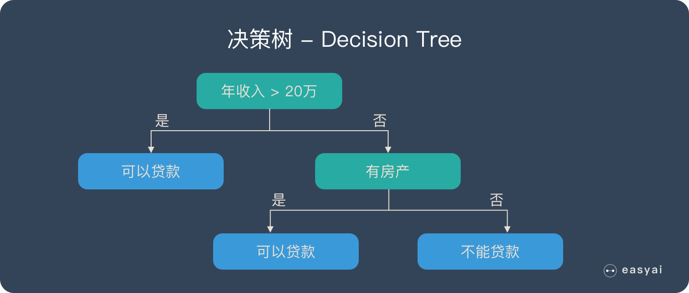
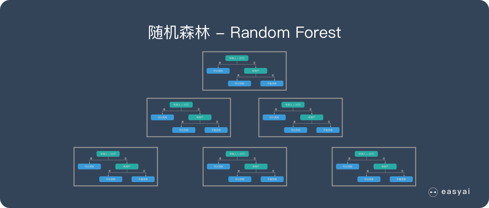

```{r include=FALSE}
color_block = function(color) {
  function(x, options) sprintf('\\color{%s}\\begin{verbatim}%s\\end{verbatim}',
                               color, x)
}

## 将错误信息用红色字体显示
knitr::knit_hooks$set(error = color_block('red'))
```

# section 1: TOC

## 前情提要

-   linear regression
-   nonlinear regression
-   modeling and prediction
-   **K-fold** & **X times** cross-validation
-   external validation

## 本次提要

-   机器学习算法归纳
-   随机森林
-   特征选择
-   实例解析

# section 2: 机器学习算法归纳

## 机器学习算法归纳

本节内容来自`CSDN` `Deep Learning小舟` 同学的 《机器学习：常见的机器学习算法归纳》一文。

### 机器学习可分为以下几类

\FontSmall 

1） **回归算法**

2） 基于实例的算法

3） **决策树学习**

4） 贝叶斯方法

5） 基于核的算法

6） **聚类算法**

7） **降低维度算法**

8） 关联规则学习

9） 集成算法

10） 人工神经网络

## 1. 回归算法

回归算法是试图采用对误差的衡量来探索变量之间的关系的一类算法。 常见的回归算法包括： 

- 最小二乘法（Ordinary Least Square），

- 逻辑回归（Logistic Regression） ， 

- 逐步式回归（Stepwise Regression） ， 

- 多元自适应回归样条（Multivariate Adaptive Regression Splines） 以及

- 本地散点平滑估计（Locally Estimated Scatterplot Smoothing）。

## 2. 基于实例的算法

基于实例的算法常常用来对决策问题建立模型， 这样的模型常常先选取一批样本数据， 然后根据某些近似性把新数据与样本数据进行比较。 通过这种方式来寻找最佳的匹配。 

因此， 基于实例的算法常常也被称为“赢家通吃” 学习或者“基于记忆的学习” 。 常见的算法包括：

- k-Nearest Neighbor(KNN), 

- 学习矢量量化（Learning Vector Quantization， LVQ），以及

- 自组织映射算法（Self-Organizing Map， SOM） 。 

深度学习的概念源于人工神经网络的研究。含多隐层的多层感知器就是一种深度学习结构。 深度学习通过组合低层特征形成更表示属性类别或特征， 以发现数据的分布式特征表示。

## 3. 决策树学习

决策树算法根据数据的属性采用树状结构建立决策模型， 决策树模型常常用来解决分类和回归问题。 常见的算法包括： 

- 分类及回归树（Classification And Regression Tree， CART） ， 

- ID3 (Iterative Dichotomiser 3)， 

- C4.5， Chi-squared Automatic Interaction Detection(CHAID), 

- Decision Stump, 随机森林（Random Forest） ， 

- 多元自适应回归样条（MARS）以及

- 梯度推进机（Gradient Boosting Machine， GBM） 。

## 4. 贝叶斯方法

贝叶斯方法算法是基于贝叶斯定理的一类算法， 主要用来解决分类和回归问题。 常见算法包括： 

- 朴素贝叶斯算法， 

- 平均单依赖估计（Averaged One-Dependence Estimators，AODE） ， 以及 

- Bayesian Belief Network（BBN） 。

## 5. 基于核的算法

基于核的算法中最著名的莫过于支持向量机（SVM） 了。 基于核的算法把输入数据映射到一个高阶的向量空间， 在这些高阶向量空间里， 有些分类或者回归问题能够更容易的解决。 常见的基于核的算法包括： 

- 支持向量机（Support Vector Machine， SVM） ， 

- 径向基函数（Radial Basis Function， RBF)， 以及

- 线性判别分析（Linear Discriminate Analysis，LDA)等。

## 6. 聚类算法

聚类， 就像回归一样， 有时候人们描述的是一类问题， 有时候描述的是一类算法。 聚类算法通常按照中心点或者分层的方式对输入数据进行归并。 所以的聚类算法都试图找到数据的内在结构， 以便按照最大的共同点将数据进行归类。 常见的聚类算法包括 

- k-Means 算法以及

- 期望最大化算法（Expectation Maximization， EM） 。

## 7. 降低维度算法

像聚类算法一样， 降低维度算法试图分析数据的内在结构， 不过降低维度算法是以非监督学习的方式试图利用较少的信息来归纳或者解释数据。 这类算法可以用于高维数据的可视化或者用来简化数据以便监督式学习使用。 常见的算法包括： 

- 主成份分析（Principle Component Analysis， PCA） ， 

- 偏最小二乘回归（Partial Least Square Regression， PLS） ，

- Sammon 映射， 

- 多维尺度（Multi-Dimensional Scaling, MDS） , 

- 投影追踪（Projection Pursuit）等。

## 8. 关联规则学习

关联规则学习通过寻找最能够解释数据变量之间关系的规则， 来找出大多元数据集中有用 联规则。 常见算法包括 

- Apriori 算法和

- Ec t 算法等。

## 9. 集成算法

集成算法用一些相对较弱的学习模型独立地就同样的样本进行训练， 然后把结果整合起来进行整体预测。 集成算法的主要难点在于究竟集成哪些独立的较弱的学习模型以及如何把学习结果整合起来。 这是一类非常强大的算法， 同时也非常流行。 常见的算法包括：

- Boosting， 

- Bootstrapped Aggregation（Bagging）， 

- AdaBoost， 

- 堆叠泛化（Stacked Generalization，Blending） ， 

- 梯度推进机（Gradient Boosting Machine, GBM） ， 

- 随机森林（Random Forest） 

## 10. 人工神经网络

人工神经网络算法模拟生物神经网络， 是一类模式匹配算法。 通常用于解决分类和回归问题。 人工神经网络是机器学习的一个庞大的分支， 有几百种不同的算法。（其中**深度学习** 就是其中的一类算法） ， 重要的人工神经网络算法包括： 

- 感知器神经网络（Perceptron Neural Network） , 

- 反向传递（Back Propagation） ， 

- Hopfield 网络， 

- 自组织映射（Self-Organizing Map, SOM） 。 

- 学习矢量量化（Learning Vector Quantization， LVQ）。

# section 3: 随机森林

## 随机森林 – Random forest

本文大部分内容取自“easyai.tech” 网站的《随机森林 – Random forest》一文，有修改。

随机森林是一种由**决策树**构成的集成算法，适用于**小样本**数据，在很多情况下都能有不错的表现。

随机森林属于 **集成学习** 中的 Bagging（Bootstrap AGgregation 的简称） 方法。


## 决策树 - decision tree

{height="40%"}

决策树是一种很简单的算法，他的解释性强，也符合人类的直观思维。这是一种基于if-then-else规则的有监督学习算法，上面的图片可以直观的表达决策树的逻辑。

## 随机森林 – Random Forest | RF

{height="40%"}

随机森林是由很多决策树构成的，不同决策树之间没有关联。

当我们进行分类任务时，新的输入样本进入，就让森林中的每一棵决策树分别进行判断和分类，每个决策树会得到一个自己的分类结果，决策树的分类结果中哪一个分类最多，那么随机森林就会把这个结果当做最终的结果

## 随机森林的 4 个应用方向

{height="40%"}

# section 4: 随机森林实例

## 随机森林实例，数据

使用`Liver cirrhosis 肝硬化`数据：

\FontSmall

|    Data    |    ID   | Data type | Nr. controls | Nr. cases | Country | 
|------------|---------|-----------|--------------|-----------|---------|
| PRJEB6337-cohort1 | Qin-cohort1 |  mNGS | 83 | 98（95）* | China|
| PRJEB6337-cohort2 | Qin-cohort2 | mNGS | 31 | 25（23）* |  China |
| PRJNA471972       | Iebba-16S   | 16S  | 14 |  35       |   Italy  |

## 数据和代码目录

"data/talk12/"

文件:

- `rf.function.R`  : 自写的函数，将建模相关代码进行了封装；
- `working.R` : 分析代码，利用上面函数对数据进行分析；
- 子目录 `data/` ：文件夹，包括各种所需数据；

## 装入数据

- 丰度信息
- 样本分组（对照和疾病）

\FontSmall

```{r load-discovery-data, message=FALSE, warning=FALSE}
## 发现集，用于建模的数据； species 水平
discovery.featdata <- 
  read.csv("./data/talk12/data/PRJEB6337.LC.s.discovery.txt",
           sep = "\t",header = T,row.names = 1);

discovery.metadata <- 
  read.csv("./data/talk12/data/PRJEB6337.LC.s.discovery.metadata.txt",
           sep = "\t",row.names = 1);
```

用 `View()`函数查看数据内容

用 `rowSums(discovery.featdata)` 查看 细菌的丰度数据


## 装入封装好的函数

注意，需要以下包：

`tidyverse`, `ROCR`, `randomForestSRC`, `pROC`, `caret`, `progress`, `tictoc`,
`doSNOW`, `ggplot2`

\FontSmall 

```{r load-source-code-from-rf-function, message=FALSE, error=FALSE}
source("./data/talk12/rf.function.R");
```

## 封装的函数及其功能

-   `rf.setdata()` : 准备数据
-   `rf.train()`：用指定的数据构建模型
-   `rf.evaluate()`：计算模型交叉验证结果
-   `rf.external.validation()`：外部验证（即：被验证数据的分类结果已知）。
-   `rf.predict()`：预测（即：未知分类结果的情况下）

## 1. 准备数据

`rf.setdata()`有四个参数，分别是：

- `feat.data` ：丰度数据（feature data）；`data.frame`，`行`为**样本**，`列`为**物种（细菌）**；内容为数字；**行名**为样本名

- `meta.data` ：样本表型数据（疾病健康）；`data.frame`；**行名**为样本名；样本应分为**两类**；

- `grouping` ：指定 `meta.data`中包含样本**分组列**的**列名**；

- `control` ：样本**分组列**中对照组的名称，比如 `Healthy`, `CTR`等；

返回：一个`list`

## `rf.setdata`的使用

\FontSmall

```{r set-data, warning=FALSE}
## 先做过滤；去掉失败的样本
qc.fail.run<- read.csv("./data/talk12/data/qc.fail.run.csv");

dis.meta <- discovery.metadata[!rownames(discovery.metadata) %in% qc.fail.run$run.id,];
dis.feat <- discovery.featdata[!rownames(discovery.featdata) %in% qc.fail.run$run.id,];

## check data 
table(dis.meta$Group);

## set data 
dis.mod <- rf.setdata( feat.data = dis.feat, meta.data = dis.meta,
                       grouping = "Group", control = "Healthy");
```

## 2. 构建模型（train）

`rf.train()`函数，其参数为：

-  `rf`： `list`；`rf.setdata`的输出结果；包括了所需数据（样本分组、丰度信息）；
-  `fold`：折；默认为10；
-  `resample`：次数；默认为10；
-  `parallel`：是否用并行模式；默认为**否**；
-  `num.cores`：使用CPU数量；默认为10；`parallel = T`时生效；当超过系统的CPU数量时，自动变为 cpu - 1；
-  `class.weights`：默认为`NULL`；可改为 `class.weights = T`；当样本分组不均衡时使用（比如：健康对照人数是疾病组的5倍）；

## 构建模型（train）, cont.

\FontSmall

```{r train-model-using-all-features}
dis.mod <- rf.train( dis.mod, parallel = T, num.cores = 20 );
```


- 使用了 7 个CPU（指定20个，但系统只有8个）；
- 进行了 10次 * 10折 建模，共得到 100 个模型
- 没有做 `class weight`调整，因为样本分组相对均衡
  - Case group: 'LC', w/ 124 samples, 
  - Control group: 'Healthy', w/ 103 samples
  
## K折N次的实现代码

\FontSmall

```{r create-multi-folds}
sample.split <- caret::createMultiFolds( as.vector( dis.meta$Group ), times = 10, k = 10 );

## 检查结果 ... 
class(sample.split);
length(sample.split);
str(sample.split$Fold01.Rep01);
```

**注**：

- sample.split包括了**被选中样本的行号**；被选中的样本为**样本集/train data**
- 没有被选中的样本即为**测试集/test data**；

## 模型构建代码

\FontSmall

```{r train-a-tree}
## assemble data --
dat <- dis.feat;
dat$Group <- as.factor( dis.meta[ rownames(dat), "Group" ] ); ## 这一步很重要！！

## 从 list 中随机取一个出来
split <- sample( sample.split, 1 ); 

## 生成 train 和 test 数据；
train.data <- dat[ split[[1]] , ];
test.data <- dat[ -split[[1]] , ];

## 建模
model.a <- rfsrc(Group ~ .,train.data, proximity = T, importance = T, ntree = 500);
```

-  `ntree` 指定生成`500`个决策树；

## Feature 重要性检验

`RandomForest`提供对每一个`feature`重要性的评估，保存在 `model.a$importance` data.frame中。

\FontSmall

```{r relative-importance-data-from-a-model, fig.height=4}
require(tidyverse);
impo <- as.data.frame( model.a$importance * 100 ) %>% arrange( desc(all) ) %>%
  slice_head( n=20) %>% rownames_to_column( var = "Feat" ) %>% 
  ggplot( aes( x = fct_reorder(Feat, all), y = all  ) ) + geom_bar( stat = "identity" ) +
  coord_flip();
impo;
```

## 预测和结果检验（使用100个模型中的一个）

\FontSmall

```{r predict-using-a-model }
## 预测；结果为 LC和Healthy的可能性；
pred <- predict( model.a, test.data, type = "prob");

## 整理预测结果
res <- as.data.frame( pred$predicted );
res$prediction <- if_else( res$Healthy > res$LC, "Healthy", "LC" );
rownames( res ) <- rownames( test.data );
res$label <- test.data$Group;

## 比较真实和预测值；得到一个confusion matrix；
table( res[, c("prediction", "label")] );
```

## 3. 检查建模的整体结果

如上所述，100个模型就会有100个结果；我们接下来把结果总结显示出来；

\FontSmall

```{r fig.height=4, error=FALSE, message=FALSE}
dis.mod.eval <- rf.evaluate( dis.mod );
```

## 输出的 message 

\FontSmall

```
--------------------------------------------
Overall performance (AUC):  0.95 (95%CI: 0.92-0.98) 

Predicted vs. Truth (Group): 
Control group:  Healthy 
Case group:  LC 

         Predicted
Group     Healthy  LC
  Healthy      97   6
  LC           17 107
---------
Error rates: 
Healthy      LC 
  0.058   0.137 

Overall error rate: 0.101
--------------------------------------------
```

## AUC？

\FontSmall

```{r roc-plot, fig.height=5}
dis.mod.eval$roc.plot;
```

Area Under the Curve （线下面积）；

AUC >= 0.8 就算是比较好的模型；

图可用于FPR和TPR的折中选择；

## Feature 的相对重要性和特征选择

\FontSmall

```{r show-top-30-features-all-models }
## 选择最重要的30 个feature ... 
dis.mod.selected <- rf.featureselect( dis.mod, top = 30 );
```

## 显示 feature importance 

\FontSmall

```{r show-feature-importance, fig.height=5}
dis.mod.selected$feat.select.importance.plot;
```

**这个数据是怎么来的**？每一个model都有 `importance` 这一 `data.frame` ，将这些数据合并后，即可得到。

## 使用 top four species 重新建模

\FontSmall

```{r select-top-4-features-and-re-train }
## 选择 重要性排前4的feature
dis.mod.selected2 <- rf.featureselect(dis.mod, top = 4);

## 用选择的feature重新建模
dis.mod.selected2.mod <- rf.train( dis.mod.selected2, parallel = T, num.cores = 7 );
```

## 检验建模结果

\FontSmall

```{r evaluate-the-top-four-model, fig.height=4, message=FALSE, error=FALSE}
dis.mod.selected2.mod.eval <- rf.evaluate( dis.mod.selected2.mod  );
```

## 比较不同数量特征得到的结果

\FontSmall

```{r compare-roc-multiple-models, fig.height=4}
plot <- 
  rf.plot.multiple.roc( dis.mod.eval, dis.mod.selected2.mod.eval, 
                      labels = c("All features", "Top 4 features"));
```

## 4. 外部验证

外部验证是指用已知表型的另一个数据集，对模型进行检验；

\FontSmall

```{r load-test-data }
## 装入外部验证数据
validation.featdata <- 
  read.csv("./data/talk12/data/PRJEB6337.LC.s.validation.txt",
           sep = "\t",header = T,row.names = 1)
validation.metadata<-
  read.csv("./data/talk12/data/PRJEB6337.LC.s.validation.metadata.txt",
           sep = "\t",header = T,row.names = 1)

## 整理外部验证数据；去除分析失败的样本
qc.val.metadata <- validation.metadata[!rownames(validation.metadata) %in% qc.fail.run$run.id,]
qc.val.featdata <- validation.featdata[!rownames(validation.featdata) %in% qc.fail.run$run.id,];
```

## 外部验证，cont.

使用外部验证函数 `rf.external.validation()`

\FontSmall

```{r external-validation, fig.height=5}
val.res <- 
  rf.external.validation(dis.mod, qc.val.featdata, qc.val.metadata);
```

## 外部验证，cont.

\FontSmall

```{r external-validation-top-four-feature-model }
val.res2 <- 
  rf.external.validation(dis.mod.selected2.mod, qc.val.featdata, qc.val.metadata);
```

## 比较 cross validation和external validation结果

\FontSmall

```{r plot-multiple-roc, fig.height=5}
res <- rf.plot.multiple.roc( dis.mod.selected2.mod.eval, val.res2,
                             labels = c("Train data, top 4 features", "Test data"));
```


# section 5: 小结

## 本次小结

-   机器学习算法归纳
-   随机森林
-   特征选择
-   实例解析

## 练习

- 练习并重复本章的示例
- 查看 `rf.funcdtion.R` 的代码，理解其含义；
- 查看 `siamcat` 这个包，并运行其示例：https://bioconductor.org/packages/release/bioc/vignettes/SIAMCAT/inst/doc/SIAMCAT_vignette.html

### important
* all codes are available at Github: https://github.com/evolgeniusteam/R-for-bioinformatics
